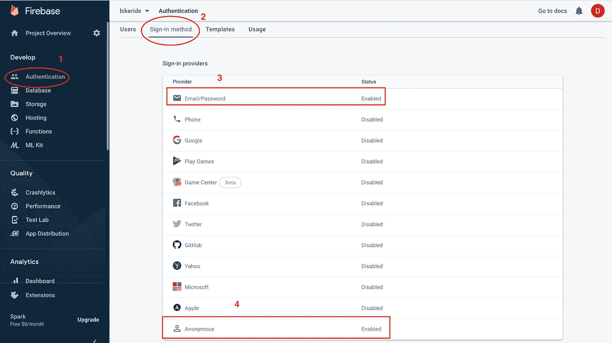
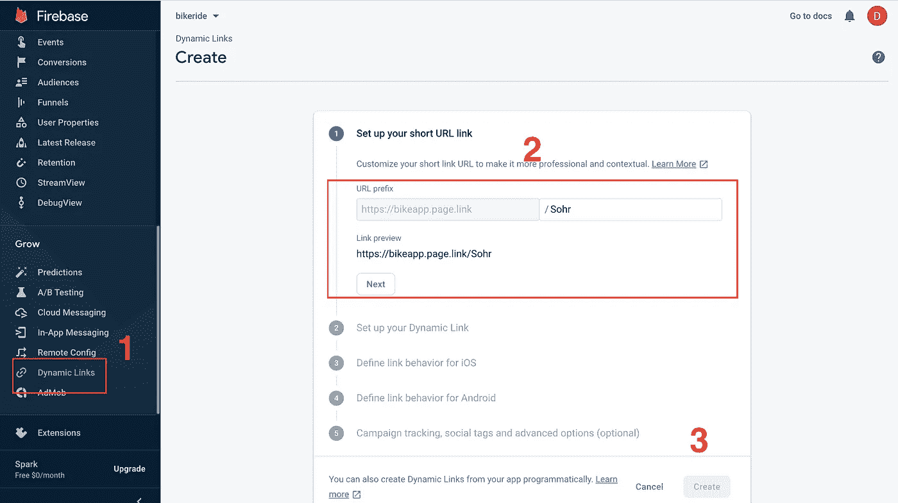
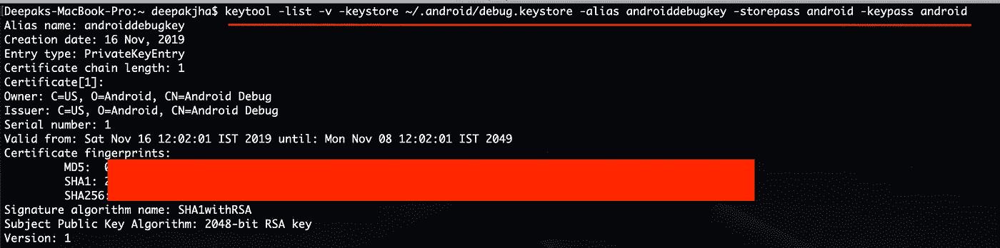
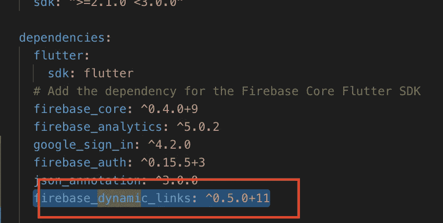
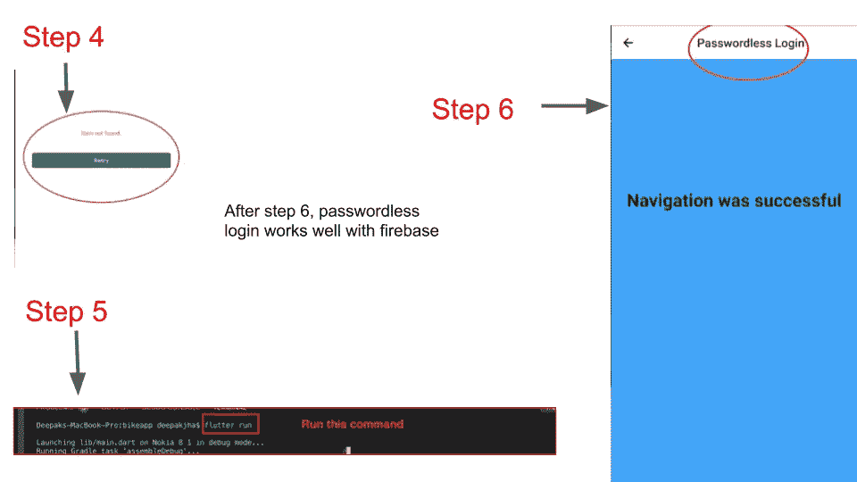

# 使用 Firebase 的 Flutter 登录(电子邮件链接/无密码)

> 原文：<https://itnext.io/flutter-passwordless-login-with-firebase-8cb085c4fb67?source=collection_archive---------0----------------------->

与 Firebase (MBaaS)的集成，Flutter 与 Firebase 认证配合得非常好

通过电子邮件登录 firebase flutter

# **先决条件**

要理解这篇文章，你必须具备:

1.  对颤振的基本理解，
2.  对 Firebase 有基本的了解，
3.  对 Dart 有基本的了解，
4.  对 Android 移动开发有基本的了解

# **这篇文章是写给谁的？**

那些希望通过 Android 平台上的电子邮件链接在 Flutter 应用程序中学习使用 Firebase 无密码登录的人

> **注意:有一些关于 FIREBASE 账户的关键信息是我的个人信息，我已经把它们藏起来了。如果你看到一个红色的盒子里藏着一些细节，请 DONT 惊慌这是故意的**

## **设置 Firebase 账户和数据库？**

创建一个 firebase 项目，如果不熟悉，请阅读此链接。这篇文章是关于无密码登录的，所以我没有介绍与创建 firebase 帐户相关的步骤

 [## 文档| Firebase

### Firebase SDK 参考、集成指南、示例代码和库

firebase.google.com](https://firebase.google.com/docs) 

# 让我们开始吧，

# 如何在 Firebase 中设置无密码登录？

## 这是一个分三步走的过程，

**第一步:**在 firebase 中设置签到方式，确保勾选邮箱签到(匿名签到可选)，看看下面的截图，

设置动态链接 firebase 颤振

**步骤 2:** 在 firebase 中设置动态链接，按照所有说明填写以下所有详细信息，并输入相关详细信息

设置动态链接 firebase 颤振

**步骤 3:** 在你的终端中运行下面的命令，从系统中找出 SHA-1 和 SHA-256 密钥

> *keytool -list -v -keystore ~/。Android/debug . keystore-alias Android debug key-store pass Android-key pass Android*

SHA-1 和 SHA-256 的详细信息将在 SHA 证书指纹中给出，如下所示

# 本演示中使用了哪些 firebase_dynamic_links 方法，我们应该使用哪些方法？

我们需要仔细观察和使用三种方法，

1.  `getInitialLink()`
2.  `onLink()`
3.  `sendSignInWithEmailLink()`

> 要接收动态链接，从`*FirebaseDynamicLinks*`调用`*getInitialLink()*`方法，该方法获取打开应用程序的链接(如果不是通过动态链接打开的，则为空),并在应用程序活动或在后台调用`*onLink*`时为链接回调配置监听器。

# 在 Flutter 代码中如何设置无密码登录？

## 这是一个两步的过程，

**步骤 1:** 通过在 pubspec.yaml 文件中进行如下更改，在项目中设置 Firebase 动态链接。

Firebase 动态链接设置

> 注意:在 pubspec.yaml 中进行任何依赖关系更改后，请确保在终端中运行 flutter pub get 命令

版本信息可以在这个链接中找到，在我写这篇博客的时候，所有的最新版本都被使用

 [## 扩展/扑火

### FlutterFire 是一组 Flutter 插件，使 Flutter 应用程序能够使用 Firebase 服务。可以效仿一个例子…

github.com](https://github.com/FirebaseExtended/flutterfire/blob/master/README.md) 

**步骤 2:** 设置代码并实现`getInitialLink()`方法，`onLink()`方法不在本文讨论范围内

下面给出了 FirebaseHandler 类的片段，展示了如何使用`getInitialLink(),` `sendSignInWithEmailLink`和`onLink()`，

firebase flutter 无密码登录

FirebaseHandler 类用于 loginpage.dart 类，如下所示

firebase 颤振登录

上面代码片段中的方法等待来自 FirebaseHandler 类的 Future，任何逻辑(比如导航到另一个屏幕)都要在这里编写

请看下面给出的 main.dart 文件，

通过电子邮件登录 flutter firebase

# 当应用不在 app store 上时，如何在开发过程中测试动态链接？

当您收到电子邮件中的登录链接时，点击它并从控制台运行 flutter 应用程序，这将调用`getInitialLink()` 方法，您的动态链接逻辑将被执行

# 申请的流程是什么？

1.  将显示登录屏幕(单击使用电子邮件登录按钮)
2.  输入有效的电子邮件并点击发送电子邮件按钮(电子邮件将被发送)
3.  打开你的邮箱，查看邮件，点击那里的链接
4.  将显示 Google play store(由于该应用程序不在 play store 上，将显示一条消息，说明找不到该应用程序)
5.  从应用程序终端运行命令 flutter run
6.  将安装应用程序，并调用`getDynamiClikData()`的处理程序(。然后准确地说是部分)

无密码登录防火墙抖动认证

无密码登录防火墙抖动认证

# 摘要

我们刚刚看到了任何应用程序中的无密码登录如何与 Firebase 配合使用。Firebase 是一款优秀的工具，全球许多初创公司都在使用它。