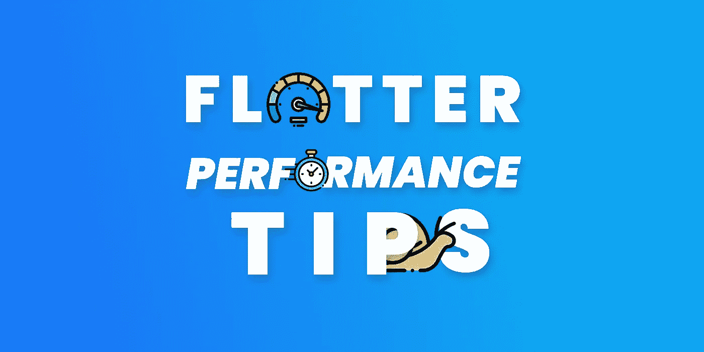
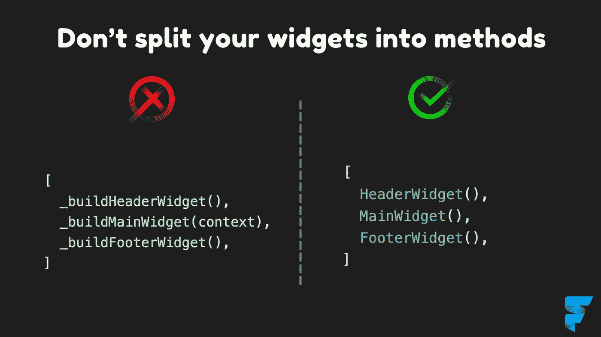

# 颤振性能提示

> 原文：<https://itnext.io/flutter-performance-tips-4580b2491da8?source=collection_archive---------1----------------------->



# 1.在功能上使用小部件



## 简短解释

您可以节省 CPU 周期，并使用 const 构造函数进行重建时，只需要和更多的好处(重用等)..。)

## 冗长的解释

[](https://blog.codemagic.io/how-to-improve-the-performance-of-your-flutter-app./#dont-split-your-widgets-into-methods) [## 如何提高你的 Flutter 应用程序的性能

### 由 Diego Velásquez 撰写关于如何提高我们的性能，有许多疑问和问题…

blog.codemagic.io](https://blog.codemagic.io/how-to-improve-the-performance-of-your-flutter-app./#dont-split-your-widgets-into-methods) [](https://stackoverflow.com/questions/53234825/what-is-the-difference-between-functions-and-classes-to-create-reusable-widgets) [## 创建可重用小部件的函数和类有什么区别？

### 让我从头开始解释吧。🙂(仅关于命令式)编程历史，我们都知道始于…

stackoverflow.com](https://stackoverflow.com/questions/53234825/what-is-the-difference-between-functions-and-classes-to-create-reusable-widgets)  [## 将小部件拆分成方法是一种反模式

### 大约 6 个月前，我建议您将长的构建方法拆分成多个较小的方法。结果发现我是…

iiro.dev](https://iiro.dev/splitting-widgets-to-methods-performance-antipattern/) 

# 2.**尽可能使用常量**

```
x = Container();
y = Container();
x == y // falsex = const Container();
y = const Container();
x == y // true
```

## 说明

如果已经定义了，你可以使用同样的小部件来节省内存

# **3。尽可能使用常量构造函数**

```
class CustomWidget extends StatelessWidget {
  **const CustomWidget();** @override
  Widget build(BuildContext context) {
    ...
  }
}
```

## 简短解释

当构建自己的小部件或使用 Flutter 小部件时。这有助于 Flutter 只重建应该更新的小部件。

# 4.使用 nil 代替 const Container()

```
**// good** text != null ? Text(text) : const Container()**// Better** text != null ? Text(text) : const SizedBox()**// BEST** text != null ? Text(text) : nil
or
if (text != null) Text(text)
```

## 简短解释

它只是一个基本的元素小部件，几乎不需要任何成本。

## 冗长的解释

[](https://pub.dev/packages/nil) [## 无|颤动组件

### 当您不想显示任何内容时，可以在小部件树中添加一个简单的小部件，对性能的影响极小。有时候…

公共开发](https://pub.dev/packages/nil) 

# 5.尽可能使用状态管理工具

## 简短解释

状态管理工具帮助您进行粒度更新，而不是重建所有小部件。有状态的小部件有时真的很有害

## 冗长的解释

[](https://blog.codemagic.io/how-to-improve-the-performance-of-your-flutter-app./#avoid-rebuilding-all-the-widgets-repetitively) [## 如何提高你的 Flutter 应用程序的性能

### 由 Diego Velásquez 撰写关于如何提高我们的性能，有许多疑问和问题…

blog.codemagic.io](https://blog.codemagic.io/how-to-improve-the-performance-of-your-flutter-app./#avoid-rebuilding-all-the-widgets-repetitively) 

# 6.在 ListView 中为长列表使用`itemExtent`

## 简短解释

这有助于 Flutter 计算 ListView 滚动位置，而不是计算每个小部件的高度，并使滚动动画更具性能

## 冗长的解释

[](https://blog.codemagic.io/how-to-improve-the-performance-of-your-flutter-app./#use-itemextent-in-listview-for-long-lists) [## 如何提高你的 Flutter 应用程序的性能

### 由 Diego Velásquez 撰写关于如何提高我们的性能，有许多疑问和问题…

blog.codemagic.io](https://blog.codemagic.io/how-to-improve-the-performance-of-your-flutter-app./#use-itemextent-in-listview-for-long-lists) 

# 7.避免将 AnimationController 与 setState 一起使用

```
void initState*() {* _controller = AnimationController*(* vsync: this,
    duration: Duration*(*seconds: 1*)*,
  *)* **..addListener*(()* => setState*(() {}))***;
*}*Column*(* children: *[* Placeholder*()*, // rebuilds
    Placeholder*()*, // rebuilds
    Placeholder*()*, // rebuilds
    **Transform.translate*(*** // rebuilds**offset: Offset*(*100 * _controller.value, 0*)*,
      child: Placeholder*()*,
    *)*,**
  *]*,
*)*,
```

到

```
void initState*() {* _controller = AnimationController*(* vsync: this,
    duration: Duration*(*seconds: 1*)*,
  *);* **// No****addListener(...)** *}***AnimatedBuilder*(* animation: _controller,
  builder: *(*_, child*) {* **returnTransform.translate*(* offset: Offset*(*100 * _controller.value, 0*)*,
      child: child,
    *)*;
 ***}*,**
  child: Placeholder*()*,
***)*,**
```

## 简短解释

这导致重新构建整个用户界面，不仅动画部件和动画滞后

## 冗长的解释

[](https://medium.com/flutter-community/flutter-laggy-animations-how-not-to-setstate-f2dd9873b8fc) [## 颤动滞后动画:如何不设置状态

### 在 Flutter 中创建动画真的很有趣也很容易，但是有一个不好的做法可能会使这些动画…

medium.com](https://medium.com/flutter-community/flutter-laggy-animations-how-not-to-setstate-f2dd9873b8fc) 

# 8.避免对 AnimatedBuilder 使用不透明度

```
// BADAnimatedBuilder*(* animation: _controller,
  builder: *(*_, child*) {
***return Opacity*(* opacity: _controller.value,
      child: child,
    *)*;**
  *}*,
  child: Placeholder*()*, 
*)*,**// GOOD****FadeTransition*(* opacity: _controller,**
  child: Placeholder*()*,
***)*,*****// OR ALTERNATIVELY*****AnimatedOpacity(
   opacity: opacity,
   duration: duration,** child: Placeholder*()*, **),**
```

## 简短解释

改变不透明度是一个相当昂贵的动画，颤振给我们提供了更好的解决方案

## 冗长的解释

[](https://medium.com/flutter-community/flutter-laggy-animations-how-not-to-setstate-f2dd9873b8fc) [## 颤动滞后动画:如何不设置状态

### 在 Flutter 中创建动画真的很有趣也很容易，但是有一个不好的做法可能会使这些动画…

medium.com](https://medium.com/flutter-community/flutter-laggy-animations-how-not-to-setstate-f2dd9873b8fc) 

# 9.用键加速颤振性能

```
// FROM
return value
  ? const SizedBox*()* : const Placeholder*()*,// TO
return value
  ? const SizedBox*(***key: ValueKey*(*'SizedBox'*)****)* : const Placeholder*(***key: ValueKey*(*'Placeholder'*)****)*,----------------------------------------------
// FROM
final inner = SizedBox*();*return value ? SizedBox*(*child: inner*)* : inner,//TO **final global = GlobalKey*()*;** final inner = SizedBox*(***key: global***);*return value ? SizedBox*(*child: inner*)* : inner,
```

## 简短解释

使用按键时，Flutter 可以更好地识别小部件。这使我们的性能提高了 4 倍

**小心**

*   会让你的代码看起来有点臃肿
*   `GlobalKey`有点危险，但有时值得。

## 冗长的解释

[](https://medium.com/flutter-community/elements-keys-and-flutters-performance-3ef15c90f607) [## 元素、键和 Flutter 的性能

### TL；DR: Widget Keys 可以提高我们的应用程序的性能，在那些你不能得到承诺的 60 FPS 的地方。

medium.com](https://medium.com/flutter-community/elements-keys-and-flutters-performance-3ef15c90f607) 

# 10.使用图像列表视图时优化内存

```
ListView.builder(
  ...
  addAutomaticKeepAlives: false (true by default)
  addRepaintBoundaries: false (true by default)
);
```

## 简短解释

ListView 无法删除它的孩子在屏幕上不可见。如果儿童拥有高分辨率的图像，会消耗大量内存。

如果将这些选项设置为 false，可能会导致使用更多的 GPU 和 CPU 工作，但它可以解决我们的内存问题，并且您将获得一个非常高性能的视图，而没有明显的问题。

## 冗长的解释

[](https://devmuaz.medium.com/flutter-memory-optimization-series-8c4a73f3ea81) [## 颤振记忆优化系列

### 正如你可能已经知道的，默认情况下，Flutter 中的几乎所有东西都得到了优化和增强，这要感谢…

devmuaz.medium.com](https://devmuaz.medium.com/flutter-memory-optimization-series-8c4a73f3ea81) 

# 感谢您的阅读！

我试图尽可能简单地解释它，我希望你喜欢它。

如果你喜欢这篇文章，请点击👏按钮(你知道你可以升到 50 吗？)