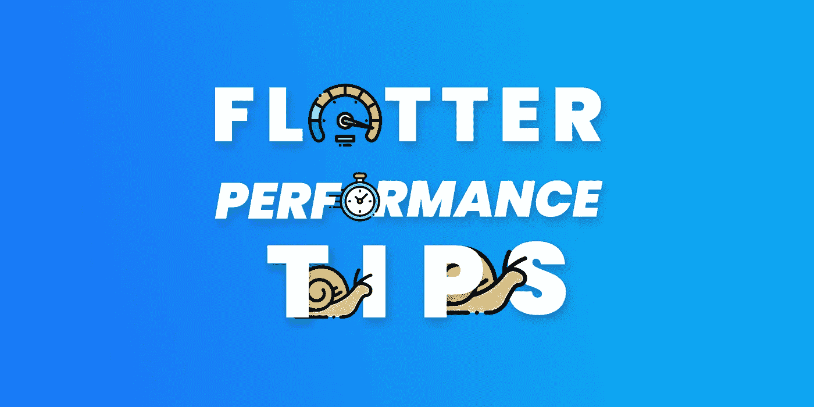
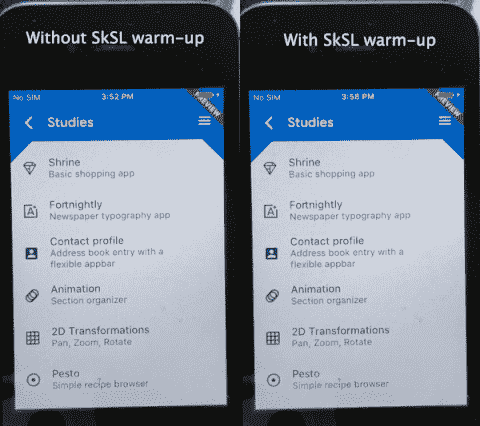
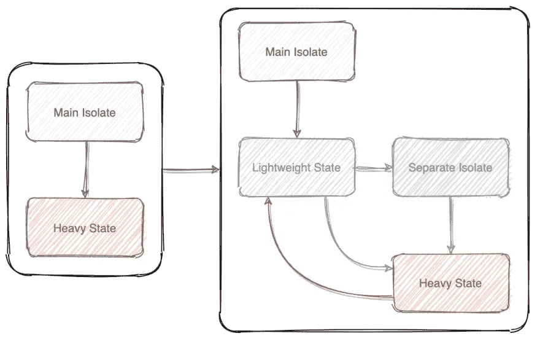
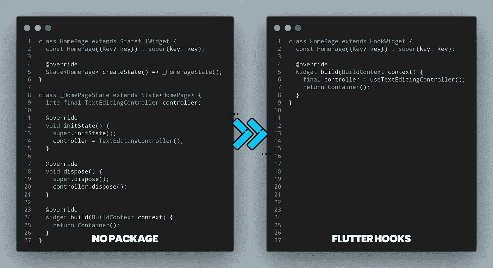
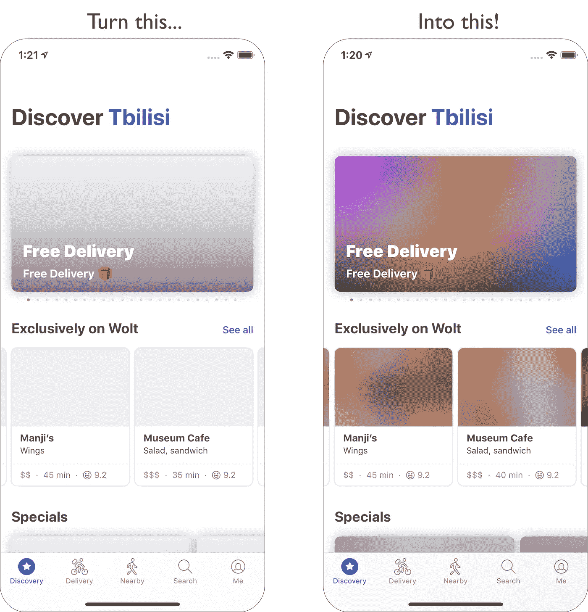
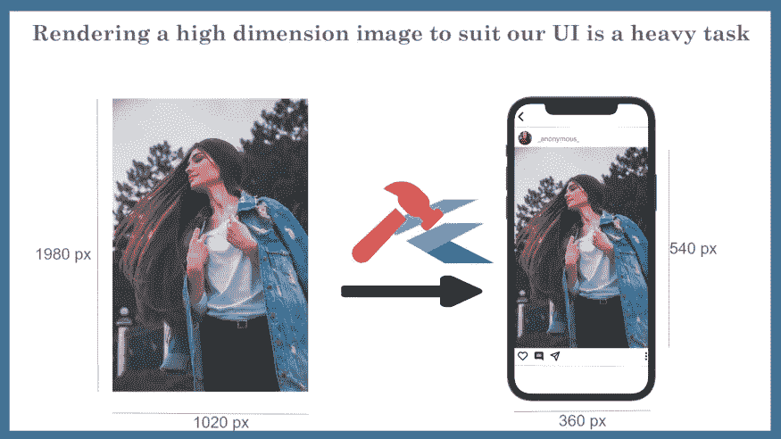

# 颤振性能提示第二部分

> 原文：<https://itnext.io/flutter-performance-tips-part-2-7e37af5b0690?source=collection_archive---------1----------------------->



## Flutter 速度很快，但想要更高的性能？

## 在你走之前！

这是本系列的第二部分。起初，我认为我涵盖了一切，但幸运的是，我错了，这使得第 2 部分成为可能！

我建议你两个都看看

## 第一部分

[](/flutter-performance-tips-4580b2491da8) [## 颤振性能提示

### 使颤振速度更快，性能更好

itnext.io](/flutter-performance-tips-4580b2491da8) 

# 1.使用 for/while 代替 foreach/map


## 简短解释

命令式>声明式

## 冗长的解释

[](/comparing-darts-loops-which-is-the-fastest-731a03ad42a2) [## 比较 Dart 的循环，哪个最快？

### Dart 是一种用于编写 Flutter 应用程序的语言，它有许多不同的循环，可以遍历列表或运行一些…

itnext.io](/comparing-darts-loops-which-is-the-fastest-731a03ad42a2) 

# 2.预先缓存您的图像和图标


这取决于场景，但我通常会预先缓存所有图像。

## 对于图像

你不需要任何包裹

```
precacheImage(AssetImage(imagePath), context);
```

## 对于 SVG

你需要 [flutter_svg](https://pub.dev/packages/flutter_svg) 包

```
precachePicture(
  ExactAssetPicture(SvgPicture.svgStringDecoderBuilder, iconPath),
  context,
);
```

# 3.使用 SKSL 预热



```
flutter run --profile --cache-sksl --purge-persistent-cache
```

## 简短解释

如果一个应用程序在第一次运行时有 janky 动画，后来对于相同的动画变得平滑，那么这很可能是由于着色器编译 jank。

## 冗长的解释

[](https://docs.flutter.dev/perf/rendering/shader) [## 减少移动设备上的着色器编译 jank

### 注意:要了解如何使用性能视图(Flutter DevTools 的一部分)来调试性能问题，请参见使用…

docs.flutter.dev](https://docs.flutter.dev/perf/rendering/shader) 

此外，您可能有兴趣自动完成这项工作

[](https://alex-min.fr/improving-flutter-latency-through-sksl-automation/) [## 通过 sksl 自动化改善颤动延迟

### flutter 这是最终结果的演示，自动导航整个应用程序:sksl 的视频演示…

alex-min.fr](https://alex-min.fr/improving-flutter-latency-through-sksl-automation/) 

# 4.考虑使用重画边界


无重画边界 vs 有重画边界

## 简短解释

这个小部件为其子部件创建一个单独的显示列表，这可以在特定情况下提高性能

## 冗长的解释

[](https://medium.flutterdevs.com/repaintboundary-in-flutter-9e2f426ff579) [## 颤振中的重画边界

### 了解如何在你的 Flutter 应用中使用 RepaintBoundary

medium.flutterdevs.com](https://medium.flutterdevs.com/repaintboundary-in-flutter-9e2f426ff579) 

# 5.如果可能，使用生成器命名的构造函数

这是常识，但以防万一

`Listview` → `Listview.builder`

## 简短解释

`builder`只渲染屏幕上显示的项目。如果不使用`builder`渲染所有的孩子即使看不到

## 冗长的解释

# 6.不要对任何可滚动的小部件使用包膜

## 简短解释

衡量内容问题。

## 冗长的解释

# 7.使用重功能时使用隔离



## 简短解释

有些方法非常昂贵，比如图像处理，它们会在主线程中运行时冻结你的应用程序。如果你不想要那种情况，你应该考虑使用隔离。

## 冗长的解释

[](https://dev.to/alphamikle/why-should-you-use-isolates-in-flutter-1k5o) [## 为什么要在颤振中使用隔离物？

### 在 Flutter 中有许多管理状态的方法，但是大多数都是以这样一种方式构建的，即所有的逻辑都被执行…

开发到](https://dev.to/alphamikle/why-should-you-use-isolates-in-flutter-1k5o) 

# 8.不要对每一件小事都使用隔离物

## 简短解释

隔离是很好的，当你完成一项繁重的任务时，它们非常有用。但是如果你在任何地方使用，即使是最小的操作，你的应用程序也会变得非常简单。只是因为繁殖一个隔离物种并不是一件容易的事。这需要时间和资源

# 9.数据的适当处理

## 简短解释

不必要的内存使用会在应用程序内部悄无声息地终止。所以不要忘记`dispose`你的数据

## 冗长的解释

[](https://medium.com/@deepaklohmod6789/top-5-tips-for-flutter-performance-optimization-and-following-best-practices-to-build-your-next-abe3b8c94fcd) [## 颤振性能优化的 5 大技巧，并遵循最佳实践来构建您的下一个…

### 有没有想过为什么你的应用会在某些设备上出现延迟/抖动？让我们来了解一些改善用户体验的要点…

medium.com](https://medium.com/@deepaklohmod6789/top-5-tips-for-flutter-performance-optimization-and-following-best-practices-to-build-your-next-abe3b8c94fcd) 

## 建议

有些包对它们的类提供了支持，如 [Riverpod](https://pub.dev/packages/riverpod) 、 [GetX](https://pub.dev/packages/get) 、 [get_it](https://pub.dev/packages/get_it) 、 [flutter_hooks](https://pub.dev/packages/flutter_hooks) 等。

## 如果你不知道什么是扑钩和如何使用它



他们在做同样的事情，但是钩子为你处理一切！

[](https://iisprey.medium.com/get-rid-of-all-kind-of-boilerplate-code-with-flutter-hooks-2e17eea06ca0) [## 用抖动钩子去掉所有类型的样板代码

### 难道你不认为，是时候杀死 StatefulWidget 并使用 flutter 钩子去掉样板代码了吗

iisprey.medium.com](https://iisprey.medium.com/get-rid-of-all-kind-of-boilerplate-code-with-flutter-hooks-2e17eea06ca0) 

## 还好奇 Riverpod 或者 GetX？

你可以看看我以前的文章，对它们有所了解

[](/a-minimalist-guide-to-riverpod-4eb24b3386a1) [## Riverpod 简约指南

### 颤振中最好的状态管理和依赖注入解决方案之一

itnext.io](/a-minimalist-guide-to-riverpod-4eb24b3386a1) [](/a-minimalist-guide-to-dependency-injection-in-flutter-641d4803c0fd) [## Flutter 中依赖注入的最简指南

### 这是对 Flutter 用户使用 GetX 进行依赖注入的介绍

itnext.io](/a-minimalist-guide-to-dependency-injection-in-flutter-641d4803c0fd) 

# 10.处理图像加载以获得更好的用户体验



## 简短解释

实际上，这并没有提高设备性能，但在用户体验方面感觉更好

[](https://pub.dev/packages/flutter_blurhash) [## flutter_blurhash | Flutter 包

### 图像占位符的紧凑表示。你可以使用 https://blurha.sh/测试或使用任何官方…

公共开发](https://pub.dev/packages/flutter_blurhash) [](https://pub.dev/packages/blurhash_dart) [## blurhash_dart | Dart 包

### BlurHash 的纯 dart 实现。支持编码和解码。在所有支持的 Dart 平台上运行。看…

公共开发](https://pub.dev/packages/blurhash_dart) 

## 冗长的解释

[](https://github.com/woltapp/blurhash#how-does-it-work) [## GitHub - woltapp/blurhash:图像占位符的一个非常紧凑的表示。

### BlurHash 是图像占位符的紧凑表示。你的设计师会在你每次加载他们的…

github.com](https://github.com/woltapp/blurhash#how-does-it-work) 

# 11.设置图像的`cacheHeight`和`cacheWidth`值



## 简短解释

您可以通过这种方式减少内存使用

## 冗长的解释

[](https://medium.com/@deepaklohmod6789/top-5-tips-for-flutter-performance-optimization-and-following-best-practices-to-build-your-next-abe3b8c94fcd) [## 颤振性能优化的 5 大技巧，并遵循最佳实践来构建您的下一个…

### 有没有想过为什么你的应用会在某些设备上出现延迟/抖动？让我们来了解一些改善用户体验的要点…

medium.com](https://medium.com/@deepaklohmod6789/top-5-tips-for-flutter-performance-optimization-and-following-best-practices-to-build-your-next-abe3b8c94fcd) 

# 12.为了节省内存，压缩您的数据

例如 lang 文件

```
final response = await rootBundle.loadString('assets/**en_us.json**');final original = **utf8.encode**(response);
final compressed = **gzip.encode**(original);
final decompress = **gzip.decode**(compressed);final enUS = **utf8.decode**(decompress);
```

## 简短解释

你也可以通过这种方式节省一些内存

## 冗长的解释

[](https://abhishekdoshi26.medium.com/compression-algorithm-flutter-f628481cc4e0) [## 1300000 字节→ 2572 字节！99%压缩！

### 别浪费内存了！让我们看看如何将 1300000 字节减少到 2572 字节，即 99%的压缩率！

abhishekdoshi26.medium.com](https://abhishekdoshi26.medium.com/compression-algorithm-flutter-f628481cc4e0) 

## 13.跟上时代潮流

## 长话短说

在每一个版本中，颤动越来越快。所以别忘了及时更新你的 flutter 版本，保持惊艳的作品！！

## 你可能也会感兴趣

[](/flutter-minimizing-tips-42113f02b678) [## 颤振最小化尖端

### 颤振尺寸优化的最简指南

itnext.io](/flutter-minimizing-tips-42113f02b678) 

## 感谢您的阅读！

那是一篇很长的文章，而你大老远跑来这里！你太棒了！请不要忘记鼓掌(也可能你不知道鼓掌可以达到 50 次，只是在你走的时候点击)