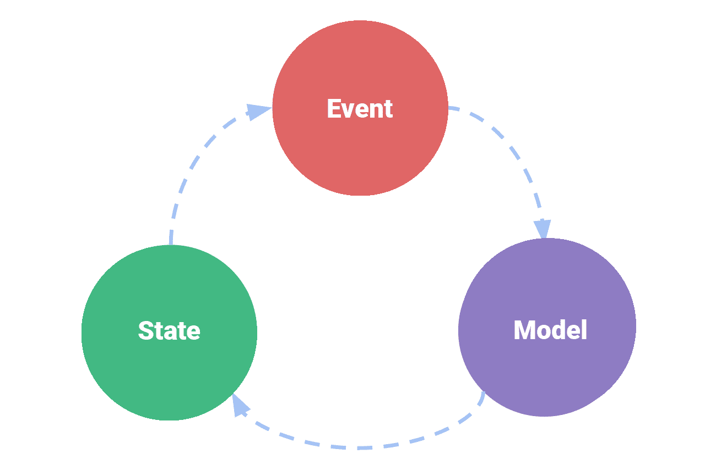

# 颤振供应商状态管理

> 原文：<https://itnext.io/flutter-provider-state-management-456db14aa77?source=collection_archive---------2----------------------->


[安德鲁·尼尔](https://unsplash.com/@andrewtneel?utm_source=medium&utm_medium=referral)在 [Unsplash](https://unsplash.com?utm_source=medium&utm_medium=referral) 上拍照

在 flutter 中创建任何更大的应用程序时，有一种管理状态的方法是必不可少的。有许多不同类型的状态管理选项。Bloc、RxDart、MobX 只是你在 flutter 社区中可能听说过的几个名字。我确信它们都有自己有用的方式，可以帮助不同的项目完成不同的事情，但是我个人最喜欢的控制状态的方式是使用 Provider。

正如其创建者雷米·罗塞莱(【https://twitter.com/remi_rousselet】)所说，提供商本身并不是一个国家管理解决方案。它更像是一种用于创建状态管理的工具。事实上，有些软件包使用 Provider 为您创建状态管理包。尽管这似乎有悖直觉，但这也是我更喜欢提供商而不是其他解决方案的主要原因。使用 Provider，即使您必须做更多的工作，您也可以完全控制您的状态所发生的一切。为了使它工作，不需要添加太多的样板文件。

我还想指出，我不是 RxDart 或 MobX 方面的专家。我只深入研究了 Provider 和 Bloc，因为它们似乎是最受欢迎的。从我的经验来看，使用 Bloc 没有任何问题，对于更大的项目，它可能会节省编码人员的时间。但对我个人来说，我重视拥有控制权，随着时间的推移，事情越简单越好。

但是现在从 provider 的实际工作方式开始。有三个主要的小部件，您将需要有一个完整的状态管理选项与提供者一起工作。它们是 ChangeNotifier、ChangeNotifierProvider 和 Consumer。Provider.of 也是一个重要的部分，但这更像是一种检索状态的方式。

在我们深入研究之前，我想给你一个状态管理如何工作的简单视觉效果。ChangeNotifierProvider 将向应用程序提供状态。然后，在应用程序内部，可以在模型内部激活一个事件，然后模型将相应地更新状态，持有状态的使用者应该在必要时更新任何 UI 元素。这可能有点令人困惑，让我们再深入分析一下。



**型号**

模型将是保存状态的实际事物。该模型需要扩展 ChangeNotifier 才能使其全部工作。事件也可以在模型内部。状态在模型中应该是私有的，所以只有事件可以改变状态。如果有任何人需要在状态改变时被更新，您需要调用 notifyListeners()来通知任何监听状态的人。那么您还应该创建一个访问器来访问该状态。下面是一个存储用户正在关注的人员列表的模型示例。

```
class Following extends ChangeNotifier {
  final List<String> _followingList = [];List<String> get followingList => _followingList;add(String name) {
    _followingList.add(name);
    notifyListeners();
  }remove(String name) {
    _followingList.removeWhere((element) => element == name);
    notifyListeners();
  }
}
```

**状态**

接下来使用 ChangeNotifierProvider，您将向它下面的任何小部件提供状态。有几种方法可以访问小部件中的状态/模型。最简单的方法是使用 Provider.of。您可以将它设置为一个变量，然后使用它来访问模型中的所有内容。您可以获取它的当前状态，并由此发送一个事件。

最终值= Provider.of <foo>(上下文)；</foo>

如果你需要根据状态改变用户界面，那么消费者就是你要走的路。Consumer 允许您访问状态，并允许您使用该状态构建 UI。这里的关键区别在于，每当状态实际发生变化时，它都会被重新构建。还记得 notifyListeners()函数吗？好吧，那就通知消费者它需要被重建。

**事件**

可以在消费者内部或使用 Provider.of 调用该事件。然后，如我在模型部分中所述，可以对该事件进行操作，并将状态更新为新值。然后，如果您想让任何人对状态变化采取行动，不要忘记调用 notifyListeners()。

这就是 Provider 的全部内容。就像我说的，一旦你理解了如何使用它，它就非常简单明了。您的状态可以很容易地管理，没有太多的样板文件。使用 ChangeNotifier、ChangeNotifierProvider 和 Consumer，您可以获得所需的所有功能。一旦您了解并完全理解了这些内容，您就可以研究包中的其他类型的提供者，比如当一个状态依赖于另一个状态时使用的 ProxyProvider。

感谢阅读！

Instagram: @amateurcoder

推特:@tadaspetra