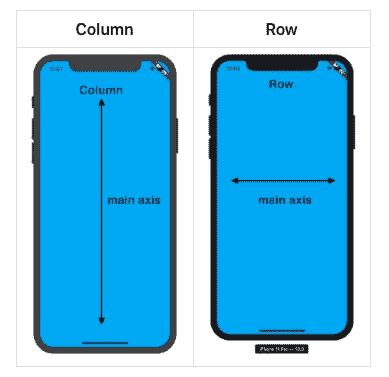
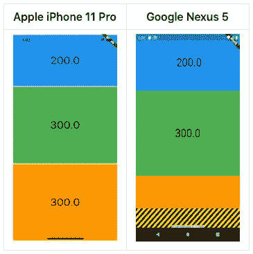
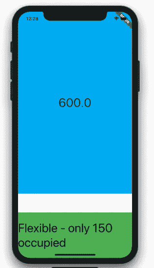
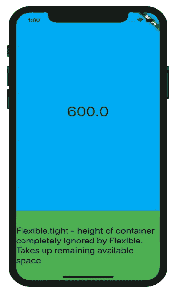
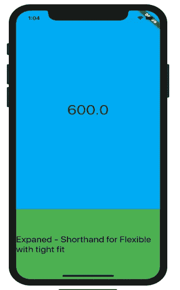

# 颤动响应应用:灵活与扩展

> 原文：<https://itnext.io/flutter-responsive-apps-flexible-vs-expanded-ff8cc92b468f?source=collection_archive---------0----------------------->

使用哪一种响应速度更快？

# 介绍

[扩展](https://api.flutter.dev/flutter/widgets/Expanded-class.html)和[灵活](https://api.flutter.dev/flutter/widgets/Flexible-class.html)窗口小部件都是在 Flutter 中创建响应性移动应用的窗口小部件。你可以阅读这篇非常基本的[帖子](https://medium.com/@sid.310/flutter-screen-overflow-creating-responsive-mobile-applications-f8ecb1c51610)(或者观看[视频](https://www.youtube.com/watch?v=F8BUQsIrPA0&t=15s))来了解扩展的小部件如何解决 Flutter 中的响应式设计问题。

在这篇文章中，我将谈论扩展的和灵活的部件，以及它们之间的基本区别和何时使用它们。

# 它们是如何工作的

这两个小部件都与[列](https://api.flutter.dev/flutter/widgets/Column-class.html)或[行](https://api.flutter.dev/flutter/widgets/Row-class.html)(或 base Flex)小部件紧密耦合。他们可以沿着父列或行小部件的主轴改变子小部件。对于列，主轴是垂直的，对于行，主轴是水平的。横轴尺寸不会因扩展或柔性而改变。

同样，对于这两个小部件，主要目的是响应性设计，即让 Flutter 应用程序根据屏幕大小进行更改和适应。这些小部件对于响应非常重要，因为在 Flutter 中，您不能将维度指定为屏幕的百分比。例如，下面的响应式问题很容易通过使用 Flexible 或 Expanded 来解决。

# 灵活的

因此，如果您用一个 Flexible 包装您的小部件，基于参数 *fit* ，会发生两件事情。

# 松配合

如果你用宽松的方式包装你的部件，你的部件将试图占据主轴上剩余的最少可用空间。

例如，如果在一个高度为 600 像素的列中有一个容器，但唯一可用的空间可能是 250 像素，那么该容器最终是 250 像素。

另一方面，如果我们的容器是 150 像素，但是可用空间比这个大，那么容器将是 150 像素。

# 牢配合

当使用紧配合时，沿着主轴的列或行内的小部件维度完全没有关系。

让我们以容器为例，它的高度比之前高 150 像素，位于一个列小部件中。当你用一个紧配合的柔性包装容器时，柔性将完全忽略子容器的高度，并占据任何可用的空间，可能是 10 像素，可能是 300 像素，无论剩下什么空间。

# 扩大

扩展的小部件是灵活和紧密贴合的简写。就这么简单。因此，我们关于弹性紧配合的代码是:

# 我用哪一个？

如果您想让一个小部件在一列或一行中沿着主轴扩展尽可能多的可用空间，那么使用扩展，但是如果您觉得您想让一个小部件在一列或一行中沿着主轴扩展，但是由于法律原因或者为了更好的客户体验，不希望它扩展超过某个尺寸，那么切换到灵活宽松。

所以，就这样，让我知道你的想法，如果他们有任何其他点添加到分析中。

编码快乐！

检查我用 flutter 创建的本机应用程序。**目前只部署到苹果的 App Store。由于 Covid 延迟，谷歌的 Play Store 需要更多时间进行审查。**

 [## 核对清单:带模板

### 通过将清单保存为模板来提高工作效率。如果需要，安排到期日期和提醒，并获取…

chklist.app](https://chklist.app/) 

# Extras — Youtube 视频

在 twitter 上与我联系:

 [## 火星山羊

### marsgoat 的最新推文(@marsgoat1)。...来自火星的山羊媒介:https://t.co/BUAZThMhEn

twitter.com](https://twitter.com/marsgoat1)