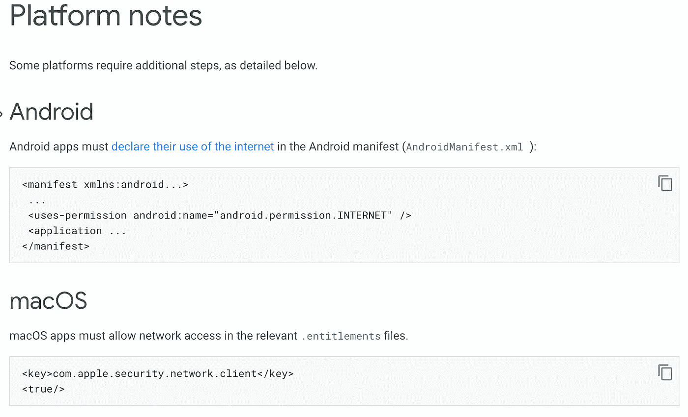
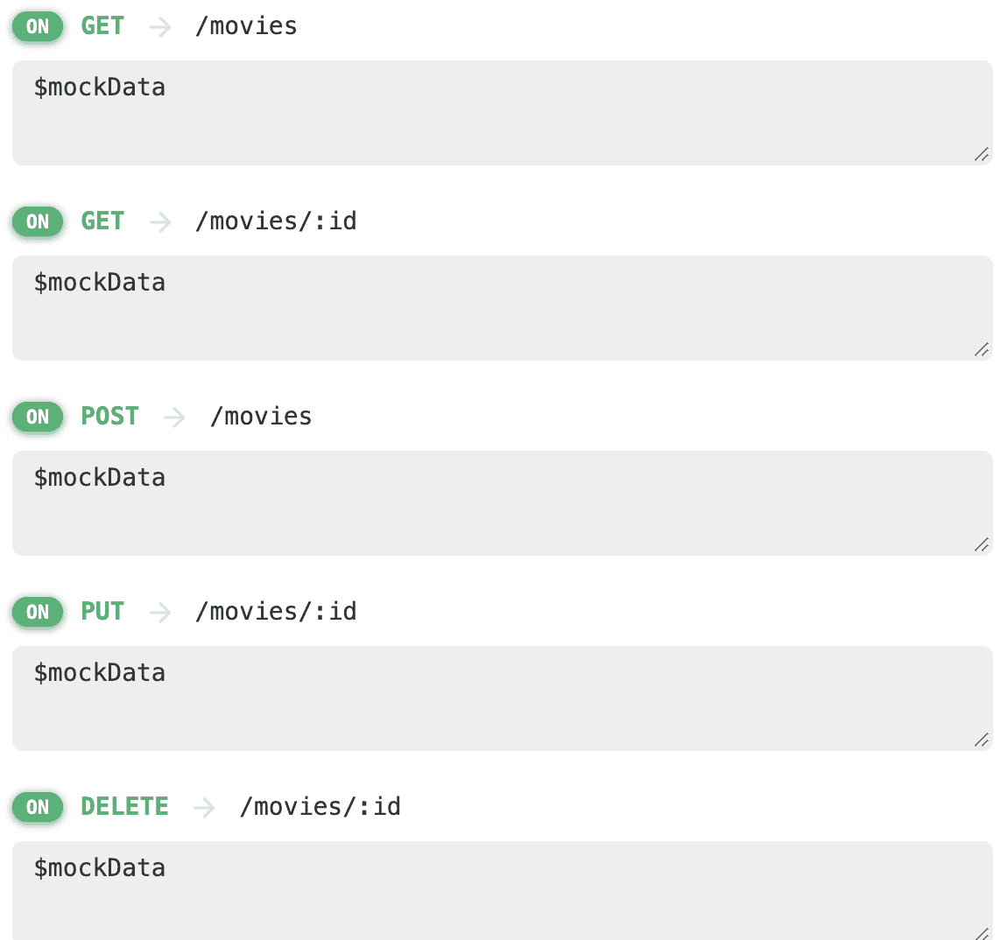

# Flutter Riverpod 示例和联网指南

> 原文：<https://itnext.io/flutter-riverpod-example-and-guide-with-networking-b758af7b646b?source=collection_archive---------0----------------------->

带网络的 Flutter Riverpod

在本系列的第一部分中，我们开始简单使用 flutter riverpod，只使用我们已经动态加载的 JSON 数据。

由于这在第二部分中很少使用，我们将检查如何使用 API 将我们在上一篇文章中制作的 riverpod 结构与网络连接起来。请务必查看上一篇文章，因为我们将不会再从头开始来完成这些步骤。

如果你刚开始使用 flutter 或一般的开发，那么最好了解两种最常用的处理数据和后端的类型，一般是 Firebase 或自定义 API (HTTP 请求)。

我们今天要做什么:

## **什么是 HTTP 请求？**

由于我们将在这篇文章中使用 HTTP 请求和一般的网络，我们应该创建一个快速的概述。

> *客户端向位于服务器上的主机发出 HTTP 请求，以接收构建内容所需的资源。*
> 
> 当客户端发出请求时，它们使用包含访问服务器资源所需信息的 URL(统一资源定位符)。
> 
> *HTTPS 是传统 HTTP 请求的扩展，通过使用双向加密来保护请求协议，双向加密使用称为 SSL 的服务器端数字证书。*

关于它们还有很多要学习，但这取决于你在本文中的表现(如果你想写一篇关于 HTTP 请求和 Flutter 中的网络的文章，请留下你的评论:)

## **颤振中的联网**

http 包提供了发出 http 请求的最简单的方法。Android、iOS 和 web 都支持这个包。在我们的例子中，我们将使用 Dio 包。只剩下一件简单的事情要做，这样我们的应用程序就可以发出 HTTP 请求:

## **为什么选择 Dio 而不是 HTTP？**

Dio 提供了很多 HTTP 所缺乏的功能。拦截器、全局配置、表单数据、请求取消、文件下载、超时等等。

当我们想到网络时，首先想到的不就是 CRUD 操作吗？然后让我们看看如何使用 DIO 包来执行 CRUD 任务。

我使用 [mockapi](https://mockapi.io/) 为电影创建 crud，其结构与我们在第一篇文章的示例中使用的结构相同，这是我们得到的路径:

请记住，我们正在重用你可以在 [github](https://github.com/vbalagovic/flutter-riverpod-example) 上找到的[上一篇文章](https://blog.devgenius.io/flutter-riverpod-simple-example-and-guide-f183de192445)中的代码，克隆它并快速调整。

首先，我们更新了我们的电影模型:

*   添加了 id 字段，我们现在有后端

首先，我们更新了电影服务:

*   创建 Dio 客户端(我们稍后将提取它)
*   更新了所有给定的函数/路线(除了创建)

在这个例子中，您可以看到如何将 Dio 用于简单的 HTTP 请求。我们只是以一种简单的方式将获取和过滤方法从 JSON 转移到服务器。

根据服务功能，我们还将更新提供商功能:

好了，我们的“后端”功能已经准备好了，现在我们只需要更新前端。Filter 使用与我们之前使用的相同的功能，我们添加了具有编辑/删除功能的按钮。在“编辑”按钮上，我们创建了一个带有“保存更改”按钮的表单，该表单包含标题、年份和描述。使用“保存更改”按钮，我们将调用提供商更新功能:

和删除按钮用对话框确认:

至此，我们完成了故事的一部分，post 功能缺失，因此您可以尝试自己实现它:)好的，我们已经获得了所有数据(通过过滤)、编辑、删除，并且这些都保存在我们的服务器上。除了在本教程中，还有一点没有实现，那就是电影的细节视图。

因为为此我们将使用一个新的屏幕，所以我将实现用于路由的 [go router](https://pub.dev/packages/go_router) 包。首先，我们需要创建一个 MovieDetails 屏幕，这里我们将使用 future builder，因为在电影卡标题上，click 应用程序在服务器上发送一个请求，以通过 id 获取移动细节，而加载程序正在细节屏幕上旋转。虽然在当前的例子中，所有的信息都已经被获取，你可以把它发送到一个新的屏幕，但我只给你一个例子，为什么它会是一个问题。想象一下，你想给某人发送一个应用程序中特定电影细节的链接..

哦，对了，go 路由器实现:

现在，在电影卡上，我们可以在任何地方点击以下行，进入详细信息屏幕:

> *context . push('/$ { movie . id } ')*

完整代码可以在 [github](https://github.com/vbalagovic/riverpod_movie_example_networking) :)上找到

好了，我们基本上拥有了所有应用的全部功能(在这个 x 中设计并不重要)，现在它缺少了一些部分。因为它的简单性，这段代码并不像我希望的那样好(因为我认为初学者可以很容易地阅读它，我知道对于非初学者来说这很难，但这是最基本的..).在最后一章中，我们将在一个单独的服务中提取 Dio，创建存储库，以便我们可以测试我们的代码，并提取所有内容，这样我们的代码将是干净的。

直到关于这个主题的下一篇文章，我目前正在写 flutter web 文章，因为我们刚刚推出了用 flutter 编写的 [BargyBud](https://bargybud.com/) 网站，我们非常想尝试一下:)你也可以查看用于 [Android](https://play.google.com/store/apps/details?id=com.bargybud.app&hl=hr&gl=US) 或 [iOS](https://apps.apple.com/us/app/bargybud/id1632586489) :)的 flutter 应用程序