# Flutter Riverpod 简单示例和指南

> 原文：<https://itnext.io/flutter-riverpod-simple-example-and-guide-f183de192445?source=collection_archive---------0----------------------->

当我们开始使用 Flutter 时，我们选择了 Flutter 最喜欢的供应商。通过这个项目，我们看到了所有的好处和问题，对于下一个项目，我们决定使用 Riverpod。从那时起，它一直是我们的国家管理的选择。在这个简单的教程中，我们将创建一个简单的 riverpod (1.0.4)使用示例。如果你读过我以前的文章，你会知道我欠你一些关于快车道部署的新东西，但从那以后，我们的 [Flutter academy](https://qed.academy/) 花了我的时间，把我的注意力转移到这上面来帮助所有的学生。

*更新—第二章是[这里](https://medium.com/@vedran.balagovic/flutter-riverpod-example-and-guide-with-networking-b758af7b646b):)

# 第一步。—新项目和模拟数据

创建一个新项目，并将一个数据文件夹添加到根目录中(在这个例子中，我们将使用 json 文件，但是在这个实现之后，您可以很容易地将其切换到 http call 或 firestore)。你可以从这个[链接](https://gist.github.com/vbalagovic/178afa70fdc4b858c87a963d2571ad4e)中使用 json，我们将在项目中使用它。

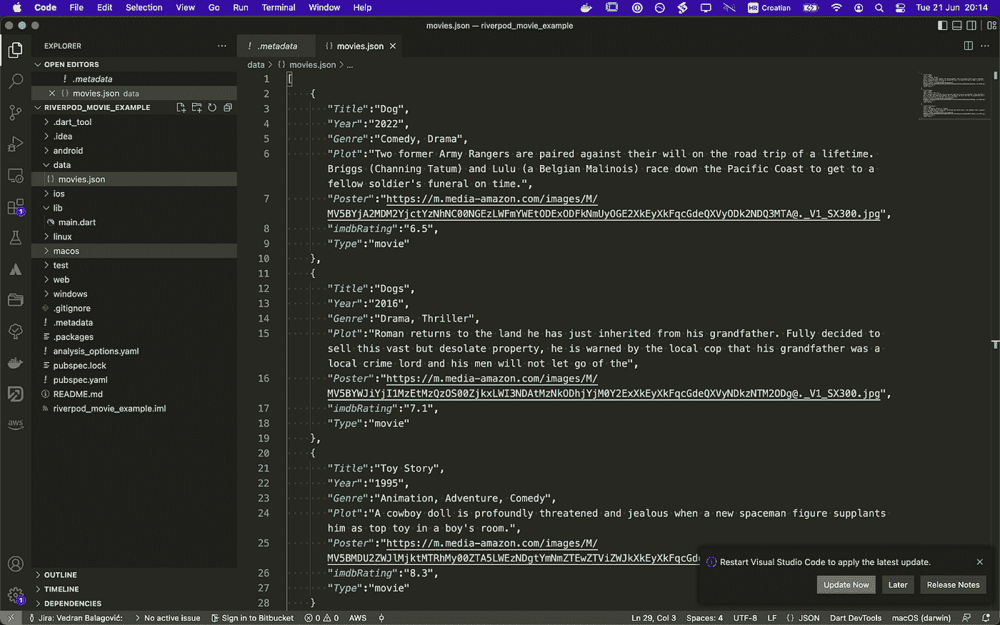

要将数据文件夹作为资产使用和访问，您需要更新您的 pubspec.yaml 文件。

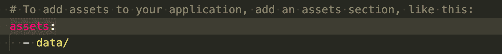

# 第二步。—创建模型类

在 lib 目录中创建 models 文件夹，我们将在其中添加 movie.dart 文件，该文件将成为我们的电影模型类。颤振架构中的模型对应 [MVC](https://en.wikipedia.org/wiki/Model%E2%80%93view%E2%80%93controller) 。当我们有我们期望收到的相同类型的数据时，通过一个模型来处理它(甚至是意想不到的事情)会容易得多，因为它简化了工作。我们总是知道我们将得到什么以及以什么形式得到，这将帮助我们通过应用来管理它。

*   这样做的基本方法是定义一个类，并添加我们期望的所有变量，以及构造函数(在我们的例子中，也是今天的标准 API 格式)来解析来自 JSON 和 JSON 的模型
*   在 [JSON to dart](https://javiercbk.github.io/json_to_dart/) 应用程序的帮助下，如果我们指定了 Json 格式，该应用程序将为我们完成所有工作，因此无需更多麻烦，从 movies.json 列表中取出一个 Json 对象，并将其复制粘贴到 Json to dart 应用程序。正如你所看到的，它甚至为我们处理了 JSON 对象中的数组数据(唯一的缺点是它可能不是最新的 dart 版本，所以你可能需要调整代码来删除不必要的关键字等):

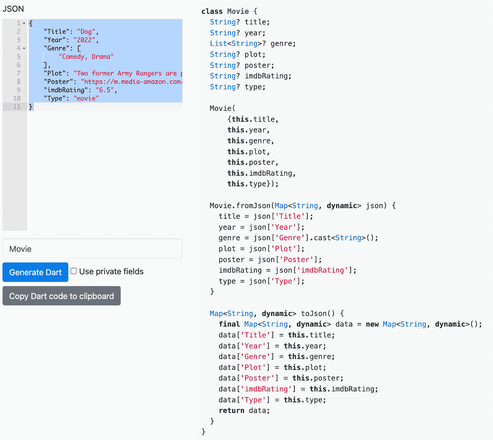

# 第三步。—创建简单视图

用小工具创建一个简单的电影列表。我们提取了一个电影卡片小部件，并添加了一个简单的列表视图构建器和一个电影类模型示例。我们应该有这样的东西。这个步骤的代码在一个单独的[分支](https://github.com/vbalagovic/flutter-riverpod-example/tree/STEP-3-simple-widgets)中，所以你可以看到它。

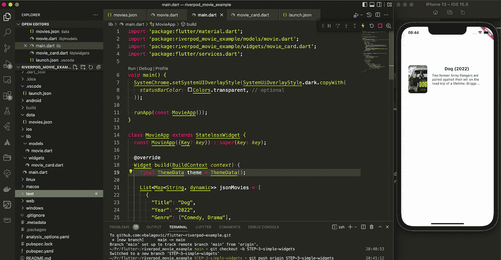

# 第四步。—介绍 Flutter Riverpod

首先，我们需要添加一个 [flutter riverpod 包](https://pub.dev/packages/flutter_riverpod/install)你有一个关于给定链接的安装指南，然后做以下事情:

*   一旦安装了 Riverpod，我们就可以用 ProviderScope 包装我们的根小部件:
*   ProviderScope 是一个小部件，它存储我们创建的所有提供者的状态。

之后，我们将把我们的 StatelessWidget 转换成消费者 Widget。通过子类化 ConsumerWidget，我们的小部件的 build()方法现在有了一个额外的 WidgetRef 参数，我们可以用它来监视我们的提供者。

WidgetRef 是什么？

Riverpod 文档将 WidgetRef 定义为允许小部件与提供者交互的对象。

> 为了更好地理解 WidgetRef 的用途，让我们将它与 BuildContext 进行比较:
> 
> BuildContext 允许我们访问小部件树中的祖先小部件(例如 Theme.of(context)和 MediaQuery.of(context))

换句话说，WidgetRef 允许我们访问任何我们想要的提供者。这是故意的，因为所有 Riverpod 提供商都是全球性的。

正如我们将看到的，这有很多优点，让我们可以轻松地将任何状态管理逻辑移到小部件树之外。状态可用性的示例:

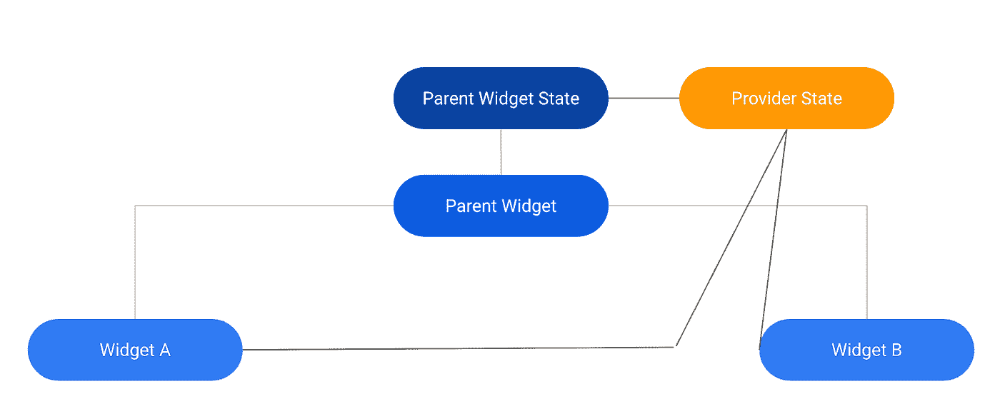

好了，这个设置仍然以引入 riverpod 之前的方式工作，所以让我们创建第一个提供者。

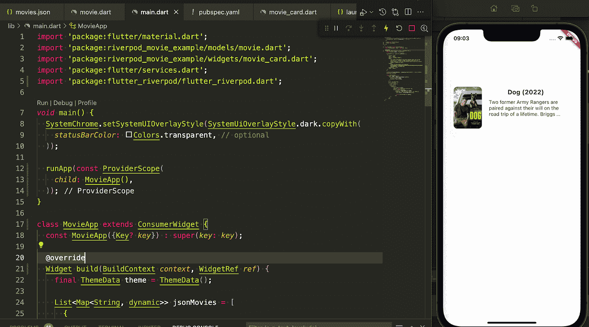

# 第五步。—创建电影提供商

Provider 和 StateProvider 对于像反例这样的简单用例已经足够了。但是在更复杂的应用程序中，我们经常需要在小部件类之外存储一些状态和一些业务逻辑。

因此，我们将为我们的业务逻辑使用 StateNotifier 提供程序。

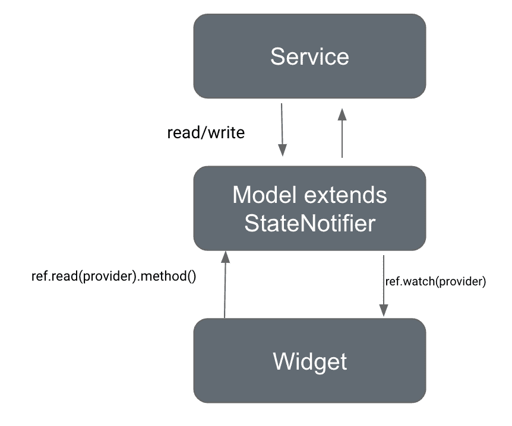

> StateNotifierProvider 是一个提供程序，用于侦听和公开 StateNotifier(来自 Riverpod 重新导出的包 state_notifier)。
> 
> StateNotifierProvider 和 StateNotifier 是 Riverpod 推荐的管理状态的解决方案，状态可能会随着用户交互而改变。

所以我们需要一个不可变的状态，为了创建这个简单的方法，我们将使用一个名为[冻结](https://pub.dev/packages/freezed)的包。它将为我们生成所有的样板代码，所以我们的提供者将会很好很干净。

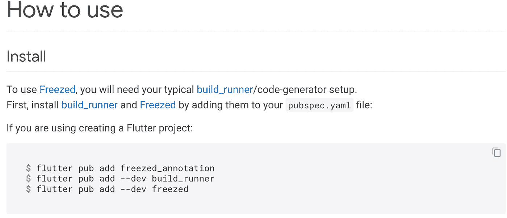

第一个简单的提供程序将加载我们的 json movies 数据，看起来像这样(如果您只是复制粘贴它，不要担心丢失文件，要创建丢失的冻结文件，您需要运行冻结包指令中指定的一些命令):

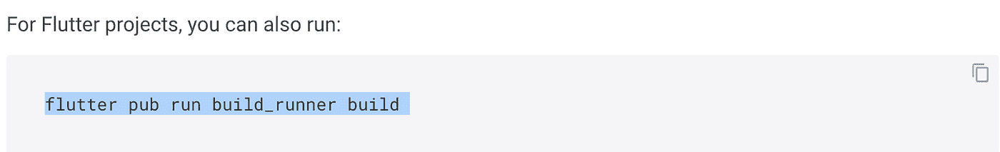

我们现在还可以清理 main.dart 文件，只需读取提供者就可以从列表中看到我们的电影。

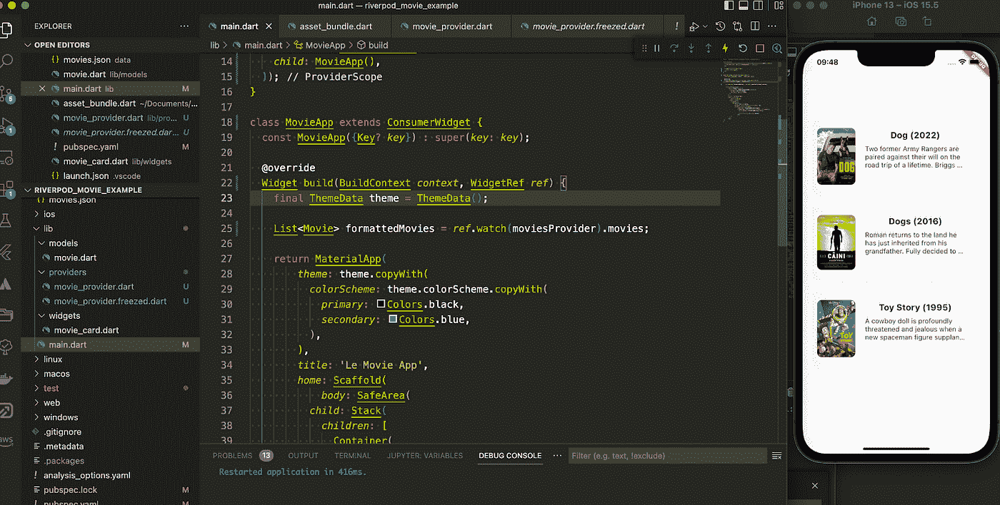

# 第六步。—增加简单的交互性

我们将添加一个简单的文本输入小部件和 onChanged function trigger，我们将调用提供者提供的一个新方法 filterMovies。

所以我们的 main.dart 现在看起来像这样:

像这样调出 movie_provider.dart:

正如我们可以看到的，虽然它的工作，我们有太多的重复代码，没有加载器时，搜索，当它将是一个 API 请求，这可能需要一些时间。

解决问题 1:提取 JSON 到服务的加载(稍后可以很容易地切换到 http 方法)

并替换提供程序中的获取。现在，我们可以在一个地方轻松地切换任何类型的数据获取方法。有了存储库(下一篇文章)，它将很容易测试。

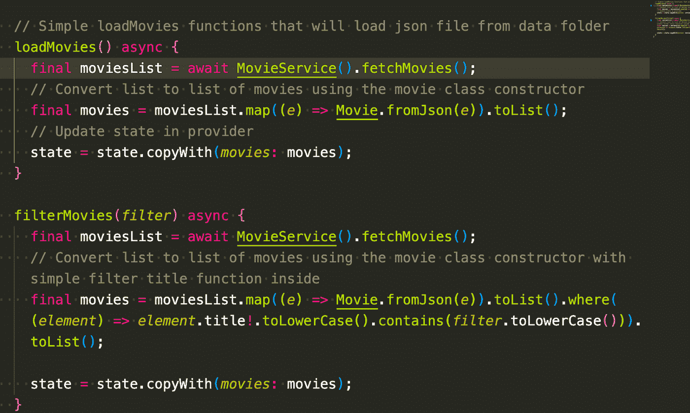

解决问题 2:在搜索时添加加载程序

虽然这可以用 FutureProvider 自然解决，但为了方便起见，让我们用最简单的方法来解决这个问题:

*   在 MovieState 中添加 isLoading 变量(每次加载时触发)

*   运行命令重新生成电影状态

颤振包发布运行构建 _ 运行构建—删除—冲突—输出

*   主屏幕上正在加载监视程序

向模拟加载程序的服务添加延迟:

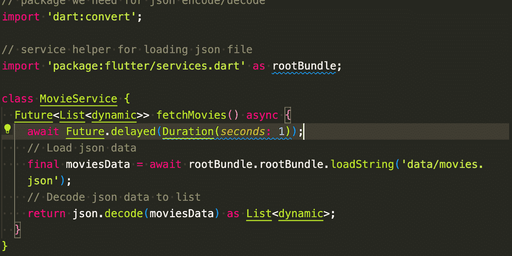

也许这不是最佳的方式或代码，但我认为它对初学者来说是友好的，你可以在这个基础上构建，这也是本文的目的。

完整代码回购可在 [github 链接](https://github.com/vbalagovic/flutter-riverpod-example)上获得。

# 为什么是 Riverpod？

正如文件中所说的。为了理解我们为什么需要 Riverpod，让我们来看一些使用 Riverpod 解决的 Provider 最常见的问题:

按照设计，Provider 是对 InheritedWidget 的改进，它依赖于小部件树

*   组合提供者非常冗长
*   通过类型和运行时异常获取提供程序

高级 Riverpod 功能，我们将在未来详细讨论:

*   自动丢弃修改器
*   家庭修饰符
*   使用 Riverpod 的依赖性覆盖
*   将提供商与 Riverpod 相结合
*   范围提供者

我个人认为对于一个使用 redux/vuex 等的网络背景的人来说。Riverpod 是一种非常自然和符合逻辑的状态管理方式，而且它的核心毕竟是提供者(Flutter favorite ),而且是由同一个人制作的。此外，在这个简单的项目中，我们没有使用存储库，所以请记住这一点，并检查该模式的可测试性，直到我可以写一篇扩展文章。

第二章是[这里](https://medium.com/@vedran.balagovic/flutter-riverpod-example-and-guide-with-networking-b758af7b646b):)