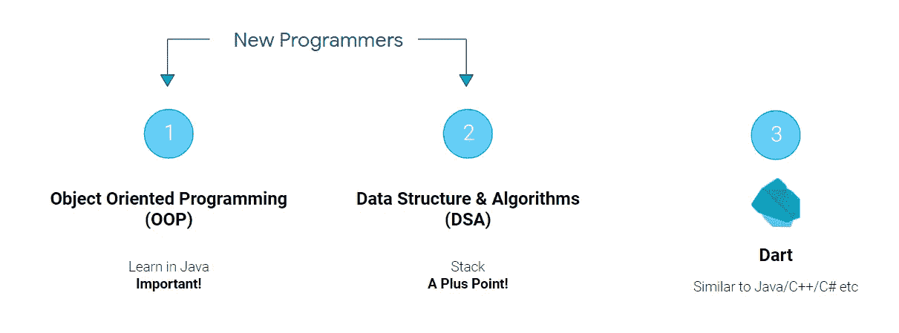
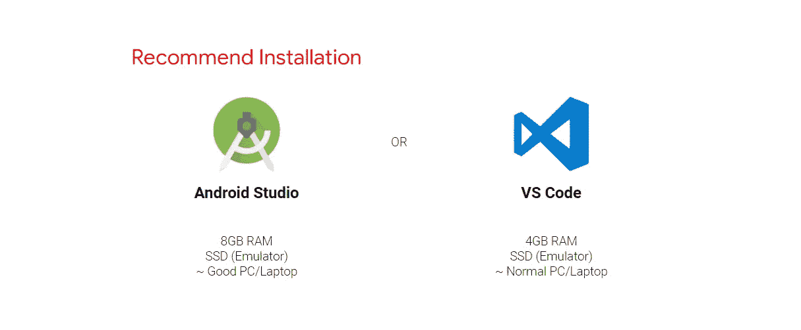
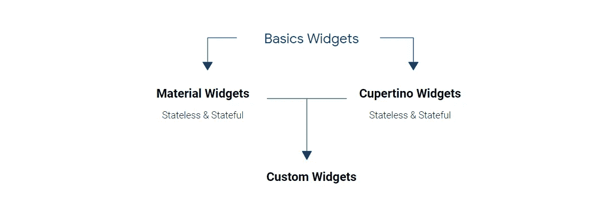
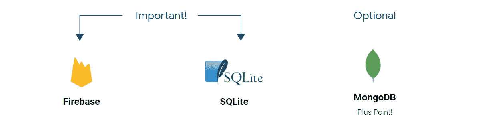
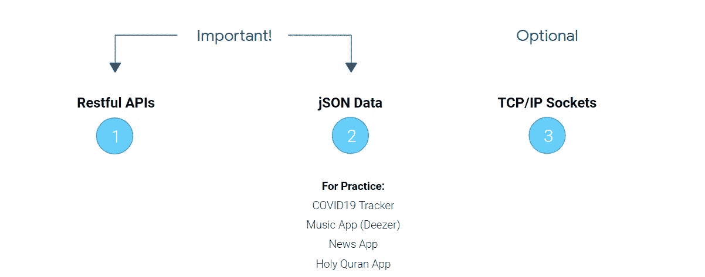
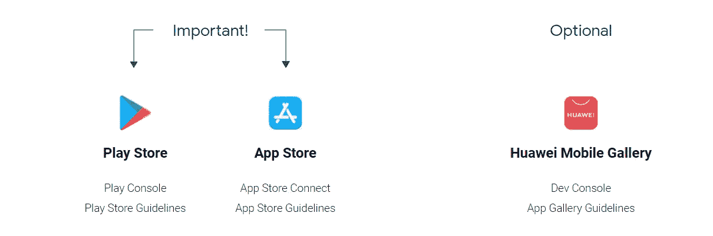

# 颤振路线图和资源指南— 2022 年

> 原文：<https://itnext.io/flutter-roadmap-resource-guide-2020-2ea6e4460a15?source=collection_archive---------0----------------------->

对于有一个好的文章开头方式，我总是很困惑。大多数人以一些故事开始，一些人以幽默的方式开始，而我呢？告诉你其他人是如何开始的，这样我就可以把这部分作为我文章的开始！😎

颤振资源和路线图指南 2021

> 这篇文章是关于 [GitHub 回购](https://github.com/m-hamzashakeel/Flutter-Roadmap-and-Beginners-Resources)的，你可以永远叉:)

尽管您已经阅读了标题，但没有必要告诉您我将在这里谈论什么，不过这是议程，因此您可以跳到您正在寻找的任何部分:

*   关于 Dart 的困惑
*   哪个 IDE 最好？
*   颤振基础
*   数据库
*   响应用户界面
*   建立工作关系网
*   状态管理
*   储存知识
*   下一步是什么？
*   其他资源

**🏃‍♂️，我们开始吧！**

现在，因为它是一个资源指南和路线图，所以我将添加从 [Flutter 官方文档](https://flutter.dev/)到我探索 Flutter 的天堂的所有链接！准备好了吗..？那就开始吧！

# 🎯关于 Dart 的困惑

*开始扑之前需要学飞镖吗？Flutter 入门需要多少 Dart 语言？Dart 是颤振的先决条件吗？*

如果你有上述任何一个问题，你需要考虑两种情况，并分析你现在所处的位置。

F 第一种情况，你是语言或编程的**完全** **初学者**？如果是的话，我的伙计！你需要学习一些基本的编程基础来开始使用 Flutter。哪些？

*   面向对象编程 **(OOP)**
*   **栈**(数据结构)不是强制的，但是会给你很大帮助。

第二种情况是，你不是初学者，你已经用 Java/C++/C#之类的其他语言编写了一些代码，那么你不需要专门学习 Dart，你可以在学习的过程中学习！

达特，是还是不是？

> 基本上第二种情况实际上是图中的第三种情况:p

# 💻哪个 IDE 最好？

接下来的困惑是 VS 代码还是 Android studio，Android Studio 还是 VS 代码？我们来解决这个问题，好吗？

> 我为什么要问你，反正我需要写作。Opsss！

下面是解释所有的图表，重要的是在图表下面。所以跳过去吧！

选择哪个 IDE？

> 但是，既然我们可以在没有 android studio 的情况下使用 Flutter，那么为什么推荐使用它呢？

纳布鲁！我不推荐使用 Android Studio，我会推荐你**安装**[**Android Studio**](https://flutter.dev/docs/get-started/editor)**，即使你不打算使用它**。

> W hy？别问为什么，照做就是了！

Na！开个玩笑，这是为什么？Android studio 将为您提供 Android Gradle、Android Emulator、Android SDK manager 等更多东西，您需要手动安装这些东西，并在实际进入 flutter 代码之前设置好一切。相信我！这是讨厌鬼！

因此，下载 android studio，安装它，但不要使用它。使用 [**VS 代码**](https://flutter.dev/docs/get-started/editor?tab=vscode) 旁边，因为它轻得多，你可以用许多方式定制它:)

# 👨‍🏫颤振基础

啊！现在是真正工作的时候了。如果你是 flutter 的完全初学者，并且你正在寻找一些课程或 YouTube 播放列表来开始？这里有一些让你开始的东西:

> **免责声明:**由于，Flutter 最新发布，这些课程和教程是针对 Flutter 版本< 2.00 的。所以，在进入它们之前，确保检查一些其他的东西，比如我在下面提到的 [**flutter_lint**](https://docs.flutter.dev/release/breaking-changes/flutter-lints-package) 和 Null safety。
> 
> U **pdate:** 自从 **flutter 3.x.x** 几乎所有的课程和播放列表都没有过时。所以，最好的起点是 [Cookbook | Flutter](https://docs.flutter.dev/cookbook) ，官方的 Flutter 团队已经放置了非常有组织的教程和练习样本。

*   [扑官方入门 Doc](https://flutter.dev/docs/get-started/install)
*   [于安琪— Udemy 课程](https://www.udemy.com/course/flutter-bootcamp-with-dart/) **(已过时)**
*   [网络忍者— YouTube 播放列表](https://www.youtube.com/watch?v=1ukSR1GRtMU&list=PL4cUxeGkcC9jLYyp2Aoh6hcWuxFDX6PBJ&ab_channel=TheNetNinja) **(过时)**

但是因为，现在 Flutter 2.0 和更高版本的更新，默认情况下在 Flutter 中启用了空安全，你必须以某种方式学习它。因此，在浏览任何教程或课程之前，因为它们大部分都是以前的版本，请确保同时学习零安全。

以下是一些帮助您入门的资源:

*   [Dart 中的空安全—简介— YouTube](https://www.youtube.com/watch?v=iYhOU9AuaFs&ab_channel=Flutter)
*   [声音零安全|飞镖](https://dart.dev/null-safety)
*   【不可空 Dart:了解空安全| raywenderlich.com

当你完成的时候，你将有关于 flutter 如何工作的基本知识，你可以马上开发应用程序！

颤振基础

# 💾数据库

嗯，虽然 Flutter 是一个 UI 工具包，而不是后端工具包，但你是一个应用程序开发人员，你需要有关于数据库的知识，对不对？

> 是啊！！

你需要做的第一件事是 **Firebase** 你可以这样开始:

*   [带颤振的燃烧室](https://flutter.dev/docs/development/data-and-backend/firebase) —颤振官方文档
*   [带颤振的 Firebase](https://firebase.google.com/docs/flutter/setup?platform=android)—Firebase 官方文档
*   [网络忍者 YT 播放列表](https://www.youtube.com/watch?v=sfA3NWDBPZ4&list=PL4cUxeGkcC9j--TKIdkb3ISfRbJeJYQwC&ab_channel=TheNetNinjaTheNetNinjaVerified) —扑击&火焰基地

等等！您的客户可以要求您将数据存储在本地。不要担心，你可以将 [**SQFlite**](https://pub.dev/packages/sqflite) 与 Flutter 一起使用。跟 *sqlite* 挺像的

颤振数据库

# 🎨响应用户界面

希尔……！！😜对不起，我只是有心情这么说。反正回到主题。因此，到目前为止，你几乎是一个完全的 flutter 开发者，可以开发带有可发布数据库的应用程序。但事实是，对于 Flutter 来说，让你的应用程序对各种屏幕尺寸做出响应是你的责任。这就像为各种屏幕尺寸制作一个响应性网站。

您可以使用以下内容开始:)

*   [响应式应用](https://flutter.dev/docs/development/ui/layout/responsive) —扑官方 Doc
*   [响应式用户界面设置](https://www.youtube.com/watch?v=z7P1OFLw4kY&ab_channel=FilledStacks) — YouTube 教程
*   [中等文章](https://medium.com/nonstopio/let-make-responsive-app-in-flutter-e48428795476)

这就是响应的全部内容，你需要练习和测试才能做好这一点:)

# 🌐建立工作关系网

Phewww！！😅我知道在这一点上，你可以开发一个拥有漂亮的响应用户界面和数据库的完整的应用程序，但事情是学习永无止境，你需要学习像**RESTful API**和 **jSON 数据解析**的东西。因为有时从互联网上获取实时数据会比创建自己的数据库更好。

> 嗯嗯…？

没错。因此，请接触 restful APIs 和 jSON 数据:

## 建立工作关系网

*   [联网](https://flutter.dev/docs/development/data-and-backend/networkings) —扑官方 Doc
*   [向互联网发送数据](https://flutter.dev/docs/cookbook/networking/send-data) —颤振官方文档
*   [从网上取数据](https://flutter.dev/docs/cookbook/networking/fetch-data) —扑官方文档

## RESTful APIs

*   [中型文章完成指南](https://medium.com/flutterdevs/using-rest-api-in-flutter-d19e6eb972b8)

## jSON 数据解析

*   [解析复杂 jSON](https://medium.com/flutter-community/parsing-complex-json-in-flutter-747c46655f51) —中等文章

## 📱要练习的应用:

*   [新冠肺炎追踪器应用](https://github.com/mhmzdev/Covid19-Tracker-App)
*   [古兰经 App](https://github.com/mhmzdev/The_Holy_Quran_App)
*   [音乐 App](https://medium.com/@ekosuprastyo15/flutter-music-app-example-with-api-deezer-21653239db48) —文章
*   [新闻 App](https://github.com/theindianappguy/FlutterNewsApp)

# 🛠国家管理

下一个**大**的事情！

在 Flutter 中学习状态管理很重要。现在，作为一个初学者，这不是强制性的，但希望在不久的将来，当你成为一个完全顶尖的 flutter 开发者，你会在 Fiverr 上获得一些订单来开发一个大规模的应用程序，像 Instagram 或脸书一样大…好了，现在停止想象！😂

对于大型应用程序来说，进行状态管理很重要。作为初学者，您可以使用简单的 *setState()* 来完成这项工作！因此，您可以按如下方式开始:

*   [状态管理](https://flutter.dev/docs/development/data-and-backend/state-mgmt/options) —颤振 Doc
*   [供应商](https://pub.dev/packages/provider)
*   [阻塞](https://pub.dev/packages/bloc)
*   [Redux](https://pub.dev/packages/redux)
*   [MobX](https://pub.dev/packages/mobx) 等。

> 你在哪个州的管理层使用 Hamza？嗯，我和布洛克一起工作

# 📱储存知识

你现在正在开发应用程序！看看你！😃最令人兴奋的是，你正在为 Android 和 iOS 开发应用。为此，你需要了解**谷歌 Play 商店**和**应用商店。**特别要阅读他们的指导方针，这样你的应用就不会在上传时被拒绝，也不会出现账户被封等问题，这些问题会阻止你通过任何一家商店获得收入。

> 耶！你不知道吗？没问题，现在你知道了。

# 🤔下一步是什么？

你正在开发应用程序，你是一个 flutter 开发者。那么，下一步是什么？我的朋友。学习永无止境，继续学习，继续探索，继续与他人分享您的应用和项目，并获得评论和帮助。永远记住:

> “成绩不说话自己”

因此，

*   给自己弄一个好看的 [**GitHub 简介**](https://github.com/mhmzdev) 并用合适的文档展示你的项目。这向其他寻找开发人员的人表明，你对你的工作和职业是认真的。获得一个不错的 GitHub 自述文件。 [**这是我的**，](https://github.com/mhmzdev/mhmzdev)你可以用，自己定制😊
*   同样的道理也适用于拥有一个好看的 [**LinkedIn 个人资料**](https://www.linkedin.com/in/mhmzdev/) 并建立联系。这将让你继续前进，你会在前进的道路上获得无数的机会！
*   展示自己的另一个好方法是准备一份 [**的现场简历**](http://mhmz.dev/) 。请你的朋友给你买一个简单的:)

# 📃其他资源

以下是你可以用来扩展你的颤振知识和研究的资源:

*   [颤振官方文档](https://flutter.dev/)
*   [它的所有部件](https://itsallwidgets.com/)

## 中等

*   [颤振社区](https://medium.com/flutter-community)
*   [颤振](https://medium.com/flutter)
*   [镖](https://medium.com/dartlang)

## 开源代码库

*   [颤振社区 GitHub](https://github.com/fluttercommunity)
*   [牛逼的颤振 GitHub](https://github.com/Solido/awesome-flutter)

## 脸书集团

*   [颤振社区](https://web.facebook.com/groups/fluttercommunity/)
*   [让我们用飞镖飞舞](https://web.facebook.com/groups/425920117856409/)

## LinkedIn 页面

*   [颤振发展](https://www.linkedin.com/showcase/flutterdevs/)
*   [颤振 App 开发](https://www.linkedin.com/company/flutter-app-development-firm/)

## YouTube 频道

*   [飘起官方](https://www.youtube.com/channel/UCwXdFgeE9KYzlDdR7TG9cMw)
*   [有趣的颤动](https://www.youtube.com/channel/UCU8Mj6LLoNBXqqeoOD64tFg)
*   [MTECHVIRAL](https://www.youtube.com/channel/UCFTM1FGjZSkoSPDZgtbp7hA)
*   [简易方法](https://www.youtube.com/channel/UC4hWRtPpBaq72ERUuKsvO7g)
*   [网络忍者飘起](https://www.youtube.com/watch?v=1ukSR1GRtMU&list=PL4cUxeGkcC9jLYyp2Aoh6hcWuxFDX6PBJ&ab_channel=TheNetNinja)

Weeyy Haaa！！🤠我们完成了，你是一个完整的 Flutter 开发者了！恭喜你！！🥳

这都是我的观点，我希望上面的垃圾能帮到你。祝你未来的努力好运。是的，我忘了一件事:

## 请鼓掌！！👏请..！！AaaaHAHAHHAHA！😭

哈哈哈！开个玩笑:)

# 谢谢你们所有人💙