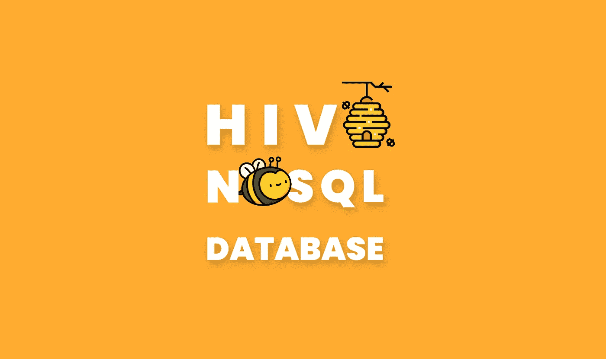
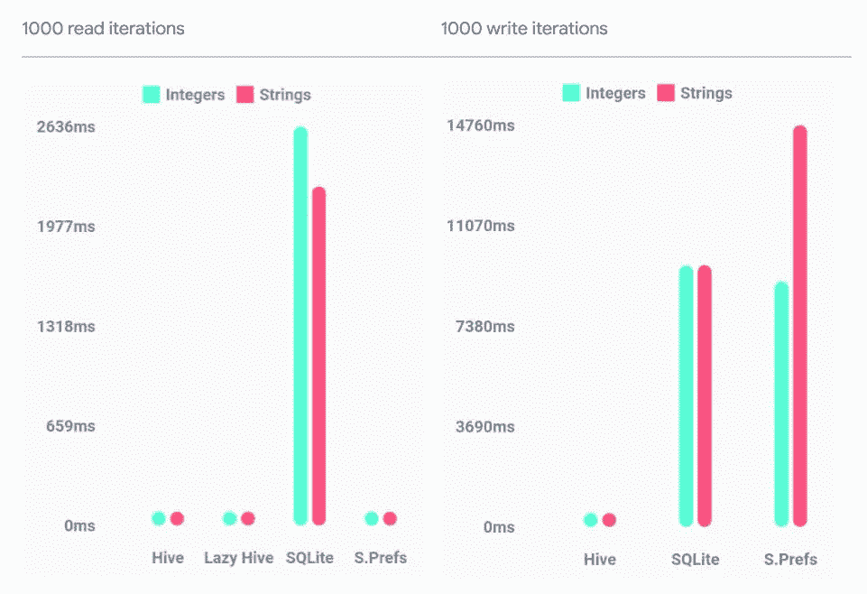
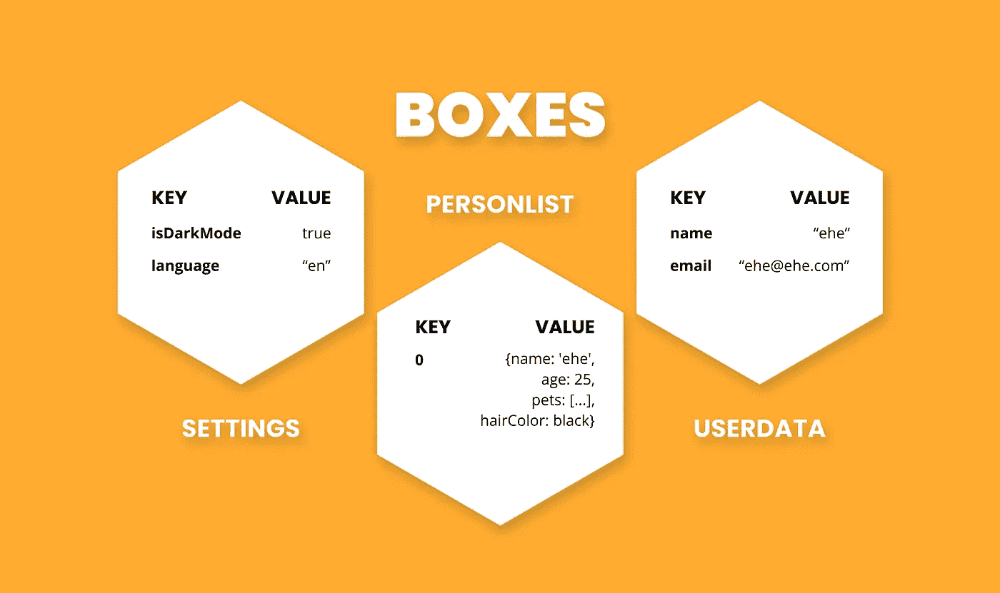

# 颤振保存数据到本地存储与蜂房 NoSQL 数据库包

> 原文：<https://itnext.io/flutter-save-data-to-local-storage-with-hive-nosql-database-package-8a0de834f313?source=collection_archive---------2----------------------->



## Hive 是一个用纯 Dart 编写的轻量级、速度极快的键值数据库。

# 动机



(越低越好)

## 什么是 Hive？

Hive 是一个先进的 NoSQL 本地数据库。

## 盒子是什么？

存储在 Hive 中的所有数据都组织在盒子中。一个盒子可以比作 SQL 中的一个表，但是它没有结构，可以包含任何东西。

盒子也可以加密以存储敏感数据。

Hive 可以存储原始数据和对象。

## 本文由两部分组成

1.  使用原语的基本 CRUD 操作
2.  如何使用对象



## 如何使用 Hive？

向您的 pubspec.yaml 添加依赖项

```
dependencies:
  hive: ^2.0.4
  hive_flutter: ^1.1.0

dev_dependencies:
  hive_generator: ^1.1.0
  build_runner: ^2.1.2
```

在 main.dart 中的`runApp()`之前初始化配置单元

```
**import 'package:hive_flutter/hive_flutter.dart';**void main() **async** {
  **await** **Hive.initFlutter();**
  runApp(MyApp());
}
```

# 第 1 部分:使用原语的基本 CRUD 操作

首先，你需要打开你的盒子

```
await Hive.openBox('boxName');
```

现在你可以做 CRUD 操作了

## 创造

您可以使用键值对保存数据。

```
**final box = Hive.box('boxName');**// key, value
box.**put**('name', 'ehe');
box.**put**('age', 25);
box.**put**('friends', ['a','b','c']);
box.**put**(123, 'evet');// index, value
box.**putAt**(35, 'value')box.**putAll**({'name': 'ehe', 'mail': 'ehe@ehe.com'});
```

您也可以不创建实例而直接获取

```
Hive.box('boxName').**put**('name', 'ehe');
```

## 阅读

```
// if key does not exists return null
String name = box.**get**('name');// if key does not exists return defaultValue
double height = box.**get**('height', defaultValue: 35);// get from **index**
box.**get**(35);
```

## 更新

只需再次覆盖键上的值

## 删除

```
// delete key
box.**delete**('key');// delete keys
box.**deleteAll**(['key1','key2']);// delete index
box.**deleteAt**(35);// delete whole box
box.**deleteFromDisk**();
```

# 一些有用的方法

```
// if the box contains the key return true, else false
final containsKey = box.**containsKey**('key');// get all keys in box
final keys = box.**keys**;// get all values in box
final values = box.**values**;// clear box
box.**clear**();
```

还可以轻松的在 Hive 中存储对象！！

# 第 2 部分:如何使用对象

## 步骤 1:创建你的对象

## 步骤 2:生成适配器

在您的项目中运行此命令

```
flutter packages pub run build_runner build
```

## 步骤 3:注册适配器并打开一个盒子

您需要注册所有想要使用的枚举和对象适配器

```
void main() **async** {
  **await Hive.initFlutter();** ... **Hive.registerAdapter(PersonAdapter());
  Hive.registerAdapter(HairColorAdapter());
  Hive.registerAdapter(PetAdapter());** **await Hive.openBox<Person>('personList');** runApp(MyApp());
}
```

## 步骤 4:进行 CRUD 操作

```
**final box = Hive.box<Person>('personList');**// You can also use auto-increment keys if you like. This is very useful for storing and accessing multiple objects. You can use a Box like a list.do// **Create**
box.**add**(person);// **Read**
final person = box.**getAt**(0);// **Update**
person.name = 'newName';
person.**save**();// **Delete**
box.**deleteAt**(0);
```

## 您还可以收听更改和即时更新

```
**// ValueListenable
ValueListenableBuilder**(
  valueListenable: **box.listenable(),**
    builder: (context, Box<Person> box, _) {
      return ListView.builder(itemBuilder: (_, index) {
        return Text(box.getAt(index)!.name);
      }
    );
  },
),// **Stream**
box.**watch**().**listen**((event) => print(event));
```

## 如果您想看一些代码示例

我试着在一次中使用它，所以它看起来有点复杂，但是不要担心你能做到！

[](https://github.com/iisprey/hive_example) [## GitHub - iisprey/hive_example

### 一个新的颤振项目。这个项目是颤振应用的起点。一些帮助您入门的资源…

github.com](https://github.com/iisprey/hive_example) 

## 此外，Hive 还有很多我没有提到的特性

如果您感兴趣，请查看文档以获取更多信息

 [## Hive 文档

### 描述

docs.hivedb.dev](https://docs.hivedb.dev/) 

## 感谢您的阅读！

我试图尽可能简单地解释它，我希望你喜欢它。

如果你喜欢这篇文章，请点击👏按钮(你知道你可以升到 50 吗？)