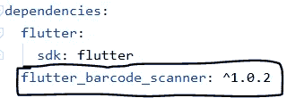
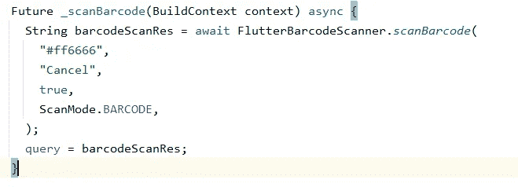
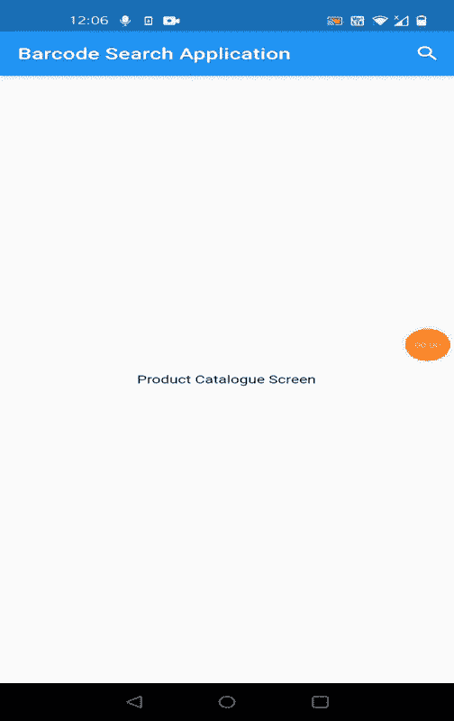

# 颤动—使用条形码扫描进行搜索

> 原文：<https://itnext.io/flutter-search-using-barcode-scan-d23adc7b138c?source=collection_archive---------3----------------------->

*   条形码作为一种快速识别的手段应用于产品。它们在零售商店中作为采购流程的一部分使用，在仓库中用于跟踪库存等。因此，对于电子商务、库存管理等应用程序来说，使用条形码在产品目录中搜索产品是一个常见的用例。现在，这些条形码通常很长(12/13 位)，所以在搜索框中手动输入会很麻烦。

现在让我们看看如何在 flutter 应用程序的搜索框中集成条形码扫描。

*   在 pubspec.yaml 文件中添加[**flutter _ barcode _ scanner**](https://pub.dev/packages/flutter_barcode_scanner)包，键入命令“ ***flutter pub get*** ”安装依赖项。

pubspec.yaml

*   现在，要在应用程序栏中添加搜索栏，您必须扩展 SearchDelegate 类并覆盖其方法。

1.  列出<widget>build actions(build context context):*在 AppBar 中搜索查询后显示的小部件(通常是清除搜索查询按钮)。我们还将添加一个按钮来触发条形码扫描。*</widget>
2.  小部件 build leading(build context context):*在 AppBar 中当前查询之前显示的小部件(通常是 back 按钮)。*
3.  widget build results(build context context):*用户从搜索页面提交搜索后显示的结果。*
4.  小部件 build Suggestions(build context context):*建议，当用户在搜索字段中键入查询时，这些建议将显示在搜索页面的正文中。*

*   SearchDelegate 为您提供了一个名为“ **query** ”的特殊 getter 和 setter，这是 AppBar 中显示的当前查询字符串。因此，在我们的用例中，我们可以轻松地将条形码扫描的结果分配给这个查询，以更新搜索栏中的搜索字符串。

使用条形码扫描进行扫描

*   最后，将所有内容拼接在一起，我们的产品搜索委托将如下所示:

一旦您构建了项目，将会得到以下结果:

你可以找到整个项目: [Github](https://github.com/Amitbhave/flutter-barcode-search)