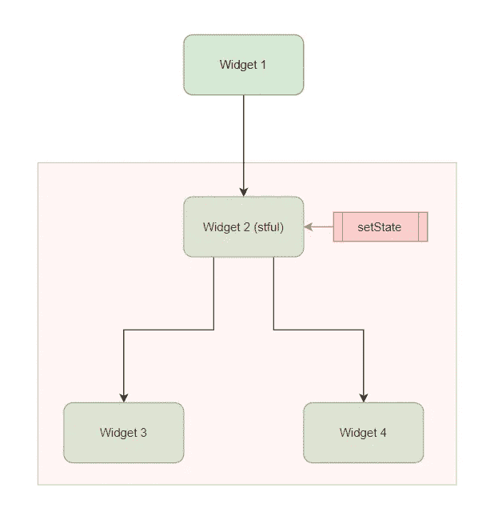
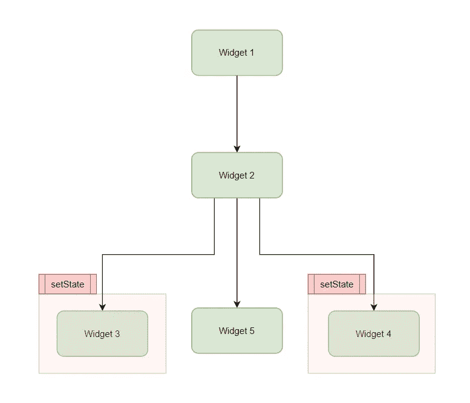
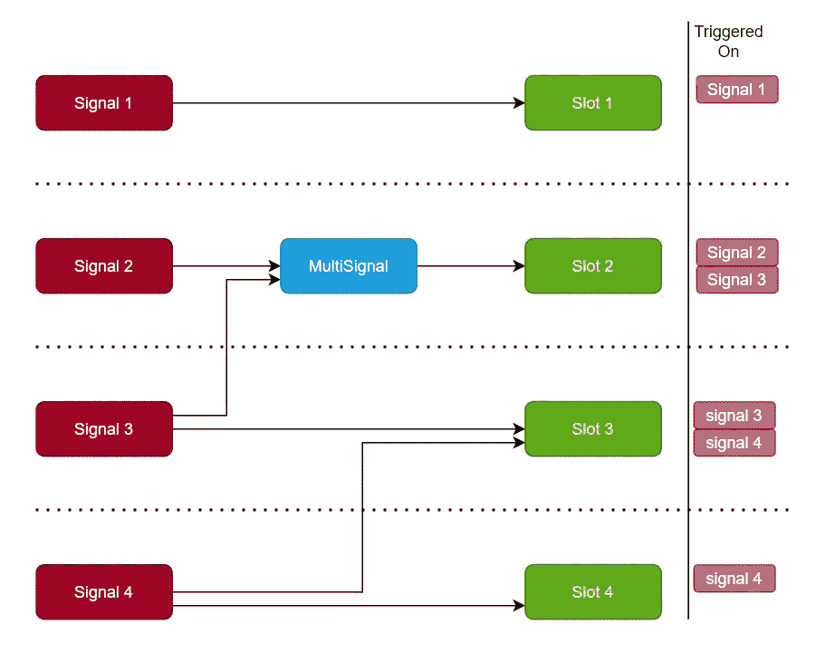

# 颤振状态管理的困惑与解决方案

> 原文：<https://itnext.io/flutter-state-management-signal-slot-a6191e93c9d6?source=collection_archive---------2----------------------->

> 我写这篇文章不是为了向社区介绍一种新的状态管理方法，而是为了解释社区和代码中存在的混乱，以及我自己如何简化它。本文还包括我自己的状态管理包。[签|镖包(pub.dev)](https://pub.dev/packages/sign)

如您所知，状态管理是 Flutter 中的热门话题之一。

许多方法、许多库和数以千计的文章、社区中不断被问及的问题……我已经做了三年的 Flutter 开发者，这些问题、文章、讨论从来没有减少，它们只是增加了。

## 这么多事情

我浏览示例、教程和源代码。我问的问题是:为什么有这么多东西？我想做的是通知小部件一个信息已经改变。为什么一个状态管理库要由上万行代码组成？ref，watch，read，context，observable，of，todoProvider，allTodoProvider，someTodoProvider，dependency injection…有几十种不同的概念、用途和例子在继续。

由于许多状态管理库的文档太长，无法在一页中解释清楚，所以它将它们引向外部资源。一个有 40 多个话题。在其中一个版本中，README.md 被用作一个 changelog，它只讲述从旧版本的迁移。

我知道，例如 GetX 提供了许多不同的便利/概念。所以它有很长的文档和数万行代码。我当然不是在批评现有的方法。

我们想要做的只是报告对小部件的更改。真的没必要搞这么大的东西。

我们不得不承认，对于大三或者 mid 来说肯定是有困惑的(或者说概念/东西太多了)。

现在，从一开始，我将以最简单的形式解释什么是状态管理，以及如何做，使用我自己的(最近重命名并发布的)方法(包)。该软件包由 550 行代码组成，包括列表和映射类迭代，+250 行，带有 flutter 小部件，即只有 800 行和 3 个类。而且非常快。

## 什么是国家管理？

非常简单:状态管理就是在期望的时间管理期望的小部件的重建。

你如何进行这种管理会极大地影响你的表现。它还会增加/减少编码时间。当与团队合作或随着项目的增长，它也改变了可管理性。

## 如何管理状态？

改个东西，报给`State`。仅此而已。

我们是怎么做到的:`setState`。

注意，`setState((){})`将一个函数作为参数。这个意思是:`<notifyWidget>(<before_change_something>)`。

setState 重新构建您所在的小部件和树下的其他小部件。

小部件 2 中的 setState，重建红色区域。



## 如何优化？

每个 setState 都会导致小部件被重新构建、重新呈现，或者导致决定应该重新构建/呈现的函数调用。

虽然 Flutter 已经过优化，但是阻止进行这种优化的函数调用会增加您的帧速率。(在一个简单的页面上可能有高达 50%的差异。)

剩下要做的唯一一件事就是:让您称为 setState 的小部件尽可能小。

向树中添加新的更小的小部件并在其中执行 setState 比更具包容性的 setState 更有效。

我们的基本原则就是这样。



## 管理数据

现在可以问一些问题:我如何将值传递给这些子部件。如何读取子部件中的变化并通知另一个子部件？

**这些问题真的与状态管理无关！**

您可以用参数将这个变量数据发送给子部件，可以将这个数据保存在另一个类实例中，可以将其定义为一个全局实例，并且可以从任何地方读取它。还有许多其他方法。

要将子部件中的更改发送到其他子部件，您必须触发一个函数。这个被触发的函数必须以某种方式在其他子部件的状态中运行 setState。

## 状态变化如何触发一个函数，我如何报告它？

现在我想用我自己的包来解释这个问题。我的包只是 ValueNotifier 或 GetX 的简化版。

我只是阐述一个观点。从这个角度来看，你可以使用任何你喜欢的方法。

我的灵感来自 QT 框架中的信号槽结构，并这样命名。

我的包是独立的。您可能还需要监听、报告和处理 Dart 包/程序中的一些变化。

Dart 包: [sign | Dart 包(pub.dev)](https://pub.dev/packages/sign)

颤振包: [sign_flutter |颤振包(pub.dev)](https://pub.dev/packages/sign_flutter)

首先，让我解释一下如何在 dart 中监听、通知和处理更改。

现在，我们需要一个在发生变化时发出信号的类，以及一个接收这些信号的类。所以`Signal`和`Slot`。

我们创建一个`Signal`，我们给这个信号添加一个`Slot`，每当这个信号的`value`改变时，插槽的`onValue`功能运行。

1.  创建信号

```
*/// Create a Signal from a variable*
**final** Signal<int> signal = 0.signal;
```

2.定义一个槽

```
**class** **MySlot** **extends** **Slot**<**int**> {
  MySlot();

  **@override**
  **void** onValue(int value) {
    *// Do something*
  }
}
```

3.添加插槽

```
signal.addSlot(MySlot());
```

4.改变数值或发送信号

```
**void** f() {
  signal.value++;
  *// OR*
  signal.sign();
}
```

在某些情况下，您可能需要从多个信号读取值的插槽。你可以用`MultiSignal`来做这个。



**现在，回到子部件问题。**

有了这个信号，我们可以更改数据，我们还可以创建一个新的小部件，为这个信号添加一个插槽。

该语句向该信号添加了一个槽，并创建了一个新的子部件:

```
signal.builder((value) => Text('$value'))
```

这条语句允许上面的小部件被重新构建:

```
signal.value++;
```

如果您想要创建一个读取信号值自定义子部件，那么您应该将“signal”变量发送给这个子部件，并创建一个读取其值的新的子部件。

坏:`MyCustomWidget(value: signal.value)`

好:`MyCustomWidget(signal : signal)`并使用`signal.builder`。

性能测试报告:[Mehmetyaz/state _ management _ performance(github.com)](https://github.com/Mehmetyaz/state_management_performance)

签署一揽子回购协议:[穆罕默德亚兹/签署(github.com)](https://github.com/Mehmetyaz/sign)

sign _ flutter package repo:[Mehmetyaz/sign _ flutter(github.com)](https://github.com/Mehmetyaz/sign_flutter)

对我来说，国家管理就是这样。我再继续写下去，就脱离题目的语境了。因此:

谢谢你听我说！

穆罕默德·亚兹

mehmedyaz@gmail.com