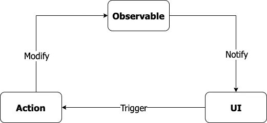
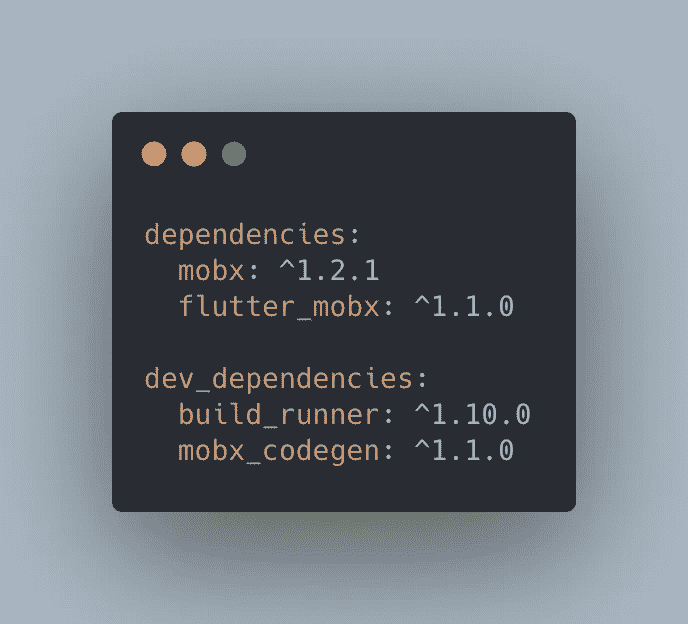
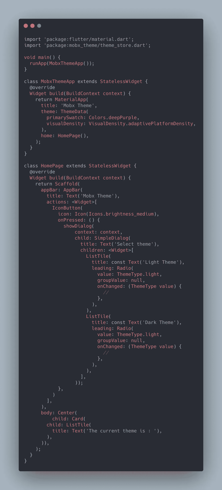
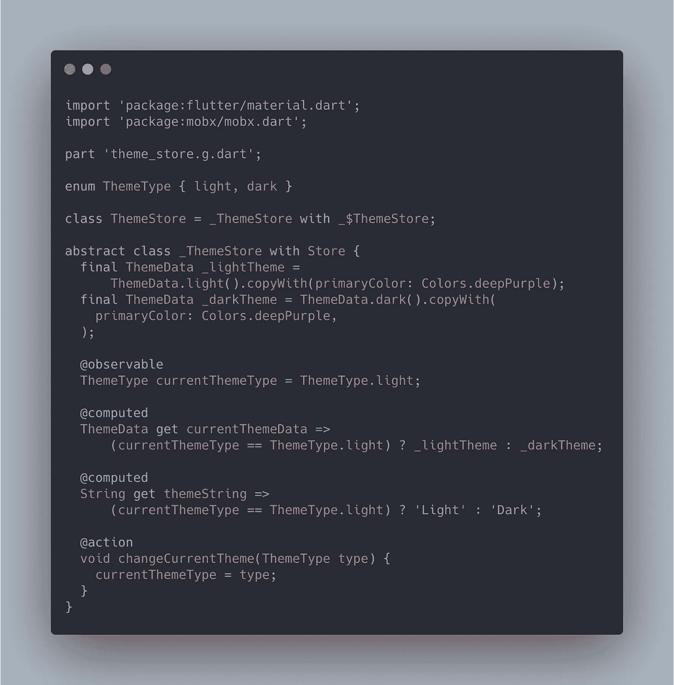
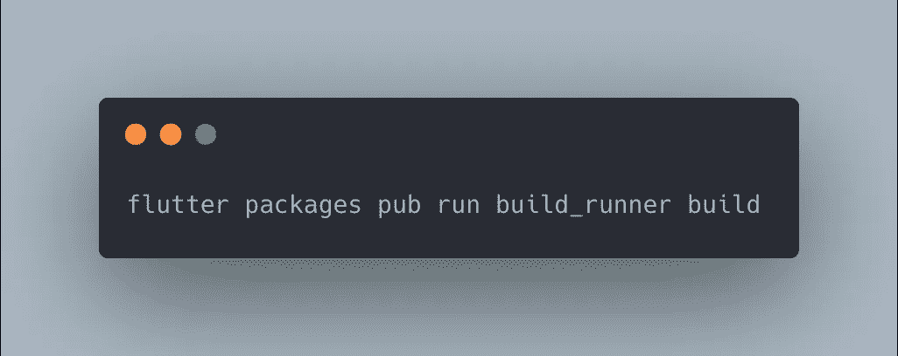
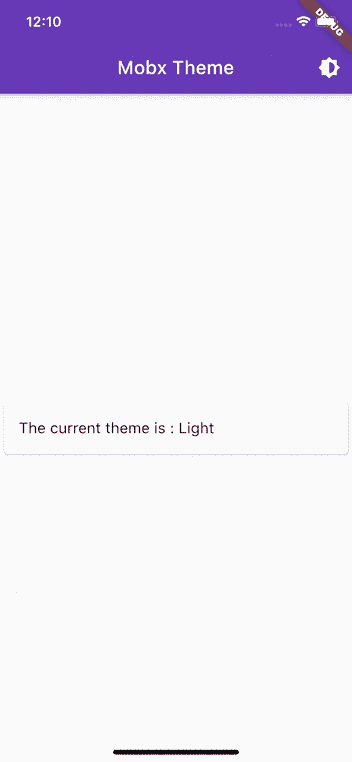
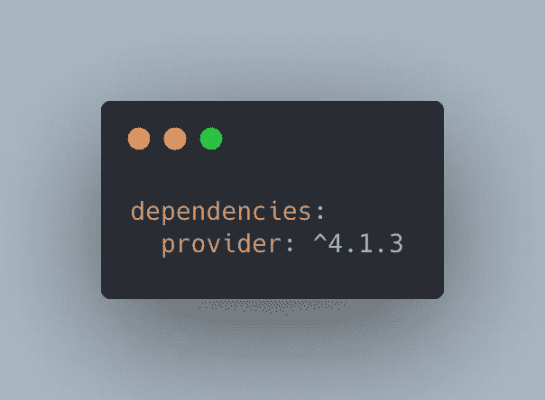
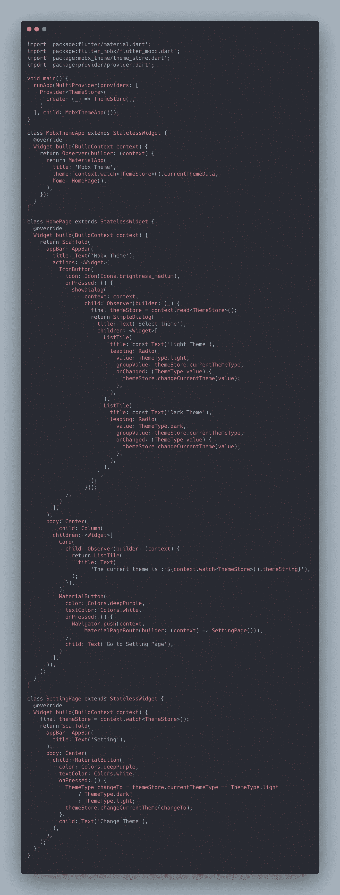
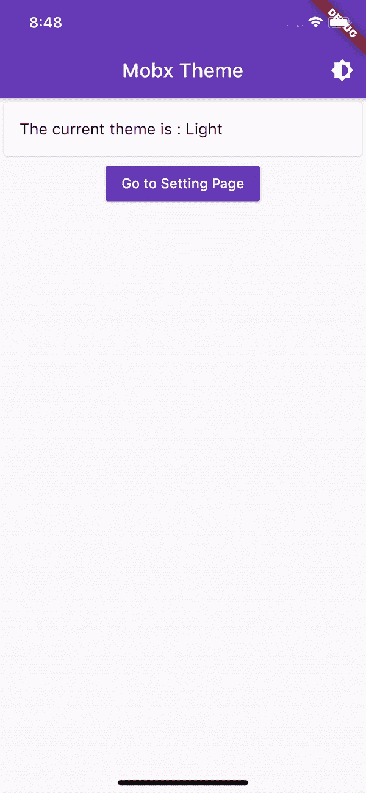

# Mobx 和提供商的颤振状态管理:动态改变应用程序主题

> 原文：<https://itnext.io/flutter-state-management-with-mobx-and-providers-change-app-theme-dynamically-ba3b60619050?source=collection_archive---------0----------------------->

Flutter 中的状态管理就像一个迷宫，你可能很容易在 InheritedWidget、ScopedModel、Redux、BloC、Mobx 和许多其他库之间迷失。选择一个是非常困难的，尤其是当你刚刚开始使用 Flutter 的时候。这是我的案例，经过反复试验，我偶然发现了 Mobx 并爱上了它。

## Mobx 状态管理解释道:

Mobx 是什么？

> 【Dart 和 Flutter 应用的无故障状态管理

Mobx 使得将 UI 与您的反应数据连接起来变得非常容易。如果你有兴趣阅读更多关于 Mobx 如何工作的内容，你可以去官方文档(链接)。但简而言之，我们可以这样说:

*   UI(或观察者)将触发一个动作
*   该动作将触发可观察到的突变
*   UI 将对可观察对象的变化做出反应。

Mobx 的概念

## Mobx 入门:

要使用 Mobx，您需要将这些依赖项添加到您的 Flutter 项目中:

我们将需要提供者包。这个包将允许我们在小部件树中注入我们的 Mobx 存储。这种方法比使用 Singleton 更好，因为一旦不再使用小部件，提供者将自动处理我们的存储。这可能会派上用场，尤其是在大型项目中。
大概就是这样。现在我们需要定义保存状态的商店，但是首先，我们需要创建我们的应用程序和 UI。

## 创建应用程序:

我们今天要创建的应用程序是一个非常简单的应用程序，只有一个功能:改变应用程序的全局主题。

主.镖

正如你从上面的动画图像中看到的，当我们按下单选按钮时，什么也没有发生。我们想要做的是将我们的状态与我们的 UI 挂钩，并让它对变化做出反应。

为此，我们需要创建主题商店。主题商店将暂时代表我们应用程序的状态。请注意，对于较大的项目，您可能希望根据使用情况将您的状态分成多个存储。一个更好的实现应该使用像 MVVM(模型-视图-视图模型)这样的原则。

Mobx 让我们能够使用代码生成来为我们的代码生成样板文件，我们所要做的就是使用注释: ***@action*** ， ***@observable*** 和 ***@computed*** ，Mobx 代码生成器会处理剩下的事情。

对于 ***@computed*** 来说，这就是 Mobx 创建者所说的派生状态，这意味着一个 computed 的值不会直接受到动作的影响，而是一个或多个可观察值发生变化的结果。

主题 _ 商店.镖

下一步是通过键入以下命令来运行代码生成器:

生成 Mobx 代码的命令

命令完成后(通常需要几秒钟完成)，您会注意到 Mobx 为我们生成了一个名为 theme_store.g.dart 的新文件

现在我们已经读取了状态存储，并使用 Mobx 代码生成器生成了代码，剩下要做就是像这样把它们连接起来:

正如你从上面的代码中看到的，我们有了一个名为 ***Observer*** 的新小部件。每当我们的状态(可观察的/计算的)发生变化时，Mobx 就会使用这个小部件在 Observer 的构建方法中触发重建。

最后的结果是:

决赛成绩

## **从不同页面更改主题:**

如果我们想改变另一个页面的主题呢？一个简单的解决方案是沿着部件树注入我们的状态存储，但是如果我们有多个状态存储呢？这样做不是很大的项目可能会有一些非常严重的性能问题，调试变得非常困难，老实说，这不是很好。

> 救援提供者

一个更优雅的解决方案是 Mobx + Provider，Provider 包允许我们注入我们的存储，并从我们的 widget 树的任何地方检索它们。下面的代码演示了我们如何做到这一点。

我们需要做的第一件事是将提供者包依赖项添加到我们的项目中:

提供商依赖性

之后，我们需要使用 Provider 在我们的小部件树中注入我们的 Mobx 存储。作为一个习惯，我总是使用 MultipleProvier，并且在应用程序的根目录下注入我所有的存储。要沿着小部件树检索我们的商店，提供者有三种方法:

> `context.watch<T>()`，让小工具监听`T`上的变化
> 
> `context.read<T>()`，不听就返回`T`
> 
> `context.select<T, R>(R cb(T value))`，允许一个 widget 只监听`T`的一小部分。

我们的新代码将如下所示:

主.镖

最终结果应该是这样的:

## 结论:

在 Flutter 应用程序的状态管理解决方案的海洋中，Mobx 是我的状态管理需求的首选解决方案。我发现它非常强大，非常容易使用，这使得 Flutter 开发成为一种非常愉快的体验。
就这些了，你可以在下面的 Github 库中找到本文的完整代码。感谢您的阅读！

 [## yiss/mobx_theme_provider

### 一个新的颤振项目。这个项目是颤振应用的起点。一些帮助您入门的资源…

github.com](https://github.com/yiss/mobx_theme_provider)