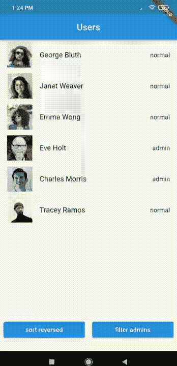

# 用 Riverpod 进行颤振状态管理

> 原文：<https://itnext.io/flutter-state-management-with-riverpod-ef8d4ef77392?source=collection_archive---------0----------------------->

## 一个有点复杂的真实世界 riverpod 例子

正如我上周承诺的。我将向您展示我自己的终极状态管理解决方案！又叫做

## [river pod](/a-minimalist-guide-to-riverpod-4eb24b3386a1)+[state notifier](https://pub.dev/packages/state_notifier)+[Hooks](https://iisprey.medium.com/get-rid-of-all-kind-of-boilerplate-code-with-flutter-hooks-2e17eea06ca0)+[Freezed](https://iisprey.medium.com/how-to-handle-complex-json-in-flutter-4982015b4fdf)

Riverpod 太牛逼了！但是没有太多好的例子。只有基本的，仅此而已。这一次我试图创造一个既容易理解又复杂的例子。我的目标是通过这个例子教你何时使用以及如何使用 Riverpod。我尽可能简化了这个过程。希望你喜欢！

## 小心！！

如果你对如何使用 Riverpod 没有任何概念，请先查看这篇文章，然后再回到这里！

 [## Riverpod 简约指南

### 颤振中最好的状态管理和依赖注入解决方案之一

itnext.io](/a-minimalist-guide-to-riverpod-4eb24b3386a1) 

# 动机

# 在这个例子中我们要做什么？

我们将从 API 中获取一些数据，并在 UI 中对它们进行排序和过滤

## 基本上，我们会；

1.  创建简单和复杂的提供者，并组合它们
2.  使用`AsyncValue`对象并使用`when`方法在 UI 中显示异步值
3.  此外，为不可变对象解决方案创建`freezed`对象

我们开始吧！

## 创建 API 服务

> 小提示
> 我找不到一个好的 API 模型来使用过滤功能，这是因为我自己添加了角色。请原谅我

## 使用`freezed`和`json_serializable`创建一个不可变的模型

如果你想了解更多关于`Freezed`的信息，请查看这篇文章。

 [## 如何在颤振中处理复杂的 JSON

### 对于初学者来说，在 Flutter 中处理 JSON 有点痛苦。他们将面临几个问题。我知道…

iisprey.medium.com](https://iisprey.medium.com/how-to-handle-complex-json-in-flutter-4982015b4fdf) 

## 从服务中获得价值

你可以想，`AsyncValue`是什么，它只是一个帮助我们处理值的状态的联合类。它附带了一个现成的提供商包。

我将在我的下一篇文章中深入解释，但目前为止，就这些。

创建排序和筛选提供程序

## 从 provider 获取获取的列表，并使用另一个 provider 对它们进行过滤和排序

## 在用户界面中显示所有内容

## 我们到了！

如果你认为这个例子是一个电子商务应用程序，这个例子会更有意义

# 奖金

这是我的下一篇关于 Riverpod 的文章

 [## Riverpod 在颤动时的撤销/重做机制

### 实现撤销-重做机制是多么容易的故事

itnext.io](/undo-redo-mechanism-with-riverpod-in-flutter-6fc15ef87b1a) 

# 临终遗言

我不是一个大师。只是学习和分享我的经验，所以如果你知道使用`riverpod`的更好方法，请告诉我们！

## Github 项目示例

这是你的源代码。

 [## GitHub-IIS prey/river pod _ example

### 一个新的颤振项目。这个项目是颤振应用的起点。一些帮助您入门的资源…

github.com](https://github.com/iisprey/riverpod_example) 

## 感谢您的阅读！

那是一篇很长的文章，而你大老远跑来这里！你太棒了！请不要忘记鼓掌(也可能你不知道鼓掌可以达到 50 次，只是在你走的时候点击)