# 颤动+条带连接+3d 安全(SCA)

> 原文：<https://itnext.io/flutter-stripe-connect-3dsecure-sca-ab8fd364ca1e?source=collection_archive---------0----------------------->

## 如何将 Stripe Connect \w 3DSecure (SCA)集成到基于 Flutter 的应用程序中！


照片由 [Unsplash](https://unsplash.com?utm_source=medium&utm_medium=referral) 上的 [israel palacio](https://unsplash.com/@othentikisra?utm_source=medium&utm_medium=referral) 拍摄

最近，我不得不在一个基于 Flutter 的应用程序中实现一个支付系统。

特别是，应用程序业务遵循这个简单的方案:

> 有一个商人不得不在网上出售他们的商品。该应用程序支持向该商家进行在线销售。
> 
> 在这种情况下，应用程序充当这个商家和他们的客户之间的中介。因为这项服务，App 向商家收取费用。

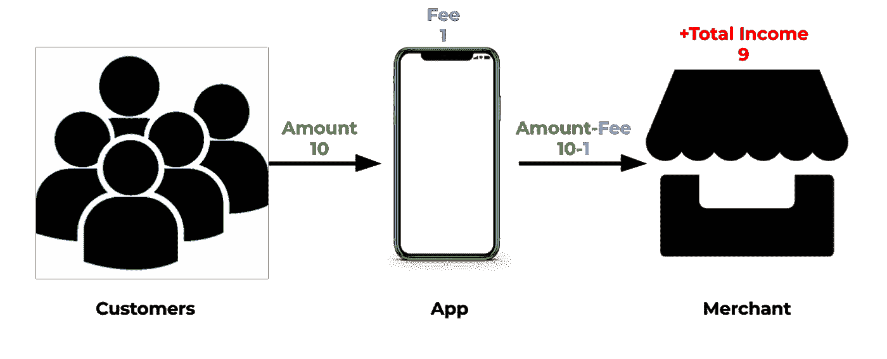

商业模式

# 条带连接

有不同的解决方案，经过一些研究，我发现**条纹连接**最适合我的具体情况。

[](https://stripe.com/connect) [## Stripe Connect:面向市场和平台的支付平台

### 使用 Stripe Connect 为市场和平台设置支付。Connect 可在任何平台内快速集成…

stripe.com](https://stripe.com/connect) 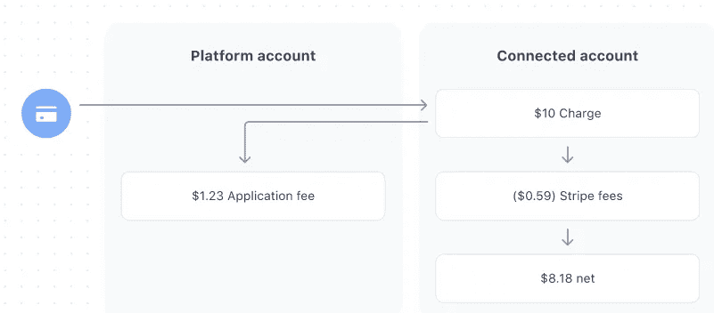

**从**到[条纹](https://stripe.com/docs/connect/enable-payment-acceptance-guide)

## **谁是谁？**

应用条带的术语，我们有:

1.  **平台账号** = *App*
2.  **关联账户** = *商户*

所以我开始工作，开始阅读 API 文档…

*   ** *拜托！求你了。支持颤振！***

> **无颤振**。


支持的库

因此，我有两个选择:

1.  自己包装 REST API。
2.  找一个已经做过这项工作的人。❤

猜猜我的选择是什么。

# 酒吧开发

经过一些包装测试，我发现以下一个最有希望:

[](https://pub.dev/packages/stripe_sdk) [## stripe_sdk | Flutter 包

### 条纹的原生 dart 包。有各种各样的其他 flutter 插件包装现有的条带库，但是这个…

公共开发](https://pub.dev/packages/stripe_sdk) 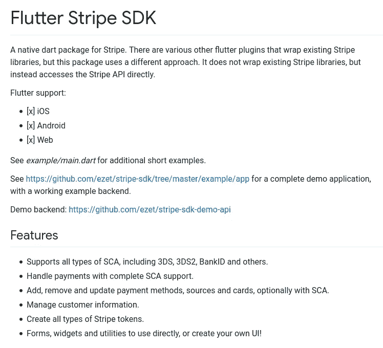

[颤振条纹 SDK](https://pub.dev/packages/stripe_sdk)

# **开始之前:条纹中的一些关键词**

1.  *付款方式*
2.  *可发布/保密 API 密钥*
3.  *账户 ID*
4.  *付款意向*
5.  *客户端秘密*

## 付款方式

> PaymentMethod 对象代表客户的支付工具。

*例如客户的卡。*

## 可发布/保密 API 密钥

> P **可公开的** API 密匙仅仅是为了用 Stripe 来识别**你的**账户，它们不是秘密的。换句话说，它们可以安全地发布在 Stripe.js JavaScript 代码或 Android 或 iPhone 应用程序中。(来自[条纹](https://stripe.com/docs/keys))
> 
> API 密匙应该保密，只存储在你自己的服务器上。您帐户的秘密 API 密钥可以不受限制地执行任何 API 请求。(来自[条纹](https://stripe.com/docs/keys))

Stripe 提供了两对不同的可发布/保密 API 密钥:

1.  **测试**:使用这一对来测试你的代码。每笔付款都是假的。Stripe 提供了一套测试卡[这里](https://stripe.com/docs/testing)。
2.  **现场**:制作时使用这对。

*您可以在条纹仪表盘中找到这些钥匙。*

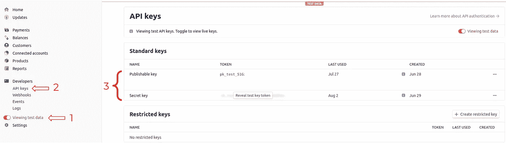

可公布/秘密密钥

## 帐户 ID

> 账户 ID 代表**商户磁条关联账户**。由于这个 ID，Stripe 知道谁发送支付的金额。

## 如何添加关联账户？

*仪表盘>关联账户>创建(标准账户应该足够)*

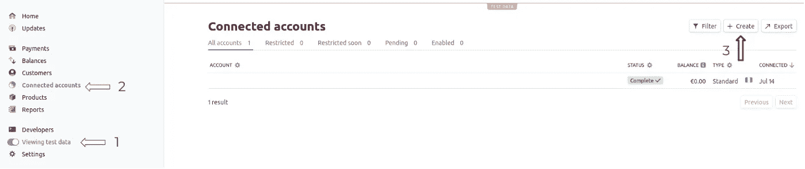

您可以在 Stripe 仪表盘的 ***关联账户*** *下找到账户 ID。*

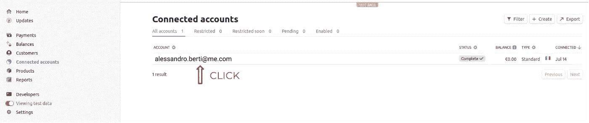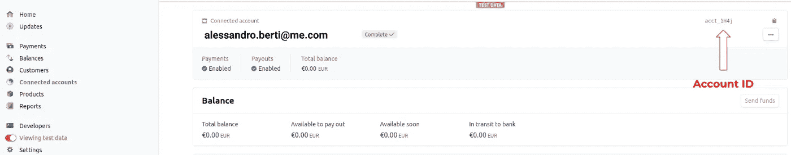

## 付款意向

> 付款意向指导您完成向客户收款的过程。(来自[条纹](https://stripe.com/docs/api/payment_intents))

特别地，一个 ***支付意图*** ***对象*** 定义了顾客购买商家出售的商品必须花费的金额($)。

由于 App 对提供给商家的服务收取一些费用，所以在支付意向中，需要定义 ***申请 _ 费用 _ 金额*** (即我每笔交易赚多少钱)。

除了 ***金额*** 和 ***申请 _ 费用 _ 金额*** 之外，还需要定义使用哪种支付方式(即客户的卡数据如*卡号*、*到期日*和、 *CVC* )以及商户账号 ID。

在付款意向中有几个其他的参数需要配置，但目前来说，还可以。把握住思路就好。我们将在编码部分对此进行更深入的探讨。

## 客户机密

> PaymentIntent 的客户端密码是一个唯一的密钥，允许您在客户端确认支付和更新卡的详细信息，而不允许操纵敏感信息，如支付金额。(来自[条纹](https://stripe.com/docs/connect/enable-payment-acceptance-guide)

一旦创建了支付意图对象，就返回客户秘密。

> 解决这个问题:
> 
> 可发布密钥标识谁接收“**申请 _ 费用 _ 金额”**(即应用)
> 
> 账户 ID 标识谁接收“金额”(即商家)

# 相关数据存储在哪里？

让我们看看哪些数据必须存储在应用程序中，哪些数据必须存储在服务器中。

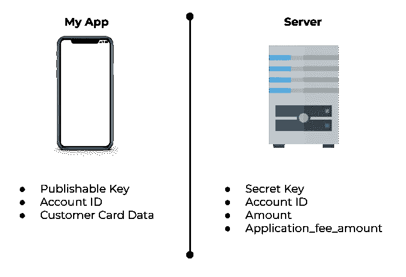

由于 ***密钥*** 能够验证支付请求，您必须将其存储在远离应用程序的安全位置(例如，在服务器中)。

如前所述， ***账户 ID*** 标识了向其发送顾客消费金额的商家。由于应用程序需要知道帐户 ID，你必须找到一种方法来传达给应用程序这个信息。一个合理的选择是将帐户 ID 存储在服务器中，然后应用程序将根据请求从服务器中检索这些数据(例如，在支付时)。

***金额*** 和***application _ fee _ Amount***应该在服务器创建的支付意向中“硬编码”。

## ***为什么？***

> 假设在 app 端存储 ***金额*** 和 ***申请 _ 费用 _ 金额*** *。有人可以手动改变他们，并设置每一个为零，所以…没有收入，无论是你还是商人！*

免费地

# 商业逻辑

下面的序列图应该有助于您理解代码执行流程。


## **但是等等，什么是 3D 安全(SCA)？**

> 为了提供额外的欺诈保护，3D Secure 要求客户在支付时与发卡机构完成额外的验证步骤。通常，您会将客户引导至其银行网站上的认证页面，然后他们输入与卡相关的密码或发送至其手机的代码。通过信用卡网络的品牌名称，如 Visa Secure 和 Mastercard Identity Check，客户对这一过程很熟悉。([条纹](https://stripe.com/docs/payments/3d-secure#three-ds-cards))

## **有必要吗？**

**绝对是的**。如果一些客户卡启用了 3D secure，而您没有提供正确的代码来处理它，则交易将被拒绝。

# 最后:让我们编码

## 服务器端

您需要在服务器上安装条带包。

因为我决定用 python 编码:

```
pip3 install stripe
```

我用过 AWS Lambda 服务，但是你可以用你喜欢的方式实现下面的 *POST* 方法。

## 金额/申请费用金额

你已经知道这些参数是什么了。只想澄清一件事:

```
amount = 1000
```

它代表 10.00€。(如果您设置*货币=‘欧元’*)

同样适用于*申请 _ 费用 _ 金额，140 代表 1.40€*

## 收据 _ 电子邮件

> 在“receipt_email”中指定客户电子邮件，一旦交易处理完毕，Stripe 将向客户发送一封关于交易状态的电子邮件。

这个参数不是必需的，但是，我发现这个参数对反馈客户非常有用。万一有任何问题，顾客可以给你看收据，你们可以一起找到解决办法。

## 确认

> 设置为`true`以尝试立即确认该支付内容。([条纹](https://stripe.com/docs/api/payment_intents/confirm))

> 服务器端部分结束。很简单，不是吗？

他妈的是啊

# 应用程序端

您可以在此处找到 Flutter SDK 条带包:

[](https://pub.dev/packages/stripe_sdk) [## stripe_sdk | Flutter 包

### 条纹的原生 dart 包。有各种各样的其他 flutter 插件包装现有的条带库，但是这个…

公共开发](https://pub.dev/packages/stripe_sdk) 

在您的 Flutter 项目的 pubspec.yaml 中添加以下依赖项。

```
dependencies:
  **stripe_sdk: ^3.0.1+1**
```

## [3D 安全设置](https://pub.dev/packages/stripe_sdk)

现在让我们设置`AndroidManifest.xml` (Android)和`Info.plist` (iOS)文件来处理 3D Secure (SCA)。

> 库“stripe_sdk”在 iOS 和 Android 上提供了对 SCA 的完整支持。它处理所有类型的 SCA，包括 3DS、3DS2、BankID 等。它通过在 web 浏览器中启动身份验证流来处理 SCA，并将结果返回给应用程序。如以下步骤所示，`returnUrlForSca`参数必须与您的`AndroidManifest.xml`和`Info.plist`的配置相匹配。

## 机器人

您需要在`android/app/src/main/AndroidManifest.xml`中声明以下意图过滤器。这个例子是针对 URL `stripesdk://3ds.stripesdk.io`:

演职员表:[颤动条纹 SDK](https://pub.dev/packages/stripe_sdk)

## ios

对于 iOS，您需要在`ios/Runner/Info.plist`中声明方案(或者通过 Xcode 的目标信息编辑器，在 URL 类型下)。这个例子针对的是 URL `stripesdk://3ds.stripesdk.io`:

演职员表:[颤动条纹 SDK](https://pub.dev/packages/stripe_sdk)

## 颤动前端

让我们对信用卡小部件和购买按钮进行编码，以提交交易。

小工具

## 遵循预期结果:

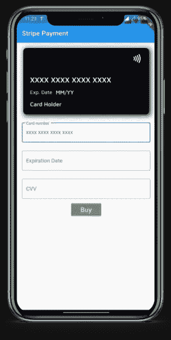

完成上一步后，让我们编写`buy()`函数。

*不要忘记添加对 CVC、Date 和 CardNumber 有效性的检查。*

购买功能

`createPaymentIntent()` 创建一个*支付方法*，并通过`postPaymentIntent()`将支付方法提交给服务器(连同顾客的电子邮件)。它返回 *clientSecret。*

然后`retrievePaymentIntent()`被调用，它返回 *paymentIntentRes。*

CretePaymentIntent 和 postCreatePaymentIntent 函数

以下函数处理启用 3D 安全的卡。如果卡未启用 3D secure，则不会调用此功能，支付过程会顺利进行。

3D 安全处理器功能

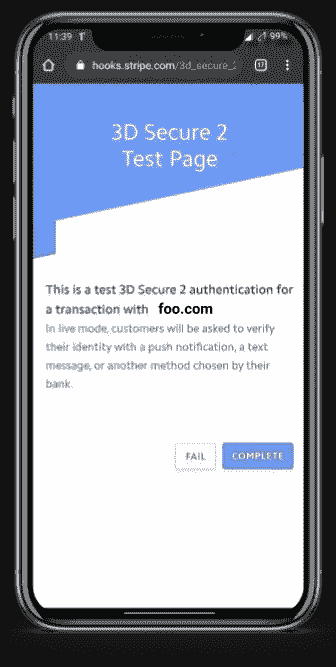

3D 安全 Webhook

遵循完整的代码。

## 测试

现在你可以自己测试卡片了。使用条纹提供的[该卡组](https://stripe.com/docs/testing)。

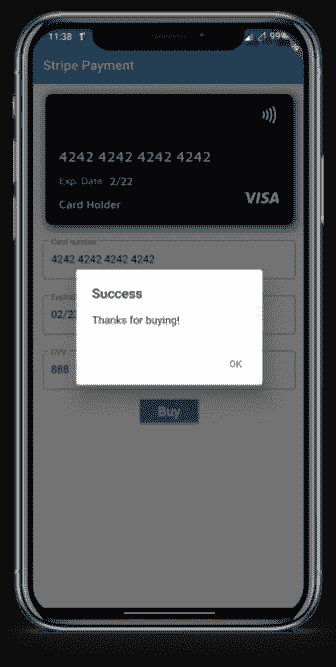

成功！

# 那都是乡亲们！

给出的代码是一个基本的例子，但它是可行的！

我的 [**GitHub**](https://github.com/Brotherhood94/FlutterWithStripeExample) 上有项目资源库！

[](https://github.com/Brotherhood94/FlutterWithStripeExample/tree/master/medium_stripe) [## brotherhood 94/flutter with tripe 示例

### 本报告展示了一个集成示例 Flutter+Stripe connect+3d secure(SCA)-brotherhood 94/Flutter with Stripe 示例

github.com](https://github.com/Brotherhood94/FlutterWithStripeExample/tree/master/medium_stripe) 

欢迎任何建议！

# **再见！**