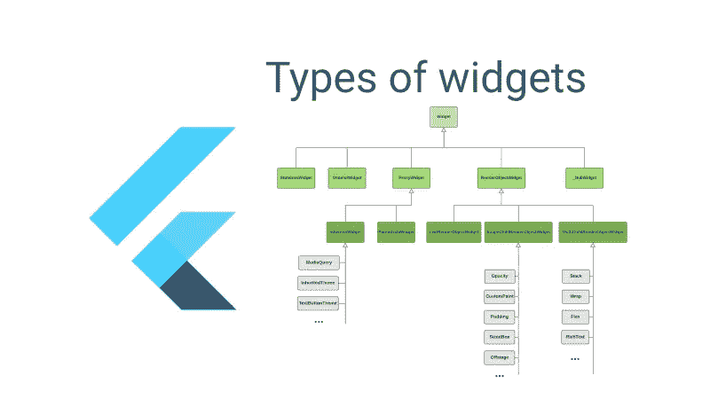
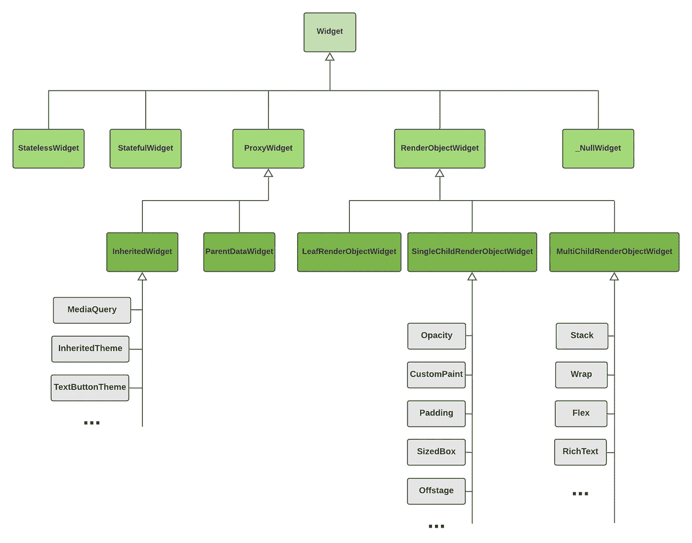

# 颤动:部件的类型

> 原文：<https://itnext.io/flutter-types-of-widgets-8d457281ad03?source=collection_archive---------2----------------------->

你曾经在一次激动人心的面试中被问到过关于小部件的类型吗？

我打赌最常见的答案是只有 2/3:`StatelessWidget`、`StatefulWidget`、`InheritedWidget`。

但这只是冰山一角。如果我们开始深入到 flutter 源代码中去理解，例如，小部件`Stack`是哪种类型，我们会在层次结构中发现更多的类。

这是来自颤振源的一些描述的层次结构。

> **小部件**描述了一个`Element`的配置。小部件是用户界面一部分的不可变描述。
> 
> **StatelessWidget** 是一个不需要可变状态的小部件。
> 
> **StatefulWidget** 是一个具有可变状态的小部件。状态是在构建小部件时可以同步读取的信息，在小部件的生命周期中可能会改变。
> 当状态改变时，确保状态被及时通知是小程序实现者的责任，使用`setState`。
> 
> **ProxyWidget** 是一个小部件，它有一个子部件，而不是构建一个新的。
> 
> **RenderObjectWidget** s 为`RenderObjectElement` s 提供配置，后者包装`RenderObject` s，后者提供应用程序的实际渲染。
> 
> InheritedWidget 是一个窗口小部件的基类，这些窗口小部件可以有效地沿着树向下传播信息。
> 要从构建上下文中获得特定类型的继承小部件的最近实例，使用`BuildContext.dependOnInheritedWidgetOfExactType`。
> 当以这种方式引用继承的小部件时，当继承的小部件本身改变状态时，将导致消费者重建。
> 
> **ParentDataWidget** 是一个将`ParentData`信息挂钩到`RenderObjectWidget` s 的子对象的 Widget 类。
> 这可用于为有多个子对象的`RenderObjectWidget` s 提供每个子对象的配置。例如，`Stack`使用`Positioned`父数据小部件来定位每个孩子。
> 
> **leavrendeobjectwidget**是 RenderObjectWidgets 的超类，配置没有子级的 RenderObject 子类。
> 
> **singlechildrenobjectwidget**是一个超类，用于配置拥有单个子插槽的`RenderObject`子类。
> 
> **multichildrendenobjectwidget**是`RenderObjectWidget`的超类，它配置了`RenderObject`子类，这些子类有一个子列表。

# 来源

 [## 颤振/框架。主颤振/颤振处的飞镖

### 此文件包含双向 Unicode 文本，其解释或编译可能与下面显示的不同…

github.com](https://github.com/flutter/flutter/blob/master/packages/flutter/lib/src/widgets/framework.dart)