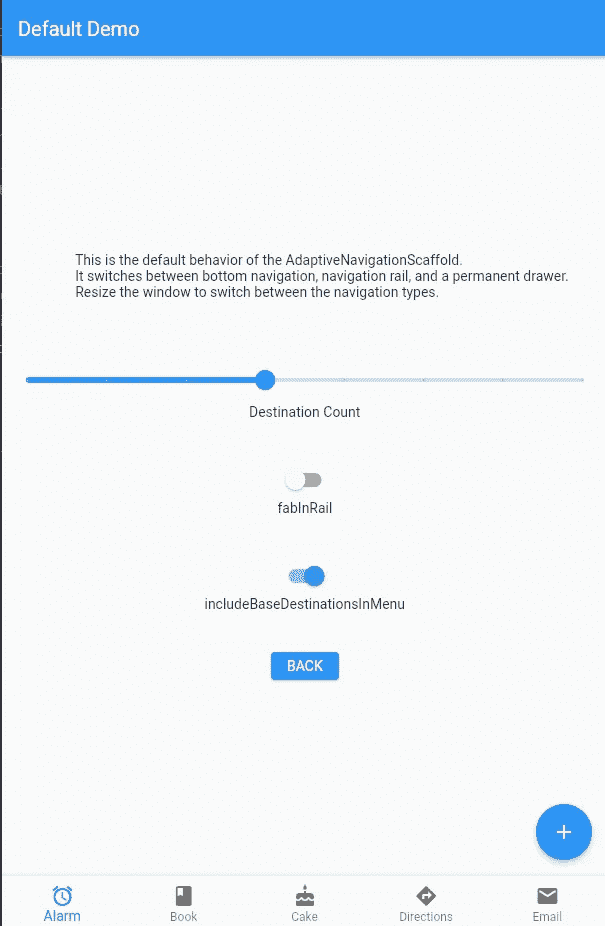
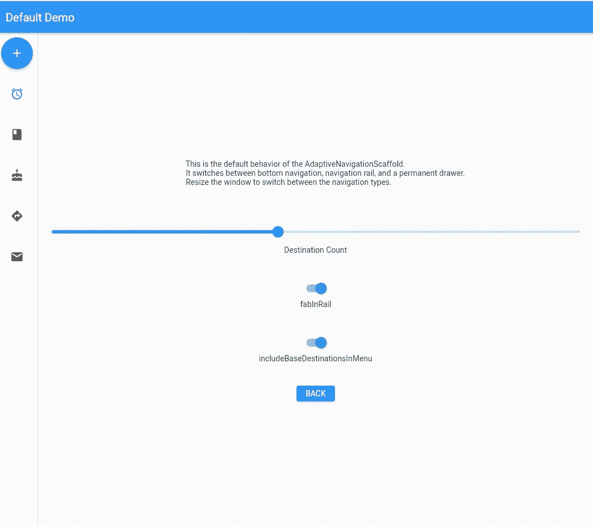
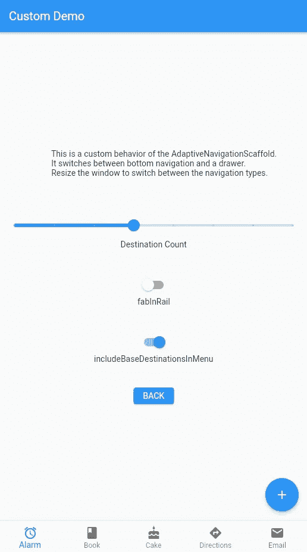
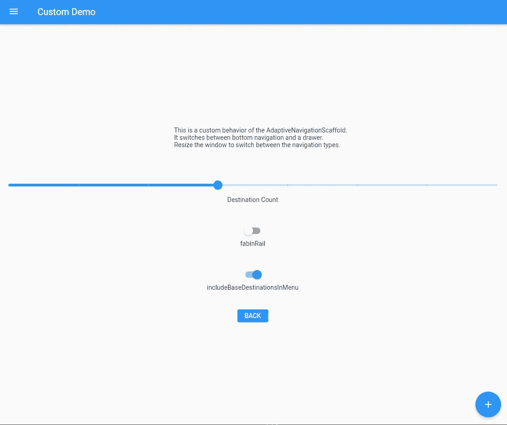
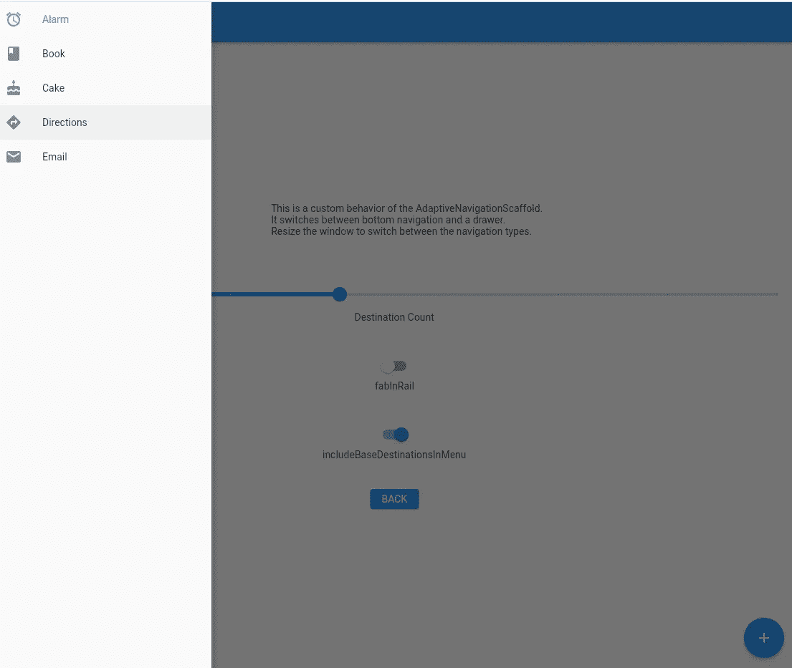
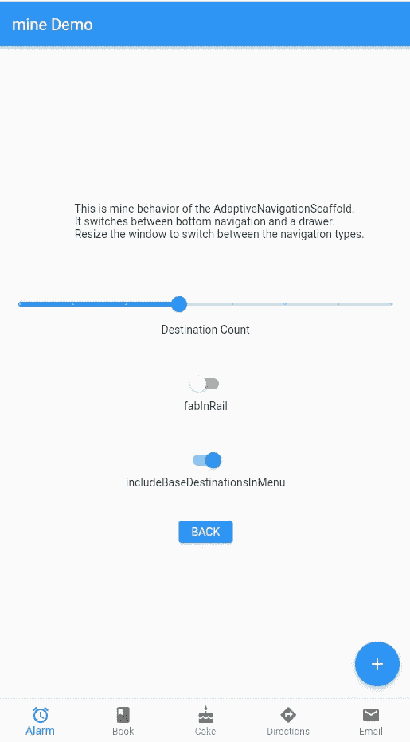
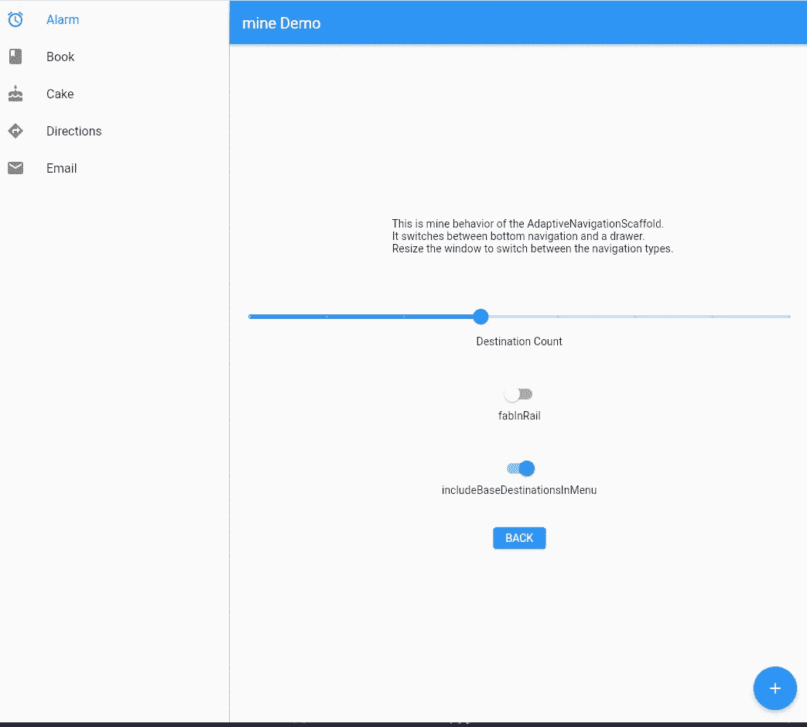

# 扑 UX 最佳实践，它不是铁路导航

> 原文：<https://itnext.io/flutter-ux-best-practices-its-not-rail-navigation-86894562a27b?source=collection_archive---------2----------------------->


是的，我确信谷歌的一些人认为轨道导航对于适应性导航来说是一个非常棒的主意。唯一的问题是，在 UX 的基础上，这是错误的，并且忽略了一个事实，即我们已经有了自适应导航的解决方案。

这篇文章不会让我在谷歌赢得很多朋友，但我宁愿应用程序用户手中有高质量的 UX，而不是谷歌的朋友。我将逐步介绍一些自适应导航代码示例，并向 UX 解释为什么我们应该使用非铁路导航解决方案。

示例代码可在本报告中找到:

[](https://github.com/fredgrott/flutter_nav_bestpractices) [## GitHub-Fred grott/flutter _ nav _ best practices:flutter nav 最佳实践

### Permalink 无法加载最新的提交信息。颤振导航最佳实践，包括使导航适应…

github.com](https://github.com/fredgrott/flutter_nav_bestpractices) 

*获取我的免费资料*

我的免费颤振代码和设计资产可以在:

[](https://github.com/fredgrott/code_with_me) [## GitHub-Fred grott/code _ with _ me:flutter 应用程序和代码演示

### 就像代码实验室一样，但是从专业 Fluter 应用程序设计者和开发者的角度来看，有更多的修饰和更多的操作方法，因为…

github.com](https://github.com/fredgrott/code_with_me) 

前端应用程序的开发和设计越来越成熟，开始的课件不再像过去那样是进入新工作的自举。

如果你没有专家对环境的洞察力，你将无法抓住创业的机会，也无法在市场上第一次推出令人敬畏的应用程序。

获得中级会员权限有助于推动你完成第一份 flutter 开发工作，或者在应用商店中开发第一款出色的 Flutter 应用。它就像两个小步骤一样简单:

1.使用我的媒体订阅链接加入媒体:

[](https://fredgrott.medium.com/membership) [## 通过我的推荐链接加入 Medium-Fred Grott

### 作为一个媒体会员，你的会员费的一部分会给你阅读的作家，你可以完全接触到每一个故事…

fredgrott.medium.com](https://fredgrott.medium.com/membership) 

2.单击我的个人资料链接并关注我，当我发布新文章时，您会立即收到电子邮件通知:

[](https://fredgrott.medium.com/) [## 弗雷德·格罗特-中等

### 你不应该把所有的东西都放在一个巨大的类中，也不应该把所有的东西都放在屏幕上，包括…

fredgrott.medium.com](https://fredgrott.medium.com/) 

# **UX 背景**

**我们不应该假设，否则，我们应该在没有最终用户调查来验证我们的假设的情况下继续我们的假设。但是你现在和我一样，没有资金来源。我们在哪里可以找到一些免费的 UX 研究资源？**

你们有些人的书架上可能有一本唐·诺曼设计的书。唐·诺曼(Don Norman)和雅各布·尼尔森(Jakob Nielsen)成立的研究小组被称为尼尔森·诺曼集团:

[](https://www.nngroup.com/) [## 尼尔森诺曼集团:UX 培训、咨询和研究

### NN/g 校长开创了许多 UX 研究方法，这些方法现在已经成为标准的最佳实践。今天我们…

www.nngroup.com](https://www.nngroup.com/) 

这项研究不是免费的，但是可以在该网站上免费的 UX 研究文章中看到这些数据和结论。

在 Flutter 中，UX 的另一个细微之处是 UX 在 Android 原生应用程序世界中不是国王时的一些遗产。这一次是以 Android 原生应用程序栏与 iOS 应用程序栏有何不同的形式，以及为什么苹果为手机 iOS 应用程序使用底部导航条，为 iPad 使用抽屉。

我们使用手机的标准方式是竖排模式，手指放在屏幕底部，因此选项卡式导航在底部，而不是在应用程序栏顶部作为工具项目，甚至是下拉菜单！

平板电脑有一个非常不同的人类 UX，因为我们在平板电脑的侧面单手或双手操作它们，而不是在设备的底部，这与手机相反。

**苹果在 2008 年领先于谷歌，因为他们已经对如何使用苹果曾经作为移动设备出售的老式牛顿设备进行了一些用户研究。谷歌处于这样的位置，他们有这种传统的方式，Android 原生 appbar 的结构，他们必须保留。但话说回来，作为 UX 质量的实践者，我们不应该强迫应用程序用户使用一个糟糕的 UX 应用程序，这种程序的形式是脑残的移动应用程序栏，带有下拉抽屉菜单。**

让我给你看一些图片:

**这些第一组视觉效果直接来自 Material.io 团队的 flutter 包，让你了解保留传统 android 应用程序栏抽屉菜单有多根深蒂固:**



**那是手机部分，终于没有该死的菜单下拉抽屉，右边的手机 appbar 也没有 effing 二级下拉抽屉。(是的，它仍然在材料 3 规格中。我就是这个意思！)**



他讨厌并害怕平板电脑上的铁路导航，恶心！我们在这里有额外的空间来标记和调整屏幕内容的大小，这在某种意义上来说是一种完整的设备形式，但是我们给用户一个比底部导航大不了多少的小菜单。

Material.io 团队的 adaptive components 包中的自定义脚手架也好不到哪里去:



**那是手机，现在是平板形态:**



是的，appbar 上一个关闭的抽屉看起来对一个平板电脑用户来说是如此的吸引 UX。不是！这是平板电脑版本上打开的抽屉:



现在让我给你看看我的 UX 版本！

电话:



**然后我们有了一个友好的平板电脑版本，有着相同的矿井脚手架代码:**



**一个美好的 UX，一个平板电脑友好的 UX，就像平板电脑应用程序用户期望的那样！**

现在让我们来看看代码。

# **代码**

## **现在，自适应导航的最初想法是在颤振样本中首次提出的，这个特定的样本在第三方文件夹中，您可以找到自适应支架的第一个粗略版本:**

[](https://github.com/flutter/samples/blob/master/experimental/web_dashboard/lib/src/widgets/third_party/adaptive_scaffold.dart) [## samples/adaptive _ scaffold . dart at 主颤振/samples

### 一组颤动的例子和演示。在 GitHub 上创建一个帐户，为 flutter/samples 开发做出贡献。

github.com](https://github.com/flutter/samples/blob/master/experimental/web_dashboard/lib/src/widgets/third_party/adaptive_scaffold.dart) 

然后 Material.io 团队在此基础上扩展了一些有用的组件，如断点、自适应列部件等。在软件包的自适应组件集:

[](https://github.com/material-components/material-components-flutter-adaptive) [## GitHub -材料-组件/材料-组件-颤振-自适应:颤振自适应包

### 颤振的自适应包通过…对材料-部件/材料-部件-颤振-适应性发展作出贡献

github.com](https://github.com/material-components/material-components-flutter-adaptive) 

**要使用我的示例代码，请将它放入 pubspec:**

```
**dependencies:** **flutter:** **sdk: flutter** **flutter_localizations:** **sdk: flutter** **adaptive_components: ^0.0.2** **adaptive_navigation: ^0.0.4**
```

**现在让我们通过例子来设置，首先从自适应导航包中设置默认的示例脚手架:**

**定制脚手架是这样的:**

**现在，两个支架之间的唯一区别是增加了这个模块:**

**看到 navigatorTypeResolver 添加的块了吗？我在其中做了一个小的改动来保证 UX 的正确性:**

**我们在平板电脑和台式机上获得了这种 UX 优势:**


那么，铁路导航有什么好处呢？我用它作为基础设施来映射手机底部导航标签中的菜单项，以及平板电脑和桌面版应用程序中永久打开的抽屉导航。

# **结论**

我正在通过 flutter 的每一个角落来擦亮你的 flutter 应用程序和我的 UX flutter 应用程序。示例代码可以在 flutter nav 最佳实践 GitHub 存储库中找到:

[](https://github.com/fredgrott/flutter_nav_bestpractices) [## GitHub-Fred grott/flutter _ nav _ best practices:flutter nav 最佳实践

### Permalink 无法加载最新的提交信息。颤振导航最佳实践，包括使导航适应…

github.com](https://github.com/fredgrott/flutter_nav_bestpractices) 

# 关于我，弗雷德·格罗特

我是一个改造过的原生 Android 应用开发者，也是一个改造过的 ADHD 创意。

这个世界上有两种人，消费者和创造者。消费者有世界上所有的麻烦，但他们的大脑中却没有任何创造性。创意者过着更有趣的充满活力的生活，充满创意的梦想，而不是头脑中的毒药。

我目前在 flutter 上的免费资料就像代码和创意资产一样，在我的 code-with me GitHub 资料库中，网址是:

[](https://github.com/fredgrott/code_with_me) [## GitHub-Fred grott/code _ with _ me:flutter 应用程序和代码演示

### 就像代码实验室一样，但是从专业 Fluter 应用程序设计者和开发者的角度来看，有更多的修饰和更多的操作方法，因为…

github.com](https://github.com/fredgrott/code_with_me) 

在前端开发和创造性生活中，上下文和路径都有来自你自己的路径的洞察力的宝石。要获得这种洞察力，你需要通过这两个简单的步骤访问我的文章:

1.在我的订阅链接注册付费媒体订阅:

[](https://fredgrott.medium.com/membership) [## 通过我的推荐链接加入 Medium-Fred Grott

### 作为一个媒体会员，你的会员费的一部分会给你阅读的作家，你可以完全接触到每一个故事…

fredgrott.medium.com](https://fredgrott.medium.com/membership) 

请注意，事实上我确实从每份媒体订阅中获得了收入削减，这有助于我产生你可以免费获得的免费代码和创造性的东西。

2.单击我在 Medium 中的名字并关注我，这样您就可以在我每次发布时立即收到电子邮件通知:

[](https://fredgrott.medium.com/) [## 弗雷德·格罗特-中等

### 你不应该把所有的东西都放在一个巨大的类中，也不应该把所有的东西都放在屏幕上，包括…

fredgrott.medium.com](https://fredgrott.medium.com/) 

我在 Flutter And Creative Life 上最受欢迎的帖子:

颤动用户界面

[](https://medium.com/geekculture/flutters-missing-bootstrap-responsive-ui-dd9fb1fd5c76) [## Flutter 缺少引导响应 UI

### 随着 Web 现在处于稳定状态，桌面将在未来几个月内进入稳定版本，很明显我们已经…

medium.com](https://medium.com/geekculture/flutters-missing-bootstrap-responsive-ui-dd9fb1fd5c76) [](https://fredgrott.medium.com/awesome-flutter-themes-color-palettes-and-color-schemes-998805b8bc53) [## 可怕的颤动主题，调色板和配色方案

### 颤振医生说你需要 13 种颜色，那么颤振医生是错误的。你实际上需要 32 种颜色。但是，这就是为什么我…

fredgrott.medium.com](https://fredgrott.medium.com/awesome-flutter-themes-color-palettes-and-color-schemes-998805b8bc53) [](https://fredgrott.medium.com/flutter-ui-secret-one-acc87c211355) [## Flutter UI 秘密一

### 有许多针对 Flutter 的响应插件，但那只是一个容器，而不是如何有效地…

fredgrott.medium.com](https://fredgrott.medium.com/flutter-ui-secret-one-acc87c211355) [](https://fredgrott.medium.com/declarative-overlays-1c4f744d1c6e) [## 声明性覆盖

### 如果你尝试使用非声明性的默认 flutter 覆盖，你最终会得到一些你不能主题化，不能持久化的东西…

fredgrott.medium.com](https://fredgrott.medium.com/declarative-overlays-1c4f744d1c6e) [](https://fredgrott.medium.com/awesome-onboarding-6b61a1d077ef) [## 出色的入职培训

### 入职培训是你有机会给用户留下深刻印象并做一些品牌推广的活动表面之一。让我展示一下…

fredgrott.medium.com](https://fredgrott.medium.com/awesome-onboarding-6b61a1d077ef) [](https://fredgrott.medium.com/google-fonts-the-right-way-72a715f046a3) [## 谷歌字体，正确的方式

### 有一些秘密的技巧可以让你的 Flutter 应用程序最大化地使用 Google 字体，让我来告诉你怎么做。

fredgrott.medium.com](https://fredgrott.medium.com/google-fonts-the-right-way-72a715f046a3) 

颤动 DevOPS

[](https://medium.com/geekculture/missing-flutter-best-practices-72a1fa684d09) [## 遗漏颤振最佳实践

### Skeleton 应用模板是在 Flutter 2.5 中引入的，据称是为了展示 Flutter 的最佳实践。咳咳，在哪里…

medium.com](https://medium.com/geekculture/missing-flutter-best-practices-72a1fa684d09) [](https://fredgrott.medium.com/easy-mocking-with-mocktail-f3fd10a1eecd) [## 用 Mocktail 轻松模仿

### 与其只是为了模拟测试而乱搞代码生成，为什么不让我向您展示如何使用 mocktail 来模拟…

fredgrott.medium.com](https://fredgrott.medium.com/easy-mocking-with-mocktail-f3fd10a1eecd) [](https://fredgrott.medium.com/bdd-like-widget-testing-bb95b12edac7) [## 类似 BDD 的小部件测试

### 这是一种真正简单的方法，可以像 BDD 一样进行小部件测试，而不必学习黄瓜-小黄瓜语言。而且它…

fredgrott.medium.com](https://fredgrott.medium.com/bdd-like-widget-testing-bb95b12edac7) [](https://fredgrott.medium.com/expert-way-to-use-goldens-45b46aa8e2c3) [## 使用 Goldens 的专业方法

### 我的金色显示真正的主题和我的自定义字体。让我告诉你如何正确使用 Goldens。

fredgrott.medium.com](https://fredgrott.medium.com/expert-way-to-use-goldens-45b46aa8e2c3) [](https://fredgrott.medium.com/an-opinionated-way-to-install-the-flutter-sdk-cca997967192) [## 一种固执己见的安装 Flutter SDK 的方式

### 想要更强大的功能来获得完整的测试覆盖、完整的代码反馈以及 flutter 前端的所有功能吗…

fredgrott.medium.com](https://fredgrott.medium.com/an-opinionated-way-to-install-the-flutter-sdk-cca997967192) [](https://fredgrott.medium.com/easy-uml-generation-e6e16e5c8b0a) [## 简单的 UML 生成

### 这里有一个为你的 Flutter 应用程序代码生成 UML 图的简单方法。

fredgrott.medium.com](https://fredgrott.medium.com/easy-uml-generation-e6e16e5c8b0a) [](https://medium.com/geekculture/super-secret-bug-trap-for-flutter-c89d36974b96) [## 超级秘密扑虫器

### Dart 的部分功能是将运行时检查转移到一个更好的地方，以提高编译性能，所以我们得到了这个很好的…

medium.com](https://medium.com/geekculture/super-secret-bug-trap-for-flutter-c89d36974b96) [](https://medium.com/geekculture/my-expert-project-setup-layered-onion-architecture-5dd06e29ee9f) [## 我的专家项目设置，分层洋葱架构

### 这是一种基于面向服务的洋葱分层面向对象应用程序来建立一个 Flutter 项目结构的自以为是的方法

medium.com](https://medium.com/geekculture/my-expert-project-setup-layered-onion-architecture-5dd06e29ee9f) [](https://medium.com/codex/flutter-perfect-setup-c5462b412f78) [## 颤振完美设置

### 适合中级和初级开发人员的完美的 flutter SDK 和项目设置！

medium.com](https://medium.com/codex/flutter-perfect-setup-c5462b412f78) [](https://medium.com/geekculture/flutter-expert-ide-set-up-25791ce690c) [## 颤振专家 IDE 设置

### 抱歉 Google，最好的 flutter 开发 IDE 是 MS 的 Vscode。作为一个节点集成开发环境是开发者的未来…

medium.com](https://medium.com/geekculture/flutter-expert-ide-set-up-25791ce690c) [](https://fredgrott.medium.com/expert-catcher-setup-for-flutter-apps-a9ee3a6a9e08) [## 颤振应用的专家捕捉器设置

### 在 Flutter 中，我们使用 Catcher 插件来集成 Sentry、Crashanalytics、Slack 等。要收集和发送应用程序…

fredgrott.medium.com](https://fredgrott.medium.com/expert-catcher-setup-for-flutter-apps-a9ee3a6a9e08) 

颤振 OOP 和 FP

[](https://fredgrott.medium.com/flutter-skeleton-app-what-app-arch-is-it-16c1e1aad106) [## 扑骷髅 App，是什么 App Arch？

### 你不能清理框架应用程序来建立 OOP、FP 和 UX 中的质量最佳实践，除非你理解…

fredgrott.medium.com](https://fredgrott.medium.com/flutter-skeleton-app-what-app-arch-is-it-16c1e1aad106) [](https://fredgrott.medium.com/mastering-code-metrics-feedback-e2b22becad2c) [## 掌握代码度量反馈

### 在视觉应用程序设计中，我们有网格断点和测量颜色对比来微调视觉设计的一个…

fredgrott.medium.com](https://fredgrott.medium.com/mastering-code-metrics-feedback-e2b22becad2c) [](https://medium.com/geekculture/mastering-flutter-zones-ea28fe6a6ca6) [## 掌握颤振区域

### 为什么我们需要颤振区域？因为发现一个被吞掉的 app 异常真的很头疼。

medium.com](https://medium.com/geekculture/mastering-flutter-zones-ea28fe6a6ca6) [](https://fredgrott.medium.com/clean-arch-for-flutter-designers-b8076416d2ca) [## 颤振设计师的清洁拱

### 对于 Flutter 应用程序设计者来说，理解 Flutter 应用程序中干净架构的简单方法。

fredgrott.medium.com](https://fredgrott.medium.com/clean-arch-for-flutter-designers-b8076416d2ca) [](https://fredgrott.medium.com/what-the-hell-is-state-management-ee49559e6f48) [## 国家管理到底是什么

### 在 Flutter 应用程序开发中，状态管理有一些令人困惑的地方。让我来澄清一下 flutter 中的状态管理…

fredgrott.medium.com](https://fredgrott.medium.com/what-the-hell-is-state-management-ee49559e6f48) [](https://fredgrott.medium.com/anitpatterns-of-state-610dae657ac6) [## 反国家模式

### 想在面试中胜出吗？让我们为一个有趣的故事做好准备。你控制你的颤振应用程序的故事…

fredgrott.medium.com](https://fredgrott.medium.com/anitpatterns-of-state-610dae657ac6) [](https://fredgrott.medium.com/training-wheels-for-reactive-flutter-d1ae35c47787) [## 反作用颤振训练轮

### 猜猜在学习 flutter 的时候，一开始创建复杂的 Flutter 应用程序的主要障碍是什么…

fredgrott.medium.com](https://fredgrott.medium.com/training-wheels-for-reactive-flutter-d1ae35c47787) [](https://medium.com/geekculture/deep-dive-into-state-34b443da3573) [## 深入状态

### 猜猜在 Flutter 中理解状态的秘诀是什么？州政府的解决方案来自不同的小组…

medium.com](https://medium.com/geekculture/deep-dive-into-state-34b443da3573) [](https://fredgrott.medium.com/choosing-a-flutter-state-management-solution-cccf1b2acf10) [## 选择颤振状态管理解决方案

### 有一个简单的方法来选择一个颤振状态管理解决方案，让我告诉你如何。

fredgrott.medium.com](https://fredgrott.medium.com/choosing-a-flutter-state-management-solution-cccf1b2acf10) 

创造性生活

[](https://fredgrott.medium.com/how-i-learned-to-trust-my-adhd-dbf4f80518cc) [## 我如何学会信任我的多动症

### 知道自己患有多动症后，你是否很难适应？糟透了，不是吗？现在很难看到，但它确实变得…

fredgrott.medium.com](https://fredgrott.medium.com/how-i-learned-to-trust-my-adhd-dbf4f80518cc) [](https://fredgrott.medium.com/diet-coke-gave-hits-developer-adhd-cd4d7f3f73cd) [## 健怡可乐让这个开发者多动症了

### 从可乐换成健怡可乐，发现我有多动症。如果可口可乐有一个警告标签不是很好吗？

fredgrott.medium.com](https://fredgrott.medium.com/diet-coke-gave-hits-developer-adhd-cd4d7f3f73cd) [](https://fredgrott.medium.com/writing-to-win-as-a-developer-on-medium-7cbf1b79d7f) [## 作为一名中等水平的开发人员，写作是致胜之道

### 有些科目需要更严格的努力才能在 Medium 平台上获得成功。正在编写…

fredgrott.medium.com](https://fredgrott.medium.com/writing-to-win-as-a-developer-on-medium-7cbf1b79d7f) 

您可以关注我

[https://fredgrott.medium.com](https://fredgrott.medium.com)

【https://keybase.io/fredgrott 号

【https://twitter.com/fredgrott 

[https://github.com/fredgrott](https://github.com/fredgrott)

[https://www.xing.com/profile/Fred_Grott/cv](https://www.xing.com/profile/Fred_Grott/cv)

[https://www . LinkedIn . com/in/fredgrottstartupfluttermobileappdesigner/](https://www.linkedin.com/in/fredgrottstartupfluttermobileappdesigner/)

https://www.reddit.com/user/fredgrott