# Flutter v 1.20 —快速总结！！

> 原文：<https://itnext.io/flutter-v-1-20-quick-summary-ca14e6da9418?source=collection_archive---------0----------------------->

因此，在我看来，这个版本的 Flutter 是我在之前的 5-6 个月里见过的最大更新。你可以通过 [flutter.dev](https://flutter.dev) 和其他网站上的各种文档浏览很多更新，但在这里我将浏览一些主要的更新。

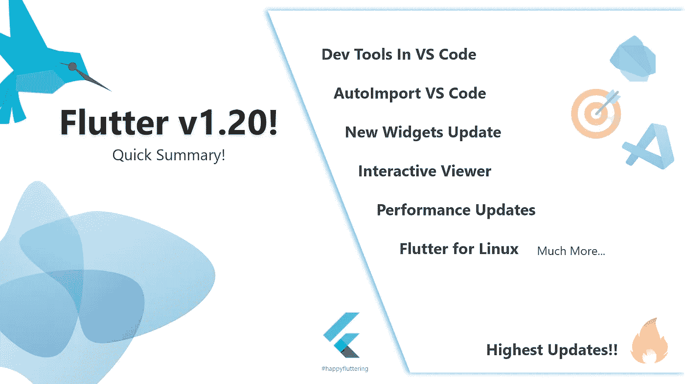

我将讨论以下几点，所以如果你愿意，你可以跳到对你来说似乎是必要的一点，:D

1.  **自动导入— VS 代码变更**
2.  **开发工具— VS 代码更新**
3.  **互动查看器—小工具**
4.  **自动填充支持**
5.  **鼠标光标支持**
6.  **新小工具更新**
7.  **鸽子—包更新**
8.  **Play Store 上的 Flutter 应用**
9.  **针对 Linux 的颤振**
10.  **新牌照页面**
11.  **合并的减贫战略——最高贡献**
12.  **性能改进**

# 我们走吧…！

# 自动导入— VS 代码更改

这是我和 Flutter 一起工作时遇到的最烦人的事情。让我解释一下是什么问题以及他们是如何解决的。

因此，如果您在 VS 代码中将文件从一个文件夹拖到另一个文件夹，那么导入在您的 dart 文件中不会改变，您必须手动改变它。如果在多个文件中有相同的导入，事情会变得更加混乱。

但是现在，如果你把文件从一个文件夹拖到另一个文件夹，导入也会随之改变。

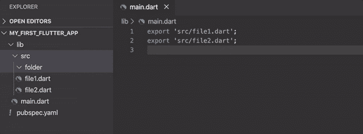

自动导入更改— VS 代码

> 我想这对于多个文件来说还不行。但是请让我知道它是否有效，我会在这里更新它:)

# 开发工具— VS 代码更新

我的天啊。！这是什么？现在，你可以在你的 flutter 代码旁边打开 VS 代码中的 Dart 开发工具，而不需要在单独的 chrome 窗口或其他地方打开它。

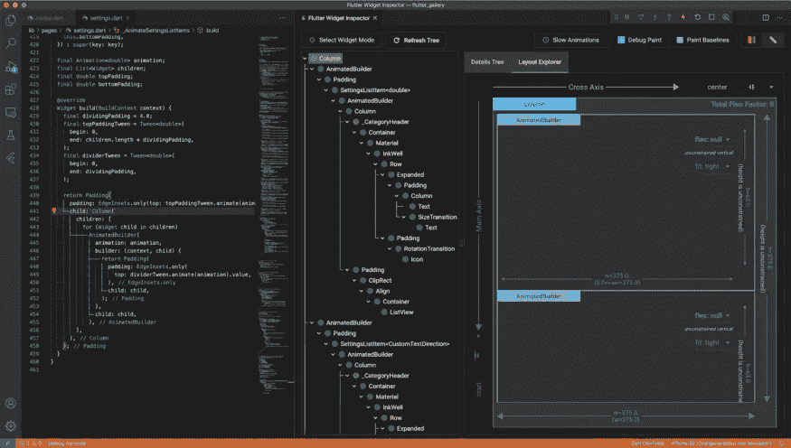

VS 代码中的 DevTools

您可以通过以下步骤在 VS 代码中启用这个开发工具:

*   转到**设置**

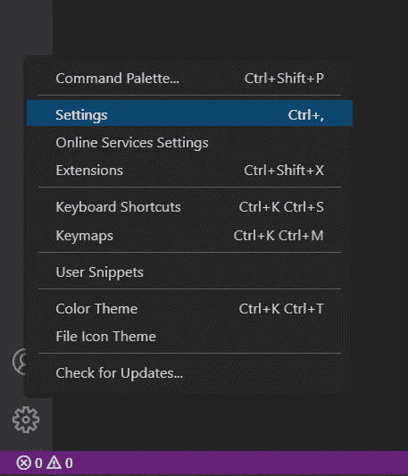

*   搜索**“嵌入”**

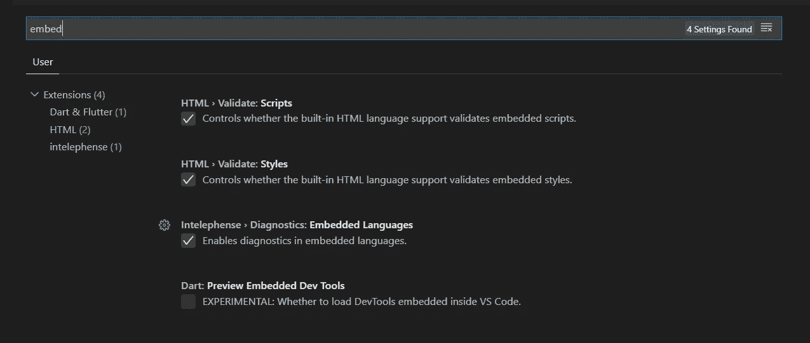

*   检查**“Dart:预览嵌入式开发工具”**

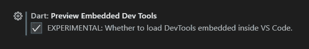

检查是否启用开发工具

# **交互式查看器—小工具**

我们在 Flutter widget 家族中有了一个新的 widget“交互式查看器”。该名称不言自明，即您可以与该小部件交互。请访问 [*API 文档*](https://api.flutter.dev/flutter/widgets/InteractiveViewer-class.html) 以更好地了解如何实现它们，并且一如既往，您也可以在同一页的演示部分使用它。

与此同时，你可以看看这个 [*棋盘扑，*](https://github.com/justinmc/flutter-go) 我不知道也许游戏😜或者随便你怎么称呼它，看看这个小部件实际上是做什么的。

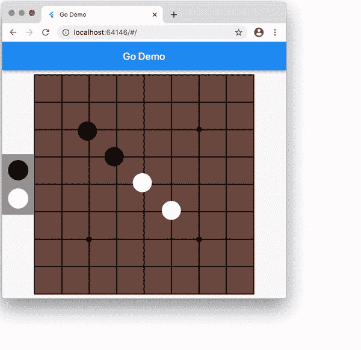

由[克里斯销售](https://medium.com/u/a5439877fc0c?source=post_page-----ca14e6da9418--------------------------------)的 g 板颤动

此外，增加了关于拖放的更新。细节有 [*这里有*](https://github.com/monkeyswarm/DragTargetDetailsExample) 。

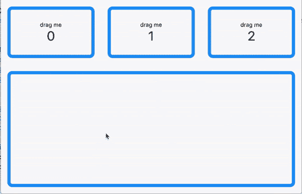

拖放可视化

# 自动填充支持

你们中的许多人可能一直在等待这个更新，它终于来了！虽然它还不像在完美的阶段，但它会得到更多的更新改进。现在，没有必要要求你的用户一次又一次地重新输入数据。


自动填充支持

> 为此干杯！*🍷*

# 鼠标光标支持

这是桌面上投票率最高的特性，现在终于出现了。现在，光标将根据放置或使用的位置更改为默认。

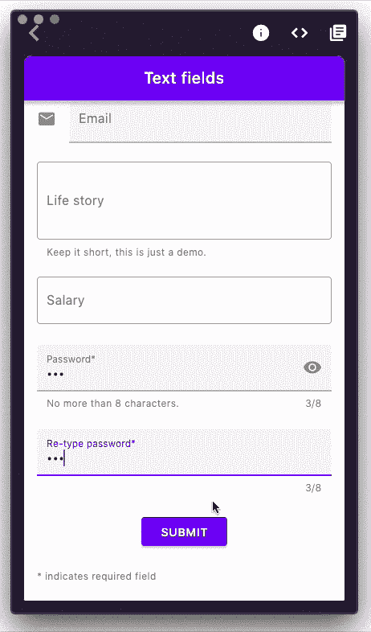

光标更新

# 新的小部件更新

每当有新的小工具推出或有关于小工具的更新时，请通知我:

小工具更新上的我！无红利

不管怎样，下面的小部件更新了新的视觉吸引力。

```
- Slider
- RangeSlider
- DatePicker
- TimePicker
```

如果没有可以互动的东西，它就不是 Flutter 团队，所以这就是为什么你可以在这个 [*有趣的网络演示中查看它们。*](https://flutter-time-picker.firebaseapp.com/#/)

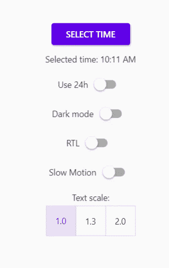

有趣的网络演示

## **滑块&量程侧**


滑块


范围滑块

## 日期和时间选择器

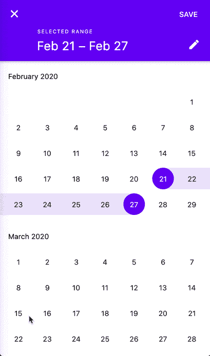

日期选择器

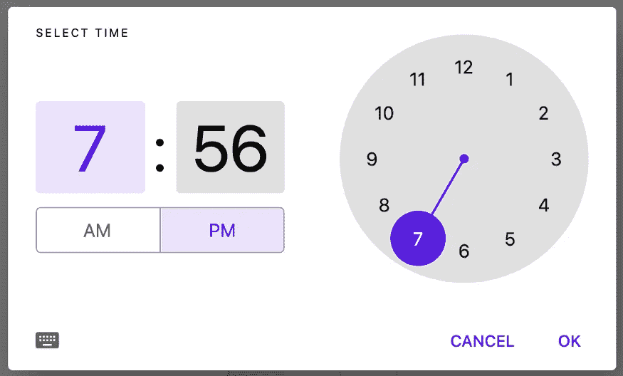

时间选择器

# 鸽子-包更新

[*鸽子*](https://pub.dev/packages/pigeon) 新增一个包*。*它是一个命令行工具，使用 Dart 语法在平台通道之上生成类型安全的消息传递代码，而无需添加额外的运行时依赖项。用 Pigeon，而不是手动匹配平台通道上的方法字符串和序列化参数。

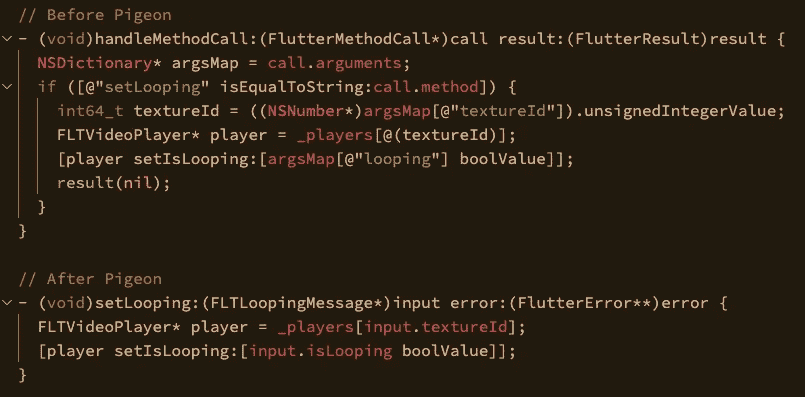

鸽子效应

目前，它支持 Objective-C、Java、Kotlin 和 Swift。

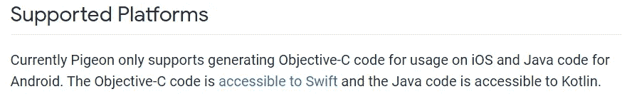

# Play Store 上的 Flutter 应用程序

嗯，从技术上讲，这不是版本更新，而是一个一般信息。随着 flutter v1.17 的发布，google play 商店上大约有 **~50，000 个应用**，现在随着 flutter v1.20 的发布，flutter 团队声称 google play 商店上大约有 **~90，000 个应用**。这显示了 flutter 开发者的数量是如何增加的，以及人们是如何采用它的。

# 为 Linux 而战

再说一次，这不是一个版本更新，但是你们中的大多数人可能都知道这个消息，Flutter 已经和 canonical 合作开发了用于 Linux 的 Flutter 应用程序。所以，跨平台的承诺正在实现。

未来会有更多关于桌面版 flutter 的更新，因为现在 Flutter 的开发者正在测试桌面版的应用，这个版本中也会有桌面版的更新。

# 新许可证页面

关于对话 的 ***中执照页的更新已随此版本发布。***

老实说，我还没有在网络应用中使用过这个页面。但是我阅读了关于这个页面的问题和视频。现在，随着这次更新，我想这个页面会有更好的反应，在视觉上也会更吸引人。

您可以访问 [*#57588*](https://github.com/flutter/flutter/pull/57588) 了解更多信息。

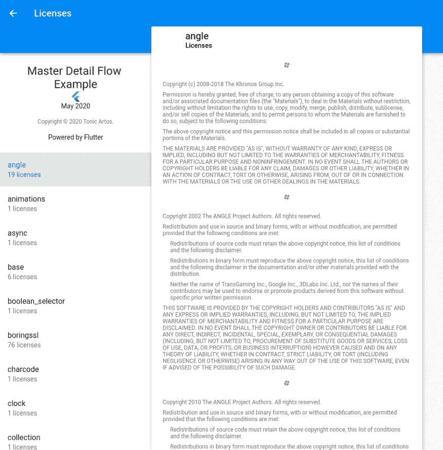

新许可证页面

# **PRs 合并—最高贡献**

关于此更新的一般信息。正如我之前提到的，到目前为止我还没有看到 flutter 有如此多的更新。因此， **3029** **PRs** 合并为 Flutter v1.20，与此同时 **5485** **问题**关闭，**贡献者**计数至 **359** 。

# 性能改进

虽然对我来说，flutter 在性能方面非常出色，但 Flutter 团队正在努力将这一点提高到最高水平，随着这个版本的更新，他们在 Flutter 中增加了更多的性能。

老实说，有很多东西我不明白，因为对我来说太专业了。但幸运的是，我真正理解的是在减少动画中的抖动方面的改进。关于这个有整整一个[*doc*](https://flutter.dev/docs/perf/rendering/shader)*。*

*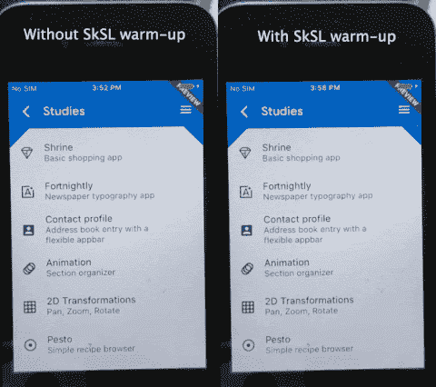*

*邱建还原*

*gif 可能不会给你带来很大的不同，但是你可以在使用它的时候亲身体验。*

*除此之外，他们还更新了 [*字体树抖动*](https://github.com/flutter/flutter/pull/55417) 等等，我之前提到过，对我来说这些东西太技术化了，但它以某种方式管理图标和图像，并将应用程序大小减少了 100kbs 左右。*

> *希望我足够专业，什么都懂😢*

# *总结一下！*

*这是我这边所有的人。但是你可以读一篇由[克里斯·塞尔斯](https://medium.com/u/a5439877fc0c?source=post_page-----ca14e6da9418--------------------------------)写得非常好的[文章](https://medium.com/flutter/announcing-flutter-1-20-2aaf68c89c75)，你会得到足够的关于 Flutter v 1.20 的信息。*

> *我非常兴奋能够使用这个新的更新，但是让这些大学考试见鬼去吧！；p*

# *谢谢你们和# HappyFluttering💙*