# 颤振 1.22 版—快速总结

> 原文：<https://itnext.io/flutter-v-1-22-quick-summary-c86a36ed56b3?source=collection_archive---------0----------------------->

考虑到之前发布的涉及大量更新的 Flutter v 1.20(T1)，Flutter v 1.22 也在做类似的工作。所以，如果你又在考虑要不要开始学习 Flutter？我建议你应该，因为它一天比一天好，我相信它很快就会爆发:)
我们走吧..！！

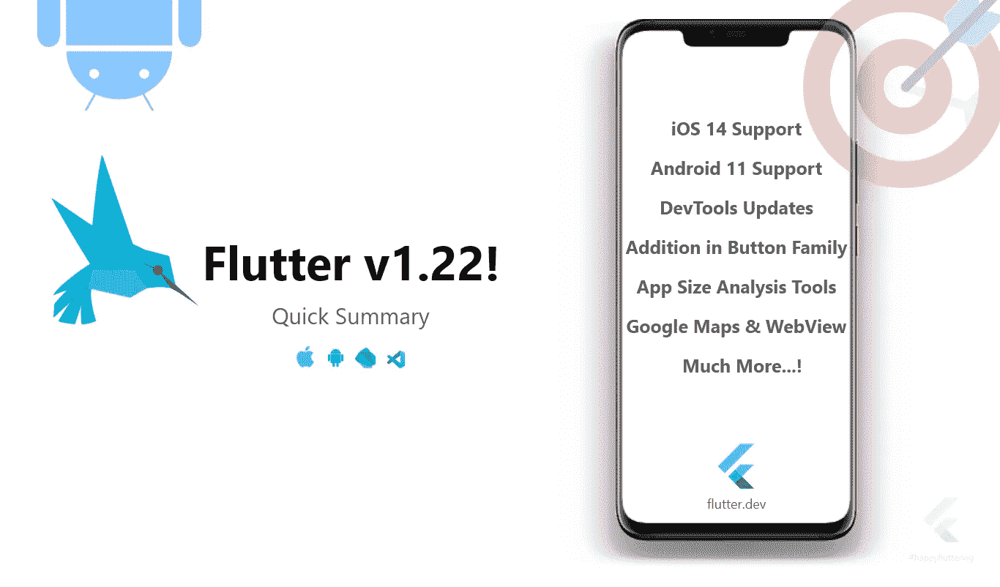

同样，这是一个快速的总结，所以我不会陷入非常技术性的东西。主要更新包括 iOS 14 支持，这对于大量开发 iOS 应用的 Flutter 开发者来说是一个非常棒的消息。但是，不要担心，Android 11 也有一些更新。

像往常一样，我们将谈论快速和简单的东西，而不是深入到技术细节。因为这是官方发布的快速概览，所以如果你对全部细节感兴趣，请确保查看[克里斯销售](https://medium.com/u/e0fa815e608b?source=post_page-----c86a36ed56b3--------------------------------)官方博客。

> 事实是我自己也不懂那些专业术语！*😜*

因此，我们将经历以下内容:

1.  **安卓 11**
2.  **iOS 14 支持**
3.  **更多“按钮”小部件系列**
4.  **国际化&本地化支持**
5.  **谷歌地图& WebView —生产层面**
6.  **导航器 2.0**
7.  **恢复状态——安卓**
8.  **平滑滚动**
9.  **新的 Dart 开发工具**
10.  **App 大小分析工具**
11.  **网页更新— DevTools**
12.  **直接来自 IntelliJ 的 DevTools 选项卡**
13.  **输出链接 VSCode —改进**

# 安卓 11

随着新 Android 版本的发布，Android 11 的 Flutter 框架有两个主要更新:

1.  各种安卓级别的安全昆虫
2.  用键盘同步动画

## 各种安卓级别的安全昆虫

现在，元素将显示在各种类型的凹口、切口和瀑布显示的其他边缘的适当位置。使用 **MediaQuery** 和 **SafeArea** 可以帮助您将 UI 的交互部分放置在正确的位置。

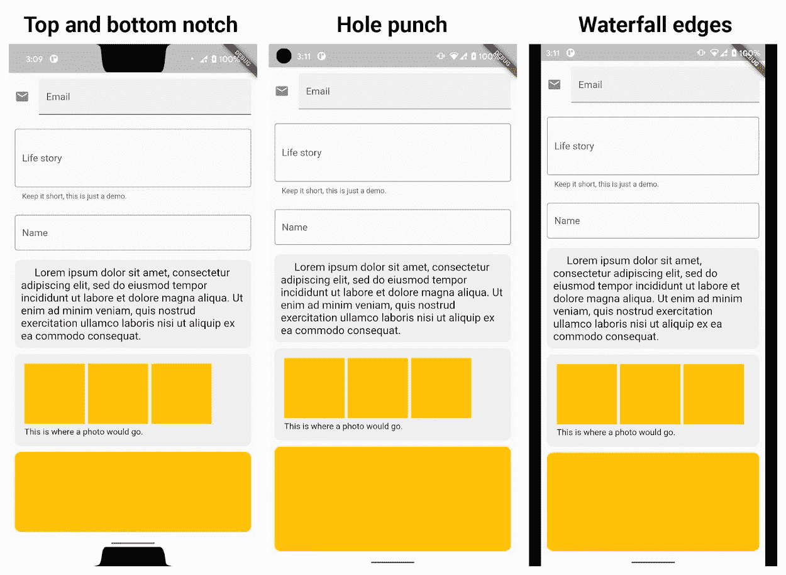

图片来自[克里斯销售](https://medium.com/u/e0fa815e608b?source=post_page-----c86a36ed56b3--------------------------------)文章

## 用键盘同步动画

Flutter 中的动画将在弹出和离开时与 Android 11 中的键盘正确同步。

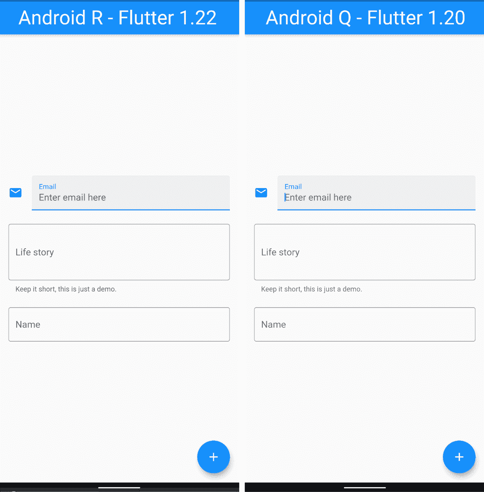

# iOS 14 —支持

Flutter 团队在版本中添加了一些令人印象深刻的更新，以便它能够以最佳方式为专注于 iOS 应用程序的开发人员工作。

*   XCode 12 最低要求 iOS 9.0。Flutter 在此版本中使用 iOS 9.0 设置默认模板。
*   其他崩溃和字体渲染问题已修复
*   在 1.20.4 版中，对物理设备的部署已经得到修复
*   关于通知的一些其他问题也被修复

> [Chris Sells](https://medium.com/u/e0fa815e608b?source=post_page-----c86a36ed56b3--------------------------------) 提到的一个技巧是通过 v1.22 重新构建 Flutter 应用，并将其部署在 App Store 上。

## 库比蒂诺包更新

随着新版本的发布，`cupertino_icons`将被更新到新版本，即 1.0 可以访问大约 [900 个新图标](https://flutter.github.io/cupertino_icons/)和新表面。

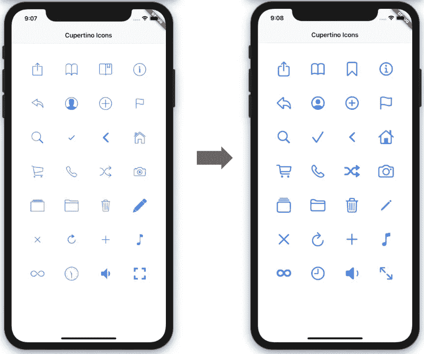

库比蒂诺图标更新

# **更多“按钮”小工具家族**

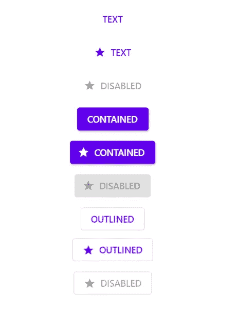

颤动按钮部件更新

虽然 Flutter 已经有了一些很棒的按钮系列，但是有时候定制这些按钮部件真的很难，你最终只能制作一个定制的部件来给你的按钮添加一些小的花哨的东西。

在这个版本中，这个家族增加了几个新成员，让你可以更好地控制按钮的定制。

> 你可以在这里玩现场[演示](https://dartpad.dev/e560e1c2e4455ad53aac245079ccdcf2)。

> 超级兴奋在我的下一个应用程序中使用它们！！

# 国际化和本地化支持

真是太巧了，几天前我的一个朋友和我讨论这件事，即本地化和颤振团队听了！😅

虽然它已经出现在 Flutter 中了，但是很明显你必须尽可能的用最小的改变来更新你的东西。因此，现在热重新加载将在您添加 l10n 信息时更新您的应用程序。

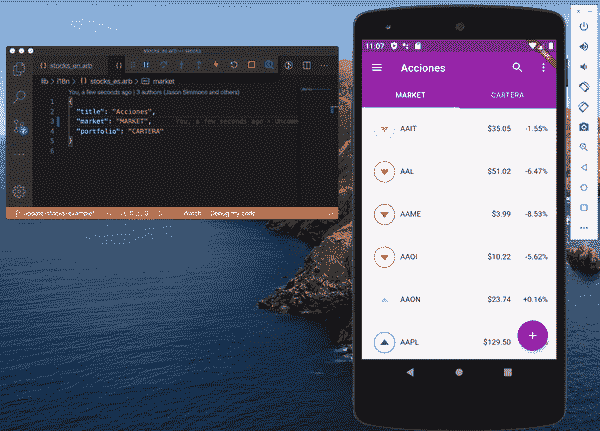

本地化热重装更新

请务必阅读完整的[文档](https://docs.google.com/document/d/10e0saTfAv32OZLRmONy866vnaw0I2jwL8zukykpgWBc/edit),了解有关参数、日期、数字等信息的详细信息。

当你使用`maxLength`的属性时，flutter `TextField`中还有另一个更新，比如💇‍♂️将被计算在内。有一个 [PR](https://github.com/flutter/flutter/pull/59267) 你可以考虑更多的细节。

# **谷歌地图&网络视图——生产层面**

天哪！我一直在等待这一天，因为我在我的一个应用程序中使用了谷歌地图，这是一些严重的头痛。感谢改善颤振团队！💙

所以现在各位，`[google_maps_flutter](https://pub.dev/packages/google_maps_flutter)` & `[webview_flutter](https://pub.dev/packages/webview_flutter)`这两个插件在“量产规模”上已经完全准备好了。只需导入它们，编写代码，构建 APK 并发布它，无需担心！

> 显然，你需要担心你放在那里的虫子！*😜*


flutter.dev via webview_flutter

我在主文章中读到的一件事是，`webview_flutter`将在新的 Android 平台上运行良好，但你必须手动启用它们。将来，随着社区越来越多地使用它，他们将默认启用它。

# 导航器 2.0

好吧，让我们面对现实吧！考虑到`Navigator 2.0`，我只理解了 Flutter 团队提到的一件事，也就是说，如你所知，Flutter widgets 在数据结构`stack`中工作，你使用`Navigator.push()`和`Navigator.pop()`在堆栈中构建屏幕。但是！您看不到堆栈，当涉及到复杂的路由时，很难以这种方式工作！唷！

所以现在有了这个新的`Navigator 2.0`实现，你将能够可视化页面堆栈。怎么会？在此阅读详情[。](https://medium.com/flutter/learning-flutters-new-navigation-and-routing-system-7c9068155ade)为什么？因为我是这么说的！😆

> 如果我继续写那样的东西，我会被封杀的😐

# 状态恢复— Android(预览版)

首先，如果你想知道“恢复状态”或“状态恢复”是什么意思，让我这么说吧。移动操作系统会杀死后台运行的应用程序，为前台应用程序夺回资源。因此，当这种情况发生时，操作系统会终止应用程序并保存应用程序的 UI 状态。为什么？当用户回来时，它可以无缝恢复，以提供更好的用户体验。

到目前为止，在 Flutter 框架中还没有这样的概念，但是在这个新版本中，你可以用 Android 实现这样的功能。检查[颤动计数器应用](https://api.flutter.dev/flutter/widgets/RestorationMixin-mixin.html#widgets.RestorationMixin.1)的状态恢复。

通过阅读解释，我理解就像`sharedPreferences`我们存储`int, string or double`以便用户一打开应用程序就可以快速访问，以类似的方式，每个小工具的状态都用唯一的 ID 存储并注册到`RestorationMixin`。`[RestorableProperty](https://master-api.flutter.dev/flutter/widgets/RestorableProperty-class.html)`键入(就像这里使用的`RestorableInt`)来存储特定于用户界面的数据，通过用状态恢复功能注册这些数据，这些数据会在 Android 杀死应用程序之前自动存储，并在它复活时恢复。仅此而已。

现在，由于这个功能是在预览版，所以这意味着状态恢复将在未来的 iOS 应用程序中出现。

# 平滑滚动(预览发布)

有时设备的输入和显示频率不同步，这可能会导致一些性能问题。例如，某个设备的输入频率为 90Hz，但显示频率为 60Hz。因此，这个 Flutter 版本带有`resamplingEnabled`标志，可以让你充分利用性能。

```
void main() {
    **GestureBinding.instance.resamplingEnabled = true;**
    run(MyApp());
}
```

> 在未来的版本中将默认启用它。

# 新的 Dart 开发工具

你可能和我想的一样。为什么颤振团队不在颤振的同时提供`dart`的更新。他们听到了。！😃

虽然你可能熟悉一些 dart 工具，比如`dartfmt, dartanalyzer`和其他工具。新的 [Dart (2.10)](https://medium.com/dartlang/announcing-dart-2-10-350823952bd5) 是一个针对 flutter 的统一 Dart 开发工具。

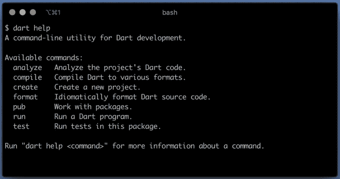

# 应用程序大小分析工具

我从新的 Flutter 开发者那里听到的最大的问题就是这个。*为什么我的应用程序这么大？我如何分析和减少 apk 的大小？大尺寸，非常大的尺寸，非常非常非常大…..*闭嘴！

现在就开始吧，你可以通过使用`--analyze-size`工具和你的任何构建命令来分析应用的大小，比如:

```
- flutter build apk
- flutter build appbundle
- flutter build ios
- flutter build linux
- flutter build macos
- flutter build windows
```

所以，它就像`flutter build apk --analyze-size`。相信我，这是你可能遇到过的最详细的应用细分，包括本机代码、资产和软件包。

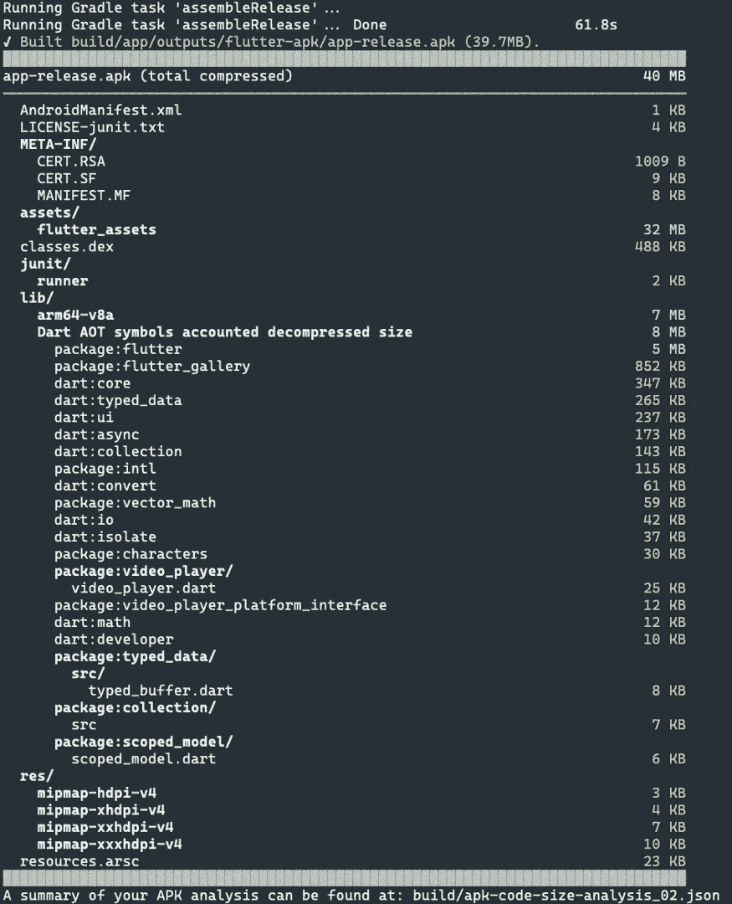

示例摘自主发布博客

有趣的部分来了，你可以得到 jSON 格式的上述数据。然后，您可以使用 jSON 文件来分析您的应用程序，如下所示:

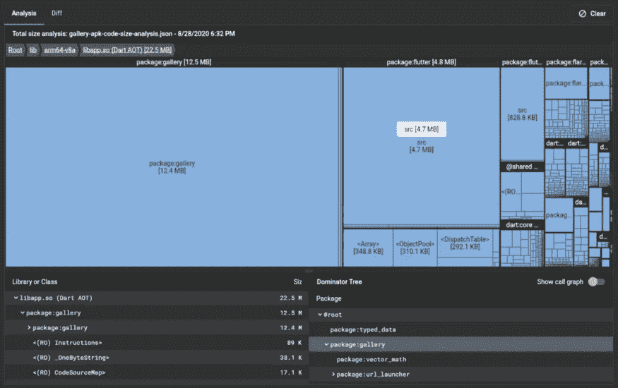

你可以在这里遵循完整的说明[。](https://flutter.dev/docs/development/tools/devtools/app-size)

# 网页更新—开发工具

很简单，你可以在如下的网络标签中看到 **HTTP** & **HTTPs** 响应主体，并且你可以搜索和过滤网络中高流量的应用。

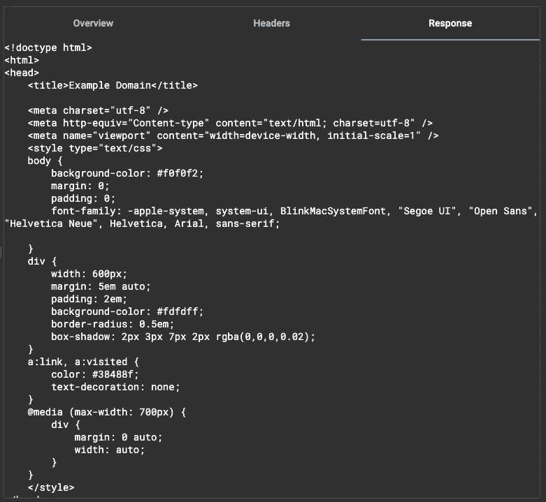

HTTP 和 HTTPs 响应主体

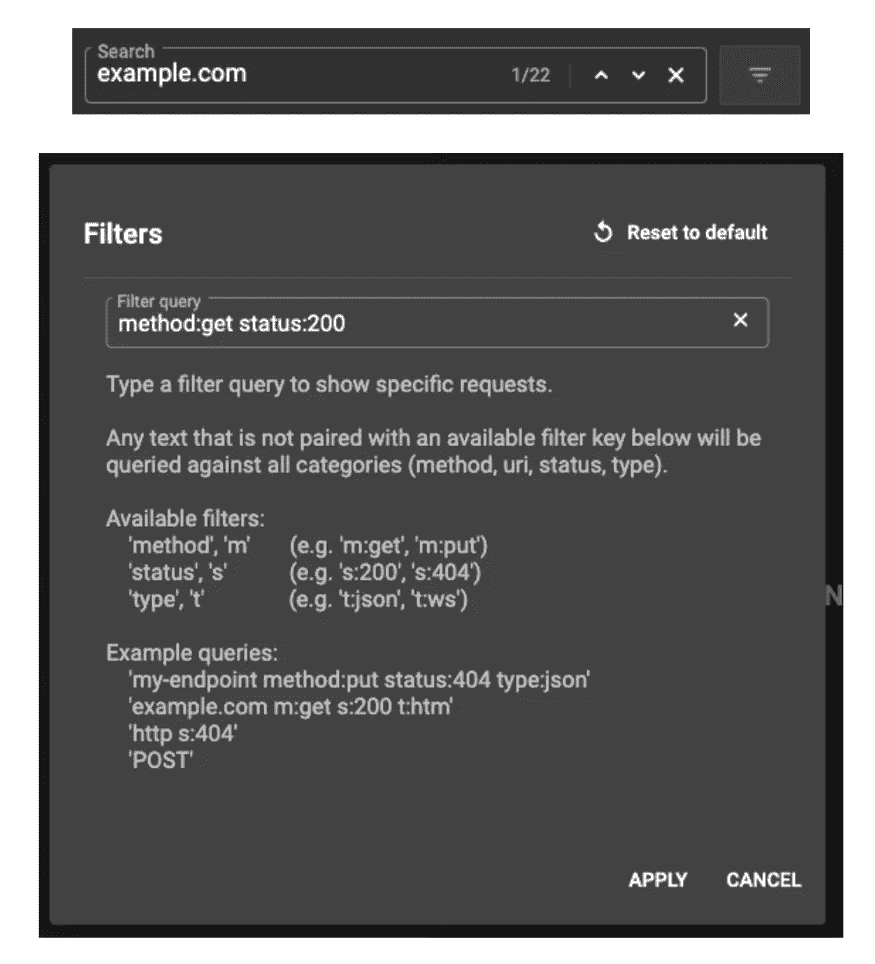

搜索和过滤高网络流量应用

# **直接来自 IntelliJ 的 DevTools 标签**

到目前为止，您可能已经使用了 IntelliJ 中的**检查器**面板和 DevTools 中的**检查器**选项卡。现在我的朋友有了这个更新，就可以直接在 IntelliJ 中托管 Dart DevTools 的 **Inspector** 选项卡了。早些时候，Flutter 团队维护了两个代码库，我们缺少了一些功能，比如缺少布局浏览器。

启用这个通过**首选项** > **语言&框架** > **旋舞** > **启用嵌入式 DevTools 检查器**。

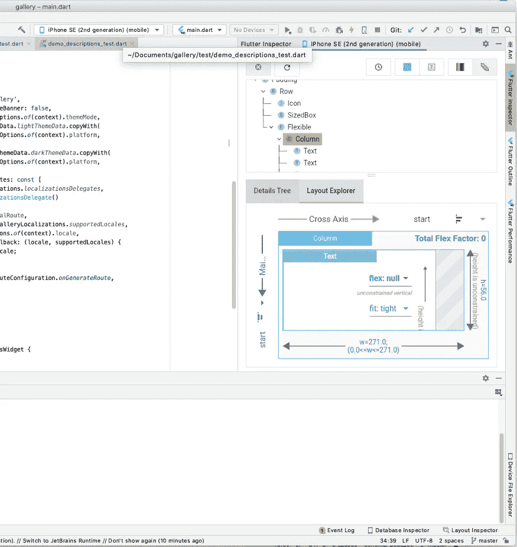

# **输出链接 VSCode —改进**

对于像我这样经常犯逻辑和运行时错误的人来说，这次更新是一种享受！😜因为犯错误是一部分，但是发现或追溯错误是另一部分，对我来说这真的很难。对于这个版本的 Flutter extension for Visual Studio 代码，现在可以正确解析这些链接，以便直接从输出中启用链接。

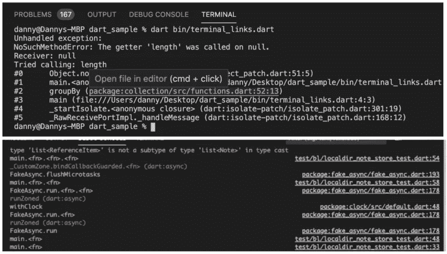

输出端的改进走线

# 总结一下！

相信我，有很多事情我不能提及，因为两个原因:

1.  我想快速浏览一下。
2.  很多事情我自己都不明白😆

不管怎样，就是这样了！有如此多的好东西，你可以在 Chris Sells 的官方文章中尝试，并在你的下一个应用中实现。我肯定要用纽扣工作！而且还会玩还原状态。不了解你；p 还是祝你好运！

一定要给一些👏和反馈:)

# 谢谢大家和# HappyFluttering💙