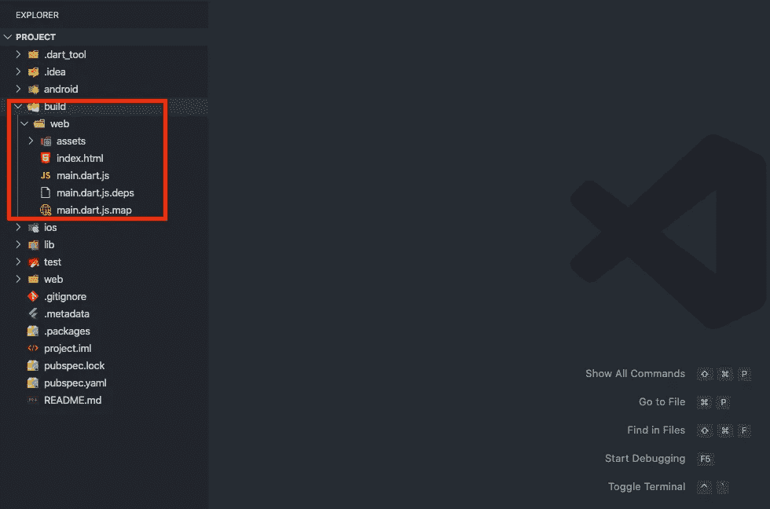
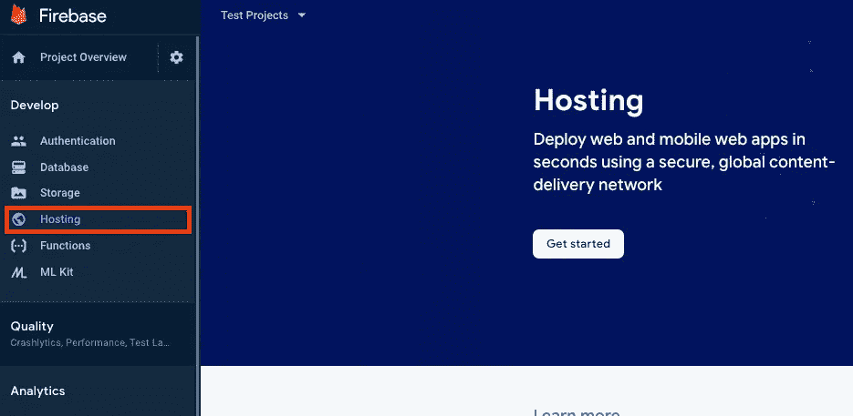
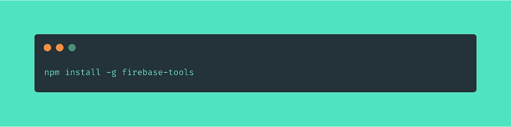
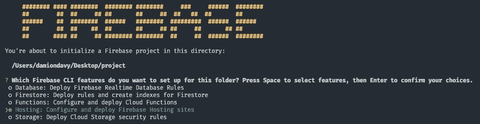
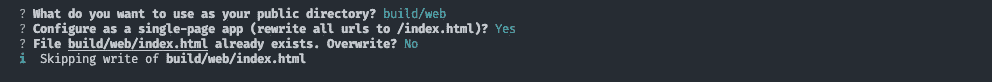

# Flutter Web + Firebase 托管

> 原文：<https://itnext.io/flutter-web-firebase-hosting-45d7e3fc50f9?source=collection_archive---------2----------------------->


作为一名开发人员，这是前所未有的好时机；你把一个想法或概念变成现实的容易程度是因为缺乏一个更好的词——惊人。

在这篇文章中，我们将开始部署一个 Flutter web 应用程序到 Firebase 主机的旅程。

# 颤振构型

1.  创建一个新的 flutter 项目，并为 web 构建它



颤动的部分已经完成了！:)

# 火基配置

1.  创建一个新的 firebase 项目[https://console.firebase.google.com/](https://console.firebase.google.com/)


2.接下来，我们将安装 firebase 工具



3.您运行下面的命令并使用您的凭据登录:


4.在你的 flutter 项目根目录下运行 **firebase init** 。


5.选择托管并选择相应的项目。



6.在提示“您希望将什么用作您的公共目录？”键入“ **build/web** ”，然后对“配置为单页应用程序(将所有 URL 重写为/index.html)”键入“是”



# 部署时间到了

```
firebase deploy --only hosting
```


# 结论

如今部署静态网站超级简单方便。Firebase 托管使它变得非常简单。

您可以阅读 Firebase 文档并添加您的自定义域。

# 如果这有帮助的话:请给我一个掌声，它让我保持动力😀

⥅跟我上[中型](https://medium.com/@codememory101)。

⥅在推特上关注我。

📢在社交媒体上分享。