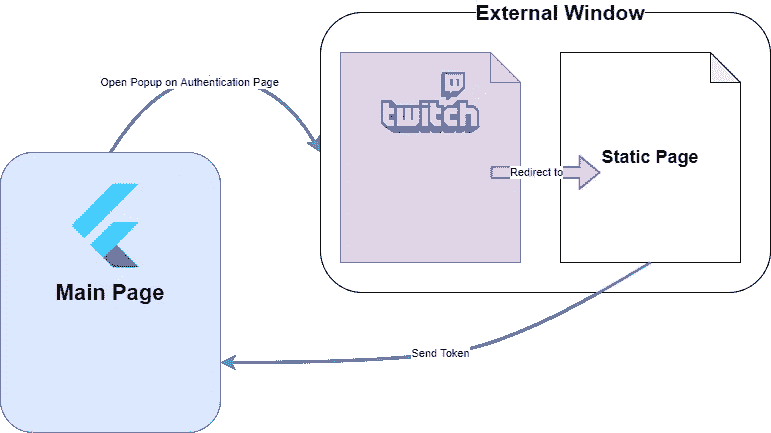

# Flutter Web:通过外部窗口进行 OAuth 认证

> 原文：<https://itnext.io/flutter-web-oauth-authentication-through-external-window-d890a7ff6463?source=collection_archive---------2----------------------->

几天前我发表了这篇文章:

 [## Flutter Web: Twitch OAuth2 认证流程实现

### 目前在 Flutter Web 上很难实现 OAuth2 这样的认证流程。困难之一是…

rouxguillaume.medium.com](https://rouxguillaume.medium.com/flutter-web-twitch-oauth2-authentication-flow-implementation-77d239c72be5) 

虽然它可能对一些读者有所帮助，但我发现了一种更好的方法来管理 Flutter Web 上的身份验证。感谢我的朋友兼同事[mem .](https://medium.com/u/60b78a4555bb?source=post_page-----d890a7ff6463--------------------------------)的帮助。

通常，当您使用第三方服务在网站或 web 应用程序上进行身份验证时，您会通过外部窗口连接您的帐户。这个过程避免了在重定向后重新加载你所在的网站。这是我在上一篇文章中描述的方法所隐含的主要问题。

因此，今天让我们解决这个问题，并使用外部身份验证窗口实现 OAuth2 流。仍然是通过使用 Twitch 的 API，这样跟随前一篇文章的人就不会太迷茫。

# 先决条件

*   创建您的初始颤振应用程序
*   一个有效的 Twitch 和 Twitch 开发者账户
*   一些基本的 HTML 和 JS 知识

# 建立

在我们开始编码之前，让我解释一下我们的认证流程。我们将在一个新窗口中打开 Twitch 认证 URL，方法是将我们的`client_id`和`redirect_uri`作为参数传入 URL。与前一篇文章相比，主要的区别是我们的`redirect_uri`不会在认证过程之后重定向到我们的应用程序，而是重定向到一个静态的 HTML 页面，这个页面的唯一目的是将我们正在寻找的数据发送到我们的主应用程序窗口。在这种情况下，它将是我们的 URL 中包含的 OAuth 令牌。

就代码而言，我们想要完成的操作有:

*   在**外部窗口**中打开 **Twitch 认证页面**
*   认证后**重定向到**我们的**静态页面**
*   **将包含认证令牌的 URL 从我们的**静态页面**发送到**主页面****
*   在我们的**主页**中捕捉令牌
*   关闭**外部窗口**

# 创建我们的静态页面

在尝试打开外部窗口之前，首先要做的是创建我们将要重定向到的静态 HTML 页面。

下面是您必须在`web/`文件夹中创建的`static.html`页面的代码:

static.html

它基本上是一个空的 HTML 页面，重要的部分在`<script>`里面。为了能够发送包含认证令牌的页面 URL，我们使用了方法`postMessage()`，它允许我们通过`window.opener`引用( [Window.postMessage doc](https://developer.mozilla.org/fr/docs/Web/API/Window/postMessage) )与主窗口进行通信。我们正在发送包含令牌的 URL`window.location.href`。

# 打开外部窗口

现在你可能会问，如何打开外部窗口？这其实很简单，因为我们在`dart:html`库中有一个抽象:

因此，要打开我们的外部窗口，我们调用方法`window.open`并添加`width`和`height`选项，这样它将打开一个新窗口，而不是一个标签。我们将窗口的引用保存在我们的`_popupWin`变量中，这样我们将能够在收到访问令牌后通过编程关闭它。

剩下唯一要做的就是添加一个监听器来获取我们的外部窗口发送的消息。

# 听留言

Dart 又一次做得很好，因为我们对消息侦听进行了抽象:

正如你在这里看到的，我们依靠`window.onMessage`从静态页面中监听`postMessage`。重要的是要事先检查收到的事件是否包含`access_token`，因为 Twitch 登录本身会发送一条消息来确认身份验证成功。你只需要解析你的 URL，这里有一个工作示例，但是你可以按照你想要的方式来做。

为了结束我们的认证流程，我们使用之前保存的参考`_popupWin`关闭窗口。

# 结论

这就是了！我希望这些步骤是清楚的，并且你已经全部理解了。对于前一篇文章，这应该适用于任何 OAuth2 流。这以一种更“web”的方式工作，不需要完全重新加载应用程序。这是我最后一次就 Flutter Web 中的认证问题打扰你，因为我认为这个解决方案更加最终和可用。

如果这篇文章对你有帮助，请不要犹豫留下评论，分享它或鼓掌，这样它可能会帮助更多的人。

一如既往，这里是我的文章所基于的源代码:

 [## TesteurManiak/flutter _ web _ twitch _ auth

### 此时您不能执行该操作。您已使用另一个标签页或窗口登录。您已在另一个选项卡中注销，或者…

github.com](https://github.com/TesteurManiak/flutter_web_twitch_auth/tree/use-external-win)