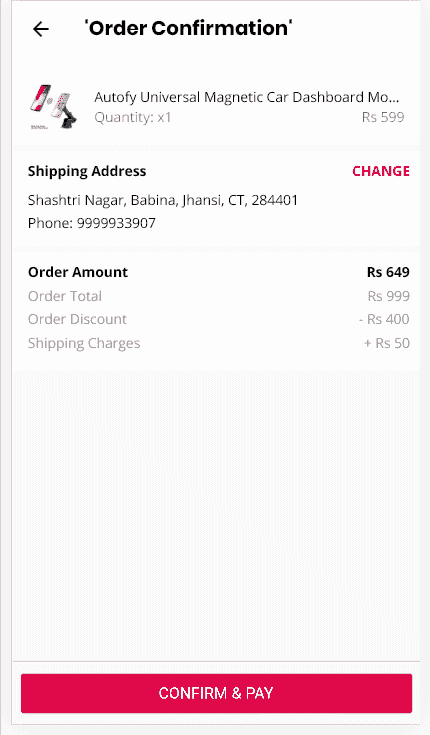

# Flutter Web: Razorpay 支付网关集成

> 原文：<https://itnext.io/flutter-web-razorpay-payment-gateway-integration-792d6e015409?source=collection_archive---------1----------------------->

如何使用 razorpay web 集成方法在 flutter web 平台上集成 razorpay 支付网关？


照片由[晨酿](https://unsplash.com/@morningbrew?utm_source=medium&utm_medium=referral)在 [Unsplash](https://unsplash.com?utm_source=medium&utm_medium=referral) 拍摄

**问题**:官方 razorpay [插件](https://pub.dev/packages/razorpay_flutter)还不支持 web 平台([参见 GitHub 问题](https://github.com/razorpay/razorpay-flutter/issues/43))而 flutter 官方 webview [插件](https://pub.dev/packages/webview_flutter)也还不支持 flutter web 平台。

*本文假设您已经注册了 RazorPay，并完成了所有手续，获得了 API 密钥，可以开始在您选择的平台上集成支付网关。*

**概述:**虽然 flutter web 仍处于测试阶段，但随着最近的更新，它的性能已经有所提高，很快我们就会看到正式的稳定版本。虽然 flutter 团队致力于在 webview 插件中支持 web 平台，但我们至少不必等到那时才实现这一功能。

我目前正在使用 flutter 为 iOS、android 和 web 构建一个购物移动应用程序。到目前为止，我对 flutter 提供的开发经验感到满意。对于这个特殊的用例，我想集成一个支付网关，它可以在我的目标平台上工作。所以我是这样做的:

1.  用 IFrameElement 注册了一个视图工厂，以便在 flutter 小部件上加载定制的 HTML 和 javascript。
2.  添加了事件监听器，以处理支付成功和失败事件，并根据事件采取进一步的行动(例如，显示成功页面)。
3.  在 flutter 中从 javascript 调度消息/事件来处理它们。

**解决方案**



Flutter Web 上的 RazorPay 支付集成

**第一步:注册一个视图工厂**

创建一个名为 *UiFake.dart* 的类

```
*import* 'dart:ui' *as* ui;

*// ignore: camel_case_types
class* platformViewRegistry {
*static registerViewFactory*(String viewId, *dynamic* cb) {
ui.platformViewRegistry.registerViewFactory(viewId, cb);
}
}
```

不要担心这个错误，它说“名称‘platformViewRegistry’通过前缀‘ui’被引用，但是它没有在任何使用该前缀导入的库中定义。”。就这样吧，它不会阻止你构建应用程序，尽管你可以在你的分析器中添加一个规则来忽略这个错误。

**步骤 2:创建 HTML 文件来初始化 razorpay checkout**

在您的资产文件夹中，创建一个名为 **"html"** ，的文件夹，创建一个名为 **"payment.html"** 的文件，内容如下

```
<!DOCTYPE *html*><html>
<meta *name*="viewport" *content*="width=device-width">
<head><title>RazorPay Web Payment</title></head>
<body>
<script *src*="https://checkout.razorpay.com/v1/checkout.js"></script>
<script>

       var options = {
         "key": "YOUR_KEY_HERE",
          "amount": "50000", "currency": "INR",
          "name": "Acme Corp",
          "description": "Test Transaction",
          "image": "https://example.com/your_logo",
          "handler": function (response){
             window.parent.postMessage("SUCCESS","*");      //2 
             alert(response.razorpay_payment_id);
             alert(response.razorpay_order_id);
             alert(response.razorpay_signature)    
          },    
          "prefill": {        
             "name": "Gaurav Kumar",        
             "email": "gaurav.kumar@example.com",
             "contact": "9999999999"   
           },   
           "notes": {        
             "address": "Autofy"    
          },    
          "theme": {
             "color": "#DF0145"    
          },
          "modal": {
            "ondismiss": function(){
               window.parent.postMessage("MODAL_CLOSED","*");   //3
            }
          }
       };

       var rzp1 = new Razorpay(options);
       window.onload = function(e){  //1  
          rzp1.open();
          e.preventDefault();
       }

     </script>
</body>
</html>
```

1.  在这里，我已经在页面加载时启动了结帐模式，这意味着当您导航到屏幕时(步骤 3)，模式应该会立即出现。
2.  为了处理支付成功，我在 javascript 中使用了***window . parent . postmessage(" SUCCESS "，" *)***来让我们的 flutter 代码知道支付已经完成。也可以在这里发送自定义事件(参考: [Javascript 自定义事件](https://developer.mozilla.org/en-US/docs/Web/Guide/Events/Creating_and_triggering_events))。了解更多关于如何安全使用 postMessage 的信息(参考:[本文](https://developer.mozilla.org/en-US/docs/Web/API/Window/postMessage))。此外，请查看 razorpay web 集成文档，以更好地理解这些选项和处理函数是如何工作的。( [RazorPay Web 集成文档](https://razorpay.com/docs/payment-gateway/web-integration/standard/))
3.  为了在用户关闭结帐模式时处理事件，我从 ondismiss 方法中继了***window . parent . postmessage(" MODAL _ CLOSED "，" *)***消息。
4.  如果支付过程中出现任何错误，razorpay checkout modal 只会提供重试支付的选项。

**第三步:创建一个小工具**

现在让我们加载这个 HTML 文件来显示结帐模式并处理事件。

```
*import* 'dart:html';
*import* 'dart:ui' *as* ui;
*//conditional import
import* 'package:autofystore/utils/UiFake.dart' *if* (dart.library.html) 'dart:ui' *as* ui;
*import* 'package:flutter/material.dart';

*class* RazorPayWeb *extends* StatelessWidget {
  @override
  Widget build(BuildContext context) {
    *//register view factory* ui.platformViewRegistry.*registerViewFactory*("rzp-html",(int viewId) {
      IFrameElement element=IFrameElement();
//Event Listener window.onMessage.forEach((element) {
        print('Event Received in callback: ${element.data}');
        *if*(element.data=='MODAL_CLOSED'){
          Navigator.*pop*(context);
        }*else if*(element.data=='SUCCESS'){
          print('PAYMENT SUCCESSFULL!!!!!!!');
        }
      });

      element.requestFullscreen();
      element.src='assets/html/payment.html';
      element.style.border = 'none';
      *return* element;
    });
    *return* Scaffold(
      body: Builder(builder: (BuildContext context) {
          *return* Container(
            child: HtmlElementView(viewType: 'rzp-html'),
          );
    }));
  }

}
```

让我解释一下这是怎么回事。

1.  我们有条件地导入了我们的 **Uifake.dart** 类，以使用我们之前创建的静态方法注册我们的视图工厂。
2.  我们已经注册了一个 IFrameElement 作为我们的视图工厂，并加载了 HTML 来显示结帐模式。
3.  我们使用 onMessage 监听器处理来自 javascript 的消息

```
window.onMessage.forEach((element) {
        print('Event Received in callback: ${element.data}');
        *if*(element.data=='MODAL_CLOSED'){
          Navigator.*pop*(context);
        }*else if*(element.data=='SUCCESS'){
          print('PAYMENT SUCCESSFULL!!!!!!!');
        }
      });
```

如果您想发送事件而不是消息，请使用**window . addevent listener**来代替。

这应该足以让 razorpay 支付在 flutter web 上运行。

那都是乡亲们。让我知道你的想法！

> **注意:**虽然这篇文章特别关注的是 RazorPay，但是你可以应用同样的技术来集成任何其他的支付网关。