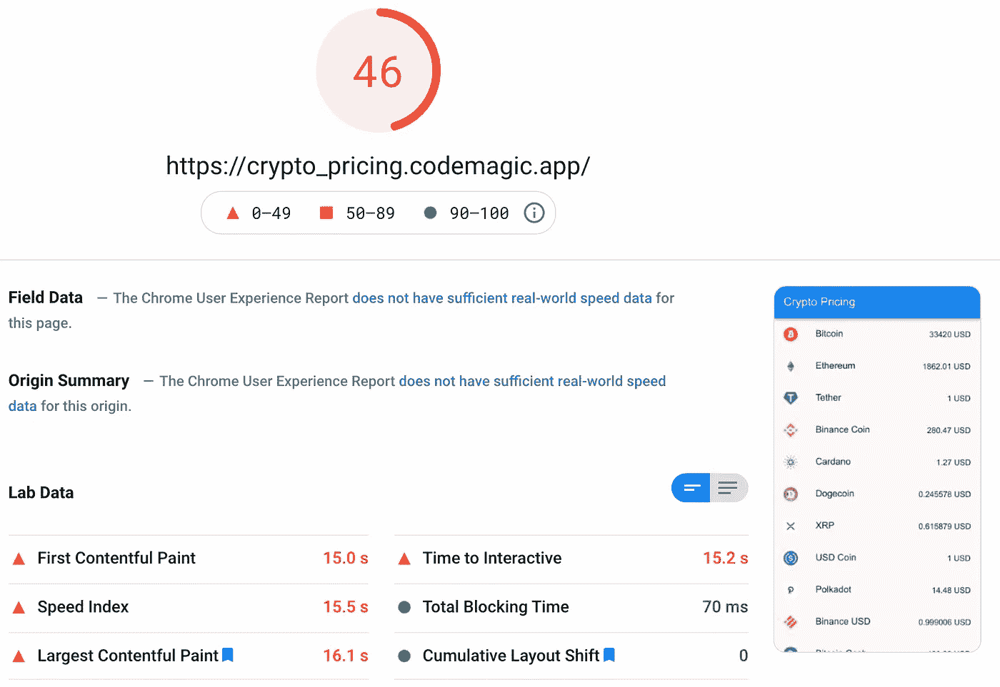

# Flutter Web:我应该使用它吗？(第 2 部分—性能)

> 原文：<https://itnext.io/flutter-web-should-i-use-it-part-2-performance-d801d122fc3e?source=collection_archive---------2----------------------->

我希望你喜欢这个系列的第一部分，在那里我介绍了 SEO 和 Web Scrappers 以及它们对 Web 使用 Flutter 的影响，如果你还没有读过，它绝对值得一读。

 [## Flutter Web:我应该使用它吗？(第 1 部分—搜索引擎优化)

### 有很多关于 Web 抖动及其弱点的讨论，在这一部分，我们将讨论 SEO 和 web scrappers。

itnext.io](/flutter-web-should-i-use-it-part-1-seo-842d87ff9d28) 

在这一部分中，我们将探讨 SEO 的另一个重要因素，即性能。当搜索引擎抓取您网站的文本内容，以便能够对其进行分析和分类，供用户搜索时使用时，他们也会密切关注您网站的性能。

性能是通过几种方式来衡量的，其中最重要的要考虑，也可能是我们作为开发人员可以解决或至少减轻的最简单的方式是下载时间和首次有意义绘图的时间。

## 下载时间…

下载时间应该是显而易见的，但这是你的网站完成下载到用户的浏览器所需要的时间，或者在搜索引擎测试“浏览器”的情况下，自然越快越好，改善的方法将是减少网站的整体负载和优化网络请求，在某些情况下更多是更少。

一个现代的浏览器可以处理大量的网络请求，从几十个到几百个，所以大量的小的、可缓存的文件比一个单独的捆绑文件更有用，JS devs 会记住`vendeor.js`文件。

在 web 的 Flutter 的例子中，有效负载仍然很大，在 Flutter 2 发布后，我组装了一个小应用程序，从一个干净的石板开始研究零安全，而不是升级现有的项目。

用 riverpod 构建的单个页面和单个 API 调用非常简单。你可以看看[这里的](https://crypto_pricing.codemagic.app)，还有[的源代码](https://github.com/RemeJuan/crypto_pricing)。

这里的有效负载大小，对于一个 HTML 构建来说，大约是 3MB，在 React 中，它可能大约是 400kb，如果不是更小的话，它将是下载大约 3MB 的 web 程序集运行时的 canvas 构建的两倍。

## 是时候开始有意义的绘画了…

这是一个衡量对用户来说有意义的东西出现在屏幕上需要多长时间的指标，这些东西超过了浏览器的默认白色页面或者你的网站的主要背景颜色。

这可能是文本，甚至是一个加载微调，向用户表明正在发生的事情。

你可以想象，这受到下载速度的影响，除非你下载了足够多的网站，否则你实际上没有多少东西可以在屏幕上绘制，在 Flutter 的情况下，你主要是在屏幕上出现任何东西之前等待`main.js`完成下载。

## 分析性能…

对于那些以前没有听说过它的人来说，衡量网站性能的一个更常见的工具是[谷歌的灯塔](https://developers.google.com/web/tools/lighthouse/)，在这里你可以输入你的或任何网站地址，并获得相当多的关于网站性能和瓶颈的有用信息，这些信息对于找到改善网站性能的最佳方法非常有价值。

Lighthouse 将为您提供 web 和移动两方面的分析，随着移动成为目前更重要的考虑因素之一，更大比例的用户通过移动设备而不是电脑在网站/应用上花费时间。

你可以看看我之前提到的那个小应用的分数[这里是](https://developers.google.com/speed/pagespeed/insights/?url=https%3A%2F%2Fcrypto_pricing.codemagic.app%2F&tab=mobile)，因为你会看到移动端的分数相当低，桌面端的分数略高。

灯塔评分(移动)的加密定价应用程序。

正如你所看到的，该网站“失败”的第一个指标是*第一次内容丰富的绘画，*这仅发生在 15s 左右，可能慢了 13-14 秒。

在页面的更下方，您将看到指向该站点特定“痛点”的特定诊断，其中一个主要诊断是`main.js`文件，该文件现在非常大，因此不仅需要一些时间来下载，还需要一些时间来处理。

我们还需要考虑这是针对 html 构建运行的，可以选择构建 flutter，指定使用“canvaskit”或“html”作为渲染引擎，因为我必须指定 HTML，但是默认情况下，它将有效地构建两者，在桌面上选择“canvaskit ”,在移动上选择“HTML”。

这意味着在桌面上，将有额外的 2.5-3mb 用于“wasm”web 程序集文件，这是“canvaskit”所需的，这将对下载速度和首次内容丰富的绘画产生额外的成本。

Lighthouse 也是用户第一次访问或每次部署的第一次访问的指标，这几乎是最糟糕的情况，后续访问会快得多，因为许多(如果不是大多数)文件会缓存在用户的设备上，所以他们应该会在每次应用部署时经历一次长时间的延迟。

## 我们能做些什么来改善这些…

对于这两个因素中的任何一个，现在作为开发者你都不能做太多的事情来帮助改善或减轻这些，当然，除非你有足够的经验来帮助核心团队改善 Flutter web。

现在，我们只需等待他们改进编译器，也许给我们更多一点对如何构建包的控制权，如果我们可以将包分成更小的块，并将所有的要素放在一个`main.js`中，其余的代码放在块中，我们就可以大大缩短下载和首次有意义的绘制时间。

下一次我们将进入其他因素，我相信，你作为开发者在为你的项目决定 Flutter 时应该考虑的。

如果你喜欢，鼓掌(或 50)会很棒，如果你真的喜欢，一杯[咖啡](https://www.buymeacoffee.com/remelehane)会很棒。

感谢阅读。

 [## 在 M1 Mac 上开发(颤振)

### 作为一名开发新款 M1 Macbook Pro 的 Flutter and React 开发人员，我有一个简短的见解

remelehane.medium.com](https://remelehane.medium.com/developing-on-an-m1-mac-flutter-563c8dcc28f)  [## 应对颤振:一个开发者的旅程—第 1 部分

### 对一个 React 开发人员迁移到 Flutter 的体验有一点了解

itnext.io](/react-to-flutter-one-developers-journey-part-1-f101443bff82)