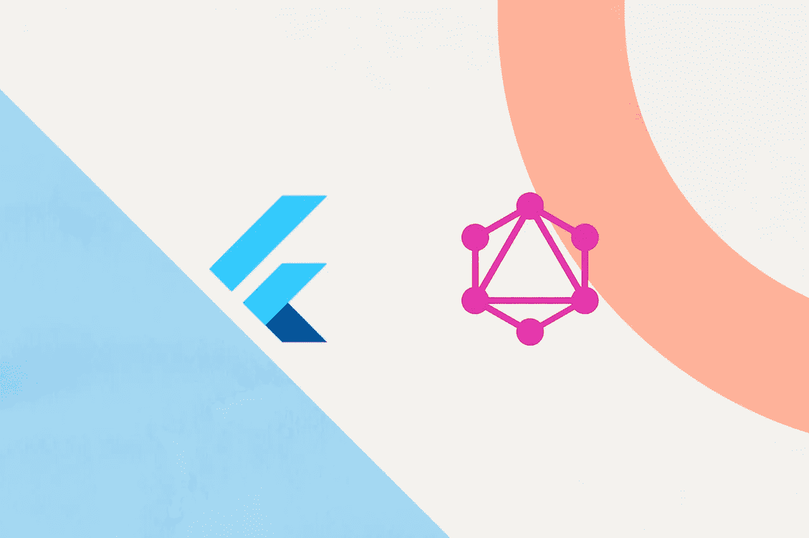

# 颤动 x 图 QL

> 原文：<https://itnext.io/flutter-x-graphql-a2dea05e6564?source=collection_archive---------0----------------------->



作为一名前端开发人员，我已经在很多使用**REST API**的项目上工作了很长时间，我已经注意到了一些与 REST 交互时的低效率。

*   源代码中有太多的端点，我需要处理它们。
*   尽管我只想在我的 **UI** 上显示一个单独的字段，但是服务器可能会向我发送更多不必要的数据。
*   与后端团队沟通以澄清 API 文档需要花费大量时间。
*   请求对象(前端)的结构必须依赖于服务器端。

你有没有因为以上原因浪费了很多时间？好吧，如果你已经回答了" **Yes** "，那么 GraphQL 将会节省你的时间。

## **那么，GraphQL 到底是什么？**

> GraphQL 是一种用于应用编程接口(API)的查询语言和服务器端运行时，它优先向客户端提供它们所请求的数据，而不是更多。
> 
> GraphQL 旨在使 API 快速、灵活且对开发人员友好。它甚至可以部署在一个称为 GraphiQL 的集成开发环境(IDE)中。作为 REST 的替代方案，GraphQL 允许开发人员在一个 API 调用中构造从多个数据源提取数据的请求。
> 
> ——[redhat.com](http://redhat.com)

当你阅读上面的定义时，我相信你会想到 SQL(结构化查询语言)并回忆起“传奇”术语，如大学一年级时的 **SELECT** 、 **INSERT** 、 **UPDATE** 、 **DELETE、**和 **WHERE** 。

之后，这个定义会让你想起休息，我相信你会想到另一个传奇术语: **C.R.U.D** ，对吗？

现在，如果我们有一个结合了所有这些传奇流行语的东西呢？没错，救了我一命的人诞生了 **— GraphQL。**

在本文的范围内，我们将从前端的角度开始介绍 GraphQL 的基本概念。

# **GraphQL 操作**

GraphQL 操作主要有三种:**查询、变异、订阅。**

> 假设我们的模式中有一个模型`ticket`，这个模型包含三个字段:`id, status, created_at`

## **查询(只读获取)**

**1。获取多个条目**

**2。获取单个条目**

## **突变(先修改再提取)**

**1。添加单个条目**

**2。更新条目**

**3。删除一个条目**

## **订阅(实时数据查询)**

# **现在，让我们把它应用到颤振上**

首先，为了使用 GraphQL，你需要一个服务器库(除非你有一个坚实的后端团队)。有很多受支持的服务器库，但是我善意地建议你使用[](https://graphcms.com/)****。****

**其次，为了让你的 Flutter 项目能够使用 GraphQL，你需要一个 GraphQL 客户端以便与服务器通信，在 **pub.dev** 上有一些很棒的库，比如[**graph QL _ Flutter**](https://pub.dev/packages/graphql_flutter)、 [**ferry**](https://pub.dev/packages/ferry) 。**

## ****编码时间！****

**(以下所有的脚本和相关的东西都可以在这个回购:[**flutour**](https://github.com/dubydu/fluttour))。开始之前，请先看一下自述文件。**

**我们要做的是:**

1.  **创建一个基本 GraphQLAPIClient。**
2.  **创建一个异步函数，包含我们希望在 GraphQLAPIClient 扩展的类中执行的*突变/查询/订阅*文档。然后，处理异常并解析响应中的数据。**
3.  **在从 **ChangeNotifier** 扩展的 provider 类中创建另一个异步函数，在步骤 2 调用该函数并开始数据处理。**
4.  **通知侦听器，来自服务器的数据可能已经更改。**

## ****创建一个基础 GraphQLAPIClient****

```
> [api_client.dart](https://github.com/dubydu/fluttour/blob/6a2ed6f521665a2feaa3dae322807e4a9801cf22/lib/data/api/api_client.dart#L4)GraphQLClient(
     cache: GraphQLCache(
       store: HiveStore(),
     ),
     link: _link,
     defaultPolicies: DefaultPolicies(
       watchQuery: policies,
       query: policies,
       mutate: policies,
     ),
   );
}
```

**在这里，我们创建了一个私有的 **_client** 函数，它返回一个 GraphQLClient 构造函数**

*   ****缓存:**数据存储中使用的初始缓存。**
*   ****链接:**将 GraphQL 文档解析为响应的链接。在这种情况下，我们使用 **HttpLink** ，我们将把它与[**AuthLink**](https://github.com/dubydu/fluttour/blob/6a2ed6f521665a2feaa3dae322807e4a9801cf22/lib/data/api/api_client.dart#L11)**连接起来，以便附加我们的 **GraphCMS** 公共令牌。****
*   ******默认策略:**为每个客户端动作设置的默认策略。****

****之后，我们创建一个 [***查询***](https://github.com/dubydu/fluttour/blob/cd10d0f9cbc564645a26c1a7e5256a458ddd4e85/lib/data/api/api_client.dart#L37) 函数来执行我们的查询。****

```
**Future<QueryResult> query(String queries) async {
  final WatchQueryOptions _options = WatchQueryOptions(
    document: gql(queries),
    pollInterval: Duration(seconds: 15),
    fetchResults: true,
  );
  return await _client().query(_options);
}**
```

****现在我们创建一个 [***变异***](https://github.com/dubydu/fluttour/blob/cd10d0f9cbc564645a26c1a7e5256a458ddd4e85/lib/data/api/api_client.dart#L47) 函数来将变异发送到服务器。****

```
**Future<QueryResult> mutation(String queries) async {
  final MutationOptions _options = MutationOptions(
    document: gql(queries),
  );
  return await _client().mutate(_options);
}**
```

****很酷吧？****

## ****创建请求****

****在从 GraphQLAPIClient 扩展的类中，我们创建了一个请求函数来发送`mutate/query/subscription`到服务器。****

```
**Future<T> get() async {String your_query= """
    query {
          /// write your query
      }
  """;final result = await this.query(your_query);
  if (result.hasException) {
    handleException(result);
    return [];
  }
  /// parse data & return the T}
>for example: [*signup_request.dart*](https://github.com/dubydu/fluttour/blob/develop/lib/data/api/request/signup_request.dart)**
```

****对于 ***突变*** ，你要做的就是把`this.query`改成`this.mutation`****

## ****数据处理/通知您的提供者类中的侦听器****

```
**Future<void> get() async {
  final result = await this._request.get();
  if (result != null) { } else { }
  // handle data & notify the listeners here.
  // there are a bunch of ways to notify the listeners, 
  // in this example, I'm using the delegation pattern and
  // [notifyListeners](https://api.flutter.dev/flutter/foundation/ChangeNotifier/notifyListeners.html) function.}
>for example: [*signup_provider.dart*](https://github.com/dubydu/fluttour/blob/cd10d0f9cbc564645a26c1a7e5256a458ddd4e85/lib/pages/signup/signup_provider.dart#L70)**
```

# ****陷阱****

****1.为了运行这个项目，您需要在一个特定的环境中运行。****

*   ****发展:`flutter run -t lib/main_dev.dart`****
*   ****生产:`flutter run -t lib/main_prod.dart`****

****2.您需要一个个人访问令牌来对 GraphCMS 服务器进行身份验证。要得到一个，去 https://graphcms.com/docs/authorization。****

****如果你不想浪费你的时间，你可以用我的代币，这个代币在这个[回购](https://github.com/dubydu/fluttour)里有。****

******最后**，享受你的工作，看看 GraphQL 有多不可思议。****

## ****2021 年 9 月 29 日更新****

> ****如果您在使用不同的 GraphQL 服务器库时遇到了这个问题:****

****`Null value resolved for non-null field `__typename``****

****原因是[**graphql _ flutter**](https://pub.dev/packages/graphql_flutter)库的`gql document node`函数是自动添加 **`__typename`s** 的，而上述这些 graph QL 服务器还没有支持这种类型。因此，为了解决这个问题，让我们定制另一个`gql document node`函数。****