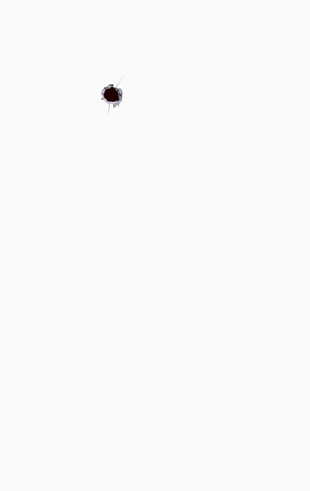

# FlutterVita:枪声应用

> 原文：<https://itnext.io/fluttervita-gunshots-app-f00e9235c3e3?source=collection_archive---------7----------------------->


枪声应用

> 我会尽量每周发表一篇新文章。下次见。🤓

是的，这是我在 2 月 9 日说过的话。我太擅长信守诺言了。因此，我借此机会给自己一个每周两篇文章的挑战，直到 WFH 日结束。让我们看看我这次得分有多低。

我们将建立的应用程序主要是初学者的学习活动。在这一课中，我们将学习许多不同的概念—

1.  从资产加载图像
2.  播放资源中的音频
3.  使用堆栈和定位部件
4.  学习关于容器约束行为的非常具体的事情。

这个 app 更像是一个增量项目。我会继续在这个应用程序中添加东西，并不断用我的作品更新你们。所以让我们开始吧。

在开始编写代码之前，我们应该总是后退一步，思考我们将如何构建它。你头脑中的一个小的初始计划，包含基本的布局，状态将如何改变，什么事件将更新用户界面等等。让我和你们分享我的思考过程——

*嗯，所以这个想法当然是在我点击屏幕的任何地方显示一个枪伤标记。对于枪伤我可以用一张图片。此外，为了更新 UI，我需要重新构建将在其中显示图像的小部件。那个小部件应该覆盖整个屏幕。因此，用户的每一次点击都会导致这个屏幕大小的小部件的重建，其中有这些枪击图像作为它的子对象。好吧，那我们开始吧。*

**什么是可以扩展到最大尺寸，有多个子控件，并且可以将这些子控件放在其中的精确位置，而不用关心轴或方向的小部件？** 这可以通过组合`[Stack](https://api.flutter.dev/flutter/widgets/Stack-class.html)`和`[Positioned](https://api.flutter.dev/flutter/widgets/Positioned-class.html)`小部件来实现。
让我们看看文档对这两个人说了些什么—

> stack——相对于其盒子的边缘定位其子部件的小部件。如果你想用一种简单的方式重叠几个孩子，这个类是很有用的，例如有一些文本和一个图像，用一个渐变和一个按钮覆盖在底部。
> 
> 定位——控制[堆栈](https://api.flutter.dev/flutter/widgets/Stack-class.html)的子堆栈定位的小部件。

所以现在我们知道如何在`Stack`中定位图像。我们将使用定位小部件的`top`、`left`、`bottom`和`right`属性在堆栈中定位我们的图像。

**但是，堆栈是如何占据整个屏幕面积的呢？** 栈有一个属性叫做`fit`属性。它负责将约束从父级传递到堆栈。这基本上意味着，堆栈应该如何根据可用空间调整自身的大小。堆栈应该占用它需要的最小空间，还是应该只占用所有的空间。如果`fit`属性被设置为`StackFit.expand`，那么堆栈会占用它所能占用的所有空间。

好了，我们知道如何在堆栈中定位我们的图像，我们知道如何让堆栈占据所有可用空间，但是现在，我如何加载枪伤标记图像？
我选择的图片来自[freepngimg.com](https://www.freepngimg.com/png/25053-gunshot-hd)。
从资产中加载图像是非常简单的方法。首先，创建下面的路径`assets/images/`并添加 gunshot.png。然后在`pubspec.yaml`文件中的`assets`节点下添加`assets/images/gunshot.png`。现在，我们都准备好使用图像了。我们将借助`Image` (Image.asset constructor)小部件来加载图像。

这就是我们的代码应该看起来的样子，如果我们急着定位一个图像的话—



这是上面的代码在你的手机上的样子。

您可能会注意到图像的`fit`属性。`BoxFit.cover`调整图像大小，使其尽可能大，同时在给定的限制内保持宽高比。

好吧，我明白了，但是我如何在每次屏幕点击时添加图像呢？
我们要做的就是在栈中增加更多的子栈，只需重建栈即可。为了重建堆栈，我们可以调用`setState()`方法。`setState()`方法重新构建调用它的小部件。
要将孩子添加到堆栈中，我们只需创建一个列表，将该列表分配给`children`字段，只要发生屏幕点击，就将`Image`追加到该列表中。

好的，那么我如何了解屏幕点击呢？我如何知道点击事件发生的位置？
`GestureDetector`是你要找的 widget。它甚至为你提供了`TapDetails`。`TapDetails`包含全局坐标和相对坐标。

嗯，能不能用代码表示一下？
在这里——

这段代码中有几件事需要注意—

1.  我用的是`onTapDown`物业而不是`onTap`物业。这是因为`TapDetails`可用于`onTapDown`回调，而非`onTap`回调。
2.  `top`和`left`值减去 25.0。这是因为`Image`的左上角将位于`Positioned`小部件指定的点。因此，要将图像放在点击的中心，我们需要设置`Positioned`小部件的值，使`Image`的中心位于点击的顶部。
3.  这段代码不能像预期的那样工作。如果你尝试点击屏幕，将不会有任何反应。这是因为当第一次创建`Stack`时，它没有`children`。所以，`Stack`里面没什么可渲染的。许多小部件在 Flutter 中的工作方式是，它们需要有一个子部件或属性，这样它们就可以根据 max 约束来调整大小。现在，`Container`也是这样的小部件，但是将一个`color`传递给一个`Stack`内的`Container`允许用最大可用约束来呈现`Container`。
    因此，代码做了一点小小的改动。只需在空的`_gunshots`列表中添加一个`Container`即可。

```
@override
**void** initState***() {* super**.initState***()***;
  **this**.**_gunshots** = ***<***Widget***>[*** Container***(***color: Colors.*white*,***)
  ]***;
***}***
```

**嗯，我想现在我们只剩下声音部分了？** 是的，声音部分再次类似于我们做图像加载部分的方式。但是这一次，我们需要一个依赖来减轻我们的工作。
我们将使用[音频播放器](https://pub.dev/packages/audioplayers)依赖。首先，我们将创建一个`assets/sounds/`路径，并在其中添加我们的 gunshot.mp3 文件。然后我们在代码中创建一个`AudioCache`对象，只要需要播放音频就调用`play`方法。在 play 方法中指定音频文件的路径时要小心，默认情况下它会添加一个`assets/`前缀。

这是最终的代码—

> 非常感谢您阅读这篇文章。我鼓励你用一种不同的方法来构建它(我将在下一篇文章中讨论)，或者用你从中学到的东西来构建别的东西。☕
> 请在评论中分享你的想法和建议。
> 到那时，快乐飘飘。🍺