# 开发组合—使用 Flutter 2.0 的响应型投资组合

> 原文：<https://itnext.io/folio-responsive-portfolio-using-flutter-2-0-86ae3e6cce4f?source=collection_archive---------0----------------------->

更新:自从我写这篇文章以来，这个应用已经更新了，但是概念是一样的。你可以在这里查看新版本[。](http://mhmz.dev/)

自从 flutter 2.0 发布以来，每个人都在谈论它的更新。我重新设计了我的[文件夹](http://m-hamzashakeel.github.io/),使用了 flutter for web，并在其中添加了 flutter [移动应用](https://drive.google.com/drive/folders/1qEjMnDPrWOHVOKnKVM3Vbl0RpDE2C9L9?usp=sharing)支持。

我收到了很多关于制作速度编码视频或教程的评论，但不幸的是，我在编码时忘记了录制,再次做同样的程序会很忙乱。因此，我写这篇文章是为了帮助你了解 flutter 是如何帮助我获得这个出色的网络和应用组合的:)

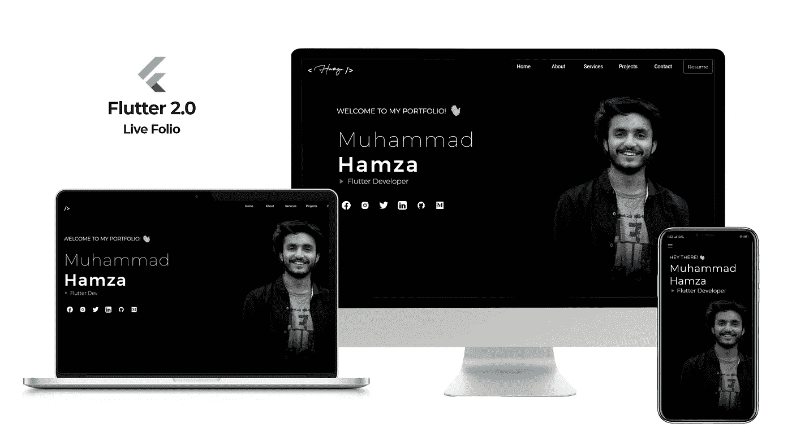

Folio —响应式实时投资组合

# 让我们开始吧…！！

> 在我们开始之前，web 应用程序在这里[已经上线](http://m-hamzashakeel.github.io/)，代码也在 [GitHub](https://github.com/m-hamzashakeel/Live-Portfolio-Flutter-for-Web) 开源，所以请随意使用或指出一些问题:)

如果你想跳到某一部分，我们将讨论以下内容:)

1.  **要求**
2.  **基础 App 理念**
3.  **项目结构**
4.  **mainSection.dart 文件**
5.  **主屏幕**
6.  **剩余 App**
7.  **导航栏**
8.  **使用 GitHub 页面托管**
9.  **结论**

# 1.要求

以下是该投资组合的必备包以及`flutter 2.0`

## [响应式 _ 建造商:^0.1.2](https://pub.dev/packages/responsive_builder)

这个包将帮助我们在**中使我们的应用对移动、平板和桌面做出响应。**可能有其他更好的方法让应用程序响应，但我用了这个:)

## [环球 _html: ^2.0.4](https://pub.dev/packages/universal_html)

这是一个`dart:html`库的替代品，因为它不能在移动应用程序中运行，这就是为什么我们将使用这个包，因为它将根据平台而行动。

## 可滚动 _ 定位 _ 列表:^0.1.10

为了在屏幕上滚动到特定的`widget`，我们将使用这个包。有其他方法可以做到这一点，但这个对我来说似乎很容易。

## 网址 _ 发射器:^6.0.2

你可能已经猜到了。耶！我们将使用它在我们的应用程序中打开`url`。

## 旋转木马 _ 滑块:^3.0.0

我将使用这个包制作一些移动视图的部分。是否使用这个由你决定:)

最后，很少有其他非常常见的包不需要介绍:

*   **谷歌字体:^2.0.0**
*   **动画 _ 文字 _ 工具包:^3.1.2**

# 2.基本应用理念

事情是这样的，克隆一个设计是小菜一碟，重要的是如何让它在这个过程中做出反应。因此，我们将为我们的每种屏幕尺寸**(手机、平板电脑和台式机)**制作屏幕，然后我们将这些屏幕传递给来自我们的包`**responsive_builder**` 的`**ScreenLayout()**` ，它将完成剩余的工作。有道理吗？！下面是演示😃

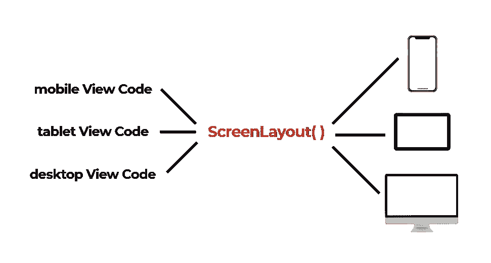

响应能力的基本应用理念

# 3.项目结构

这是我们将如何安排我们的文件。

> 请注意，我将把**代码**放在 **gists 或 images 中以节省时间**，因为在这里直接放几百行代码是没有意义的:)

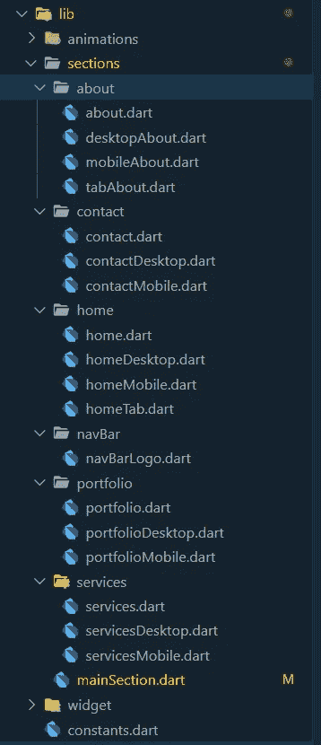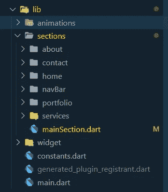

我已经为应用程序中的每个**部分**创建了**文件夹**，然后为其中的每个屏幕视图添加了`.dart`文件。

*   关于:这是“关于”部分，包含我自己、我的教育、我工作过的社区等信息。
*   **联系人:**它将保存联系信息，如电话号码和电子邮件地址。
*   首页:顶部包括我的照片，边上有几个`Text()`小工具，还有**所有社交媒体链接。**
*   导航栏:只在最上面登录
*   投资组合:它包含了我的项目/应用程序，展示了我的工作经验。
*   **服务:**我能做的事情，如应用程序开发、UI/UX、博客写作等。会在这里。
*   `mainSection.dart`是保存所有**部分、** **导航条**和**其他主要方法的主文件。**

这里**重要的是**是`**constant.dart**`文件。正如我在这个文件中提到的所有的`URLs`和`assets`，我们将在不同的文件中需要它们，所以我们可以把它们放在一个文件中，而不是重复所有的代码行。下面是 [**常量.镖**](https://gist.github.com/m-hamzashakeel/fd6401c6fc4473047250f5a4d388522e) **。**

# 4. [mainSection.dart](https://gist.github.com/m-hamzashakeel/a3ff70397e1270a99867b8d610b22e82) 文件

在我们进入其他部分之前。首先了解这个[**文件**](https://gist.github.com/m-hamzashakeel/a3ff70397e1270a99867b8d610b22e82) ，那么随着我们的项目结构现在的清晰我们将在这个文件中做以下事情:

*   a 中的所有部分`**ListView()**`
*   方法为`**scroll to widget**` 点击动作按钮时
*   导航条**动作按钮**
*   **标签**和**桌面**的导航条
*   **移动**的导航条

# 5.主屏幕

现在，我们将为`HomeScreen`实现**基本应用程序理念**，这将用于应用程序的其余部分，除了`NavBar`，在我的情况下有点不同。

因此，我们将在单独的文件中编写**移动、平板和桌面屏幕，然后从我们的包`**responsive_builder**`中将这些屏幕提供给我们的`**ScreenLayout()**`**

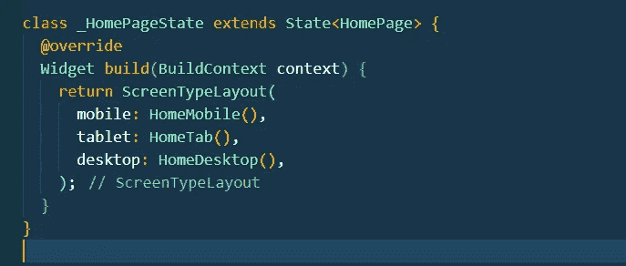

home.dart

*   [**home mobile . dart**](https://gist.github.com/m-hamzashakeel/4d00e70e21a67b50ceb28b1dccc6ee8a)**:**它相当简单，我们所需要的只是几个`**Text()**` 小部件与`**Row() Column() Stack()**` 和其他一些相关小部件的组合。

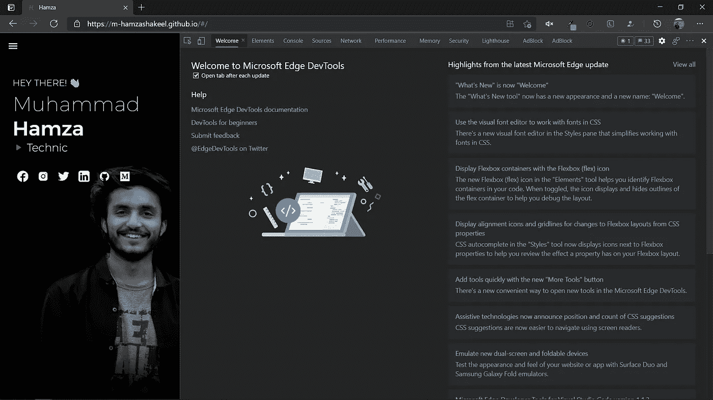

移动视图

*   [**homeTab.dart:**](https://gist.github.com/m-hamzashakeel/1e1124d266be48f98e35fc250b0d6320) 布局跟手机没太大区别，就那个**嘿！**已改为**欢迎来到我的作品集！**

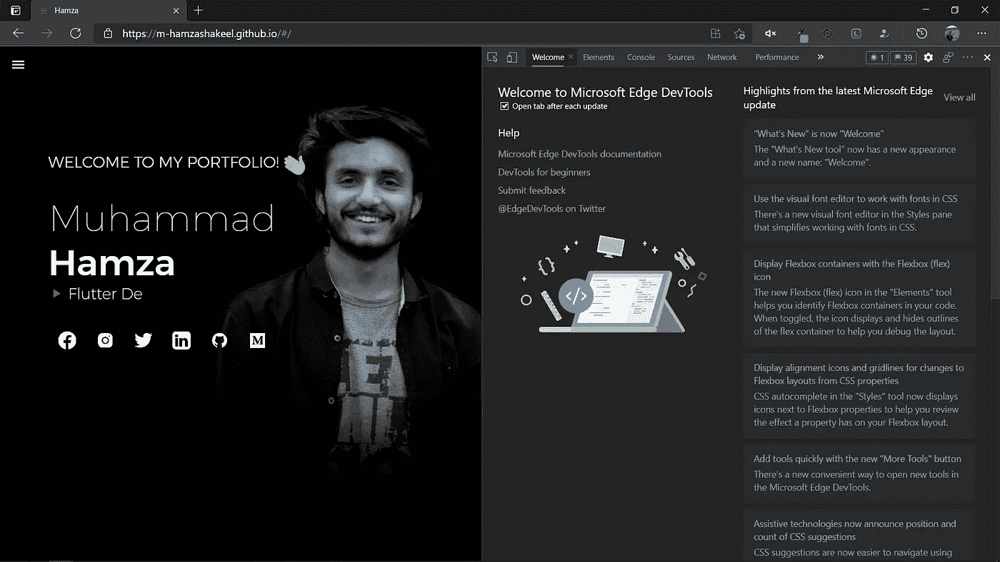

选项卡视图

*   [**home desktop . dart:**](https://gist.github.com/m-hamzashakeel/906a4c34e75b8948d1086d26455ffbe1)几乎类似于平板电脑视图只是为了响应速度**这里管理小工具的高度和宽度**😃-

桌面视图

# 6.剩余应用程序

与上面的`**HomeScreen**`完全类似，我们可以设计应用程序的所有其他部分，即**为**移动、标签和桌面**设计单独的**屏幕，然后将这些放在`**ScreenLayout**`中以管理响应。

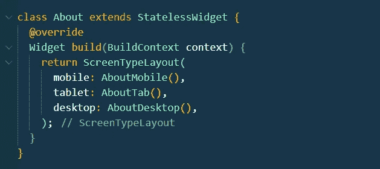

关于. dart

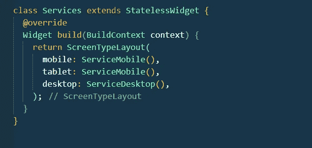

服务. dart

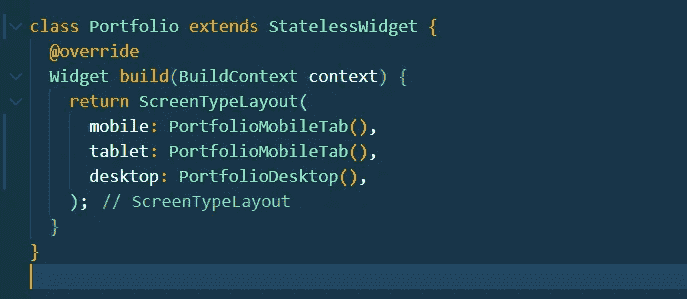

作品集. dart

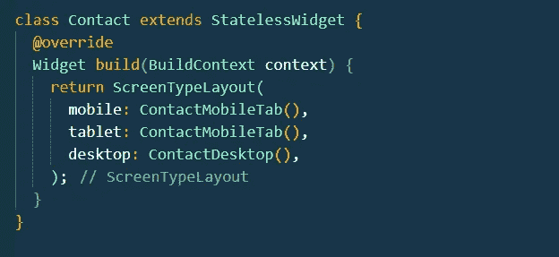

contact.dart

# 关于屏幕

我们为移动设备、平板电脑和台式机提供了独立的屏幕。

# 服务屏幕

对于服务，我们对移动设备和平板电脑使用了相同的布局，仅在宽度和高度上做了微小的改变，并对桌面视图进行了分离。

# 投资组合屏幕

与服务类似，移动和平板视图拥有共同的代码，桌面视图拥有自己独立的代码库。

# 接触屏

同样，这里的程序是相同的，即手机和平板电脑使用相同的代码库，而台式机使用不同的代码库。

> [**代码**](https://github.com/m-hamzashakeel/Live-Portfolio-Flutter-for-Web) 是开源的，所以不用担心:)

# 7.导航栏

再说说 navbar，这是 adobe XD 里的设计。

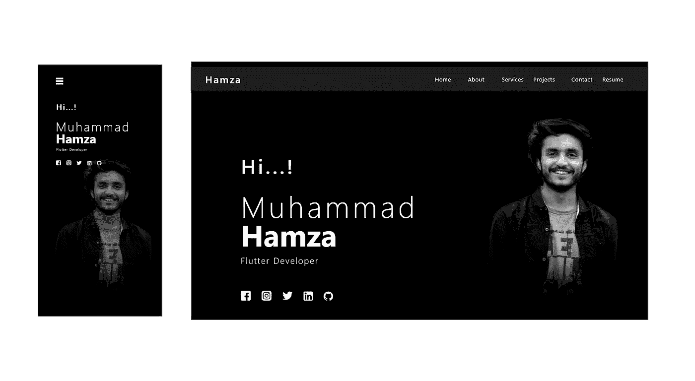

导航栏设计 Adobe XD

****导航条的实现在这里**有点不同。我没有使用`**ScreenLayout**`，但我使用了`**MediaQuery()**`来获得屏幕的大小，一旦屏幕宽度变得小于**760 像素**，我就将导航条从桌面切换到移动/标签，反之亦然。大多数情况下，导航栏上会有徽标和一些文本按钮。**

**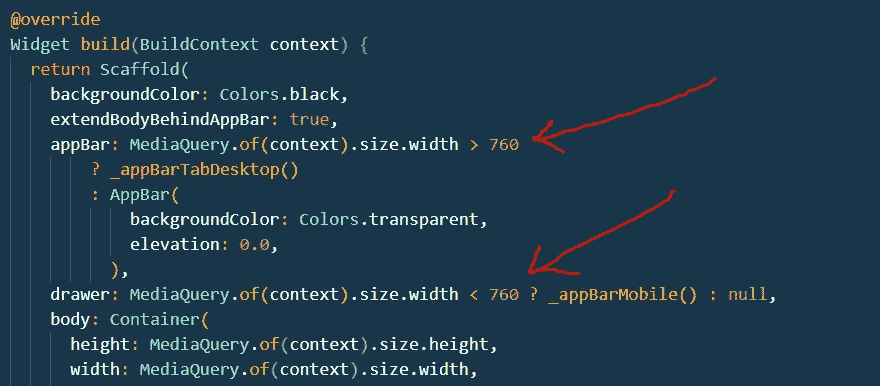**

> **L ogo 将放在 **appBar()** 的`*leading*` 属性中，所有按钮都将放在 **appBar()** 的`*actions*`属性中**

**现在，桌面和平板的 navbar 都差不多了；这就是为什么我不会为平板电脑编写单独的导航条。相反，我将在桌面和平板电脑上使用一个通用的导航条。对于手机，我们需要一个单独的，你可以在上面的设计中看到。**

**在 web 开发中使用**移动优先方法**我们需要首先为**移动视图设计屏幕。我们只需要一个抽屉的`Hamburger Menu Button`就够了！！😮****

**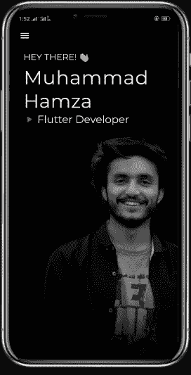**

**移动/平板电脑视图**

**对于台式机/平板电脑将需要像往常一样在左边的标志和所有的行动按钮在右边😃**

**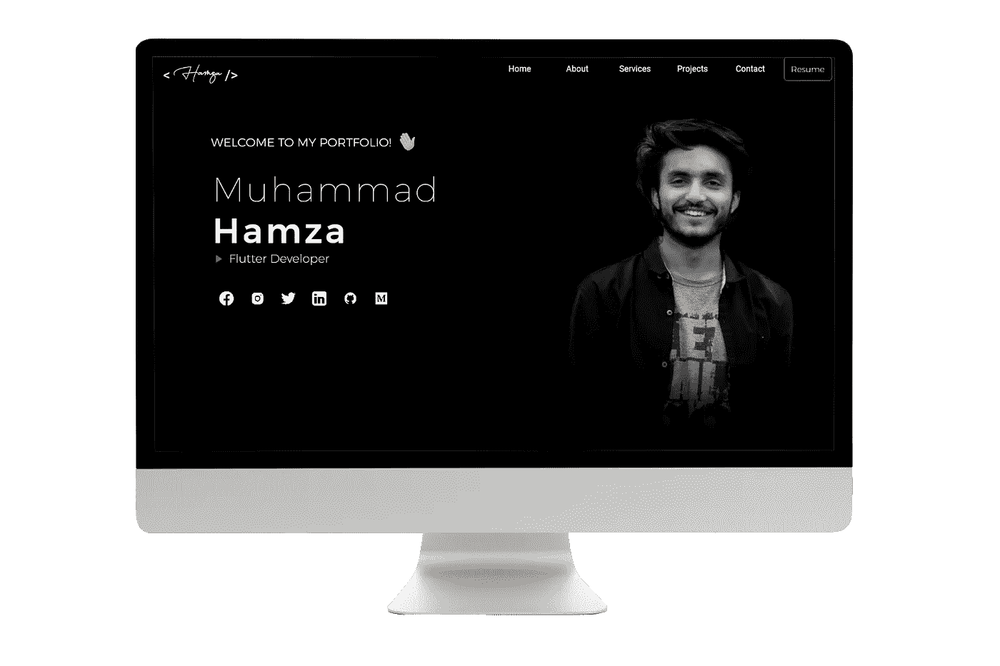**

**桌面视图**

**下面是 Navbar 手机和桌面版的 [**代码**](https://gist.github.com/m-hamzashakeel/df71af70e8c4cbcc3ebe322229970958) 。**

# **8.使用 GitHub 页面托管**

**GitHub Pages 是你可以免费托管网站的地方。你所需要做的就是遵循以下步骤:**

1.  **创建一个 GitHub 存储库，以您的`**githubUserName**` 结尾。`**github.io**` 例如:`**m-hamzashakeel.github.io**`**
2.  **接下来，将代码放入这个存储库中**
3.  **像这样访问网址【https://m-hamzashakeel.github.io/】然后嘣！！💥**

**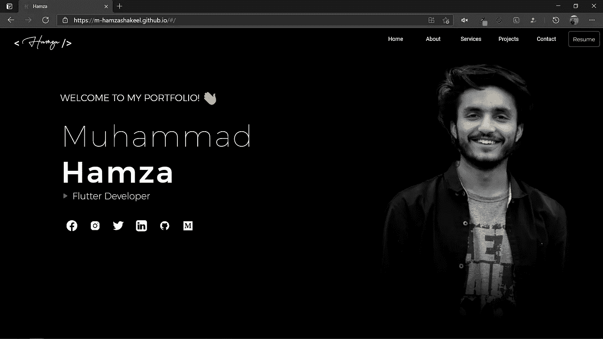**

> **如果代码没有激活，等待几分钟，有时会有延迟。**

# **9.结论**

**Phewww！！😅考虑到 Flutter 2.0，我没有遇到任何问题，因为我更新了它，尽管人们报告了一些问题。但是说实话，它真的非常适合在跨平台上开发性能强大的应用程序。**

**现在，我已经看到了很多评论*“颤振网络应用程序是不友好的搜索引擎优化”。*在我看来，我不太了解 SEO 是否友好，但让我们等待进一步的更新，就像 [Flutter](https://medium.com/u/2f6112f8ad9c?source=post_page-----86ae3e6cce4f--------------------------------) 团队正在进行更新，并提供如此棒的东西来处理 SEO 问题，希望能得到解决。**

**在那之前，键入`flutter upgrade`打开你的编辑器并开始编码…！！！💙**

> **万一你不知道，可以给 50 *👏对于中等大小的文章:)如果你喜欢这篇文章，请确保去掉最大数量:)***

# **谢谢大家和# HappyFluttering💙**