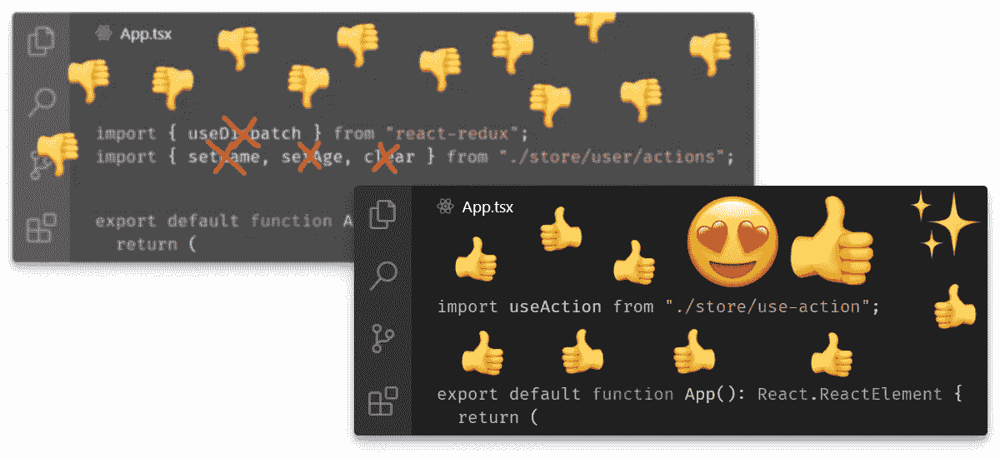
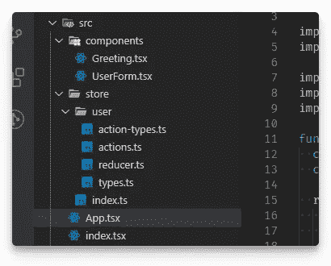
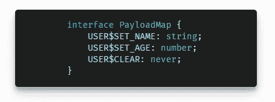
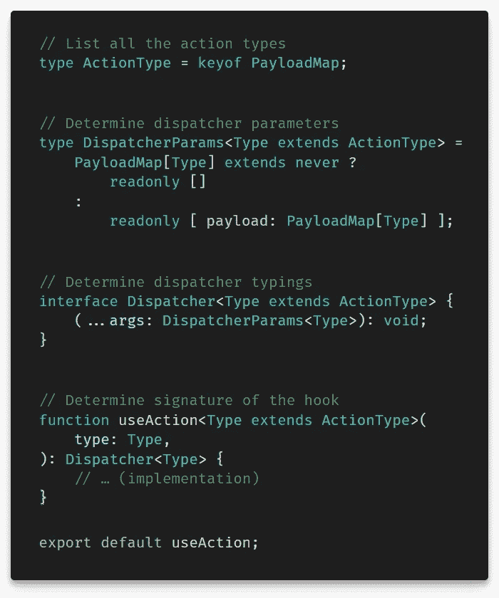
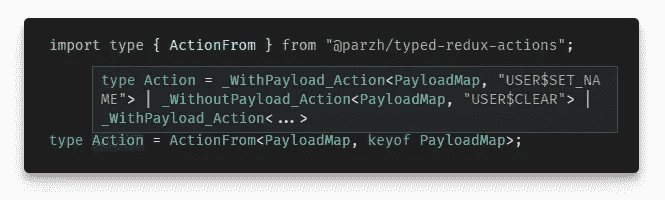

# 忘掉 Redux 样板文件吧——现在它只是一个小钩子

> 原文：<https://itnext.io/forget-about-redux-boilerplate-now-it-is-just-one-little-hook-bd95a7a44d6f?source=collection_archive---------3----------------------->



> 我试图尽可能减少 React 应用程序中的 Redux 设置，并成功做到了这一点。

如果你不喜欢自己开发的应用程序中的 Redux 设置，请对这一行进行评论。是你做的吗？我想是的。

Redux 在 React 开发人员中臭名昭著，因为它需要庞大、混乱的样板文件和大量无关的代码。虽然 [Flux 架构](https://facebook.github.io/flux/)的核心非常简单，其概念清晰易懂，但在实现时，无论是 Redux、Vuex 还是 NgRx，通常都不那么容易处理。

今天，我希望向您展示一种方法来处理繁琐的定义问题，以及在 React 应用程序中冗余使用 Redux 的问题。

# 工具

我们将使用一个示例 React 应用程序。首先，让我们概述一下将要用来构建它的工具:

*   **反应** 16.8+和**还原**4；
*   丹·阿布拉莫夫的**创建-反应-应用**，用于更快的设置；
*   **打字稿**(大粉丝！).

> TypeScript 是整个方法的重要部分。如果你不使用它，也不打算使用它，就此停止阅读，为自己节省时间。
> 
> 还有，不要太担心 TypeScript 版本。我在文章里用的是 v4.0，在回购里用的是 v3.9。差异非常小。

# 初始设置

本指南假设 React 应用程序和 Redux 流已经存在。如果您没有，我已经在一个示例存储库中介绍了这个步骤，只需克隆它并签出到分支`initial-setup`:

```
git clone \
  [https://github.com/parzhitsky/minimal-redux-example.git](https://github.com/parzhitsky/minimal-redux-example.git) \
  --branch initial-setupnpm clean-install
```

> 无论如何都要考虑克隆它，这样我们就平等了。



这是典型 React 应用程序中 Redux 的典型设置，存储通常位于`src/store/index.ts`中。一些现实世界的项目可能使用符号而不是字符串来标识操作；有些人选择枚举；有些人决定不在动作类型前面加上商店的名称。

不过，这些都不重要。实际上重要的是:

1.  代码不是[干](https://en.wikipedia.org/wiki/Don%27t_repeat_yourself)的，例如`Action`类型的联合需要不断的重复更新，否则会导致难以追踪的问题。
2.  每个动作类型和动作对象都被定义为一个完全独立的实体，例如，`ActionSetName`接口，尽管非常相似，却完全与`ActionClearName`分开定义。
3.  触发一个动作需要至少两个实体出现在作用域中:`dispatch`函数和专用的动作创建者函数。
4.  编译错误，如果有的话，显示得很好；总的来说，该设置按预期工作，提供了完全的类型安全。

毫无疑问，一个正常工作的应用程序是一件好事，但是也有扩展它、添加新功能、修复错误等等的意图。而且，尽管一些设计选择看似合理，但目前的设置在这方面做得并不多。

最终，这种设置有两个大问题:永远不完整的动作/类型/有效载荷等的定义。，以及所有这些的详细用法。

## (旁注)不，泛型没有用

> 如果你不知道泛型，[去读一读它们](https://www.typescriptlang.org/docs/handbook/generics.html#generic-types)，那会非常有帮助。

`Action`类型的联合显然是最差的，并且可能有将其重新定义为泛型的诱惑。虽然泛型非常有用(我们将在后面广泛使用它们)，但在这里它可能更像是一个快速而不实用的解决方案，而不是一个合适的解决方案。原因如下。

泛型需要参数。在我们的例子中，它们可能意味着给定动作的`type`和`payload`——这样每个特定的动作看起来就像`Action<"SET_NAME", string>`。

这里最大的问题是减速器。它希望第二个参数是所有的动作同时发生，就像现在这样。为此，`Action`泛型必须将其参数设置为*所有动作类型*和*所有有效载荷*。这可以通过两种方式实现:

*   指定所有已知的*类型和有效载荷——这将需要另外两个类型的联合，并且必须不断更新；*
*   允许*任何*类型和有效负载——这将 TypeScript 的类型检查的所有有用性抛到了脑后。

如果你已经克隆了我的库，检查一下`generics/no-type-checking`和`generics/too-verbose`分支，看看在代码中的实际效果，以及一些额外的注释。

```
git checkout generics/no-type-checking
```

# 行动与有效载荷的对应

当定义一个新的动作时，你如何知道它的`payload`属性的类型或者缺少它？你怎么知道`"SET_NAME"`动作带走了`string`的有效载荷，而`"RESET_STATE"`根本不带走任何有效载荷？

答案是动作到有效载荷的对应或动作到有效载荷的映射。有些动作只需要一些东西就能完成，而其他的动作是自洽的，不需要任何有效载荷。动作和它们的有效载荷之间存在单向的内在对应。作为一名开发人员，这允许您在需要时轻松地指定动作的有效负载类型。

但是，虽然人类可以很容易地弄清楚这一点，但计算机就不那么容易了，而且必须明确地告诉 TypeScript 编译器，一个函数需要一个`string`参数，而另一个函数不需要任何参数。如果有可能教 TypeScript 关于这个动作到有效载荷的对应关系，那么每个动作都将会预先隐含地知道它的所有类型。

谢天谢地，这是可能的。

可能有点不太习惯，这种映射可以使用 JavaScript 的 hashmaps 来完成，即普通的旧的常规对象；至于没有有效载荷的动作，按照惯例，使用`never`类型是明智的——稍后，将有逻辑来区分`never`和其他类型:



> 如此简单。

为了了解这是如何工作的，让我们暂时抛开定义，毕竟，设置的“使用”部分也需要注意。

# 一切都是单钩

概括地说，目前，要更新商店中的数据，需要获取`dispatch`函数，导入所有需要的动作创建者，创建动作对象，并在适当的时候“分派”它们:

这是一个巨大的概念开销。不管这意味着什么，动作被“分派”并不重要；不要紧，`dispatch`函数是`“react-redux”`模块的一部分，而不是`“redux”`；记住“动作”实际上指的是一个对象是无益的。

> 我们在不同的抽象层次上，ffs！

关于动作的重要事情应该是 a) *何时*调用它们，以及 b) *它们做什么*。这是多么简单的事情:

让我们试着逆向设计这段代码，让它正常工作。

## 实现挂钩

需要注意的要点是:

*   动作类型是硬编码的，不是导入的；
*   `useAction`取动作类型，返回函数；
*   `setName`接受一个参数(如第一个片段所示)；
*   操作对象是自动创建和调度的；
*   所有类型检查都按预期工作。

您可能能够在这里识别出一个[定制钩子](https://reactjs.org/docs/hooks-custom.html)——这正是它。前面代码片段中所有与 Redux 相关的复杂性都被提取到一个单独的函数中，该函数采用 React 挂钩的形式(一个函数，其名称以“use”开头)。

> 有人可能会说硬编码的值不好。对此我的回答是，在我们的情况下，他们不是。因为 TypeScript 最终将只传递有效值，所以这些值不需要也存在于 JavaScript 范围内。

上面的观察足以实现钩子(我们现在忽略最后一项)。它必须是一个 JavaScript 函数，有一个字符串(动作的类型)作为参数。在内部，它必须创建一个`dispatch`函数的实例，稍后会用到它。

钩子必须返回另一个函数，这个函数没有或者只有一个参数，这取决于动作类型；该参数被视为有效载荷。给定有效载荷，这个函数在被调用时，必须使用之前创建的`dispatch`函数创建并分派一个 action 对象，这部分工作要归功于[闭包](https://developer.mozilla.org/en-US/docs/Web/JavaScript/Closures)的概念。

> 请注意，这段代码远没有上面描述它的文本那么冗长。

就这样，钩子实现了，可以使用了。

然而，最后一项——类型安全——有点难，所以这个钩子暂时还没有完全类型化；这将在下一节中解决。

钩子的参考实现可以在`use-action/untyped`分支看到。

```
git checkout use-action/untyped
```

## 向挂钩添加类型安全

让我们回忆一下，上面的`PayloadMap`界面是什么样子的:


这是一个简明、简洁、组织有序的信息，允许轻松执行以下操作:

*   使用`keyof`操作符获得所有动作类型的并集；
*   使用 TypeScript 的[方括号运算符](https://developer.mozilla.org/en-US/docs/Web/JavaScript/Reference/Operators/Property_Accessors)的变体，获取给定动作的有效负载类型；
*   将动作类型与任意值分开；

此外，使用不同的实体，将有必要区分`never`和其他类型，正如所承诺的那样，首先找出有效载荷的存在或不存在。

下面的代码击中了一个好的、类型安全的钩子的所有要点:



指责[介质](https://medium.com/u/504c7870fdb6?source=post_page-----bd95a7a44d6f--------------------------------)造成了这种可怕的格式。为了使用更好的格式，我需要一个更宽的图像，但是由于像素错位，这里更宽的图像将会模糊和难看——对此我无能为力。

```
git checkout use-action/typed
```

# 处理减速器

设置改进的最后一部分是处理减速器。它仍然需要那个通用的`Action`类型——而这个类型还不存在。

其实这部分是最难的。我决定制作一个名为 `[@parzh/typed-redux-actions](https://www.npmjs.com/package/@parzh/typed-redux-actions)`的 [npm 模块，将流程中最繁琐的部分委托给第三方。](https://www.npmjs.com/package/@parzh/typed-redux-actions)

```
npm i @parzh/typed-redux-actions
```

> 这不是广告。不要害怕。如果我的包被下载，我不会从 npm 或其他任何人那里得到任何利润。如果你不想让我的名字出现在你的`*package.json*`里，那就直接从回购里偷代码[，说真的。对我来说不会太好，但我不介意，我保证。](https://github.com/parzh/typed-redux-actions)

这个模块导出三样东西，但是作业只需要其中之一`ActionFrom`。有了这种类型，创造`Action`简直易如反掌:

```
type Action = ActionFrom<PayloadMap, keyof PayloadMap>;
```

`ActionFrom`的第一个类型参数显然是有效载荷图。第二个参数指定给定动作的类型；它必须是有效载荷映射的键的子集。

然而，正如代码片段所示，所提供的类型不仅仅是一个子集，它是有效负载映射的所有键的集合。因此*,*`*Action*`*类型一次包括所有动作的* `*type*` *和* `*payload*` *，好处是保留了它们之间的正确映射。*现在只是给参数分配类型的问题，如`action: Action`所示。



这就是如何制作类型安全的缩减器。分支`proper-action-type`显示了这种方法的实现。

```
git checkout proper-action-type
```

# 结论

Redux 的设置并不复杂。今天，我们讨论了一种简化 it 并减少多余/样板代码的方法。你可以在`master`分支观察小林挺后的完整结果。

非常感谢您，并为阅读全文赢得+50 kudos！❤❤❤


我希望，这是一次有趣的旅程，充满了丰富的思想和有益的建议。如果是的话，要知道这是我最看重的东西——不要犹豫，留下尽可能多的掌声来表达你对我的支持和感谢。此外，如果你觉得我肯定应该写更多，请在*parzhitsky@gmail.com*给我留言——毕竟，你和我可以一起合作，让我们不要错过机会。

与此同时，请看看我以前的文章，在这篇文章中，我试图揭开正则表达式的神秘面纱，使它们成为通用的日常开发工具:

[](/regular-expressions-1580bbb26319) [## 正则表达式

### 比你想象的要容易得多！

itnext.io](/regular-expressions-1580bbb26319)