# 表单可访问性:实用指南

> 原文：<https://itnext.io/form-accessibility-a-practical-guide-4062b7e2dd14?source=collection_archive---------1----------------------->

如何使表单具有可访问性？

Artem Sapegin 在 [Unsplash](https://unsplash.com/search/photos/internet-subscription?utm_source=unsplash&utm_medium=referral&utm_content=creditCopyText) 上拍摄的照片

表单是 web 上的重要元素。对于按钮，它们是允许与用户交互的主要元素。

像网络上的一切一样，我们必须确保每个用户都可以与他们互动，包括残疾人。

让我们看看如何做到这一点。

# TL；速度三角形定位法(dead reckoning)

1.  [语义](#68d1):为正确的目的使用正确的 HTML 元素。
2.  [导航](#2f6a):保证自然的浏览器导航顺序，避免花哨的 CSS 放置。不要试图和 tabindex 玩。
3.  [输入状态](#76be):不要依赖 javascript 和 CSS 来设置输入状态(禁用，必需，…)，使用 HTML 属性。
4.  [标签](#ecfb):为每个输入添加一个清晰的关联标签。避免将占位符和标题作为唯一的标签。
5.  [描述](#67f2):如果需要，添加相关描述。比起冗长的细节解释，我更喜欢例子。
6.  [错误](#48c1):将错误与输入相关联。比起冗长的细节解释，更喜欢例子和建议。使用正确的 aria-live 级别来通知屏幕阅读器。帮助用户识别有错误的输入。

# 无障碍原则

在深入研究代码和技术之前，让我们先快速回顾一下可访问性的含义。有 4 个原则:

1.  **👀可感知的**:所有有意义的信息必须对每个人都可用。例如，对于色盲或盲人来说，这可能是一个挑战。
2.  **💻可操作**:可以执行每个功能中的每个动作，包括导航、查找内容和交互。对于不能使用鼠标或键盘等控件的人来说，这可能是一个挑战。
3.  **💡可理解的**:信息是可读的，可理解的，例如通过用户指导，内容以可预测的方式出现和操作。
4.  💪健壮:它必须兼容当前和未来的用户工具，如屏幕阅读器。

# 稳健性

让我们从最后一点开始，因为这将有助于我们检查之前的所有内容。

检查信息是否可访问的最佳方式是通过屏幕阅读器。主要平台都有免费的屏幕阅读器可用:MacOS (VoiceOver)，Windows ( [NVDA](https://www.nvaccess.org/) ，…)，Linux ( [Orca](https://wiki.gnome.org/Projects/Orca) ，…)。

但是我们可以通过浏览器 devtools 访问屏幕阅读器会告诉我们的很多信息。例如，在 Chrome 上

1.  打开 Chrome DevTools 并检查一个元素。
2.  单击 HTML 元素树下的“可访问性”选项卡。您将可以访问可访问性树，以及屏幕阅读器将获得的信息列表。

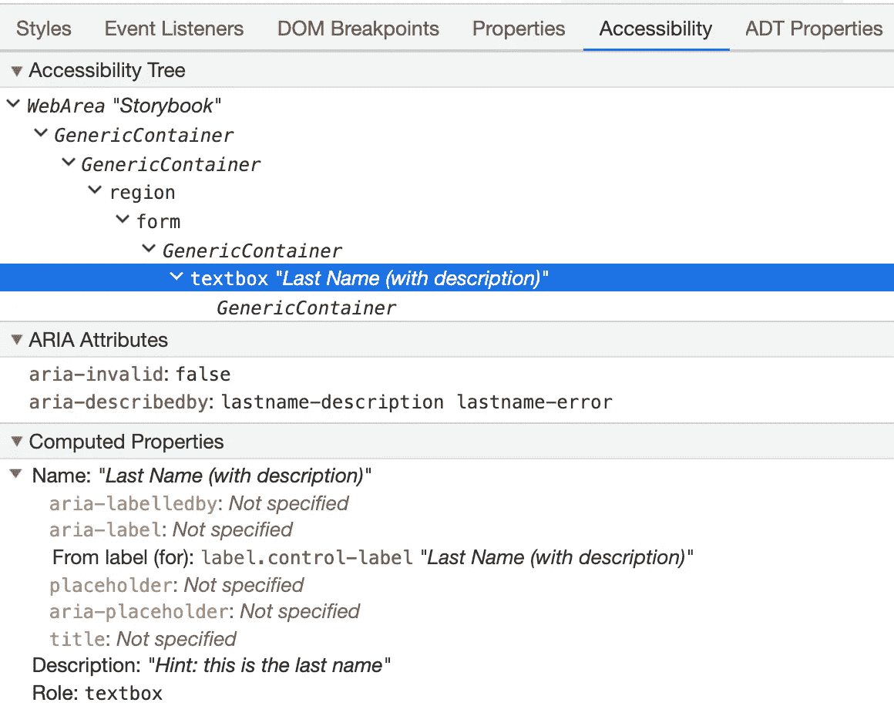

Chrome DevTools 可访问性选项卡内容:可访问性树、aria 属性、计算属性

# 1.语义的

**👀** *可感知，* **💻** *可操作，* **💡** *可以理解*

网页可访问性的第一步是遵循 HTML 语义。有 [119 个 HTML 元素](https://developer.mozilla.org/en-US/docs/Web/HTML/Element)，每一个都定义了一个特定的目的或结构。

使用正确的标签而不是一大堆 div 和 spans 有什么好处？

屏幕阅读器会给出关于你使用的元素的信息。对于一个 *<按钮>* ，它会宣布这是一个按钮，所以用户知道这个元素可以被按下。对于 *<表格>* 和所有相关的表格元素，屏幕阅读器将引导用户，在用户浏览数据时告知行号/列号，并允许行/单元格导航。

这适用于一切:列表( *ol/ul* )、定义列表( *dl* )、输入、…

你可以用一种可访问的方式实现一个带有 div 的按钮，传递一个 *role="button"* 。但是你会错过很多功能:启用焦点，点击/回车/空格激活，…这需要更多的工作来实现，虽然你可以只使用一个所有浏览器都支持的 *<按钮>* 。

> 不要试图重新实现元素行为，只需使用元素

表单呢？

使用 Javascript 时，很容易添加输入，收集用户类型的值，并通过按钮 *onClick* 监听器执行操作。

形式语义错误的例子

但这样做，你打破了语义。让我们看看如何使表单在语义上正确:

*   用一个 *<表单>* HTML 标签包装表单。

表单 HTML 元素

*   通过表单元素 *onSubmit* listener 而不是按钮 *onClick* listener 执行自定义 Javascript 提交动作。顺便说一下，使用带有*类型=提交*属性的按钮。这些将通过公共输入手势(例如，在文本输入元素上按 ENTER 键)实现提交。

启用通用提交手势

*   标签使用 *<标签>* HTML 标签。

标签 HTML 元素

*   使用 *< fieldset >* HTML 标签对输入进行分组。在每个字段集上提供一个 *<图例>* 。这允许屏幕阅读器宣布一个带有图例的组，让用户选择进入或跳过它。

字段集 HTML 元素

有了正确的 HTML 语义，你已经涵盖了很大一部分*可感知**可操作**可理解*的原则。

# 2.航行

**💻** *可操作，* **💡** *可以理解*

浏览器遵循 DOM 元素的顺序来确定默认的焦点顺序。您可以使用 [*tabindex*](https://www.w3schools.com/tags/att_tabindex.asp) 属性改变焦点，但是大多数时候，它引入的问题比解决方案更多。

> 尽可能避免使用 tabindex！

不要试图用输入做花哨的放置，通过 css 改变视觉顺序。焦点顺序将以非自然顺序意外跳转。

通过 css 放置在顶部的提交按钮

在上面的例子中，使用键盘导航，用户将首先关注按钮，即使它在视觉上位于底部。这是不自然的，没有预期的效果。

# 3.输入状态

👀*可感知的*

输入具有状态:

*   **只读**:不可编辑，提交表单时发送。
*   **禁用**:不可编辑，提交表单时不发送。
*   **必输项**:必输项，不设置该值表单不会提交。
*   **无效**:当前值有错误。

这些信息需要由屏幕阅读器来解释。让我们以*要求的*为例。开发人员可以在标签中添加一个小星号(*)作为提示。但是让我们看看屏幕阅读器将通过 chrome devtool 的 accessibility 选项卡获得什么信息。

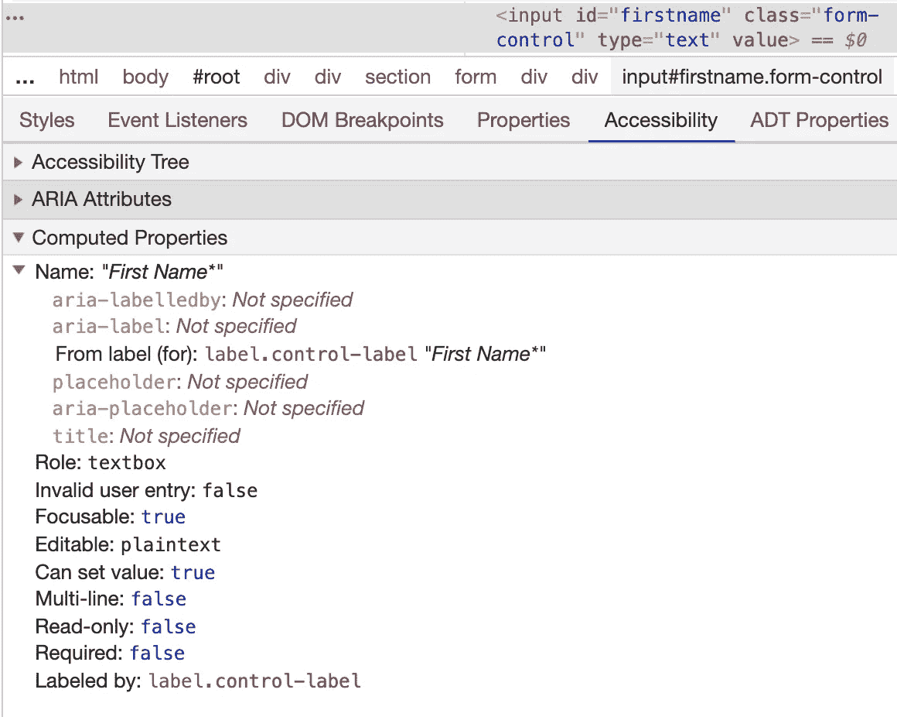

输入辅助功能属性，标签为星号(*)，但“必需”属性为假

注意标签上的星号(*)，但是 r*required*属性被设置为 false。

让我们看看如何解决这个问题。

*   **readonly** :设置 *readonly* 或 *aria-readonly* 属性，
*   **禁用**:设置*禁用*或*aria-禁用*属性，
*   **必需**:设置*必需*或*咏叹调必需*属性，
*   **无效**:当输入有错误时，设置 *aria-invalid* 属性。

让我们将*必需的*属性添加为 true，并检查 accessibility 属性是否为 true。

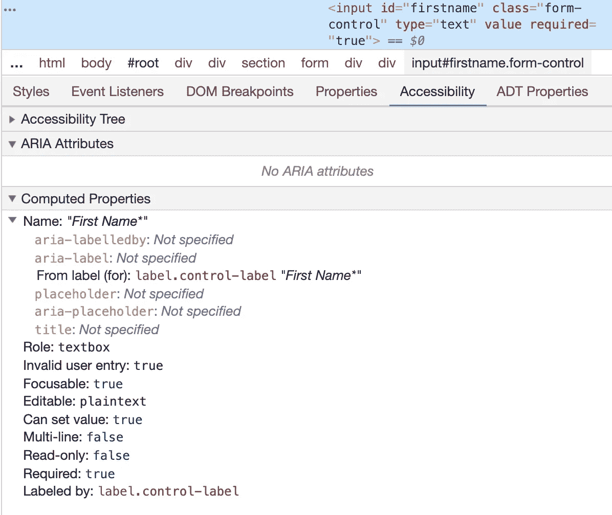

对于“必需”属性，可访问性“必需”属性为真

**应该用 required 还是 aria-required？**

既然屏幕阅读器支持 HTML5，你就不需要 *aria-required* 。但是，如果您需要支持旧的屏幕阅读器，或者如果您开发自己的自定义控件，您可以添加 aria 属性来为屏幕阅读器提供信息，因为它本身并不支持您的控件。

答案是相同的只读，禁用，…

> 对于本机输入，使用“required”而不是“aria-required”。Aria-required 对于自定义控件很有用。

# 4.标签

💡*可以理解*

语义之后，这是最重要的部分。每个输入都必须有一个关联的标签。没有它，屏幕阅读器只能告诉用户当前元素是…一个输入。没有关于用户应该在其中设置什么的指示。相关标签的缺失是一个完全的功能障碍。

让我们用一个例子来说明。

标签没有关联

这似乎是对的，我们甚至对所有东西都使用了正确的语义:表单、输入、按钮、标签。但是让我们看看 chrome devtool 的 accessibility 标签在输入上给了我们什么。

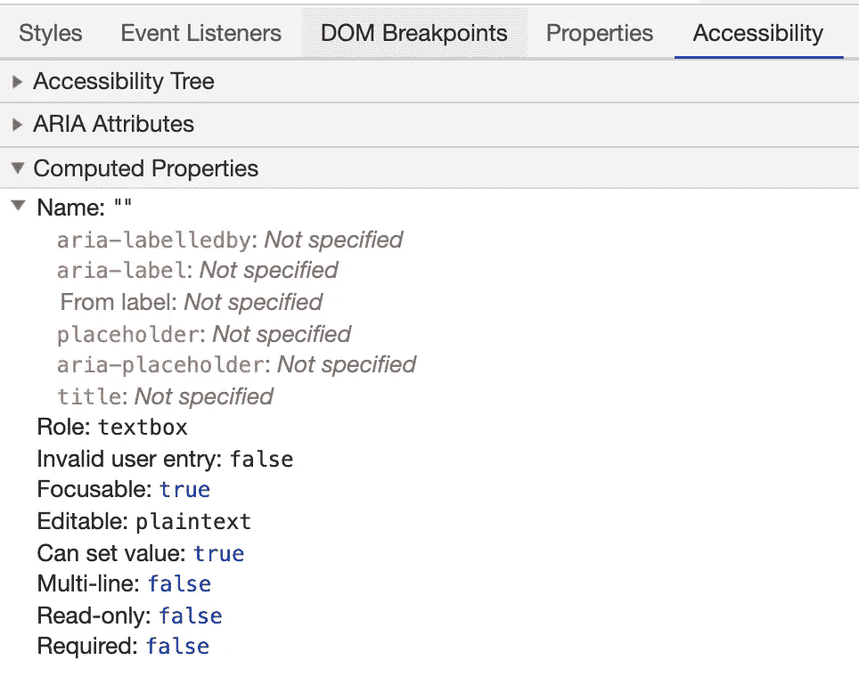

输入中没有计算名称

看看 devtool 是如何显示没有计算出的名称的，即使输入旁边有一个标签。这是因为**标签与输入**没有关联。

为了了解如何解决这个问题，让我们关注 chrome devtool 可访问性标签的*名称*部分。

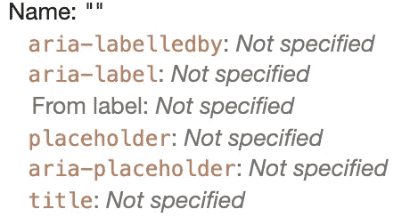

Chrome devtool 辅助功能标签

屏幕阅读器将获取第一个关联标签，按以下顺序获取:

*   **aria-labelledby** :输入中的属性，用于引用包含标签的 DOM 中另一个元素的 id，
*   **aria-label** :输入上的属性，属性值是标签、
*   **来自标签**:表示多个工艺关联一个标签。最常见的是用于属性的 HTML *(见下面的例子)，*
*   **占位符**:输入上的属性，属性值会作为提示显示在输入中，当它没有值时，
*   **aria-placeholder** :同上，但不在输入中打印，仅用于辅助技术。
*   **标题**:输入的属性，鼠标经过时，属性值会显示在工具提示中。

添加关联标签的每种方法的代码示例

我们应该用什么？

他们都使用屏幕阅读器。但其中一些不应该作为唯一的标签，影响没有屏幕阅读器的用户体验。

*   aria-label/aria-placeholder :这个不会显示任何标签，所以不使用辅助技术的用户不会有任何标签。这种技术应该和印刷标签一起使用。
*   **占位符**:这样会产生不好的用户体验。当占位符为空时，它将被打印在输入中，但是当用户在其中键入时，它将消失。对于提供的输入值，没有指示输入代表什么。
*   **标题**:这将添加一个标签作为工具提示，但是直到用户将鼠标放在输入上它才可见。

> 首选标签形式的包裹标签作为标签技术。

标签-例如

我们应该把标签放在哪里？

不要做花哨的放置，用户习惯看到标签在**输入顶端或左侧**。

除单选按钮和复选框外，标签应放置在右侧**。**

**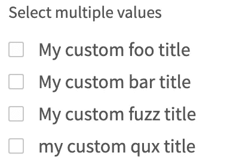**

**标签在右侧的复选框**

**这使得放置是可预测的，并且用户不会感到惊讶。**

****我们应该将什么设置为标签文本？****

**标签必须清晰，因为它的目的是指导用户。您应该在标签的末尾通过星号(*)或“*(必填)”*包含“必填”指示符。**

**有时，它应该包括比字段名更多的信息。让我们看一个例子。您会在这个输入中键入什么？**

**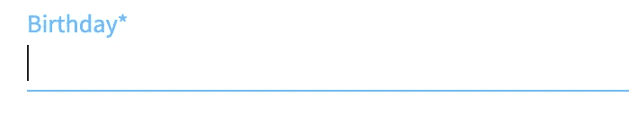**

**只有“生日”作为标签的生日输入**

**这不清楚你应该使用什么日期格式，对不对？当格式不清楚时，提供更多信息或示例。标签的目标之一是避免可能的用户输入错误。**

**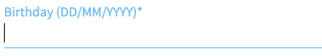**

**标签中带有所需格式 DD/MM/YYYY 的生日输入**

> **对用户的引导越多，产生的错误就越少，用户体验就越好。**

**然而，标签应该是短的。如果你需要提供更长的信息，最好是描述。**

# **5.描述**

**💡*可以理解***

**如果你需要提供更长的指示，那么对于这些信息，最好使用描述而不是标签。像标签一样，它必须与输入相关联，所以当用户聚焦于输入时，屏幕阅读器将读取它。**

**为此，请使用 *aria-describedby* 属性。**

**带有相关描述的输入**

**如果描述太长或太复杂，提供一个例子。对人脑来说，处理一个例子并加以应用要比阅读和理解解释容易得多。**

****

**长篇大论 vs 举例**

> **比起冗长的技术描述，更喜欢清晰的例子**

# **6.错误**

****👀** *可感知，* **💻** *可操作，* **💡** *可以理解***

**即使您提供了良好的关联标签和描述，您仍然必须处理输入错误。主要有 3 种显示误差的技术:**

*   **错误对话框**
*   **错误区域**
*   **线内误差**

**让我们来看看每种方法的优缺点，以及如何以一种容易理解的方式实现它们。**

## ****错误对话框****

**这项技术显示了提交时的所有表单错误。它们出现在对话框中。**

**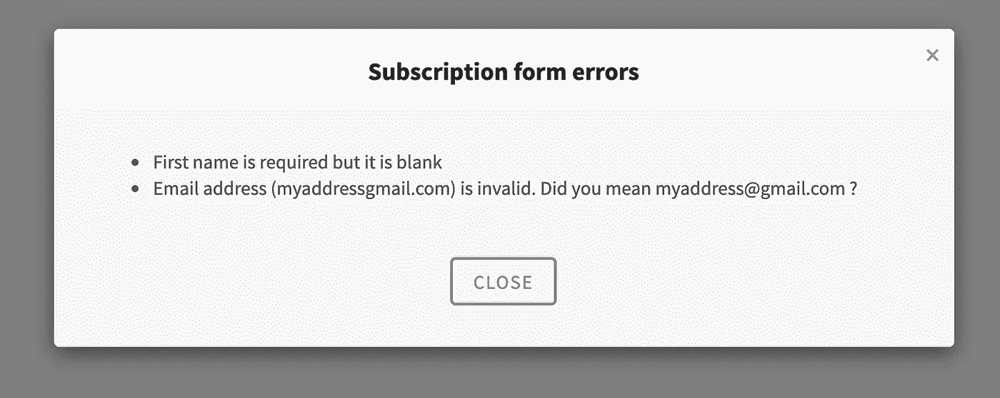**

**错误对话框示例**

**请记住，这有一个很大的缺点:在对话框关闭时，错误会消失。用户返回到没有错误细节的表单，直到下一次提交。**

**如果您仍然决定使用此解决方案，要使其可访问，您需要:**

*   **使对话框可访问:添加一个关联的标题，焦点应该只限于对话框内容。对话框关闭时，焦点被设置回触发对话框的元素。**

**通过 aria-labelledby 与标题关联的对话框 div**

*   **在对话框中添加一个*角色="alertdialog"* 。这将自动将咏叹调现场片段设定为*断言*。Aria live 区域通常设置有属性 *aria-live* 。该属性可以取 3 个值: *off* (屏幕阅读器不会通知任何更改，*礼貌*(会在用户空闲时间通知更改)， *assertive* (会中断用户流来通知任何更改)。因此，无论用户在提交后做什么，屏幕阅读器都会在错误对话框出现时读取它的内容。**

**具有 alertdialog 角色的对话框 div**

## **错误区域**

**这种技术在位于表单顶部的 div 中显示所有错误。它有助于在一个地方有一个表单错误的摘要，并提供一个导航入口点，允许跳转到错误的输入。**

**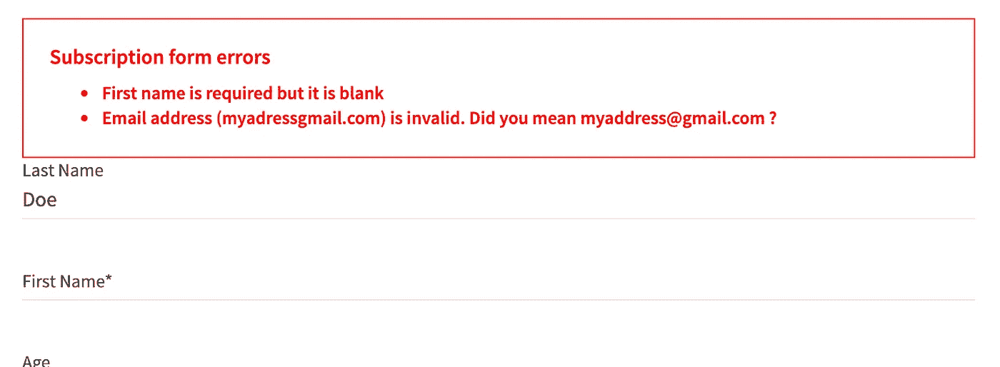**

**错误区域示例**

**要使其可访问:**

*   **创建 div。在表单提交时，它应该自动聚焦，或者它的活动区域应该设置为 *assertive* 以帮助屏幕阅读器轻松定位。**

**误差区域可编程聚焦**

*   **为了帮助用户导航，提供直接跳转到相关字段的链接**

**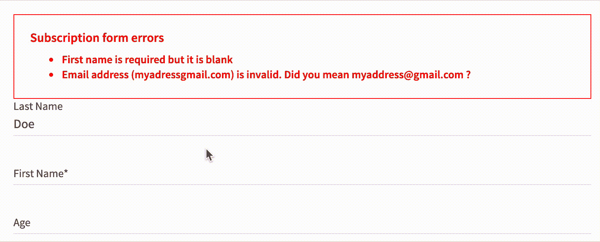**

**错误描述是到相关输入的链接**

**在错误描述周围使用锚标记**

## **线内误差**

**这种技术在输入旁边显示错误。这是在没有表单提交的情况下动态验证输入时使用的方法。(但是您仍然可以在表单提交验证中使用这种技术)。这种技术的优点是可以直接在表单中定位错误字段。**

**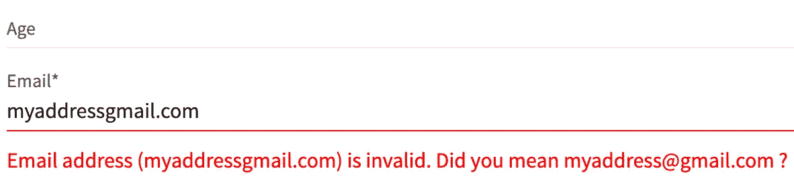**

**带有内联错误的无效输入示例**

**让它变得容易接近**

*   **像标签和描述一样，错误消息需要与输入相关联。我们可以使用 *aria-describedby* 属性。它接受多个 id，因此您可以通过该属性将描述和错误关联起来。**

**通过 aria 描述的相关错误**

*   **你可以通过关注错误的输入来引导用户。但是要小心，对于表单提交的验证，关注第一个错误输入是很好的，但是对于用户类型的实时验证，或者输入模糊，自动关注输入可能会很棘手。你必须确保没有焦点陷阱，用户必须能够关注输入。**

## **错误消息**

**错误消息必须足够清晰，以便用户能够快速理解和修复错误。**

**对于对已定义值列表有约束的字段，如果错误不太长，它应该显示可能的值。这允许用户直接选择一个正确的值。**

**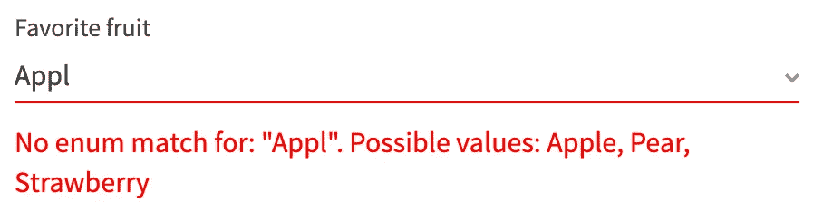**

**错误消息中的可能值**

**当您对值格式有约束时，请提供一个示例，而不是解释格式。**

**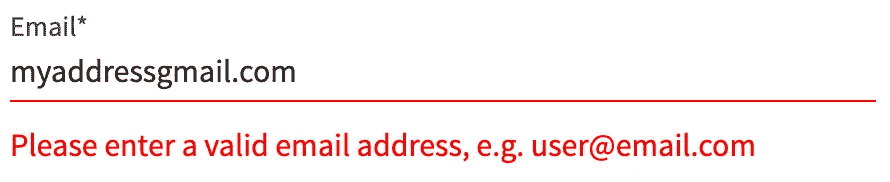**

**错误消息中的示例**

**对于前两种情况，更好的方法是根据无效值建议一个有效值。这种技术很难建立，但是在用户体验方面是指导用户的最好方法。**

**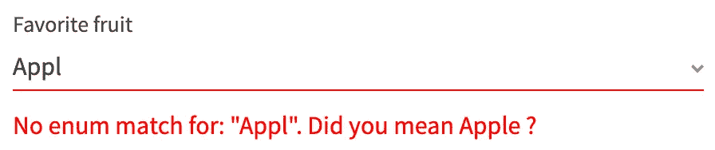**

**枚举中的正确值建议**

****

**更正受限格式字段中的值建议**

> **基于无效价值的有效价值建议是在用户体验方面引导用户的最佳方式。**

# **结论**

**在 web 开发中，HTML 语义很重要。这是开始使一个功能具有可访问性的基础。但是形式特别难，语义不够充分。**

**表单是一个复杂的元素，管理着大量的信息，我们必须确保一切都是清晰的，并且链接到正确的元素。**

**遵循这个指南可以使您的表单得到屏幕阅读器的完全支持，并确保每个用户，无论是否有残疾，都有良好的用户体验。**

# **谢谢你**

**非常感谢[杨奇煜·拉西尼耶](https://twitter.com/frassinier)、[尼古拉斯·马林](https://twitter.com/nicomaligne)和[塞巴斯蒂安·勒·穆伊尔](https://www.linkedin.com/in/sebastienlemouillour/)的校对工作！**

# **参考**

*   **[MDN HTML 元素引用](https://developer.mozilla.org/en-US/docs/Web/HTML/Element)**
*   **[WCAG 2.1 —输入辅助](https://www.w3.org/TR/WCAG21/#input-assistance)**

# **关于我**

**我是前端建筑师@Talend。我参与的是[故事书](https://github.com/storybookjs/storybook)，是 [a11y 插件](https://github.com/storybookjs/storybook/tree/next/addons/a11y)，是[设计系统](https://github.com/storybookjs/design-system)。**

**在 [twitter](https://twitter.com/jsomsanith) 上关注我，以获得关于 React 和可访问性的未来文章的通知:**

*   **[这到底是在反应什么？🥁🥁(Suspense) 🥁🥁](https://medium.com/@jimmy.somsanith/what-the-heck-is-this-in-react-suspense-c5e641e487a)**