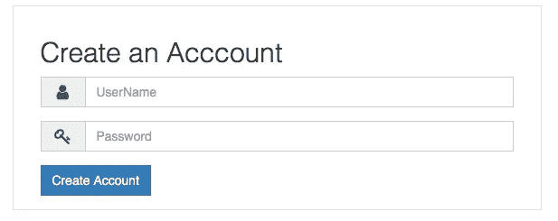
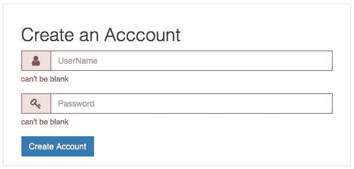

# Ruby On Rails 中带有错误消息的表单验证

> 原文：<https://itnext.io/form-validation-with-error-messages-in-ruby-on-rails-cec36ba3daa9?source=collection_archive---------0----------------------->


Cendrine Marrouat 在 [Unsplash](https://unsplash.com/search/photos/warning?utm_source=unsplash&utm_medium=referral&utm_content=creditCopyText) 拍摄的照片

> [点击这里在 LinkedIn 上分享这篇文章](https://www.linkedin.com/cws/share?url=https%3A%2F%2Fitnext.io%2Fform-validation-with-error-messages-in-ruby-on-rails-cec36ba3daa9%3Futm_source%3Dmedium_sharelink%26utm_medium%3Dsocial%26utm_campaign%3Dbuffer)

验证用于确保只将有效数据保存到数据库中。例如，对于您的应用程序来说，确保每个用户都提供有效的电子邮件地址、邮寄地址和其他详细信息可能很重要。

模型级验证是确保只将有效数据保存到数据库中的最佳方式。它们与数据库无关，不能被最终用户绕过，并且便于测试和维护。Rails 使它们易于使用，为常见需求提供了内置的助手，并允许您创建自己的验证方法。

在本文中，我们将讨论以下几点。

1.  模型级验证
2.  显示 Ruby on Rails 表单验证错误消息

这里我们开始，
首先，在你的/app/helpers/form_helper.rb 中创建一个助手类

```
module FormHelper
    def errors_for(form, field)
        content_tag(:p, form.object.errors[field].try(:first), class: 'help-block')
    end

    def form_group_for(form, field, opts={}, &block)
        label = opts.fetch(:label) { true }
        has_errors = form.object.errors[field].present?

        content_tag :div, class: "form-group #{'has-error' if has_errors}" do
            concat form.label(field, class: 'control-label') if label
            concat capture(&block)
            concat errors_for(form, field)
        end
    end
end
```

很好，现在转到您的/app/views/文件夹。
在我的例子中，路径是/app/views/accounts，我的页面存在于哪里。

```
<% def msg(status) return "#{status}" end %>
<div class="col-md-6 col-md-offset-3 panel panel-default">
  <div class="panel-body">
    <h2>Create an Acccount</h2>
    <%= form_for @account do |f| %>
      <%= form_group_for f, :username, label: false  do %>
        <div class="input-group">
          <span class="input-group-addon"><span class="fa fa-user fa-lg fa-fw"></span></span>
          <%= f.text_field :username, class: 'form-control', placeholder: 'UserName' %>
        </div>
      <% end %>                  
      <%= form_group_for f, :password, label: false  do %>
        <div class="input-group">
          <span class="input-group-addon"><span class="fa fa-key fa-lg fa-fw"></span></span>
          <%= f.password_field :password, class: 'form-control', placeholder: 'Password' %>
        </div>
      <% end %>
      <%= f.submit("Create Account", class:"btn btn-primary", data: {:confirm => msg('Do you want to create account?'), :disable_with => 'Creating'}) %>
    <% end %>
  </div>    
</div>
```

在上面的代码中，我们使用了" form_group_for "方法，

```
<%= form_group_for o, :password, label: false do %>
<% end %>
```

这里，f 是表单对象。:password 是您的数据库列名。

标签:假意味着，如果你想显示标题，然后设置为真，否则将不显示标题。

例子，



然后在点击创建帐户按钮后，



您可以在您的模型中定制您的错误消息。
例如，

```
validates_presence_of   :username, :message => 'Please Enter User  Name.'
    validates_presence_of   :password, :message => 'Please Enter Your Password.'
```

享受编码。


**感谢&的问候，
Alok Rawat**

*原载于*[*qiita.com*](https://qiita.com/alokrawat050/items/dc7f4a7ee1acdc6a449a)*。*