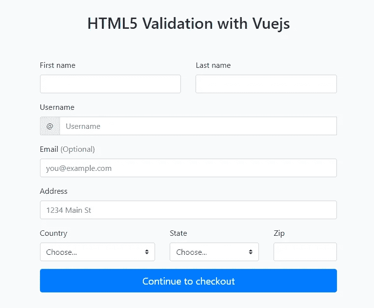
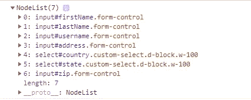
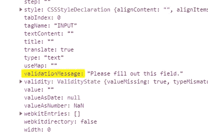

# 用 HTML 和 Vuejs 进行表单验证

> 原文：<https://itnext.io/form-validation-with-html-vuejs-54ec18e473aa?source=collection_archive---------0----------------------->

他们说大多数 web 应用程序只是 HTML 表单。好吧，表单需要验证，谢天谢地，HTML5 自带了很多很棒的内置表单验证功能，比如电子邮件、数字、最大值、最小值等等。您甚至可以用**模式**编写自己的验证规则。在本文中，我将讨论如何利用 HTML5 验证，同时覆盖无聊的默认设置，这样就可以随心所欲地显示验证错误。我将与 [**Vuejs**](https://vuejs.org/) 一起工作，但即使你不使用 Vue，你也可以随时跟上。

让我们从 [bootstrap examples](https://getbootstrap.com/docs/4.0/examples/checkout/) 中的 Checkout 表单的修改版本开始，这样我们就不必太担心样式了。你可以在这里克隆启动器。设置应该如下所示:

使用 Vuejs Starter 进行 HTML 验证

默认的 HTML5 验证不会一次显示所有的表单错误。具有讽刺意味的是，一旦用户提交，浏览器实际上知道所有的无效字段，所以现在我们要做的就是检查它们，然后按照我们喜欢的方式显示。

现在让我们向表单添加一个 id 和一个使用 Vuejs 捕获提交事件的监听器。

将事件侦听器添加到表单提交中

然后在我们的 **form-validation.js** 文件中，我们将初始化 Vuejs 并创建处理表单提交和验证的方法。

这里我们创建了两个方法 **submitForm** 和 **validateForm。submitForm** 调用 **validateForm** ，如果满足所有的验证规则，那么 validateForm 将返回 true。现在，我们只是控制台记录所有无效的表单输入。如果我们检查每一个，我们可以发现一些有趣的属性，包括可以显示给用户的**验证消息**。

无效的输入属性

接下来，让我们为每个无效输入创建保存 **validationErrors** 的数据属性。然后我们将遍历无效输入的数组来设置每个输入。

在这里，我们做了许多事情。我们创建了 **validationErrors** 数据属性来保存每个字段的错误消息。 **validationErrors** 对象的每个属性对应于被验证的每个表单元素的 name 属性。因此，在 **validateForm** 方法中，我们清除任何以前的错误消息，然后遍历无效字段来设置它们对应的 validationErrors。我们还添加了一个事件侦听器，一旦无效字段发生变化，它就会重新验证。

现在我们需要为每个想要验证的字段添加 name 属性，这在制作表单时是很正常的。然后，当然，我们还应该添加向用户显示错误消息的 **span** 元素。

现在，一旦我们提交表单，我们的用户就可以看到他们需要修复的所有验证错误。最酷的是，我们已经做到了，而不必仅仅为了验证而引入额外的库。现在，因为我们正在利用 Vue 的数据绑定能力，我们可以真正地从这里开始，在我们希望如何显示我们的错误上有所创新。

# 使用 HTML5 模式

如果我们需要扩展可用的验证规则，该怎么办？例如，检查邮政编码是否有效。这就是 HTML5 模式变得非常有用的地方，因为我们可以在 HTML 中编写正则表达式来执行我们需要的任何类型的检查。我感觉现在有人在咒骂正则表达式，但是谢天谢地你可以在 html5pattern.com 找到一堆有用的正则表达式。现在我还没有找到一个尼日利亚邮政编码，但我知道我会的。

好吧，找到一个正则表达式比我想象的要难一点。结果大部分都是 7 位数。所以**[0–9]{ 13，16}** 应该没问题。现在我们有了一个新问题。HTML5 模式上的错误消息不是很有帮助，所以我们需要指定我们自己的。我们需要一种方法来告诉 **validateForm** 函数显示什么消息。

添加标题和图案属性

然后我们可以在 **validateForm** 方法中检查 title 属性:

这里我们添加了一个 if-else 块，它检查 title 属性，如果没有找到，就显示默认的错误消息。此外， **formId** 和 **errorObjectName** 变量现在被传递到 **validateForm** 函数中，这允许我们随时随地根据自己的选择来验证同一网页上的多个表单。

我们已经能够为表单验证的配置方法创建一个简单的约定。一旦我们在 **validationErrors** 对象中指定了表单字段的名称属性，我们酷的 **validateForm** 函数就会利用内置的 HTML5 特性来完成剩下的工作，我们需要做的就是按照我们想要的方式显示错误。一如既往，我希望这能帮助一些人。

如果你正在使用 Vue，你可以使用 [**这个代码片段**](https://gist.github.com/Obapelumi/113d8a33c3ae4ae412e46de905c3da5a) 来快速开始验证，并且应用于其他前端框架应该不难。你也可以在 **这个回购** 和 [**演示网站这里**](https://obapelumi.github.io/HTML5-Validation-and-Vue-Complete/) 找到这篇文章 [**的工作代码。干杯！**](https://github.com/Obapelumi/HTML5-Validation-and-Vue-Complete)