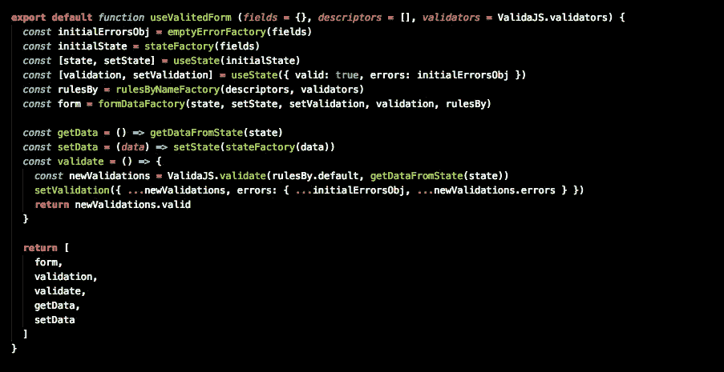

# 使用 React 挂钩进行表单验证

> 原文：<https://itnext.io/form-validation-with-react-hooks-ab0dbba23b9f?source=collection_archive---------0----------------------->



正如你可能知道的，我对钩子的新 React API 感到非常兴奋([这里是关于它们的介绍](/why-im-excited-with-react-hooks-5a8601ac43f7))

现在有几个可用的 React 钩子，我计划详细介绍其中的一些，但是这篇文章是关于只使用 **useState** 钩子来构建一个自定义钩子来验证表单数据。

如果你现在想看它工作，这里有一个活生生的例子。

[](https://frontarm.com/demoboard/?id=04d6233e-31cd-4921-b171-8d65f8204a05) [## 演示板

### 快速创建 Javascript 和 Markdown 演示。导入 npm 上的任何包。

frontarm.com](https://frontarm.com/demoboard/?id=04d6233e-31cd-4921-b171-8d65f8204a05) 

想法是创建一个定制的钩子来接收初始数据、验证和验证器。并返回一组变量和函数作为表单的工具

这是最后一个钩子，让我们看看它是如何工作的，以及我们如何用它来验证一个表单

这里的总体思路是，钩子返回一个包含 2 部分状态和 3 个函数的数组，让我们一个接一个地看看会是什么

## form 变量表示状态以及状态每个部分的 onChange 和 onClick 函数。这意味着

如果我们有一个这样的初始表单数据

```
const formData = {
  name: '',
  email: ''}
```

钩子返回的表单变量将是

```
{
  name: {
    input: {
      value: '',
      onClick: onClickHandlerFunction,
      onChange: onChangeHandlerFunction
    },
    meta: {
      touched: false,
      dirty: false
    }
  },
  email: {
    input: {
      value: '',
      onClick: onClickHandlerFunction,
      onChange: onChangeHandlerFunction
    },
    meta: {
      touched: false,
      dirty: false
    }
  }
}
```

## 验证保存来自 valida-js 的验证响应

```
{
  valid: true,
  errors: {
    name: [],
    email: []
  }
}
```

## 其他 3 个功能用于

*   验证:一次验证所有的表单数据
*   getData:返回一个对象，其签名与传递给钩子的初始值相同
*   setData:将数据设置为表单状态，传递一个与钩子初始参数具有相同签名的对象

# 使用钩子

首先从 npm 导入钩子，并将它们放入组件函数中。

```
import useValidatedForm from 'react-valida-hook'
```

**useValidatedForm** hook 可以用来传递至少两个参数，第一个是表单的初始数据(应该是数据的完整模式)，第二个参数是验证规则的数组，那些验证规则将用于 **valida-js。**

现在知道了钩子的返回以及如何初始化钩子。让我们用它写一个小表格

这里的重要部分是

如果一个属性有错误，我们该如何读取(也许我们需要一个函数来做得更好)，但是让我们保持这个简单的逻辑。如果一个属性的错误数组大于 0，这意味着我们在那里有错误，在另一种情况下，我们假设我们没有

```
className={ validation.errors.firstName.length > 0 ? 'validated-form__control error': 'validated-form__control'
```

这里另一个重要的部分是

```
<input name='first-name' id='first-name' { ...formData.firstName.input } />
```

在我们拆分输入对象 **firstName** 的地方，这意味着我们正在将**值**、 **onClick** 处理程序和 **onChange** 处理程序作为道具传递给输入。这样，我们将更新属性的元数据( **touched** ， **dirty** )，在用户写入输入时更新输入的值，并更新关于表单特定属性的验证。因此，在这种情况下，更新**validation . errors . first name**。

其中一个奇妙的事情是，现在我们可以构建控件组件并通过**验证.属性**、**表单.属性**并提取逻辑将错误和类放入其中。

我希望这能帮助你了解更多关于 React 钩子的知识，以及我们如何使用它在我们的应用程序中组合功能。

这个例子只使用了 React 上众多可用钩子中的一个(**使用状态**)，我将深入挖掘其他钩子，以及我们如何使用它们来创建一个类似 redux 的架构，只是使用钩子。

这是带有这个挂钩的 npm 包的存储库

[](https://github.com/highercomve/react-valida-hook) [## 更高级的命令/反应有效的钩子

### 通过在 GitHub 上创建一个帐户，为更高级的 comve/react-valida-hook 开发做出贡献。

github.com](https://github.com/highercomve/react-valida-hook) 

感谢阅读，愿原力与你同在。