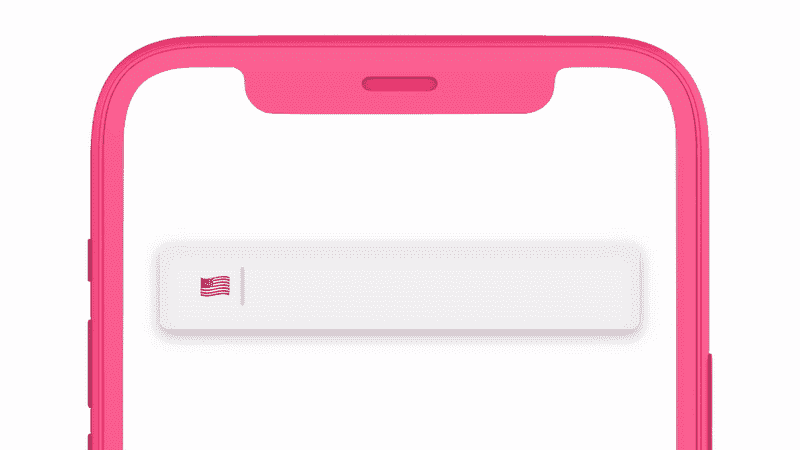
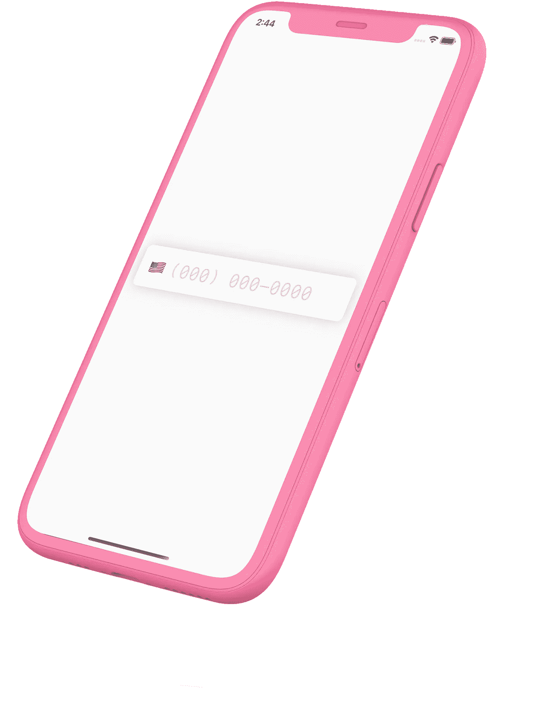
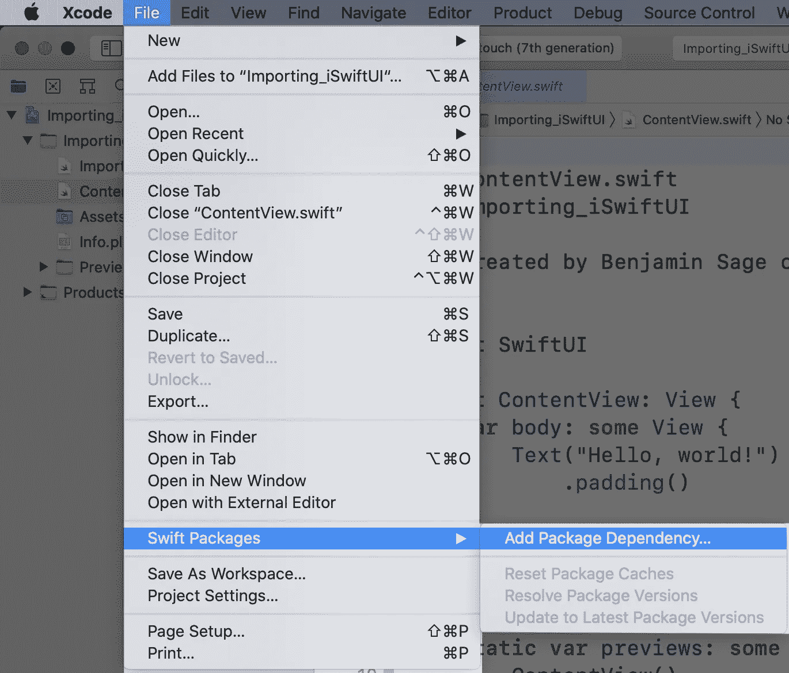
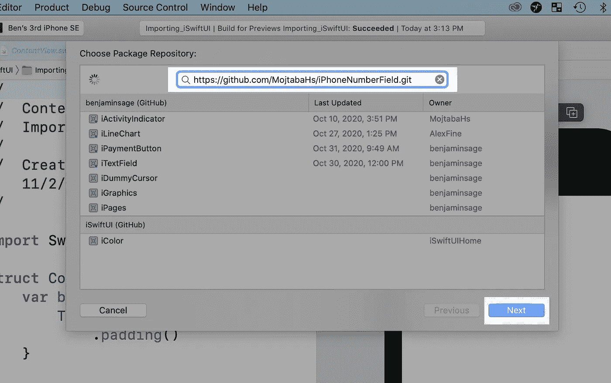
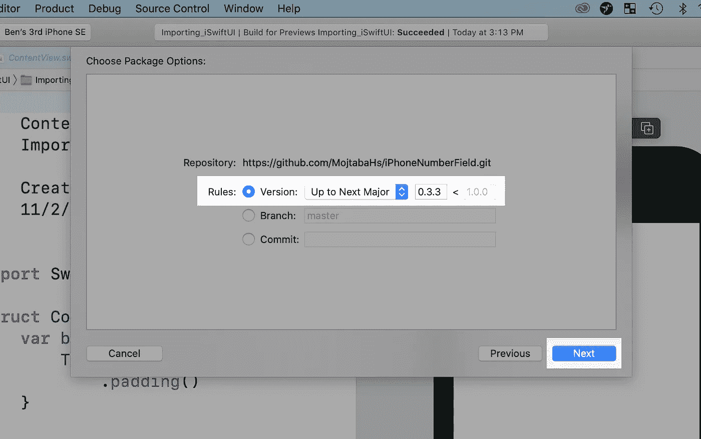
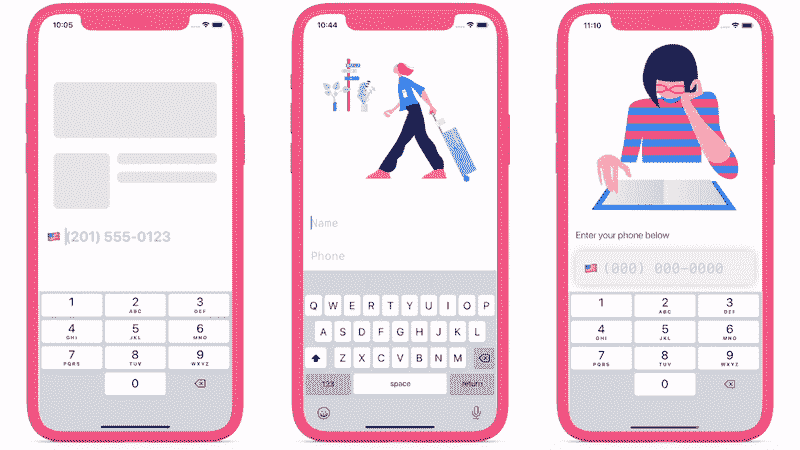

# 完全在 SwiftUI 中格式化电话号码

> 原文：<https://itnext.io/format-phone-numbers-entirely-in-swiftui-9456f52990a1?source=collection_archive---------1----------------------->

## 认识 iPhoneNumberField📱—电话号码的文本字段

# 这非常简单

> `iPhoneNumberField("Phone", text: $text)`

[*GitHub 此处*](https://github.com/MojtabaHs/iPhoneNumberField)

# 介绍

这似乎是一件很平常的事情:格式化一个电话号码。但事实并非如此。实时格式化电话号码——当他们被键入时——是困难的。即使在已建立的框架中，这也很有挑战性。除其他事项外，您需要:

1.  获取所有国家电话号码格式的所有数据。它们几乎完全不同。
2.  监视键盘，在每次击键时格式化。
3.  以编程方式移动光标，这样即使添加空格、破折号和括号，它也总是在正确的位置。
4.  确保它对输入*和删除*都有效。

如果你喜欢在 SwiftUI 中工作，就像我们中的许多人一样，它会从非常困难变得几乎不可能。

> 等等，但是苹果有这个代码吧？他们不应该把它公之于众吗？

是的，是的。但是他们没有！所以我们做了😀。**简介** `**iPhoneNumberField**` **—您现在可以在 SwiftUI 中完全格式化电话号码。**

# **第一步:安装⬇️**

安装`iPhoneNumberField`很容易。

1.  *打开 XCode。转到[File>Swift packages>Add Package Dependency…]。*

安装第 1 步，共 4 步

2.*粘贴* `[https://github.com/MojtabaHs/iPhoneNumberField.git](https://github.com/MojtabaHs/iPhoneNumberField.git)` *&点击*下一步。

安装第 2 步，共 4 步

3.*选择* *【版本:到下一专业】&点击*下一步。

安装第 3 步，共 4 步

4.*点击*完成。

# 第二步:开始🎬

下一步是将`iPhoneNumberField`添加到您的项目中。

如果你愿意，你可以停在这里。你的工作真的可以这么简单。🙂

# 步骤 3:自定义(可选)🎀

`iPhoneNumberField`几乎可以和你习惯的所有修饰词一起使用。这包括:

*   `.foregroundColor(_:)`
*   `.font(_:)`
*   `.multilineTextAlignment(_:)`
*   `.border(_:)`
*   等等。

它还具有一些新的特定于电话号码字段的功能。

从左到右，我们有:(1)旗帜，(2)重点，和(3)风格

## 特色一:旗帜🇦🇶

标志是电话号码文本字段的一个非常重要的部分，因为可以代表许多不同的国家。

`iPhoneNumberField`可以在您键入时自动检测您的旗帜，或者它可以为您提供所有旗帜的列表。

要启用此功能，只需键入

## 特点二:专注与不专注🔍

通常，您的电话号码字段与其他字段(如姓名字段)一起出现在某个页面上。目前，在 SwiftUI 中，用户必须点击不同的文本字段才能移动焦点。

有了`iPhoneNumberField`，这一切都可以通过编程轻松完成。只需使用内置的`isEditing`绑定:

## 功能 3:自定义样式🎁

你的应用有自己独特的风格，所以它需要一个适应的电话号码字段。因此，我们为您内置了大量自定义修饰符，因此您可以像格式化任何其他文本字段一样格式化它。

下面是定制风格*可能的样子:*

有无数种方法可以让你做到这一点。关于自定义修改器的完整列表，请查看 [GitHub](https://github.com/MojtabaHs/iPhoneNumberField) 。

# 结论

格式化电话号码几乎是每个应用程序的一部分。没有理由会很难。而现在，不是了😁。

有了`iPhoneNumberField`，你可以检查这一关，回到有趣的东西。

点击查看 GitHub [。](https://github.com/MojtabaHs/iPhoneNumberField)

# 资源

*   [GitHub](https://github.com/MojtabaHs/iPhoneNumberField)
*   [YouTube 教程](https://www.youtube.com/watch?v=4SnmiWFvolM&t=88s&ab_channel=WhatisiSwiftUI%3F)
*   [GitHub 要诀](https://gist.github.com/benjaminsage/7fd9d51021ed60ffbda5ac39e68abe99)

# 用法❗️

`**iPhoneNumberField**` **对个人来说是免费开源的，并将永远保持这种方式。**

`iPhoneNumberField`是在 GNU GPL 开源许可下发布的。

商业朋友请注意，这个许可证[与许多商业应用](https://en.wikipedia.org/wiki/GNU_General_Public_License#Legal_barrier_to_app_stores)不兼容。如果你的最终产品可以赚钱，许可证只需 0.99 美元。无忧代码😁。

## [获得许可](https://general099748.typeform.com/to/p5FtTKBj)