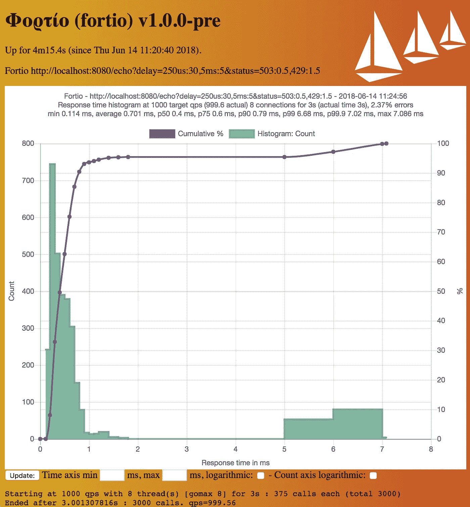
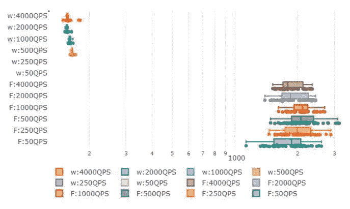

# 服务网格的 Fortio 优势与劣势

> 原文：<https://itnext.io/fortio-for-service-meshes-pros-vs-cons-e0458c7d672b?source=collection_archive---------3----------------------->

## Fortio 是您可以用于微服务测试的最佳工具吗？再想想！

Fortio 是一个快速、小型(3Mb docker 映像，最小依赖性)、可重复使用、可嵌入的 go 库以及命令行工具和服务器进程，服务器包括一个简单的 web UI 和 REST API，用于触发运行并查看结果的图形表示(单个延迟图形和多个结果的比较性 min、max、avg、qps 和 percentiles 图形)。

Fortio 样本结果图([来源](https://github.com/fortio/fortio)

Fortio 最初是 Istio 的负载测试工具，现在已经发展成为自己的项目。Fortio 社区在过去几年一直非常活跃，并在多个版本中贡献了非常好的功能集。Fortio 组件甚至可以用于不相关的项目，例如客户端和服务器端的`log`、`stats`或`fhttp`工具。

# **功能:**

*   请求回显，包括报头，添加具有概率分布的延迟或错误代码
*   TCP 回应
*   TCP 代理
*   HTTP 扇出/分散和聚集代理服务器
*   除 http 之外的 gRPC echo/health
*   Ping 测试
*   基于 TLS 的测试
*   动态标志支持([https://github.com/fortio/fortio/blob/master/dflag](https://github.com/fortio/fortio/blob/master/dflag))
*   *输入列表*:每秒查询次数、持续时间、延迟参数、HTTP/GRPC、服务器端能力、文件传输等。
*   *输出*:已解决的查询、查询错误、休眠消息、百分比延迟(P75、P90、P99 等。)，直方图

**其他详细信息:**

*   用 Go 写的
*   提供 GET/POST 方法
*   会引入抖动，但不可定制
*   提供直方图功能

# 赞成还是反对

## **优点:**

*   快速易用，易于定制
*   可以建成一个图书馆
*   像样的日志消息
*   拥有活跃的社区支持
*   具有直方图等绘图功能
*   可以通过网络用户界面运行测试

## **缺点:**

*   没有专注于 MTL 的功能
*   对于超过 10000 QPS 的负载，单个实例的伸缩性不好。
*   Go scheduler 并未针对高负载生成进行优化，其行为可能因运行时版本而异
*   当响应与请求不匹配时增加睡眠时间
*   使用 Linux 内核堆栈，增加了自己的延迟
*   不适用于利用连接池进行开环或闭环测试的测试
*   不符合 L2/L3 性能优化或 RFC2544
*   它的垃圾收集可能会大大提高噪声基底，尤其是在 TLS 用例中
*   在为应用分配多个内核的情况下，不一定能够很好地扩展
*   根据社区测试，Fortio 似乎更多地以批处理方式执行请求，导致缺乏统一的负载分布
*   延迟结果超过 1000QPS 时缺乏一致性的公开问题

由 [Otto van der Schaaf](https://medium.com/u/b7b39d3d5691?source=post_page-----e0458c7d672b--------------------------------) 合著的《Fortio 与 [Wrk2](https://github.com/giltene/wrk2) (此处[发布](https://docs.google.com/document/d/10xeQuEjUjdmfFq36kGrxI6v78GKHspqn_Nb-pohKfOo/edit?pli=1#))之间的比较中，发现两者之间的性能结果存在以下问题/差异:

在 200 个连接时，Wrk2 的 P50 延迟远远低于 Fortio，4CPUs ( [来源](https://docs.google.com/document/d/10xeQuEjUjdmfFq36kGrxI6v78GKHspqn_Nb-pohKfOo/edit?pli=1#))

*   对于相似的配置，Wrk2 和 Fortio 在原点引起不同的延迟，并且它们随着 QPS 的增加而不同
*   Wrk2 似乎产生更多可重复的结果，在测试运行之间显示更少的抖动，而
*   Wrk2 能够产生在时间上更好分布的负载。Fortio 似乎更多地以批处理方式执行请求(通过手动检查访问日志来观察)
*   与 Fortio 相比，Wrk2 更适合细粒度(亚毫秒级)延迟测量

# 那现在怎么办？

基准测试微服务或服务网格需要一个负载生成器来提供一致且可重复的性能。选择正确的工具可以提高或降低您的应用程序性能，因为它会导致不适当的调优混乱和生产中不可预测的行为。

根据工作负载/应用程序的预期运行时条件仔细选择工具。如果您关心毫秒级延迟或在高 QPS 场景下的一致性能，您的负载生成器应该模拟 benhavior 和 Wrk2 与 Fortio 相比似乎更好。当您考虑 1000QPS 的范围，并且不太关心亚秒延迟时，您可以选择 Fortio。我已经在本文中深入解释了一些细节:

 [## 关于服务网格性能的 5 件事

### 服务网格性能是否足够简单，可以获得任意两个端点之间的指标？原来它要复杂得多…

sunkur.medium.com](https://sunkur.medium.com/5-things-to-know-about-service-mesh-performance-a8331765e995)