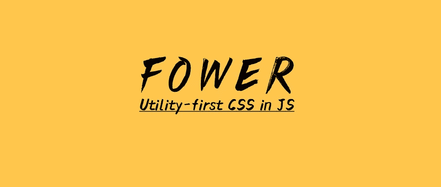

# 1.0 版之前

> 原文：<https://itnext.io/fower-v1-0-8df48723de0b?source=collection_archive---------4----------------------->



经过半年的努力，今天我们终于发布了 1.0 版本。

# 什么是福尔？

Fower 是一个样式工具库，允许您高效地开发 UI。目标是让你写 CSS 更容易。Fower 的核心特性是原子性、类型安全和 JS 中的 CSS。它非常注重开发体验，让你快速愉快地构建用户界面。

# 故事

一年前，我们的团队同时开发 Web、React native 和 Mini 程序项目。在这三种类型的项目中，我们使用了不同的造型工具:

*   在 Web 项目中，我们使用 styed-component 编写样式；
*   在 React native 项目中，我们使用 React native 自带的`StyleSheet.create`；
*   在迷你程序项目中，我们用 Sass 写 css

这三种样式解决方案以不同的方式编写，这使得我们在编写样式时特别痛苦:

*   开发体验差。在开发同一个用户界面时，我们需要编写三种类型的 css 代码，需要不断切换习惯和思维。
*   工具链太宽太复杂，，样式化组件，Sass，样式表。创建…
*   开发效率低，重复代码太多。
*   CSS 有很多固有的缺点，可维护性差。

后来，我们发现了 [Tailwindcss](https://tailwindcss.com/) ，一个实用优先的 css 框架。我们开始在 web 项目中使用 Tailwindcss。经过一段时间，我们发现开发体验非常好，开发效率非常高，特别适合我们需要高度定制化界面的项目。遗憾的是，Tailwindcss 不能直接用于 React native 等非 web 项目。

我们团队的成员喜欢 Tailwindcss 的风格，所以我们创建了[for](https://github.com/forsigner/fower)，它允许我们为所有项目统一编写风格。

与 Tailwindcss 类似，我们也使用效用优先的概念，但 Fower 稍有不同。Fower 使用原子道具来编写样式。代码如下:

```
<div toCenterY p-10 w-260 rounded-10 shadow>
  
  <div ml-10>
    <div textXL fontBold>Steve Jobs</div>
    <span gray800>Co-founder of Apple Inc.</span>
  </div>
</div>
```

# 核心概念

Fower 坚持己见，我们基于以下概念创建了它:

*   **实用优先**，它可以让我们更快地编写样式。与其他“实用优先”的 CSS 框架不同，Fower 使用“原子样式道具”来编写样式。
*   **Type safe** ，我们团队是 TypeScript 的重度用户。Type safe 带来的 intellisense 使我们很难阅读文档，并且我们在编写代码时不依赖任何编辑器插件来获得准确的自动完成。
*   框架不可知的，这是我们创建 Fower 的主要原因之一。Fower 允许你以一致的方式在 React、Vue 和 React Native 中编写样式。
*   **CSS 在 JS** 中，我们讨厌在单独的 CSS 文件中写 CSS。纯 CSS 有很多缺点，比如:无法访问 JS 变量；容易产生风格冲突；容易生成死代码…我们喜欢用 JS(JS 中的 CSS)写样式，在年龄组件中比较合适。其实 Fower 不仅仅是 JS 中的 CSS，我们在 HTML 中也称之为 CSS。

# 一些很酷的功能

Fower 有很多特性，比如原子类、响应性、伪类、主题、设计系统、JS 中的 CSS 我觉得这些是 Fower 的基本特性，而不是特殊特性。

Fower 有几个很酷的特性:

# 1.布局工具包

如果我要在 Fower 中选择一个最喜欢的特性，它无疑会是[布局工具包](https://fower.vercel.app/docs/fower-layout-introduction)。

Fower 提供了一个强大的基于 Flexbox 的布局工具包。通过调整布局的方向和对齐方式，您可以构建大部分布局并使布局更容易。

与传统的 flex 布局相比，Fower 的布局更加抽象和精简。Fower 的布局抽象为`toCenter`、`toCenterX`、`toCenterY`、`toLeft`、`toTop`、`toRight`、`toBottom`、`toBetween`、`toEvenly`、`toAround`十种原子排列，使用它们时可以忘记传统 flex 布局中主轴和横轴的概念，只需要有方向感即可。

如下使用:

```
<div toCenter bgGray100 square-200>
  <div square-60 bgAmber400 rounded-8></div>
  <div square-80 bgBlue400 rounded-8></div>
</div>
```

更详细的用法请参见文档:[布局工具包](https://fower.vercel.app/docs/fower-layout-introduction)。

# 2.可预测的风格

Fower 的另一个很酷的特性是可预测的风格。在传统的 CSS 中，重写样式是不可预测的。

例如，如果您有如下 css 规则:

```
.red {
  color: red;
}
.blue {
  color: blue;
}
```

以及一些带有 css 类“红蓝”“蓝红”的 html:

```
<div>
  <span className="red blue">Fower</span>
  <span className="blue red">Fower</span>
</div>
```

你能判断文字的颜色吗？很难确定，如果我们没有看到上面的 CSS 代码，你无法直接判断文字的颜色，只能用开发者工具通过调试才能发现。

在 Flower 中，您可以轻松判断以下文本的颜色:

```
<div>
  <div red400 blue400>text will be color blue400</div>
  <div blue400 red400>text will be color red400</div>
</div>
```

当我们构建一个可重用的组件时，它非常有用。我们可以优雅地覆盖组件样式。

更详细的用法请参见文档:[可预测样式](https://fower.vercel.app/docs/predictable-style)。

# 3.颜色助手

Fower 的另一个很酷的功能是颜色助手。你可以用一些后缀来处理颜色。

使用`--D{0-100}`后缀使颜色变暗。

```
<div toEvenly toCenterY>
  <div red300>normal</div>
  <div red300--D40>darken</div>
  <div color="#fff--D40">darken</div>
  <div bgRed300 square-84></div>
  <div bgRed300--D40 square-84></div>
  <div border borderRed300 square-84></div>
  <div border borderRed300--D40 square-84></div>
</div>
```

使用`--L{0-100}`使颜色变亮。

```
<div toEvenly>
  <div red500>normal</div>
  <div red500--T40>transparentize</div>
  <div color="#000--T40">transparentize</div>
  <div bgRed500 square-84></div>
  <div bgRed500--T40 square-84></div>
  <div border borderRed300 square-84></div>
  <div border borderRed300--T40 square-84></div>
</div>
```

使用`--T{0-100}`使颜色透明化。

```
<div toEvenly>
  <div red500>normal</div>
  <div red500--T40>transparentize</div>
  <div color="#000--T40">transparentize</div>
  <div bgRed500 square-84></div>
  <div bgRed500--T40 square-84></div>
  <div border borderRed300 square-84></div>
  <div border borderRed300--T40 square-84></div>
</div>
```

使用`--O{0-100}`使颜色变得不透明。

```
<div toEvenly>
  <div color="rgba(0,0,0,0.4)">0.4</div>
  <div color="rgba(0,0,0,0.4)--O40">Opacify to 0.6</div>
  <div bg="rgba(0,0,0,0.4)" square-84></div>
  <div bg="rgba(0,0,0,0.4)--O40" square-84></div>
  <div border borderColor="rgba(0,0,0,0.4)" square-84></div>
  <div border borderColor="rgba(0,0,0,0.4)--O40" square-84></div>
</div>
```

更详细的用法请见文档:[颜色助手](https://fower.vercel.app/docs/color-helper)。

# 4.作文后缀

提供了一些后缀来处理样式，比如:`--hover`、`--focus`、`--sm`、`--dark`、`--T{amount}`...

Fower 的另一个很酷的特性是 Composition Postfix。您可以组合一些后缀，顺序是任意的:

```
<div square-84 bgOrange300 bgOrange400--D10--hover--sm></div>
```

下面的代码等同于上面的代码:

```
<div square-84 bgOrange300 bgOrange400--hover--sm--D10></div>
```

最后，Fower 是一个固执己见的风格工具，如果你喜欢，可以在 github 给它打个星: [Fower](https://github.com/forsigner/fower) 。