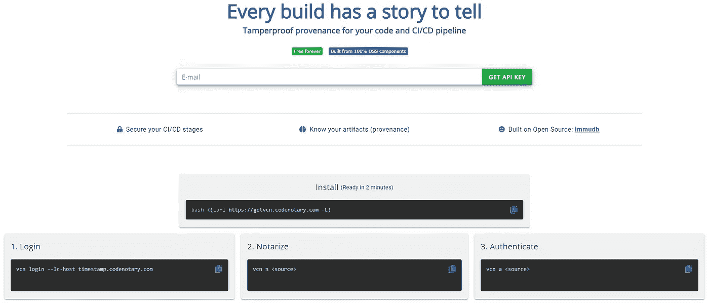

# 为开发者提供免费的可信时间戳服务

> 原文：<https://itnext.io/free-trusted-timestamping-service-for-developer-4ade058cc470?source=collection_archive---------3----------------------->

每一个构建都有一个故事可讲——代码和 CI/CD 管道的防篡改出处

**快速入门这里**:【https://timestamp.codenotary.com 

我们免费的、闪电般快速的、始终在线的时间戳服务与易于使用的 CLI 工具相结合，让您在一分钟内开始使用。


# 什么是可信时间戳

[可信时间戳](https://en.wikipedia.org/wiki/Trusted_timestamping)是安全地跟踪文档的创建和修改时间的过程。

这里的安全性意味着一旦文档被记录，只要时间戳的完整性没有被破坏，任何人甚至文档的所有者都不能更改它。


code 公证人使用其不可变的开源数据库 [immudb](https://github.com/codenotary/immudb) 来提供这项服务，其中包括加密验证和不可变的数据历史。

# 用例

这种时间戳服务为曾经写入的所有数据和曾经存储的唯一数据校验和(包括其历史)提供了完全的不变性。



由于信任级别是由时间戳决定的，所以您可以随时改变主意(不支持、不信任),而无需接触代码或二进制文件。

由于为任何数字身份(SHA-256 校验和)存储了完整的信任和时间戳历史记录，您可以轻松地在 CI/CD 方案中创建工作流和决策树。

有许多不同的使用案例:

*   向代码添加可信时间戳
*   为电子签名添加不可变时间戳
*   在给定时间点密封数据完整性和您的信任级别
*   证明特定时间点电子数据的存在
*   CI/CD 集成—公证所有传出资产，认证所有传入资产
*   为你自己的来源储存出处
*   不支持软件的过时版本，并根据最新时间戳运行更新检查
*   随时撤销信任(untrust ),而无需接触您的代码或二进制文件
*   信任或移除对数字资产的信任，并根据状态采取行动(在您的脚本或管道中)
*   只需给文件和源打上时间戳，以便在将来的任何时候再次检查它们是否仍然相同(备份/恢复)

**只需申请您的 API 密钥，一分钟内即可开始！这项服务是永远免费的，是使用开源软件开发的！**

经公证的资产信息存储在一个防篡改的分类账中，并由不变的数据库 [immudb](https://codenotary.com/technologies/immudb/) 提供加密验证。

# 获取 API 密钥

要访问我们的时间戳服务，需要一个有效的 API 密钥。如果您还没有，只需在此注册[code 公证人时间戳](https://timestamp.codenotary.com/)该 API 密钥绑定到您的电子邮件地址，在 vcn 登录时需要它。

# 快速启动

1.  **安装程序**如果你使用 Linux 或 macOS，最快的启动是我们的安装脚本:`bash <(curl https://getvcn.codenotary.com -L)` 你也可以[下载最新版本](https://github.com/vchain-us/vcn/releases/latest) (Windows、Linux、macOS)
2.  **登录**到[timestamp.codenotary.com](https://timestamp.codenotary.com/)

```
vcn login --lc-host timestamp.codenotary.com # type in your API key when requested
# or setting the API key
VCN_LC_API_KEY=<Your-API-Key vcn login --lc-host timestamp.codenotary.com
```

**3。公证现有的数字物品**
一旦你有了账户，你就可以开始公证数字资产，给它们一个身份。

```
vcn n <file|dir://directory|docker://dockerimage|git://gitdirectory>
```

4.**验证数字对象**您可以使用该命令作为起点。

```
vcn a <file|dir://directory|docker://dockerimage|git://gitdirectory>
```

详细的**命令行用法**，运行`vcn help`即可。

提示:时间戳和验证会计算 SHA256，因此较大的文件可能需要更长的时间，这取决于您的系统。

# 使用

## 通配符支持和递归公证

还可以使用通配符模式来公证资产。

使用`--recursive`标志，该工具可以递归公证内部目录。

```
vcn n "*.md" --recursive
```

## 公证

从`login`命令开始。`vcn`将引导你登录，并在首次使用时输入你的秘密。

```
vcn login --lc-host timestamp.codenotary.com
```

一旦设置了您的密码，您就可以公证资产，如下例所示:

```
vcn notarize <file>
vcn notarize dir://<directory>
vcn notarize docker://<imageId>
vcn notarize podman://<imageId>
vcn notarize git://<path_to_git_repo>
vcn notarize --hash <hash>
```

更改资产的状态:

```
vcn unsupport <asset>
vcn untrust <asset>
```

## 证明

```
vcn authenticate <file>
vcn authenticate dir://<directory>
vcn authenticate docker://<imageId>
vcn authenticate podman://<imageId>
vcn authenticate git://<path_to_git_repo>
vcn authenticate --hash <hash>
```

以`json`或`yaml`格式输出结果:

```
vcn authenticate --output=json <asset>
vcn authenticate --output=yaml <asset>
```

# 例子

## 在运行 Docker 映像之前自动对其进行身份验证

首先，您需要使用以下方法来提取图像:

```
docker pull hello-world
```

然后使用下面的命令进行自动安全检查。它只允许运行经过验证的映像。

```
vcn authenticate docker://hello-world && docker run hello-world
```

如果映像未经验证，它将不会运行，也不会执行任何操作。

## 认证多项资产

您可以通过将其他命令输出传送到`vcn`来认证多个资产:

```
ls | xargs -n 1 vcn authenticate
```

> *只有在您其他命令输出中的所有资产都被验证后，退出代码才会是* `*0*` *。*

## 由特定签名者认证

通过添加`--signerID`，您可以验证您的资产已经由特定的 SignerID 签名。您可以在`vcn n`或`vcn a`(签名者)的输出中找到自己的签名者 id。

> *SignerID 是签名者的公共地址(用前缀为* `*0x*` *的 40 个十六进制字符的长字符串表示)。*

```
vcn authenticate --signerID 0x8... docker://hello-world
```

## 使用资产的哈希进行身份验证

如果您希望仅使用资产的哈希来验证资产，可以使用如下所示的命令来实现:

```
vcn authenticate --hash fce...
```

## 不支持/不信任您不再拥有的资产

如果您想要取消支持/取消信任您不再拥有的资产，您可以通过以下步骤使用资产哈希来实现。

首先，你需要从你的 code 公证人分类帐合规仪表板中获得资产的散列，或者你可以使用`vcn list`命令。然后，在 CLI 中，使用:

```
vcn untrust --hash <asset's hash>
# or
vcn unsupport --hash <asset's hash>
```

## 自动化环境中的公证

简单地说，使用以下命令相应地设置您的环境:

```
export VCN_LC_API_KEY=Your-API-Key
```

完成后，您可以在非交互环境中使用`vcn`,方法是:

```
vcn login --lc-host timestamp.codenotary.com
vcn notarize <asset>
```

> *其他命令如* `*untrust*` *和* `*unsupport*` *也可以。*

## 签署资产时添加自定义元数据

用户可以在使用`--attr`选项进行资产公证时上传自定义元数据，例如:

```
vcn n README.md --attr Testme=yes --attr project=5 --attr pipeline=test
```

这个命令将添加定制的资产元数据 Testme: yes，project: 5，pipeline: test。

用户可以在资产认证时回读元数据，即使用`jq`实用程序:

```
vcn a README.md -o json | jq .metadata
```

## 检查

Inspect 已经扩展，增加了新的过滤器:`--last`、`--first`、`--start`和`--end`。用`--last`和`--first`分别返回第 N 个或最后一个。

```
vcn inspect document.pdf --last 10
```

使用`--start`和`--end`可以使用时间范围过滤器:

```
vcn inspect document.pdf --start 2020/10/28-08:00:00 --end 2020/10/28-17:00:00
```

如果没有提供过滤器，则最多只返回 100 个项目。

## 签名者标识符

可以通过签名者标识符过滤结果:

```
vcn inspect document.pdf --signerID Cyg...
```

# 开始给你所信任的一切打上时间戳，或者你想证明它今天或明天的存在

[](https://timestamp.codenotary.com) [## 代码公证-时间戳服务

### 为您的代码和 CI/CD 管道提供防篡改的出处——为您的代码、构建和…

timestamp.codenotary.com](https://timestamp.codenotary.com)