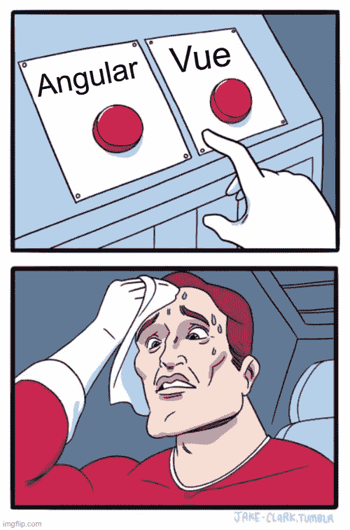
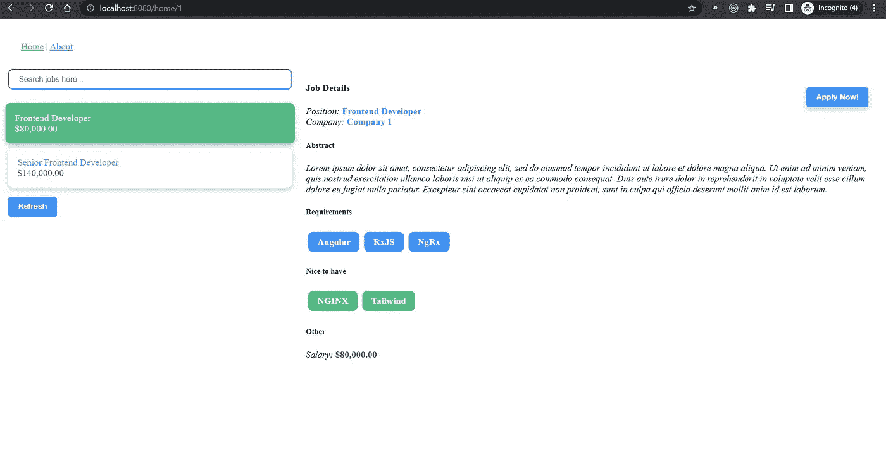

# 从 Angular 到 Vue:一个简单的过渡指南

> 原文：<https://itnext.io/from-angular-to-vue-a-simple-transition-guide-d0a8a952d17f?source=collection_archive---------5----------------------->



3 年前，当我作为应用开发助理开始我的第一份工作时，我偶然发现了 Angular，我必须承认，我完全尊重并喜欢使用这个框架。换工作后的最后七个月，我有机会第一次见到另一个流行的前端框架 Vue。

这是指南的第一部分，将帮助有 Angular 经验的工程师迈出 Vue 项目的第一步。当然需要基本的角度知识。

> TL；博士去检查官方的 Vue 文档，或者继续阅读，后果自负

# 10 英里 vue

## 安装 CLI，创建工作区，启动应用程序

```
// Angular
ng new from-angular
cd from-angular
ng serve// Vue
vue create to-vue
cd to-vue
npm run serve
```

你可以在应用程序的首页找到 [*这里*](http://localhost:4200) 和 [*那里*](http://localhost:8080) 。

## 应用程序和组件结构(选项 API)

在这两个应用程序中，我们可以打开`src`文件夹并检查文件。两者都包含一个负责应用程序引导的`main.ts`文件。在 Angular 中，第一个模块是`app.module`，它包括其他模块、路由器和组件，并引导`app.component.ts`。在 Vue 中，`main.ts`负责初始化状态，导入共享组件，路由和创建`App.vue`组件。

与 Angular 相反，Vue 使用单个文件组件(SFC)，它包含三个块`<template>` *(HTML 模板)*、`<script>` *(类型脚本代码)*和`style` *(CSS)。*

仔细一看，我们可以看到脚本返回了一个带有`data`属性的对象，或者如 Vue 所说的`data` ***选项*** 。这个属性有`reactivity`,这意味着 JS 跟踪这个属性的变化并适当地更新 DOM。我们还可以看到模板块中带有花括号语法`{{greeting}}`的插值。最后，在最后一个块中，我们理解了两个属性的存在，`lang`和`scoped`，所以我们可以使用更好的 SCSS，并确保样式只影响这个文件模板。

我们来细说一下。除了`data`选项之外，Vue 还提供了`computed`，我们可以从其他数据创建属性，并且只有当数据源更新时才更新它们(例如`name() { return this.first + ' ' this.last }`、`methods`，我们可以在其中放置函数，以及`watch`，当反应属性改变时，它可以触发一个函数)。此外，还提供 6 种生命周期选项`beforeCreate, created, beforeMount, mounted, beforeUnmount, unmounted`。我们可以使用选项`props`来传递来自父组件的数据(相当于`@Input()`)，使用选项`emits`来声明组件发出的事件(如`@Output()`)，使用`components`来导入组件，使用`provide`来为嵌套的子组件提供对象，以避免钻取，使用`inject`来访问祖先组件提供的数据。提供的三个有趣的选项是`beforeRouteEnter, beforeRouteUpdate, beforeRouteLeave`框架的路径解析器/保护，并使它们接近实际的组件，而不是不同的文件(如 Angular)。所以脚本块是一个有很多选项的对象，这也是 Vue 称之为 ***Options API 的原因。***

## 组合 API

现在 Vue 提供了另一种选择:与`<script setup>`一起使用的 ***组合 API、*** ，我们可以在那里编写完整的逻辑。Options API 因其结构*而更具可读性——您总是知道在每种情况下要检查什么块——*，但是您必须向上滚动&才能从一个方法导航到所使用的反应属性，并从那里导航到计算变量和观察器。Composition API 提供了保持接近您想要的变量和方法的灵活性，缺点是一些样板代码应用反应性、计算等。在每种情况下。

## 路由器和延迟加载

Vue 路由器简单明了。您可以用一个**组件**或者用一个**重定向**将每个路径绑定到另一个路径。此外，您可以提供**急切**和**懒惰**加载的组件和一个`name`属性。`name`属性允许在不使用硬编码路径的情况下导航到另一条路径，并提供了无需进一步考虑即可更改路径的机会。

类似`alias` *的属性-为多个 URL 渲染同一个组件-*`children`*-为子路由-*`beforeEnter`*-路由守卫-*`props`*-将输入值或对象应用于组件的选定属性！！！-*`meta`*-其他信息/配置-* 等

最后，通过利用**命名视图**，您可以在同一路径中显示多个视图，并在同一路径下的页面的不同部分显示许多组件。

带有已命名的`router-view`元素的`template`:

命名视图的`router`配置:

## 内容投影

Vue 支持两种在组件内部投影内容的方式:`slots`和`scoped slots`。`<slot />`允许组件呈现给定的模板片段。支持多个模板`named slots`，也可以为一个槽定义一个回退(默认)内容。`slot`的角度等同于`<ng-template>`。

`scoped-slot`是类固醇中的一个插槽，因为它允许我们访问子组件/模板的状态。Angular 的等价物是传递模板的`<ng-template>`和将给定数据传递给提供的模板的`<ng-container>`的组合。`scoped slot`的一个好例子是这样的:

如你所见，这里有一个作为`prop`的`items`列表。该组件遍历这些项，并呈现从槽中传递的模板。它还将列表的`item`作为模板变量传递。

这就是我们如何使用作用域槽。只需放置一个带有模板变量的模板，并在我们选择的组件中将其用作`prop`。

## 服务？可组合！

Vue 引入了 composable，这是一个具有状态逻辑的函数。现在我们能够跨组件重用逻辑(数据和功能)。该文档使用了以下示例:

## 状态管理

Vue 留下(维护模式下)Vuex，欢迎[***Pinia***](https://pinia.vuejs.org/)作为推荐店，由 Vue 核心团队维护。pinia**简单**，**最小**支持**打字稿**。这里举个小例子:

# 2 个框架中的 1 个应用

## 示例应用程序

过渡的一个很好的例子是在 Angular 中创建一个应用程序，并在 Vue 中创建一个完全相同的应用程序，以了解利弊。这个应用程序是一个主从示例，您可以从左边部分选择一个作业，并在右边查看摘要。您可以通过单击“立即申请！”来申请所选的工作按钮。它支持过滤功能(作业列表上方的输入区域)和“刷新”按钮，以便在出错时重试请求。



主-详细示例。

让我们在每次更改后将表单的值保存到`localStorage`

*有棱角:*

*带 Vue :*

带有输入和错误消息的表单模板

*有棱角:*

*带 Vue:*

## 比较-基本差异

*   Vue 的核心团队创建了 Pinia，一个完整的商店库。Angular 使用 Observables*-一种更棘手的学习曲线方法-* ，并依赖外部库获得完整的商店解决方案。
*   RxJS 操作员是救命恩人。`switchMap`、`retry`、`debounce`等必须从外部库导入，或者更糟…由我们自己丑陋肮脏的手创造。
*   Angular 的管道当量是计算变量，但内置管道应该从头开始实现(只需考虑`date`、`currency`等)
*   Vue 仍然使用`fetch` API 来触发 HTTP 请求，因此开发人员应该实现取消、重试或使用外部库的功能。
*   表单，或者更糟的带有异步验证器的表单数组…这里就不提了。
*   性能:Vue 用虚拟 DOM，Angular 不用。
*   Watchers: Vue 能够跟踪对象，并以一种简单易行的方式对它们的更新做出反应。
*   Vue 使用单文件组件(SFC ),所以有必要保持文件精简和小。
*   Angular 需要大量的时间投入。Vue 是最小的，非常容易启动。

# 结论

我知道我有偏见，因为我是从 Angular 开始的，我倾向于以“Angular 的方式”思考，但我不得不承认，Vue 在简单性、极简主义和易用性之间保持了完美的平衡，没有太多的妥协。当然，Angular 内置实用程序的缺失是显而易见的，我不得不承认这是一个不舒服的 atm。

> 主要的困境是这样的:我们更喜欢一个需要高度参与的包罗万象的框架，还是一个开发者能够构建自己的工具或者依赖社区的最小框架？

这里的申请代码是[](https://github.com/stavrosdro/from-angular-to-vue)*。享受🚀🚀🚀*