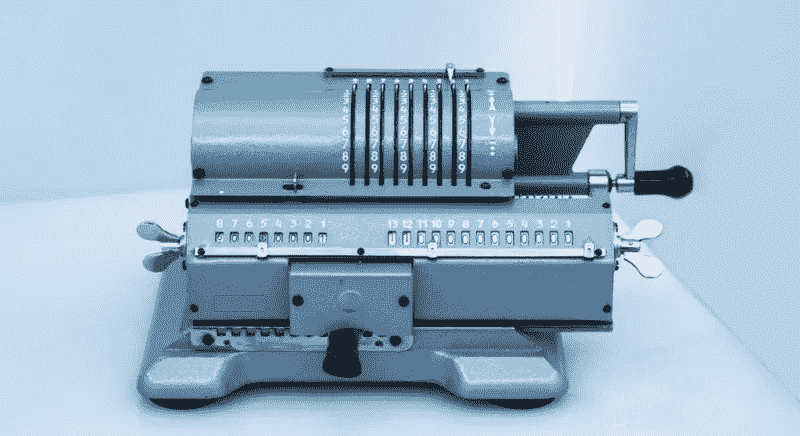
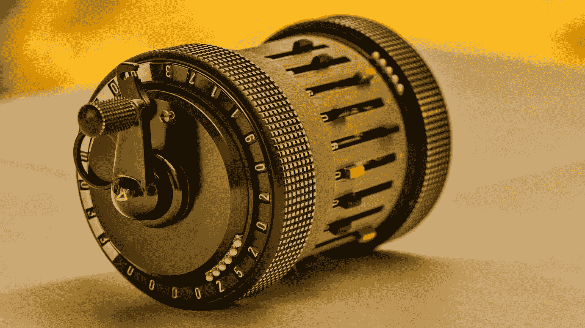
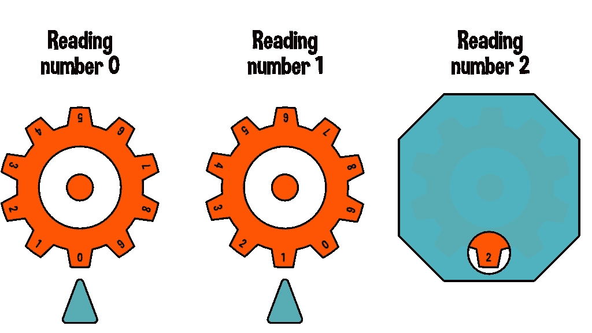
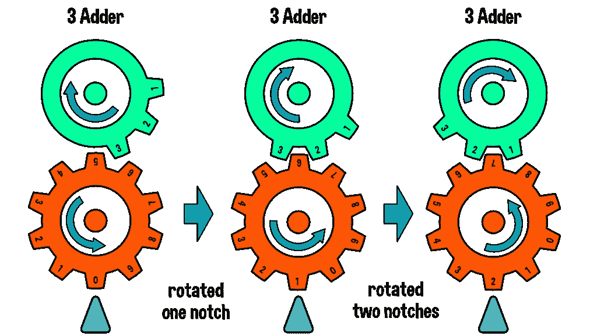
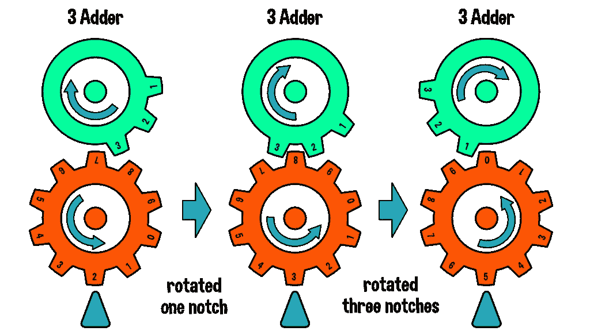
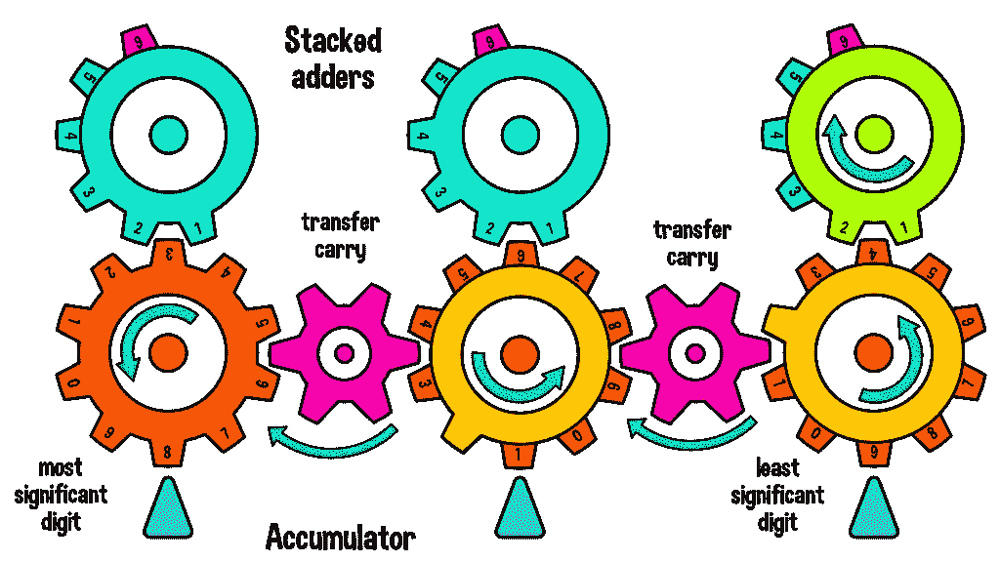
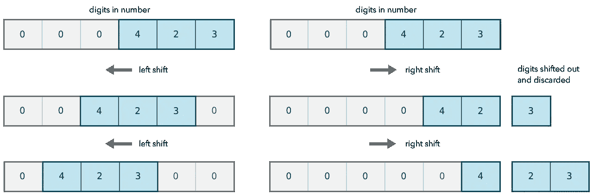
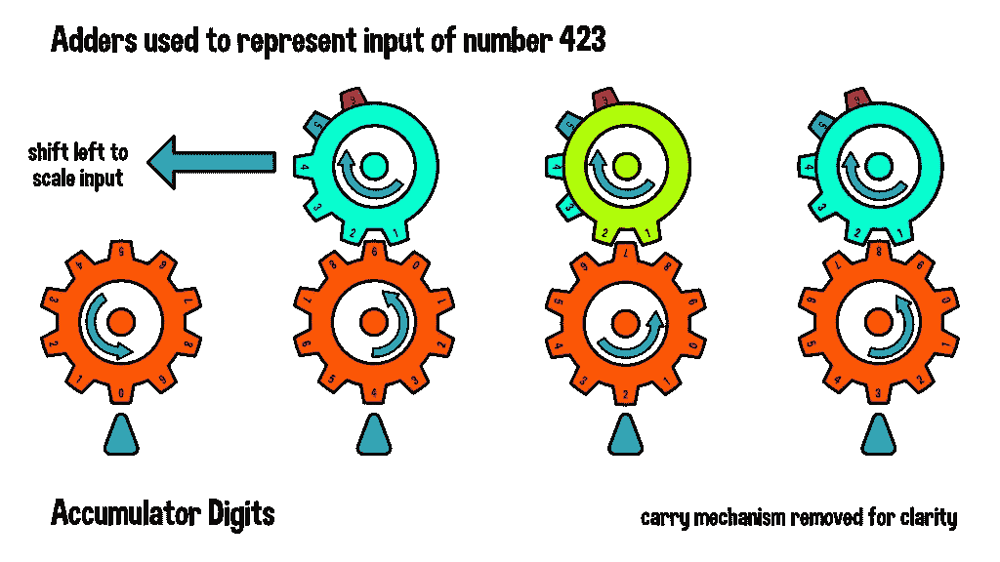
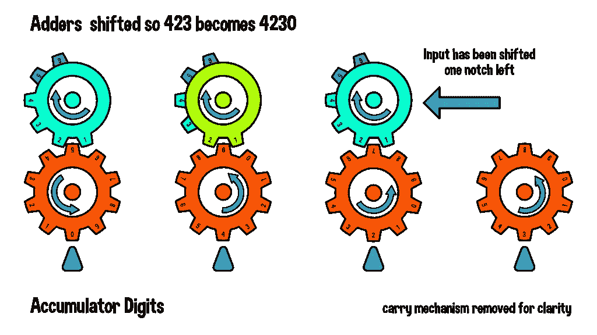
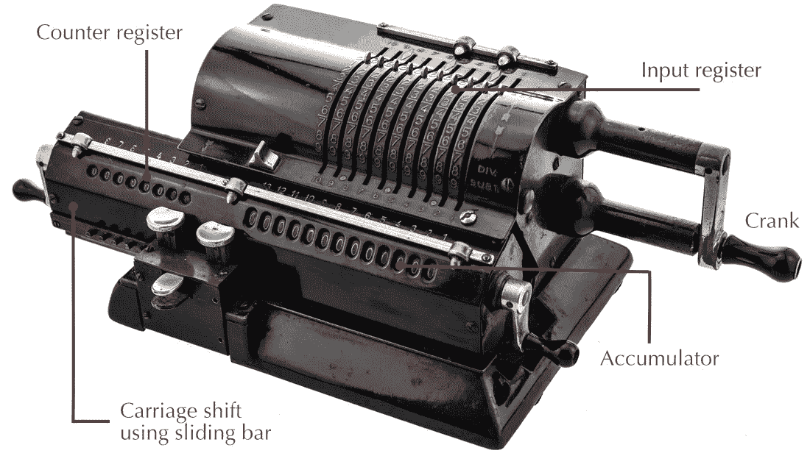

# 从算术到微处理器

> 原文：<https://itnext.io/from-arithmometer-to-microprocessors-fd82a7b9d6a6?source=collection_archive---------2----------------------->

## 通过学习旧技术来理解现代技术



奥德纳算术——1873 年俄罗斯发明的风车计算器

现代微处理器将晶体管组合起来构成逻辑门，然后将这些逻辑门组合起来构成二进制加法器、减法器和移位器，它们可以进一步用于执行乘法和除法。然而，除了让电流流过由半导体制成的晶体管之外，还可以用许多其他方式进行计算。

[](https://erik-engheim.medium.com/from-abacus-to-microprocessors-d84d9ca69e8a) [## 从算盘到微处理器

### 通过学习旧技术来理解现代技术

erik-engheim.medium.com](https://erik-engheim.medium.com/from-abacus-to-microprocessors-d84d9ca69e8a) 

例如，我的大儿子用一个叫做[图灵不倒翁](https://upperstory.com/turingtumble/)的工具包制作了一个大理石轨道二进制加法器、计数器和乘法器。不涉及电力或硅。


基于图灵不倒翁弹珠的计算设备。

直到 20 世纪 80 年代，苏联一直使用基于水的模拟计算机，称为[水积分器](https://en.wikipedia.org/wiki/Water_integrator)，它可以用来解决微分方程。这些计算机被用于地质、矿山建设、冶金、火箭生产和其他领域。

直到 20 世纪 60 年代左右，计算硬件和简单的计算机系统都是围绕压缩空气而不是电流的使用来构建的。这些系统被称为射流技术。但在今天的故事中，我将重点介绍一个使用齿轮执行算术的旧系统。法国数学家布莱士·帕斯卡是最早探索这一想法的人之一，他设计了 T4 帕斯卡林 T5。帕斯卡林是一种能够进行加法和减法运算的机械计算器。德国科学家[戈特弗里德·威廉·莱布尼茨](https://en.wikipedia.org/wiki/Gottfried_Wilhelm_Leibniz)制造了一种被称为[步进计算器](https://en.wikipedia.org/wiki/Stepped_reckoner)的改进版本，但是法国发明家[查尔斯·泽维尔·托马斯·德·科尔马](https://en.wikipedia.org/wiki/Charles_Xavier_Thomas)制造了突破性的机械计算器，被称为[算术计](https://en.wikipedia.org/wiki/Arithmometer)。由于大规模生产，它在整个欧洲广受欢迎。最广泛使用的变体之一是本文介绍中显示的 Odhner 算术计。

机械计算器技术的顶峰无疑是 [Curta 手持式机械计算器](https://en.wikipedia.org/wiki/Curta)，小到可以放在你的手掌中。它的设计者 [Curt Herzstark](https://en.wikipedia.org/wiki/Curta) 不得不提出许多创新的概念来缩小计算器，使其紧凑小巧。



Curta 手持式机械计算器由 Curt Herztark 在 20 世纪 30 年代设计

在这个故事中，我们将探索这些计算器如何使用看起来像复杂的齿轮和轴的发条装置来执行算术运算。

# 用齿轮表示数字

基本思想是，一个有十个齿的齿轮可以用来代表十进制数字系统中的十个数字 0-9 中的每一个。你决定你想在哪里阅读齿轮的价值。下图显示了两种不同的方法。在前两种情况下，我们使用指示器或标记来指向当前选择的数字。在最后一个例子中，我们通过盖子上的开口显示当前的数字。



用齿轮来表示一个数或一个数字。如何读取当前数字？

通过去除齿轮上的齿，我们可以创建特殊的齿轮来设置数值。请注意，Curta 和 Odhner 算术计数器都有一个可以转动的手柄。我们希望每次旋转一整圈时，都有某种计算发生。如果你看下面的绿色齿轮，你可以看到它们是如何被用来设置橙色轮的数字 3。绿色齿轮旋转一整圈将导致橙色齿轮设置为值 3。



如何旋转一整圈输入数字 3？

事实上，绿色齿轮就像一个加法器。每当你旋转一整圈，数字 3 就会加到橙色的齿轮上。因此，如果你想用 3 乘以 3，你可以转动绿色齿轮 3 次，橙色的轮子就会显示 9。



使用绿色齿轮作为三相加法器。齿轮每转一圈，橙色蓄能器齿轮将增加 3。

每次旋转只能加 3 当然是非常有限的。然而，我们可以创建特殊的齿轮来增加 1，2，3，一直到 9。每个彩色齿轮都是不同数字的加法器。我们可以把这些加法器组装起来。您可以通过沿轴上下滑动加法器来选择要添加到橙色累积轮的数字。只有与橙色轮处于相同高度的加法器会与它连接并使它旋转。


可以为每个加法器制造一个齿轮。加法齿轮可以相互堆叠。通过上下滑动加法器堆栈，我们可以选择一个加法器来使用。

[戈特弗里德·威廉·莱布尼茨](https://en.wikipedia.org/wiki/Gottfried_Wilhelm_Leibniz)做了一个这个概念的实际实现，叫做*莱布尼兹轮*或者*阶梯鼓*。注意它是如何类似于一堆有不同齿数的齿轮。单个齿只延伸到鼓的一半。这样，我们可以通过简单地上下滑动所谓的计数轮来选择想要的“加法器”。当计数轮位于顶部时，步进鼓轮旋转一整圈将使计数轮增加 9。


莱布尼兹轮或阶梯鼓。通过上下滑动红色计数轮，我们可以选择使用哪个加法器。

当然，我们希望能够处理大于 9 的数字。为了实现这一点，我们需要一种机制来处理进位。一旦一个轮子旋转了超过九个齿，它就需要增加代表更高有效数字的轮子。原则上，这很容易。所有你需要的是一个 1 加法器附在每个齿轮的顶部，它会在你每转一圈的时候加一。如下图所示，我们放入一个粉红色的齿轮以确保旋转方向正确。



342 的输入被加到包含数字 819 的累加器上。输入由加法器组成。下面一行包含橙色齿轮，组成累加器寄存器。

阅读我的插图可能会感到困惑，因为这一切都发生在 2D，齿轮一个接一个地叠在一起。你将不得不想象最右边的橙色齿轮没有直接连接到它左边的粉红色齿轮。相反，橙色齿轮顶部的黄色 1 加法器与粉色齿轮处于同一水平。这意味着，一旦橙色齿轮旋转一整圈，顶部的单齿黄色齿轮会将粉红色的小齿轮移动一个档位。最终结果是左边的橙色齿轮增加了一个。

这个系统的实际实现要复杂得多，因为我们需要正确地同步和排序一切。最右边的齿轮必须完成加法，并可能在我们添加到它左边的齿轮之前进行进位。一旦下一个齿轮完成加法和进位，我们就可以开始添加下一个橙色齿轮。如果您试图并行执行所有这些操作，那么就会出现混乱，因为当输入被添加到橙色累加器齿轮时，可能会尝试进位。

奥德纳算术运算器的说明。有助于解释进位和加法运算是如何错开的，以避免完全混乱。

如果你看一个解释奥德纳算术的视频，你会看到不同的动作是如何分阶段完成的。首先进行正常加法，然后在单独的阶段进行进位。进位是交错的，因此较低有效位的进位在较高有效位的进位之前执行。

# 执行移位操作

移位运算在计算中很重要，因为它们易于实现，并允许您快速执行数字系统基数倍数的乘法和除法运算。因此，对于十进制计算器来说，与 10、100、1000 等数字相乘或相除更快。对于二进制计算机来说，乘以或除以 2、4、8、16、32 等等都很快。



十进制数 423 的左移和右移运算的概念性解释

结合移位运算、加法和减法，我们可以用很少的运算完成乘法或除法。比如我想用 231 乘以 423。我们可以将此操作表示为:

```
423 × 231 = 200×423   + 30×423   + 1×423
          = 2×423×100 + 3×423×10 + 1×423
          = 42300 + 42300 + 
          =  4230 +  4230 + 4230 + 
              423
```

因此，我们可以执行六次加法，而不是执行 423 的 231 次加法。为了实现乘法，使用这种策略需要一种能够快速放大输入数 423 的方法。策略非常简单:我们简单地改变输入齿轮相对于储能齿轮的位置。下图在顶部显示了 4、2 和 3 的加法器。这是将数字 423 表示为输入的一种方式。



如果我们将三个加法器向左移动一步，那么所执行的任何加法都将表现为我们添加了 4230 而不是 423。



向右滑动累加器在功能上等同于向左滑动输入。事实上，这就是实际的算术。请注意奥德纳算术计数器上的累加器是如何包含在一个回车内的，类似于一台老式的机械打字机。您可以向左或向右移动此回车，将输入除以或乘以 10 的倍数。



奥德纳算术机械计算器的零件

移动托架也会影响计数器寄存器。正常情况下，每转动一次右边的手柄，计数器寄存器就增加 1。但是，如果您将输入缩放了 10 倍，计数器也会缩放。这种机制使得跟踪我们将输入数添加到累加器中的次数变得容易。如果你在用 423 乘以 231，而计数器显示的是 30，那么你知道你需要转动手柄一次而不移动，然后在 423 移动到 42300 时转动两次。如果你不小心走得太远，你可以向相反的方向转动曲柄，从累加器和计数器中减去。

## 使用齿轮进行计算的好处

对我来说，作为一个热衷于教授计算机和计算器原理的人，机械齿轮太棒了。你可以向全班或好奇的小孩展示这种计算装置的内部，他们可以看到它们是如何工作的。相比之下，现代的电子计算机看起来就没什么意思了。当它执行操作时，您看不到它在做什么。机械计算机器的好处是，它们可以与我们的十进制数字系统一起工作，这降低了教授它们如何工作的障碍。

## 使用齿轮的缺点

有一个很好的原因是没有真正的由齿轮组成的计算机被制造出来。英国发明家查尔斯·巴贝奇在 1833 年开始设计一种机械通用计算机，称为[分析引擎](https://en.wikipedia.org/wiki/Analytical_Engine)，它基于使用齿轮来表示十进制数字。然而，这台机器最终成为一个永远无法完成的庞然大物，尽管得到了英国政府的慷慨资助。

相比之下，德国工程师康拉德·楚泽在他的起居室里建造了一台机电二进制计算机，很大程度上是自费的。尽管花费的时间、金钱和资源少得多，但他在查尔斯·巴贝奇失败的地方取得了成功，这证明了在计算硬件中使用二进制数字系统比使用十进制齿轮有优势。

# 有用的资源

理解只有文本和插图的机械计算器是如何工作的可能很难。要真正了解它们是如何工作的，看各种视频会有所帮助。这里有一个很好的动画演示了莱布尼兹轮的工作原理。

演示莱布尼兹轮的工作原理，以及如何使用它来执行一位数加法。

我所看到的关于进位机制的一个更好的解释是在这个制作机械计数器的视频中展示的。计数器实际上与机械计算器有许多共同之处。

如何建立一个计数器？很好地解释了齿轮计算机器中的进位机制。

# 外卖食品

机械计算器能教会那些对理解现代计算机感兴趣的人什么？从我们所讲的内容中可以得到什么？

1.  任何计算机器的最基本构件都需要能够将两位数相加。对于二进制计算机，这意味着使布尔逻辑增加两位。
2.  一种处理进位的方法，这样我们可以对多位数进行加减运算。在二进制计算机的情况下，这意味着能够增加或减少由多位组成的数字。
3.  计算机是用来处理最多位数的。
4.  乘法和除法比加法和减法实现起来要复杂得多。通常，它们是移位、加法或减法的组合。

当试图理解二进制计算机时，所有这些考虑都出现了。早期的家用计算机在计算中使用 8 位寄存器。早期的微处理器(如 6502)或今天小型嵌入式系统中使用的处理器(如 AVR)不支持硬件中的乘法和除法。相反，它们利用移位、加法和减法运算，如本文所示。

当我在 20 世纪 80 年代开始编写游戏代码时，我总是被建议避免乘法和除法，因为那些运算很慢。当计算抛射体的角度时，你需要使用正弦和余弦函数。这些函数被实现为大量的乘法和除法，这使得它们非常慢。因此，我们通常会创建预先计算的正弦和余弦值表，并在需要时进行查找。

这些教训在今天已经没什么用了，因为现代的 CPU 相对于内存访问来说非常快。通常，重新执行计算比查找缓存值更快。