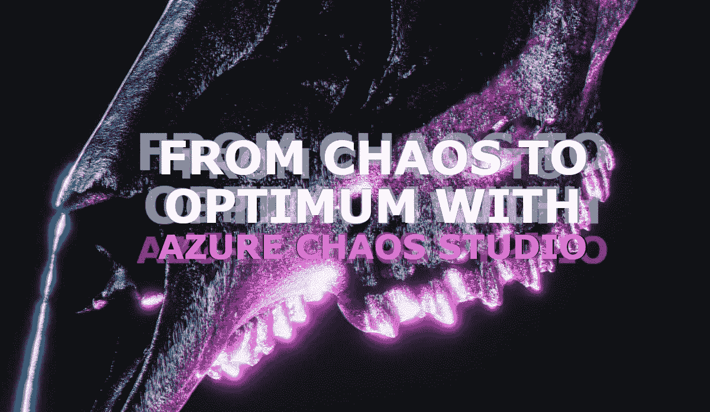
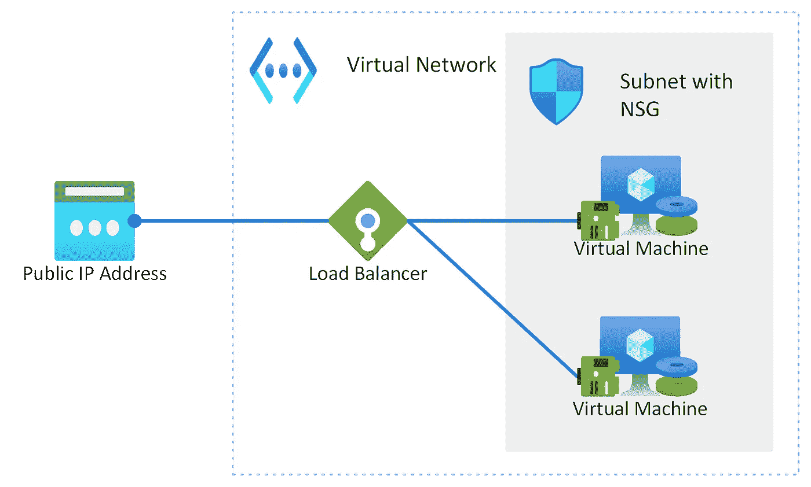
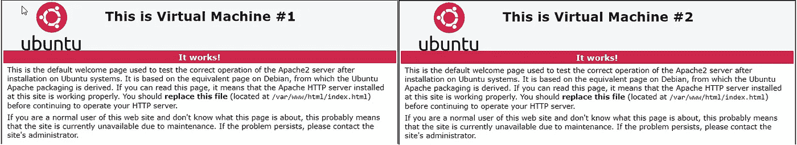
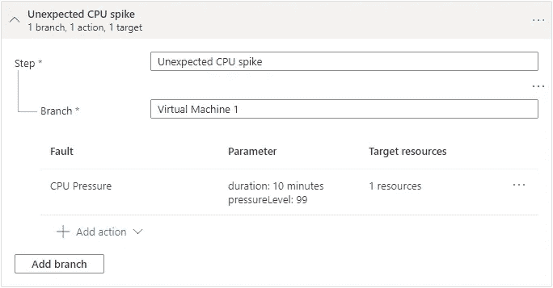
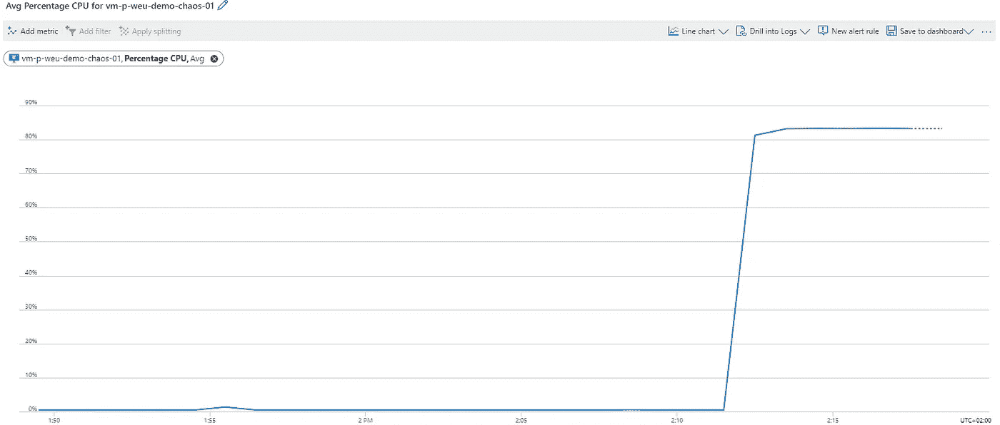
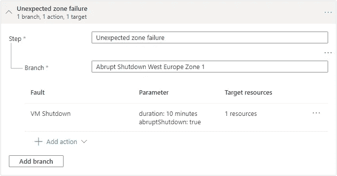
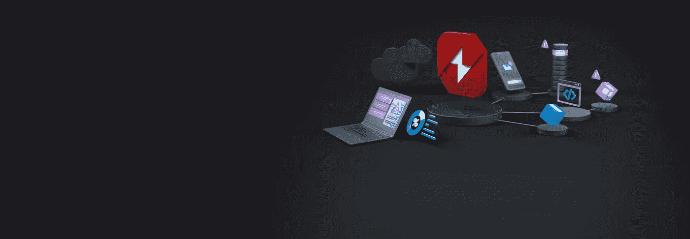

# 用 Azure Chaos Studio 从混乱到最佳

> 原文：<https://itnext.io/from-chaos-to-optimum-with-azure-chaos-studio-8bc0cae20a35?source=collection_archive---------2----------------------->



在本文中，我将解释什么是 Azure Chaos Studio 和 chaos engineering，如何使用 Azure Chaos Studio 来测试和提高应用程序的弹性，并分享我对第一次实践经验的想法。

# 关于 Azure 混沌工作室

在 2021 年 11 月 2 日的[微软 Ignite](https://myignite.microsoft.com/) 上，微软推出了 Azure Chaos Studio，自那以后一直在[公开预览](https://techcommunity.microsoft.com/t5/azure-governance-and-management/announcing-the-public-preview-of-azure-chaos-studio/ba-p/2893050)。Azure Chaos Studio 是一项 Azure 服务，帮助您测试和提高基于 Azure 的解决方案的应用程序弹性。

## 什么是混沌工程？

混沌工程是一种方法学，通过强化服务以防止生产中的故障，帮助开发人员获得一致的可靠性。[网飞](https://www.netflix.com/)是最早引入混沌工程概念的公司之一，使用了专有的知名工具[混沌猴子](https://netflix.github.io/chaosmonkey/)。该工具有意和随机地触发各种故障。这背后的想法是，基础设施有这样一个健壮的级别，它是为这些现实世界的场景准备的。目标是观察、监控、响应和提高系统在不利环境下的可靠性。

思考混沌工程的另一种方式是，它是关于拥抱复杂系统中固有的混沌，并通过实验，增强对您的解决方案处理混沌的能力的信心。

## Azure 混沌工作室是什么？

[Azure Chaos Studio](https://azure.microsoft.com/services/chaos-studio) 是一个托管服务，它使用 chaos engineering 来帮助您测量、了解和改进您的云应用程序和服务弹性。它运行可以模拟故障或导致事故的实验，例如某个区域宕机或某个应用程序故障导致虚拟机上的 CPU 使用率达到 100%。

弹性是系统处理和恢复中断的能力。应用程序中断可能会导致错误和故障，从而对您的业务和任务产生负面影响。无论是开发、迁移还是操作 Azure 应用，验证和提高应用的弹性都是非常重要的。

在 Azure Chaos Studio 中，有三种方式来设置 Azure Chaos Studio 实验:

*   使用 service-direct fault，它直接针对 Azure 资源运行，不需要任何工具。
*   使用基于代理的故障，这需要设置和安装混沌代理。
*   使用 [Chaos Mesh](https://chaos-mesh.org/) ，这是一个免费的开源混沌工程平台，Kubernetes 可以将故障注入 AKS 集群。混沌网格故障是服务直接故障，需要在 AKS 集群上安装混沌网格。

# 实践中的混乱

在 Azure Chaos Studio 的[文档页面上，微软放置了三个入门指南，分别针对](https://docs.microsoft.com/en-us/azure/chaos-studio/) [service-direct](https://docs.microsoft.com/en-us/azure/chaos-studio/chaos-studio-tutorial-service-direct-portal) 、 [agent-based](https://docs.microsoft.com/en-us/azure/chaos-studio/chaos-studio-tutorial-agent-based-portal) 和 [AKS Chaos Mesh](https://docs.microsoft.com/en-us/azure/chaos-studio/chaos-studio-tutorial-aks-portal) 故障。在以下场景中，我使用基于代理的故障和服务导向的故障。

所使用的实验室环境由两台安装了 Apache web 服务的 Linux (Ubuntu 20.04)虚拟机组成，位于负载平衡器之后。它们部署在具有子网和相关网络安全组的虚拟网络上(允许来自互联网的 HTTP 流量，并允许从我的家庭网络到虚拟机的 SSH 流量)。



Rolf Schutten 图片

虚拟机上发布的页面彼此略有不同，因此我们可以在各自的登录页面上看到哪个虚拟机当前负责发布网页。



Rolf Schutten 图片

## 混乱场景#1。意外的 CPU 峰值

在这个场景中，我们在其中一个虚拟机上造成一个意外的 CPU 峰值，以测试负载平衡器设置是否是最佳的，并减少停机时间。用于 Linux 的 Chaos Studio 代理需要 stress-ng，这是一个开源应用程序，可以在虚拟机上引起各种压力事件。您可以通过[连接到您的 Linux 虚拟机](https://docs.microsoft.com/en-us/azure/virtual-machines/ssh-keys-portal)并为您的包管理器运行适当的安装命令来安装 stress-ng，例如:

```
sudo apt-get update && sudo apt-get -y install unzip && sudo apt-get -y install stress-ng
```

Azure Chaos Studio 实验看起来是这样的:



Rolf Schutten 图片

在开始实验后，CPU 的利用率立即增加，stress-ng 显然完成了它的工作。



Rolf Schutten 图片

当访问位于发布网页的虚拟机前面的负载平衡器的公共 IP 地址时，两个网页(运行在不同的虚拟机上)在运行实验时仍然显示。这是意料之中的，因为目标虚拟机仍在运行并处于活动状态，而且在实验室环境中，网页是通过 HTTP 访问的。因此，在负载平衡器中设置了 HTTP 健康探测器。使用 HTTP 运行状况探测器，不可能根据虚拟机的 CPU 利用率来平衡负载。使用 HTTPS 健康探测器，您可以通过向健康探测器添加自定义脚本来实现。在实际场景中，如果需要根据底层虚拟机的 CPU 利用率来平衡负载，则必须使用自定义脚本来设置 HTTPS 运行状况探测器。

## 混乱场景二。意外的数据中心或区域故障

在这个场景中，我们造成 Azure zone 的意外中断，以测试将虚拟机放在不同的可用性区域中是否能够完成工作并减少中断。虚拟机 1 位于可用性区域 1，虚拟机 2 位于可用性区域 2。其他资源是区域服务。

Azure Chaos Studio 实验看起来是这样的:



Rolf Schutten 图片

启动实验后，目标虚拟机立即进入停止状态。当访问位于发布网页的虚拟机前面的负载平衡器的公共 IP 地址时，在运行实验时，只显示一个(非目标虚拟机的)网页。这是意料之中的，因为负载平衡器将我们路由到非目标虚拟机，因为配置的运行状况探测器向目标虚拟机的负载平衡器发出了否定信号。

实验结束后，目标虚拟机将(自动)正确重启，并且可以再次访问其网页。

# 结束语

当我想到混沌工程时，我会想到终止(预)生产中的场景，以确保工程师实现他们的服务对实例故障具有弹性。这正是 Azure Chaos Studio 所做的。使用 Azure Chaos Studio 是安全的，而且多少有些可预测性:你的实验是一个工作流，在那里你决定什么是触发器(以及什么时候)，这可能是你的构建和发布管道的一部分。



图片由[微软](https://azure.microsoft.com/en-us/services/chaos-studio/)

微软已经建立了一个很好的标准错误和行为库，这将有助于大多数专业人士评估他们的基础设施的弹性。这就是 Azure Chaos Studio 的优势所在:在计划的时间内，针对特定的场景进行评估和证明。这对托管服务提供商(MSP)和独立软件供应商(ISV)来说是非常有价值的。并非不重要，CI/CD 管道中的集成可能性是非常有前途的。