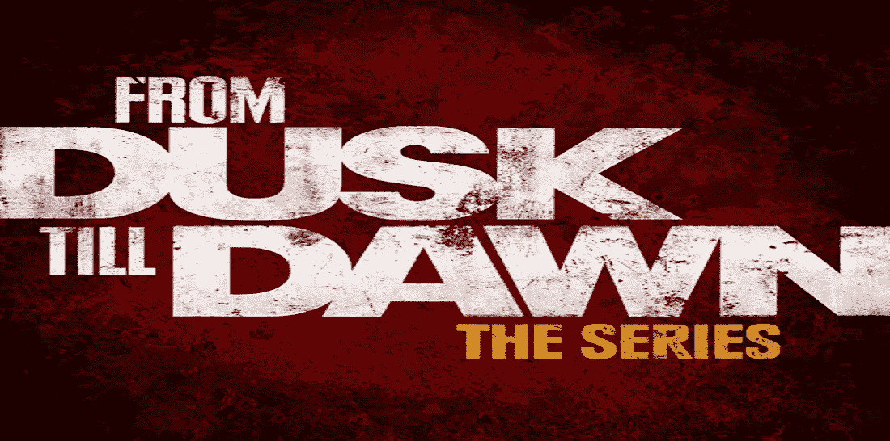
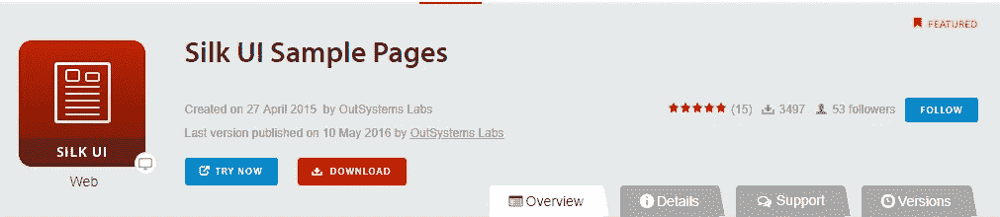
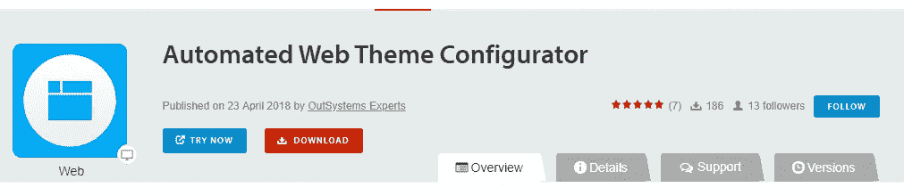
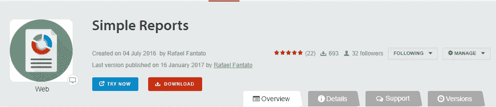
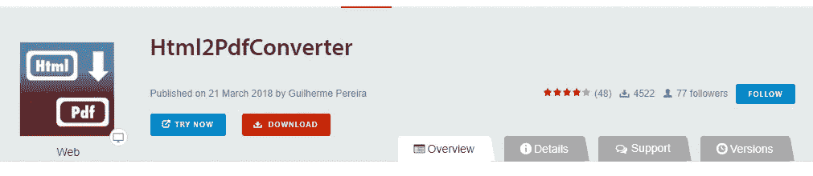
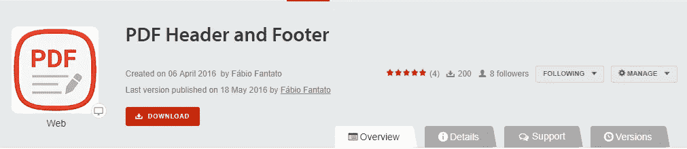
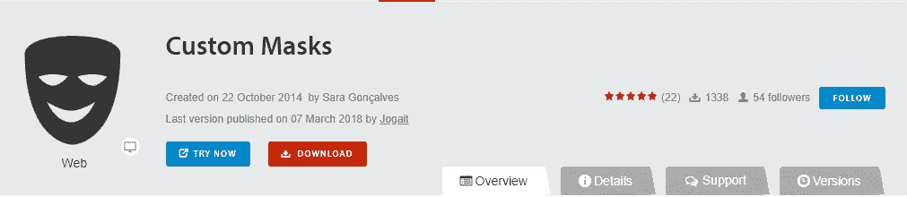
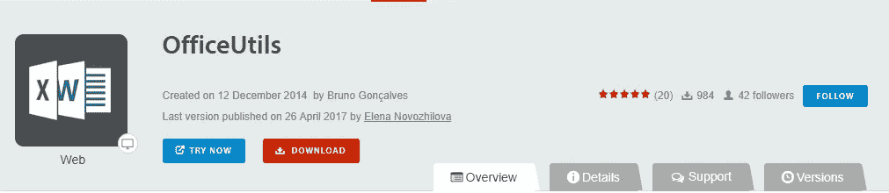
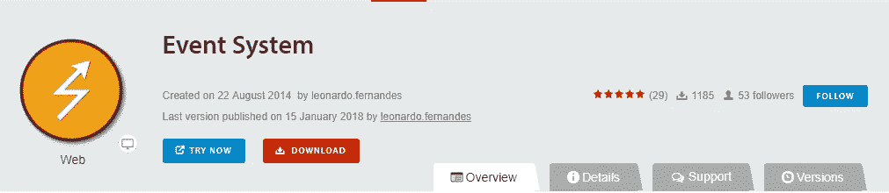

# 从黄昏到黎明(一):OutSystems 的 Web Forge 组件的金色蜂鸣器

> 原文：<https://itnext.io/from-dusk-till-dawn-1-fb62935e01e4?source=collection_archive---------5----------------------->

嗨，我的朋友们。我回来开始我的技术文章，正如我在上一篇帖子中承诺的那样。但是我没有从报告系列开始，而是决定将我的文章分成两部分。

第一期将每月出版，我会涵盖我想与你分享的主题。这条路径将从报告开始，现在已经在烤箱上了，我希望很快就能发布第一个。

另一条路是我称为从黄昏到黎明的系列。但是不要害怕，塔伦蒂诺和罗德里格斯不会在这里写任何字。它的灵感来自巴西社区，他们要求我写下我最喜欢的 Forge 组件，并组织一个前 10 名的列表。我决定每两周探索一次按主题分组的不同组件集，选择那些我知道有用或者应该在您的环境中占有特殊位置的组件。

# OutSystems 的 Web Forge 组件的黄金蜂鸣器

我选择了我认为在所有外部系统基础设施中必不可少的组件。当我负责安装一个新环境时，他们是那些不能被忘记的人。

## Silk UI Web

Silk UI 是一个由 OutSystems 团队创建的用于移动和网络应用的低代码 UI 框架。**不计入申请对象(AO)。**

自从 Silk 诞生以来，我从未开发过任何没有 Silk 的应用程序。即使是较小的，概念验证，尤其是在演示中。所有用户都应该有好的体验，如果你选择使用它，你就不会浪费时间。

 [## OutSystems Silk UI

### 查看有关框架的更多详细信息

silkui.outsystems.com](https://silkui.outsystems.com/)  [## silk UI Web-out 系统

### 在 OutSystems 平台内工作的完全响应的漂亮的 UI 框架构建了惊人的外观…

www.outsystems.com/forgeorge](https://www.outsystems.com/forge/component/916/silk-ui-web/) 

## Silk UI Web 主题

Silk UI Web 主题是在 Silk UI 框架上开发的，为您启动应用程序提供一些初始选项。它们可以定制、扩展和调整。【Silk 中没有一个模板计入应用对象(AO) ，所以我建议你全部安装。它的用处有很多。

 [## 模板网络丝绸用户界面

### 编辑描述

silkui.outsystems.com](https://silkui.outsystems.com/Templates_Web.aspx) 

## Silk UI 示例页面

这些示例对于指导您创建自己的应用程序非常有用。有可能使用大量的屏幕样本来产生想法或加速您的日常工作。**(计入 AO，但只能参考，之后可以删除，不需要发布)**

 [## Silk UI 示例页面-外部系统

### 示例页面充分利用 off 模式提供预先构建的页面内容，可以很容易地在任何屏幕上使用…

www.outsystems.com](https://www.outsystems.com/forge/component/921/silk-ui-sample-pages/) 

## 自动化 Web 主题配置器

不同于官方主题定制工具，这个组件允许你基于 Silk UI 模板为你的应用定制大量的参数和模式。这是一个从零开始启动应用程序的神奇工具。**(计入 AO)**

 [## 自动化 Web 主题配置器-外部系统

### 使用此应用程序快速创建任何基于 Silk UI 的主题的样式

www.outsystems.com](https://www.outsystems.com/forge/component/3155/automated-web-theme-configurator/) 

## 简单报告

大多数应用程序至少需要一个小报告。这就是这个组件的思想。它提供了一种简单的方法来生成报告，而不会忘记安装不同的工具和创建复杂的布局。

有一些伟大的功能，但也有一些限制。正如我之前所说，我将在我的第一篇主要文章中探讨它。

 [## 简单报告-外部系统

### 一个非常简单和容易的报告系统，使用了先进的 CSS 和 JS，可以直接在你的页面中预览

www.outsystems.com](https://www.outsystems.com/forge/component/1414/simple-reports/) 

## Html2PdfConverter

该组件使用一个外部工具包来生成基于 HTML 页面的 PDF。使用丝绸主题有些问题。所以，你需要为你的应用程序创建一个独立的主题来使用它。它还要求您的基础结构中的管理权限，以安装最新的 pdf toolkit。

这种方法的主要问题是，您需要将报表创建为 HTML 页面，包括分页、页面控制、页眉和页脚。

 [## Html2PdfConverter - OutSystems

### 基于 wkhtmltopdf https://wkhtmltopdforg/

www.outsystems.com](https://www.outsystems.com/forge/component/209/html2pdfconverter/) 

## PDF 页眉和页脚

事实上，这不是一个真正的组件，而是一种封装 Html2PdfConverter 以包含页眉和页脚功能的包装器。

 [## PDF 页眉和页脚-外部系统

### 这个示例显示了如何使用 Html2PdfConverter 来使用页眉、页脚和页码

www.outsystems.com](https://www.outsystems.com/forge/component/1242/pdf-header-and-footer/) 

## 自定义遮罩

如果您在 web 应用程序中使用表单和输入数据，您可能会需要它。锻造厂还有其他选择。但这是我最喜欢的一个，因为它涵盖了几个用例，并且可以扩展到您自己的需要。

 [## 自定义掩码-外部系统

### 使用输入掩码自定义可编辑的表格/表单

www.outsystems.com](https://www.outsystems.com/forge/component/647/custom-masks/) 

## OfficeUtils

将您的应用程序与 Excel 和 Word 集成可能是一项艰巨的工作。使用此组件，您将能够创建模板并使用自己的数据填充占位符。如果您的报告中有复杂的布局和/或您的最终用户可以选择自定义模板，这将非常有用。

 [## OfficeUtils -外部系统

### 为 NET 和 Java 堆栈提供向 Excel 和 Word 的高级导出功能

www.outsystems.com](https://www.outsystems.com/forge/component/687/officeutils/) 

## 事件系统

你有多少次试图将一个参数或一个复杂的记录结构从你的网页块发送到它的父屏幕？或者在其他屏幕动作中重用屏幕动作。现在这是可能的。这个组件是你最好的朋友。它的文档很好也很完整。有一个教程可以帮助你全方位的设置和使用它。

 [## 事件系统-外部系统

### 在您的 OutSystems 应用程序中使用自定义事件！在 web 块之间即时交流事件，重构您的屏幕逻辑…

www.outsystems.com](https://www.outsystems.com/forge/component/597/event-system/) 

## 搜索和自动完成

本机自动完成功能易于使用，但有一些限制。这个组件提供了一个很好的自动完成特性，并且很容易配置。它的文档也很好，非常完整。有一个教程可以帮助你全方位的设置和使用它。它来自《事件系统》的同一作者。从 Silk Ui Web 的 *WebPatterns* 中选择 2 也是一个很好的模式，但是如果你需要定制你的自动完成，这是最好的主意。

 [## 搜索和自动完成系统

### 设计丰富的自动完成控件，让您的用户能够通过现代搜索找到他们的数据…

www.outsystems.com](https://www.outsystems.com/forge/component/494/search-and-autocomplete/) 

哇，这个列表比我想象的要大。但这里是我在外部系统环境中一直拥有的最小组件集。

在接下来的**从黄昏到黎明**系列文章中，我们将介绍一个调整你的架构的工具集，我的 out systems Mobile Forge 组件的金色蜂鸣器，我们还将探索许多其他的 Forge 组件。

感谢阅读！让我知道你的想法

*感谢阅读。我希望你喜欢它。请让我知道你的想法。留下你的评论。给下一篇文章主题的建议。我想听听你的意见。如果你喜欢，请关注我的频道，分享吧。可以通过*[*LinkedIn*](https://linkedin.com/in/fantato/)*或* [*OutSystems 简介*](https://www.outsystems.com/profile/40762/) *联系我。*

Fábio Fantato 是一个住在里斯本的巴西人，从事专家咨询工作@ Do IT Lean | OutSystems MVP |热爱创新、电影、技术、烹饪、观光和书籍。

[**精益生产——您可以依靠的系统专家！**](http://doitlean.com/)

**统治他们所有人**