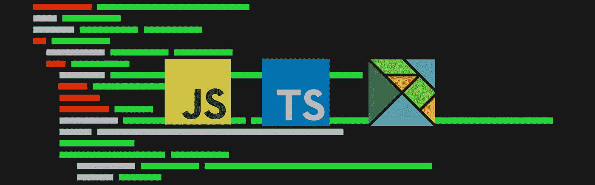
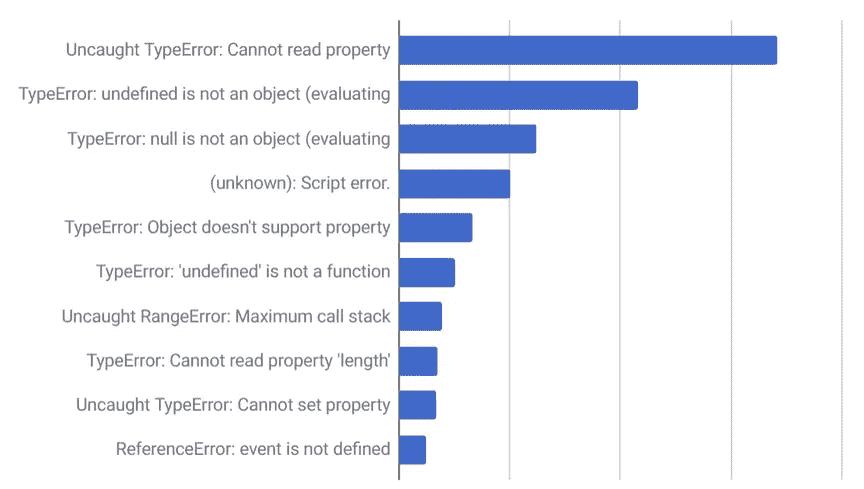

# 从 Javascript 到 Typescript 再到 Elm

> 原文：<https://itnext.io/from-javascript-to-typescript-to-elm-5c36fca70b4a?source=collection_archive---------0----------------------->



在本文中，我将介绍我在所有三种语言之间的迁移过程，并解释**为什么以及**带给我什么。

我希望我能给你们一些启发，并说服你们中的一些人为了你们的软件及其可靠性去尝试一种新的语言。

# java 描述语言

任何在生活中编写过 javascript 的人都已经遇到过太多次下面的一般性错误:



最初，我们中的许多人都是从 javascript 开始他们的旅程的，因为他们需要给一些网站添加一些“简单”的功能。有些人会使用像 [jQuery](https://jquery.com) 、 [Lodash](https://lodash.com) 或 [Underscorejs](https://underscorejs.org) 这样的库。

最终，随着你的成长，你会开始开发更大的 web 应用程序，这些程序会变得更加复杂，所以你会转向像 [Angular](https://angular.io) 、 [Vuejs](https://vuejs.org) 或 [Reactjs](https://reactjs.org) 这样的框架。

也许你有不同的道路，你来自一个更后端的经验。如今， [NodeJS](https://nodejs.org/en/) 已经成为后端应用的一个非常受欢迎的选择，它允许你用……是的，javascript 来写。

无论您来自何方，您都已经看到了它，并且您可能仍然在这样做，编写 javascript 代码，最终显示上面显示的那些错误之一。

# 为什么 Javascript 实际上是一种可支持性良好的语言

Javascript 的主要问题是该语言必须支持向后兼容。javascript 不像其他语言那样有“版本”(例如:Java7 -> Java8)。

因为这种语言最初基本上是为 web 浏览器编写的，所以只要浏览器支持这种语言的标准，这种语言就可以一直工作。这基本上允许一个在 20 世纪 90 年代编写的网站在你新的 Chrome 版本中仍然工作，即使编写的代码基本上是 30 年前的。

浏览器最终会赶上并支持 javascript 的更多新功能，这使开发人员的生活变得轻松，但它仍然支持向后兼容，以便这个非常旧的网站继续工作。这是万恶之源，因为为了支持旧代码，这种语言无法做出任何突破性的改变，而这些改变会为了更大的利益而改变做事的方式。

也就是说，如果你真的为网络浏览器编写了一个应用程序，这个应用程序很可能会永远有效。

# 为什么 Javascript 在可维护性方面是一种可怕的语言

现在你可能会问，如果它这么好，因为事情将永远工作，为什么我从 Javascript 转移到 Typescript？

Javascript，顾名思义，是一种脚本运行时编程语言，意味着你写的任何东西都会一直运行。那就是，你写的剧本是好是坏。

众所周知，Javascript 在运行时会崩溃，因为你经常会写一些代码，但这些代码并不能保证一切都好。当你与外部 API 交互时，这种情况通常会越来越多。如果代码不是 *null* 或 *undefined* ，那么总是掌控全局并保护您编写的每一行代码并验证它是非常困难的。

> 问题是，它崩溃了，而且是以最糟糕的方式崩溃:运行时崩溃。这意味着，是您的最终用户发现了这些错误，而不是您。

如果您计划创建一个可靠且易用的 web 应用程序，那么使用 javascript 不会帮助您长时间维护您的应用程序，因为错误最终会出现，而您不会知道它们。你的用户将会面临这些错误，你需要调试每一个错误，以了解那些 *null* 或 *undefined* 来自哪里。

# 如何使用 Typescript 解决这些问题

[Typescript](https://www.typescriptlang.org) 是 Javascript 的超集语言。
简而言之，它扩展了 Javascript，允许你用 Javascript 写任何可能的东西，但是能够使用 Typescript 构建的生态系统。

您将立即从 Typescript 中受益的一件事是编译器。Typescript 将警告并阻止您将 typescript 代码编译为 javascript 代码。

从版本 3.2 开始，typescript[能够做一些事情，例如:](https://www.typescriptlang.org/docs/handbook/compiler-options.html)

*   保护您免受可能的*空*或*未定义的*对象
*   没有未使用的参数或变量
*   验证您的条件的完整性，以及您是否已针对某个状态正确检查了某个对象

这样可以防止小错误，编译器会帮你发现这些问题。如果您能够将检查这类问题的工作交给 Typescript，您应该会得到更少的运行时错误。

> 依赖编译器对您的代码来说是一件非常好的事情，如果您在其他地方更改了一些东西，它会像雪球一样越滚越大，Typescript 会开始警告您潜在的错误。

Typescript 的另一个很好的部分是它的类型系统，这是 Javascript 中不存在的。
类型化变量允许 Typescript 识别对象或变量的类型是否正确。

```
let n: number = 0;
n = “a”; // Typescript will not allow that, as this is attempting to convert a number type to a string.
```

在代码中使用类型可以让编译器更多地了解你的代码并帮助你。这将确保您的代码得到适当的维护，并遵循严格的准则，以获得更好的功能可预测性。

这里有一个 Javascript 和 Typescript 的例子，以及在这种情况下类型系统是如何拯救我们的:

```
// Javascript
var a = “test”;
a = 0;// Because of the last line of code, this will never reach.
// Javascript wont tell you anything about it either, you will realize it at runtime that something is off
if (a === “test”) { 
 runSomeVeryImportantFunction();
}// Typescript
let a: string = “test”;// Typescript will raise an error and prevent you from doing this assignation. 
// The compiler protected here what could’ve been a runtime error.
a = 0;if (a === “test”) { 
 runSomeVeryImportantFunction();
}
```

这是一个非常简单和通用的例子，但是随着应用程序的增长，您最终会遇到这些简单的错误，因为事情失去了控制。如果您可以依靠编译器来保护您免受这些错误的影响，那么您将会有更少的运行时错误。

# Typescript 的缺点和我为什么搬到 Elm

Typescript 提供了许多很棒的东西，比如类型安全系统，一个更好的以 OOP 为中心的系统(类和对象),并且基本上将 Javascript 提升到了一个全新的水平。

但还是，一个超集，支持 Javascript 能做的 100%，也就是 Typescript 的问题。由于这一点，代码总是倾向于不安全的类型，开发人员最终会忘记正确地输入他们的东西，并会到处出错。它仍然不能保护你免受外部 API 变化的影响，而且系统中的每个变量都是可变的…这是问题的最大原因之一。

作为开发人员，你有责任寻找外部模块来帮助你完成诸如捆绑、状态管理、缩小等工作。

在我工作的地方，我们运行一个非常精致的 NodeJS 服务器，全部用 typescript 编写，我们到处使用**高级类型**和**枚举**以确保我们尽可能地安全，它工作得很好。我们打开了所有的严格标志，确保从 Typescript 的角度来看，我们的代码是尽可能严格类型化的。

> 它提供了洞察力，保护我们免受许多陷阱，并增加我们对应用程序的信心，但语言并不强制执行这些标准，我们必须手动维护它们，当有人新来并不遵循这些标准时，这就是一个问题。

Typescript 也允许你作弊，使用`any`类型，你基本上可以跳过所有的类型检查，告诉 typescript 某段代码可以做任何事情。当你不想遵守这个系统时，这些很容易使用，许多人把它作为一个简单的出口来更快地完成他们的功能。

我对 Typescript 的体验很棒，它是 Javascript 爱好者之间的一座很好的桥梁(也是一座容易跨越的桥梁),就像在家里一样。如果你正确地使用类型系统，你将能够从编译器获得更多的支持，但那是在你这样做的情况下。语言不会强迫你遵守，你总是可以逃避。

Typescript 不能保护您免受影响状态可变性的副作用的影响。我遇到过几个难以跟踪的问题，这些问题是由数据可变性引起的角度和反应原因造成的。

Typescript 将允许您编写 ES6+函数，并将其编译为较低级别的 Javascript 版本，这样它就可以更好地跨浏览器支持，这也是另一件好事。

# 那么什么是 Elm，为什么它比 Typescript 好？

让我们从一件事开始: **Elm 是一种函数式语言**，如果你以前从未接触过，这将是一个很大的进步。

[Elm](https://elm-lang.org) 是一种编译成 Javascript 的语言，就像 Typescript 一样，但是它是一种全新的语言**不会尝试和妥协**。

> Elm 保证您永远不会得到运行时错误。

这是一种语言，一旦数据在它的系统中，任何东西都不能处于*空*或*未定义*的状态。事物总是有价值的，系统永远不会崩溃，因为事物也有它们自己的类型。

Elm 自带了开箱即用的`Data Immutability`、`Bundles`和`Minify`代码，最重要的是，它`Enforces type safety`，防止开发人员试图偷工减料。它速度很快，重量也很轻。

如果您担心，输出可以很容易地嵌入到任何 web 页面中，所以如果您的项目是巨大的(您不需要将您的所有代码转换成 elm 来嵌入它)，从一个小的试验开始并不困难。

它有一个先进的打字系统，可以让你做更多的事情，我将在另一篇博客文章中全面介绍。

因为 elm 是一种函数式语言，所以您不会陷入由副作用引起的奇怪状态，并且您的代码非常容易测试。给定相同的输入数据，您编写的函数将总是返回完全相同的结果。

因为您非常依赖 Elm 编译器，所以更新和重构代码绝对是轻而易举的事情。编译器会抱怨很长时间，但是当它停止抱怨的时候，你就可以开始了。不需要测试任何东西，只需按照编译器的指导去发现错误，一旦你这么做了，你的代码就会重新开始工作。这种体验真的会让你对你的软件有一个很好的信心，即使是在你把它拆开并重新构建之后。(通常情况下，您会不确定是否遗漏了什么)

## 榆树建筑(茶)

Elm 有它所谓的自己的架构，一些项目就是基于这个架构(Redux)。在茶馆工作很愉快，事情很简单，也容易管理。它在分离逻辑和其他部分方面做得非常好，这在测试代码时非常有用。

因为语言是这样构建的，所以所有开发人员都被迫遵循这种模式，并对他们创建的任何东西都严格要求。在 elm 中没有`any`这样的东西，因此，每个贡献者都被迫正确地编写代码。结果很简单:**更好的代码，更好的可维护性，没有运行时错误**。

Elm 会强迫你一直处理所有的情况，从某种程度上来说，作为一名开发人员，这会给你带来压力，但这是一件好事。如果你以一个 API 调用为例，那么你必须处理`Failure`、`Success`和`Loading`的情况，但是最终的结果是，所有这些处理后的情况不仅会让用户更好地理解正在发生的事情，而且在发生不好的事情时也不会出错(通常你可能不会在 Typescript 中编写代码来涵盖这种情况)。

## 进入榆树的最困难的部分

来自 C++、C#、Java、Typescript、Python 的背景，我更习惯于编写循环(While/For ),而当你使用函数式语言时，就没有这些东西了。你必须使用诸如`Map`、`Fold`、`Filter`等函数，当你想要循环时，这就是你如何操作你的数据。我发现最初很难适应这种情况。

> 当你开始理解这一切是如何运作的时候，结果是惊人的。当你回到一个老项目并应用这些原则时，你会变得更有效率。

Elm 是一种完全不同的语言，学习它需要一些时间，你也必须努力去理解这种语言的新关键字和模式。一个好的起点是 ElmProgrammin g。

最初编写编码器和解码器是一项复杂的任务，感觉需要很长时间，但正因为如此，elm 能够确保您的数据在进入 elm 机器之前始终是安全和有效的。由于这些原因，编译器能够确保输入和输出数据总是安全的。你必须花适当的时间来学习如何创建和使用它们。

Elm 不允许你自己保存任何东西。您不创建变量。您只需传回您的整个新模型，elm 会负责将该模型保存在内存中(因为这是一个不纯粹的方法)。这对我来说很难理解，因为我习惯于将数据作为类参数保存在类中(例如私有变量)。这使得你只有一个被保存的状态，并且这个状态是你的主模型，你可以操纵它并且改变它。只是，很难改变你处理代码的方式。

# 试一试，将你的代码库升级到一种语言，这种语言将在整个过程中对你有所帮助

如果你还在写 Javascript，你应该认真考虑升级到 Typescript。它将帮助您减少运行时错误，那些想要更多保护和可靠性的人应该考虑尝试 Elm，看看他们会喜欢它。

老实说，我从来没有从编写代码中获得如此多的乐趣。Elm 构建得非常好，用这种语言构建 web 应用程序会让工作变得更加愉快。

我们每天/每周都会向我们的在线生产云平台推送更新，这对任何人来说都不是什么大事。如果编译器编译了你的代码，你知道，没有什么是坏的。运行一些测试，我们就可以开始部署代码了。

你在 Elm 中得到的唯一错误是逻辑错误，但是这些错误是由你造成的，你是一个认为自己的东西不对的开发者。

我希望这将有助于一些开发人员在他们的代码中前进，并使用更好的语言/工具以更可靠和更愉快的方式支持他们的 web 应用程序。