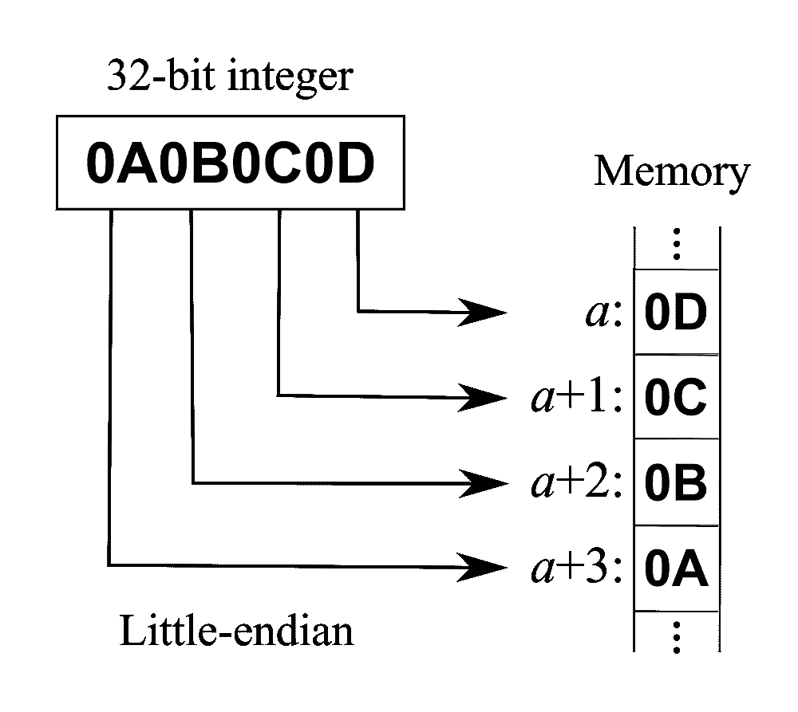
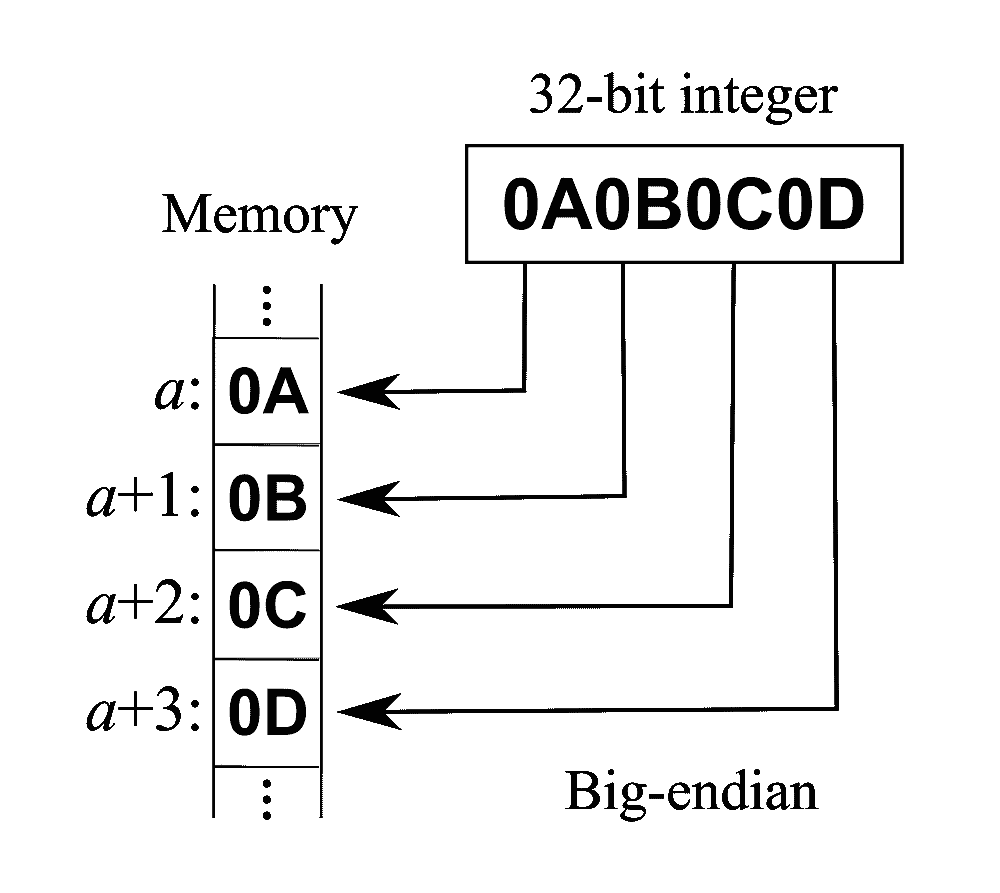
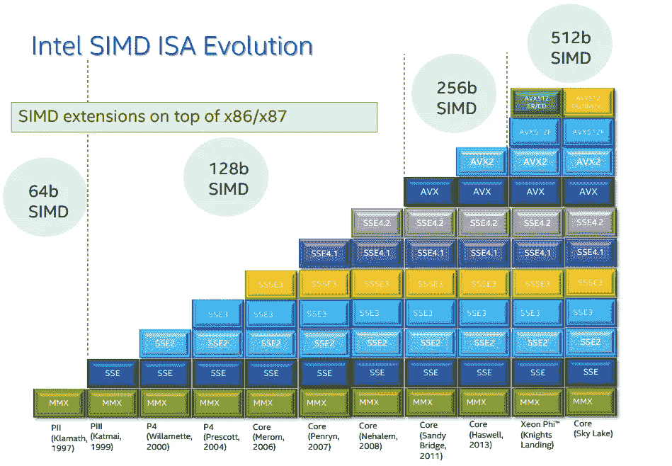
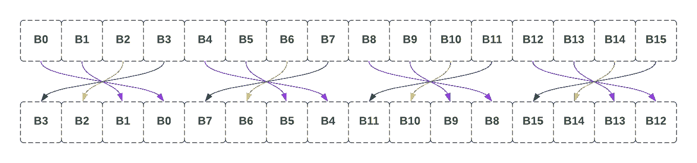

# 从少年到天才:一个优化的故事

> 原文：<https://itnext.io/from-junior-to-genius-an-optimization-story-ab20afc8159d?source=collection_archive---------0----------------------->

## 重构校验和，直到它运行快 100 倍


准备接受挑战

最近，我遇到了一个散列方法，它位于多年来被不同开发人员重构过几次的热门代码路径中——这是一段有趣的 Git 历史。每个人都带来了自己的一套工具和知识，应用不同的技术和选择不同的折衷方案。

观察一个方法随时间的演变是认识到性能范围有多广的好方法，即使对于简单的例程也是如此。在处理高级语言时尤其如此——源代码和编译代码之间有许多移动部分，减少执行时间的机会无处不在，有时很明显，有时不太明显。

# 挑战

我们准备拿一个简单的*校验和*的方法，交给六个不同的开发者，分别命名为**初级**、**专业**、**高级**、**黑客**、**专家**和**天才**。他们会用尽他们的能力去优化它，我们希望能从他们每个人身上学到一些东西。

以下是限制条件:

*   **C# / dotnet 6。拥有一个 JIT 编译器让它变得更有趣。**
*   **单线程。**我们不打算探索并行化。
*   **x86。** ARM、WASM 等目标将被排除在外。

事不宜迟，下面是我所说的**少年**校验和:

该方法非常简单，累加 4 列和，并使用来自每个累加器*的 LSB 将其缩减为一个`*uint*`。给定需求，这就是我期望一个受过教育的初级开发人员所交付的东西。*

> 我知道你在想什么:Junior 刚刚从 StackOverflow 复制了这个。如果你是大三，我告诉你:没关系。每个人都在某种程度上这样做——只是要确保你明白你在复制什么。

# 职业选手来了

所以现在我们的小校验和被交给了专业人士。Pro 已经混了一点，学了几招，但还是称不上资深。

Pro 做的第一件事就是基准测试 Junior 的代码来建立一个基线。

基准测试使用 1MB 的缓冲区，其中充满了随机数据。

结果如下:

```
|   Method |  Length |     Mean |
|--------- |-------- |---------:|
|   Junior | 1000000 | 1.799 ms |
```

这些数字是好是坏？1Mb 的数据需要 1.8 毫秒，这似乎很快，但任务很明确:让它更快。在挠头了一会儿之后，Pro 决定展开循环。

循环展开是一种以代码大小换取性能的技术。这个想法是在每次循环迭代中做更多的工作。所以与其说:

```
for (x = 0; x < 100; x++)
{
     work(x);
}
```

有人会写:

```
for (x = 0; x < 100; x+=5)
{
    work(x);
    work(x+1);
    work(x+2);
    work(x+3);
    work(x+4);
}
```

背后的主要推理是，在每一次迭代中，都会有一次比较( *x < 100* )，一次加法( *x++* )，一次跳转。通过重复这些语句，编译后的代码导致更少的操作，因为现在跳转和比较在每 5 个 *work()* 调用中只发生一次。

> 大多数编译器都将循环展开作为优化工具之一。通常，如果循环具有固定的低迭代次数，您会注意到展开发生在生成的程序集上。

Pro 版本的校验和:

虽然有可能，但这个版本每次迭代使用 16 个字节。之后，它执行几个 4 字节的循环，最后添加最后 3、2 或 1 个剩余字节。这些代码要多得多，但是值得吗？

```
|   Method |  Length |       Mean |     Median | Ratio |
|--------- |-------- |-----------:|-----------:|------:|
|   Junior | 1000000 | 1,855.5 us | 1,825.4 us |  1.00 |
|      Pro | 1000000 |   373.8 us |   373.8 us |  0.20 |
```

对比基准尖叫是的。比 Junior 快 5 倍。

# 在路上的几年有什么不同吗？

我们现在把任务交给**高层，**同样的简单命令:让它更快。

Senior 已经存在了相当长一段时间，实际上已经存在了很长时间，以至于当他们刚开始编程时，C#是一个笑话。学长用 C 写了很多代码，懂指针，懂汇编代码。

请注意，有些 Gists 只显示解决方案中最相关的循环。在本文的结尾，有一个 Github 库的链接，你可以使用它。

更新的性能指标评测，比专业版提高了 1.6 倍，比初级版提高了 7.8 倍:

```
|   Method |  Length |       Mean | Ratio |
|--------- |-------- |-----------:|------:|
|    Junior| 1000000 | 1,803.0 us |  1.00 |
|      Pro | 1000000 |   365.2 us |  0.20 |
|   Senior | 1000000 |   231.6 us |  0.13 |
```

代码看起来很像 Pro 的，所以让我们分解一下变化，了解一下是怎么回事。

## 1.将该方法标记为不安全

```
public static uint ChecksumPro(ReadOnlySpan<byte> arr)
public unsafe static uint ChecksumSenior(ReadOnlySpan<byte> arr)
```

第一个编辑是将`*unsafe*` 关键字添加到签名中。例如，这允许我们在方法中使用指针。在 C#世界中，这是开发人员做出的声明，翻译成“我知道我在做什么，编译器，冷静点。”

## 2.实际上获得一个指针

```
fixed (byte* ptr = arr)
```

在 C#中使用指针最常见的方式是在固定的**范围内。用 C#文档自己的话说:**

> fixed 语句防止[垃圾收集器](https://learn.microsoft.com/en-us/dotnet/standard/garbage-collection/)重新定位一个可移动变量，并声明一个指向该变量的指针。

基本上，它确保我们得到的指针保持有效，CLR 不会移动底层数据。这种担心只发生在这里，因为我们是在托管内存环境中操作的。CLR 在我们认为的变量和实际内存地址之间增加了一个抽象层。(公平地说，操作系统还增加了一个抽象层，为进程提供虚拟内存，但这不在我们讨论的范围之内)。每个抽象都不可避免地引入了开销。这是开发人员为垃圾收集器的便利所付出的代价。在 C#中使用指针是为了暂时绕过这种抽象。

从这里开始，代码看起来几乎完全相同，但它不是索引数组，而是索引指针:

```
arr[z + 0] //indexed array 
ptr[z + 0] //indexed pointer
```

## 3.密切关注 ASM

到最后，C#代码会被翻译成机器代码来执行。当您达到这种详细程度时，从执行路径中删除的每个指令都将被计算在内。以这两种方法为例:

使用无符号整数的版本少了一条指令。因为在第一种方法中我们使用的是`int` *，*编译器在每次内存访问(`**movzx**`)前加了一个`[**movsxd**](https://www.felixcloutier.com/x86/movsx:movsxd)` [](https://www.felixcloutier.com/x86/movsx:movsxd)。

**movsxd** 是*随符号扩展移动*

基本上，它是从一个有符号的整数转换成一个无符号的整数来索引指针。您可能认为多一条指令没有坏处，但是如果恰好在一个紧循环中，6 条指令对 7 条指令可以转化为 15%的性能差异。

> 我知道有些人接下来会说什么:你需要考虑指令互易吞吐量、等待时间和流水线，才能真正实现上面的陈述。没错，我为了证明一个观点而过于简单化了。

同样值得一提的是，在我们的例子中，虽然显示的是 X86 ASM 代码，但实际发生的是编译器输出 IL 代码，然后根据平台由 JIT 编译器编译成机器码。例如，这里的语句可能对 ARM 指令集无效。

除此之外，不能保证 JIT 总是输出相同的 ASM 指令。JIT 是一项工程壮举，充满了启发性和不断的进化。我们今天编写的代码明天可能会编译成不同的指令集，因为 JIT 已经更新了新的性能技巧。这是使用即时编译器在框架上工作的好处——我们的代码可能运行得更快，而不需要我们实际发布更新。不利的一面是，它会降低性能的可预测性。

好吧，但是在专业版和高级版之间真正改变的是什么？让我们来看两者的反编译 ASM 的一部分:

即使不知道每条 ASM 指令具体在做什么，也很容易注意到一种模式:

```
lea      ebx, [r11+0CH]
cmp      ebx, ecx
jae      G_M000_IG17
mov      ebx, ebx
movzx    rbx, byte  ptr [rdx+rbx]
add      eax, ebx
```

对比:

```
lea      ebx, [r11+08H]
movzx    rbx, byte  ptr [rdx+rbx]
add      eax, ebx
```

让我们分解第一行:

```
lea      ebx, [r11+0CH] //loads data into ebxcmp      ebx, ecx       //compares ebx to ecxjae      G_M000_IG17    //jump to G_M000_IG17 if result from compare
                        //is above or equal 0mov      ebx, ebx       //moves data from address in ebx into ebx
                        //this is a pointer dereferencing (*ptr)
```

这个跳跃在这里做什么？

如果检查标签 G_M000_IG17 处的内容，我们会发现:

```
G_M000_IG17:                ;; offset=0445H
        E8E675C15F           **call**     CORINFO_HELP_RNGCHKFAIL
        CC                   **int3**
```

好吧——看来是范围检查失败了。现在清楚了:如果代码试图访问数组的越界位置，额外的指令负责抛出异常。这就是为什么上面的代码片段抛出一个异常，而不是在`arr[2]`读取未定义的数据:

```
var arr = new byte[1] { 0 };
var invalid = arr[2];       // IndexOutOfRangeException thrown
```

如果不检查边界，访问无效地址，会发生什么情况？各种讨厌的东西，SEGFAUTS 和类似的。不漂亮。这是 C#在你的自行车上安装辅助轮。

高级代码通过使用**不安全的**关键字和指针，避免了在紧密循环中的这些绑定检查。因此，大多数读/写模式最终使用 3 条指令，而不是 6 条。

> 如果 JIT 编译器能够证明索引永远不会超出数组的界限，它就能够移除界限检查。Pro 犯了一个错误，如果修复，将导致 JIT 编译器删除绑定检查，并在不使用指针的情况下使其性能更接近高级。我鼓励你去发现它。

有些人会说，最重要的方面实际上是消除所有这些跳转，因为跳转意味着分支，而分支意味着 CPU 必须进行推测性执行，并试图预测分支将采用哪条路径。我明白了，但是在这个练习中，为了简单起见，让我们把更少的指令看作是更少的工作。

# 谁需要黑客？

学长的解决方案很棒。超越这一点需要打破常规的思维。我们把它交给**黑客。任务还是一样:让它更快。**

我们得到这个:

```
|   Method |  Length |       Mean | Ratio |
|--------- |-------- |-----------:|------:|
| Baseline | 1000000 | 1,761.0 us |  1.00 |
|      Pro | 1000000 |   363.6 us |  0.21 |
|   Senior | 1000000 |   224.6 us |  0.13 |
|   Hacker | 1000000 |   120.0 us |  0.07 |
```

比高年级学生提高了 2 倍，但在外行人看来可能是垃圾。然而，你们中的一些读者可能已经发现了窍门。你有吗？留下评论告诉我:)

在我们的挑战中，黑客的定义是:

> 一个为了达到某个特定目标，会脱离最初目的去寻找和使用工具的人。

通常，当您从真正对性能敏感的项目中读取源代码时，例如 Linux 内核，您会遇到看起来像用 ASCII 字符编写的巫术咒语的部分。一个很好的练习是去理解这些细节，并分解所使用的技术，这样它们就成为你可以用来为你自己将来可能面临的问题构建聪明的解决方案的基石。

这里的技巧是将一个`long` 重新用作一个**`**short**`**4-wide vector。**让我们来分解相关部分:**

```
ulong l1 = *(ulong*)(ptr + z);
//1\. a=(ptr + z) adds offset z to pointer ptr ( ptr is byte* )
//2\. b=(ulong*)(a) casts that pointer to a ulong*
//3\. *(b) dereferences the pointer and reads the long value
```

**所以第一个小技巧是将 8 个字节读入一个`ulong` *。*假设我们在 x64 机器上，这是一次内存读取。然后再重复 3 次:**

```
ulong l1 = *(ulong*)(ptr + z);
ulong l2 = *(ulong*)(ptr + z + 8);
ulong l3 = *(ulong*)(ptr + z + 16);
ulong l4 = *(ulong*)(ptr + z + 24);
```

**此时，我们有效地读取了 4 个`ulong`，即 32 个字节的数据，代价是 4 条指令，而逐字节读取需要 32 条指令。**

```
**l1** & **0x00FF00FF00FF00FF**;
```

**下一个技巧是对第一个`long`应用蒙版。如果我们在小端系统上标注 l1 处的字节，它看起来像:**

```
**B7_B6_B5_B4_B3_B2_B1_B0**
```

**应用我们得到的面具**

```
 **B7_B6_B5_B4_B3_B2_B1_B0** & **0x00_FF_00_FF_00_FF00_FF**
= **00_B6_00_B4_00_B2_00_B0**
```

**现在，如果我们一次看两个被屏蔽的长字节，会发生什么呢？**

```
**0x00_B6** **0x00_B4 x00_B2 0x00_B0**
```

**它的 B0，B2，B4 和 B4 从一个单字节字扩展到一个 2 宽度的字。我们将每个字节转换成一个短整型。**

```
(**l1** & **0xFF_00_FF_00_FF_00_FF_00**) >> **8**
```

**对于奇数字节也是如此，移动一个字节使它们处于正确的位置。对我们读过的所有 4 本`ulong`书都这样做，我们现在有了:**

```
M1= 00_**B6**__00_**B4**__00_**B2**__00_**B0**
M2= 00_**B7**__00_**B5**__00_**B3**__00_**B1**
M3= 00_**B14**_00_**B12**_00_**B10**_00_**B8**
M4= 00_**B15**_00_**B13**_00_**B11**_00_**B9**
M5= 00_**B22**_00_**B20**_00_**B18**_00_**B16**
M6= 00_**B23**_00_**B21**_00_**B19**_00_**B17**
M7= 00_**B30**_00_**B28**_00_**B26**_00_**B24**
M8= 00_**B31**_00_**B29**_00_**B27**_00_**B25**
```

**如果我们将 M1 与 M3、M5 和 M7 相加会发生什么？假设个人**

```
 00_**B6**__00_**B4**__00_**B2**__00_**B0
+** 00_**B14**_00_**B12**_00_**B10**_00_**B8
+** 00_**B22**_00_**B20**_00_**B18**_00_**B16
+** 00_**B30**_00_**B28**_00_**B26**_00_**B24****= [B6+B14+B22+B30]_[B4+B12+B20+B28]_[B2+B10+B18+B26]_[B0+B8+B16+B24]**
```

**我们姑且称之为对 S1、S2、S3 和 S4 的短期看法:**

```
S1= **[B6+B14+B22+B30] =** (**M1+M5**)& 0x**FF_FF**_00_00_00_00_00_00 >> 48
S2= **[B4+B12+B20+B28] =** (**M1+M5**)& 0x00_00_**FF_FF**_00_00_00_00 >> 32
S3= **[B2+B10+B18+B26] =** (**M1+M5**)& 0x00_00_00_00_**FF_FF**_00_00 >> 16
S4= **[B0+B8+B16+B24]  =** (**M1+M5**)& 0x00_00_00_00_00_00_**FF_FF**
```

**回想以前的版本，累加器是:**

```
sum0 += (B0 + B4 + B8 + B12 + B16 + B20 + B24 + B28)
sum1 += (B1 + B5 + B9 + B13 + B17 + B21 + B25 + B29)
sum2 += (B2 + B6 + B10 + B14 + B18 + B22 + B26 + B30)
sum3 += (B4 + B7 + B11 + B15 + B19 + B23 + B27 + B31)
```

**很明显，我们可以使用这些位操作实现相同的累加。**

```
sum0 = (S2 + S4)
sum2 = (S1 + S3)
...
```

**但是，如果我们在将空头合并为 sum0、sum1 等之前，继续对这些多头求和，结果会怎样呢？？**

```
while(...)
{
    tmp1 += M1+M3+M5+M7
    ...
}
```

**我们现在正在破解一个`ulong`，将它重新用作一个 4-wide `short`向量。但是有一个问题:我们不能让任何单个元素的总和超过无符号 short `0xFFFF`的最大值。**

**我们在每次迭代中为每个 short 添加 4 个字节，所以在到达`0xFF`之前，我们可以安全地这样做 64 次。**

```
0xFF * 4 *64 = 0xFF00
```

**过了那个点，任何一个短路都可能溢出，我们被黑的向量就会被破坏。因此，一旦我们做了 64 次迭代，我们提取每个向量的值，并将其添加到原始总和，重置向量。这正是该部门正在做的事情:**

```
if (limit2 != 64)
   sum0= ...
   sum1= ...
   sum2= ...
   sum3= ...
}
```

**以下是 ASM 代码在这个紧密循环中的表现:**

**这是一个扩展和带注释的版本，带有可能更容易理解的中间变量:**

# **专家为什么叫专家？**

**我用来描述专家的一个主要特征是从根本上分析问题的能力。你看，我们所有的开发伙伴都完成了任务，把他们所有的知识都倾倒在他们的前辈身上。他们中没有人质疑这一推理——他们只是利用手中的工具对其进行了改进。**

**我们的专家回顾了该方法的第一个版本:**

```
//Compute a 32-bit big-endian checksum on arr
```

**这里的线索是，这是一个大端校验和。这可以通过理解代码本身来解决，但是这个注释行一直都在那里，说明了这个方法的基本点。**

**概括地说，[字节序](https://en.wikipedia.org/wiki/Endianness)指的是字节在一个字中出现的顺序。对于数字，它是指第一个字节是 MSB 或 LSB。**

********

**来自维基百科**

**今天的大多数系统都是小端序的，但是如果我们真的在大端序系统中会发生什么呢？该方法的核心循环可能很简单:**

```
while (z < limit){
  sum += *(uint*)(ptr + z);
  z += 4;
}
```

**这正好是输入数组的 32 位总和。但是因为我们是小端的，所以当读取 4 个字节时，它们的顺序与简单求和应该工作的顺序相反。所有需要做的就是读取一个`int`，反转它们的字节，然后求和。**

**最后，这是专家的观点:**

```
|         Method |  Length |        Mean | Ratio |
|--------------- |-------- |------------:|------:|
|         Junior | 1000000 | 1,785.46 us |  1.00 |
|            Pro | 1000000 |   362.37 us |  0.20 |
|         Senior | 1000000 |   224.11 us |  0.13 |
|         Hacker | 1000000 |   120.26 us |  0.07 |
|         Expert | 1000000 |    79.83 us |  0.04 |
```

**几乎是黑客**、**的两倍，代码可读。
这是解决所有其他解决方案的根本问题的一句话:**

```
sum += BinaryPrimitives.ReverseEndianness(*(uint*)(ptr + z));
```

**它会反转读取的 4 个字节的字节顺序。这转化为单个 ASM 指令**

```
movbe    r11d, dword ptr [rdx+r10+08H]
```

**下面是`[**MOVBE**](https://www.felixcloutier.com/x86/movbe)`的定义:交换字节后移动数据。它一次读取和交换字节。用于此目的的另一个指令是`[**BSWAP**](https://www.felixcloutier.com/x86/bswap)` **，**，其在寄存器中就地操作。所以现在**专家**向我们展示了我们可以在不增加额外指令的情况下跨字节序操作。**

# **SIMD 的专家 2.0**

**SIMD 代表 [**单指令多数据**](https://en.wikipedia.org/wiki/Single_instruction,_multiple_data) **，**我知道你们很多读者都期待看到 SIMD 的解决方案。关键是 SIMD 指令允许我们一次操作更多的字节。我们的校验和似乎是这种矢量化的完美候选。**

**这是英特尔处理器上 SIMD 扩展可用性的大致时间表。我们将重点关注 AVX 和 AVX2，它们分别为 128 和 256 位宽。瞄准 AVX 和 AVX2 意味着瞄准任何从 2011 年开始生产的 CPU。**

****

**Dotnet 在 dotnet core 3 中引入了硬件内部函数。你可以在这里阅读更多的内容。网络核心-。网博(microsoft.com)。目前它支持高达 AVX2。AVX512 最终也将上市。**

**让我们先来看看 AVX 的解决方案:**

**这里的明星函数是 **Avx。洗牌，**即编译为 [**vpshufb**](https://www.felixcloutier.com/x86/pshufb.html) 。这条指令允许我们通过提供一个屏蔽参数来重新排序和屏蔽字节。我们精心制作了一个掩码，它将交换每个 4 字节块的字节顺序。**

****

**然后，它将向量重新解释为向量`unsigned int`，并将其添加到累加器向量中。在 ASM 中，这看起来像:**

```
**vmovdqu**  xmm2, xmmword ptr [rdx+r9]
**vpshufb**  xmm2, xmm2, xmmword ptr [reloc @RWD00]
**vpaddd**   xmm1, xmm1, xmm2RWD00      dq    0405060700010203h, 0C0D0E0F08090A0Bh
```

**现在只使用 3 条指令，我们就能处理 16 个字节。它有多快？**

```
|    Method |  Length |        Mean | Ratio |
|---------- |-------- |------------:|------:|
|    Junior | 1000000 | 1,774.14 us |  1.00 |
|       Pro | 1000000 |   359.41 us |  0.20 |
|    Senior | 1000000 |   223.97 us |  0.13 |
|    Hacker | 1000000 |   117.98 us |  0.07 |
|    Expert | 1000000 |    78.27 us |  0.04 |
| ExpertAvx | 1000000 |    30.62 us |  0.02 |
```

**还不错！又一个 2 倍的提升。我们现在，多亏了**专家**，比**少年快大约 57 倍。****

**下一步是从 128 宽度的向量转移到 256 宽度的向量。实现非常相似，但是我们需要注意一些问题。例如，对于大多数操作，Vector256 实际上被认为是 128 宽的两个通道。这超出了这里的范围—让我们看看我们最终是否能比我们希望的更快地达到 **100x** :**

```
|    Method  |  Length |        Mean | Ratio |
|----------- |-------- |------------:|------:|
|     Junior | 1000000 | 1,774.14 us |  1.00 |
|        Pro | 1000000 |   359.41 us |  0.20 |
|     Senior | 1000000 |   223.97 us |  0.13 |
|     Hacker | 1000000 |   117.98 us |  0.07 |
|     Expert | 1000000 |    78.27 us |  0.04 |
|  ExpertAvx | 1000000 |    30.62 us |  0.02 |
| ExpertAvx2 | 1000000 |    20.83 us |  0.02 |
```

**比初级快 85 倍左右。快到了！**

# **有时会有一堵墙挡住去路**

**需要注意的是，我们的处理速度从 **563MB/s** 提高到了**48GB/s。**在这些速度下，瓶颈变成了内存访问，而不是 CPU。**

**让我们停下来想一想。我使用的系统有 DDR4 内存，根据[维基百科](https://en.wikipedia.org/wiki/DDR4_SDRAM)的说法，这应该不会超过 25GBs。那么，我们的基准测试如何能够以 48GB/s 的速度运行呢？**

**我们观察这些速率的唯一原因是因为我们的测试数据完全适合 CPU 的 L3 缓存，在我这里使用的英特尔 i7 10875H 的情况下，它有 16MB。L3 缓存更靠近 CPU 内核，峰值可达 200GB/s，但这将因 CPU 而异。如果我们的数据适合 L2 甚至 L1，我们会看到更高的数字。**

**使用 100MB 阵列运行相同的基准测试会使我们面临 RAM 瓶颈，事实上:**

```
|     Method |    Length |       Mean | Ratio |     Bandwidth |
|----------- |---------- |-----------:|------:|--------------:|
|     Junior | 100000000 | 180.620 ms |  1.00 |   555.55 MB/s |
| ExpertAvx2 | 100000000 |  5.7772 ms |  0.03 | 17320.00 MB/s |
```

**在 17GB/s 的速度下，它实际上非常符合我拥有的特定内存模块的规格。如果我们从存储中读取文件，我们将受到磁盘速度的限制，而不是 RAM、L3 缓存，当然也不是 CPU。**

**也就是说，作为一名软件工程师，重要的是要理解性能数字来源于系统中的各种因素，代码很重要，但它只是组件之一。了解目标系统的底层组件可以帮助您计划如何更有效地安排和移动内存。**

## **多核并行化怎么样？**

**我最初声明这是我们不会探究的事情。原因现在应该很明显了。除了 RAM 瓶颈之外，L3 缓存在典型的 CPU 中的所有内核之间共享，所以这是毫无意义的。**

# **天才能让我们走得更远吗？**

**考虑到限制因素——我知道还有从本文提出的解决方案中获取更多信息的余地。**

**这里有一个回购，您可以用自己的版本复制并提交一个拉取请求:**

> **[**【github.com/israellot/checksum-challenge】**](https://github.com/israellot/checksum-challenge)**

**我会用最好的更新这篇文章。我很好奇你会想出什么。**