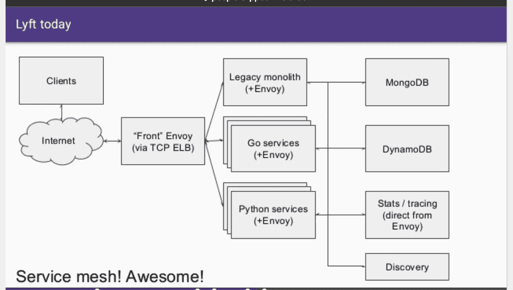
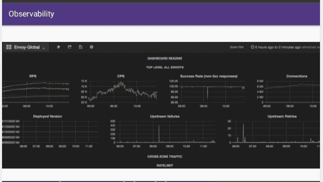

# 从整体到服务网状，通过前台代理——从构建特使代理的故事中学习

> 原文：<https://itnext.io/from-monolith-to-service-mesh-via-a-front-proxy-learnings-from-stories-of-building-the-envoy-9dab4b721089?source=collection_archive---------4----------------------->

“[服务网](https://www.youtube.com/watch?v=t_hfoAKMgOo)的概念在微服务和容器生态系统中得到了广泛的关注。这项技术有望使服务之间内部网络通信均匀化，并提供跨领域的非功能关注点，如可观察性和容错。然而，支持服务网格的底层代理技术也可以在您的系统边缘(入口点)提供大量价值，特别是在像[开源 Kubernetes-native Ambassador gateway](https://www.getambassador.io/)这样的 API 网关内。

# SOA 网络的现状

在去年由特使代理的创造者之一[马特·克莱恩](https://twitter.com/mattklein123?lang=en)所做的一次演讲中，他将 2013 年面向服务架构(SOA)和微服务网络的状态描述为“[一个非常大且令人困惑的混乱状态](https://www.microservices.com/talks/lyfts-envoy-monolith-service-mesh-matt-klein/)”。调试是困难的或不可能的，每个应用程序公开不同的统计数据和日志记录，并且无法跟踪在参与生成响应的整个服务调用栈中请求是如何处理的。对基础架构组件(如托管负载平衡器、缓存和网络拓扑)的了解也很有限。

> 太痛苦了。我认为大多数公司和组织都知道 SOA(微服务)是未来的一种，实际做它会带来很多灵活性，但在日复一日的基础上，人们会感到很受伤。这种伤害主要与调试有关。

维护基于 web 的分布式应用程序的可靠性和高可用性是大型组织面临的核心挑战。这些挑战的解决方案通常包括重试逻辑、超时、速率限制和断路的多次或部分实施。许多定制和开源解决方案使用特定于语言(甚至可能是特定于框架)的解决方案，这意味着工程师无意中“基本上永远”将自己锁定在技术堆栈中。克莱恩和他在 Lyft 的团队认为一定有更好的方法。

> 最终，健壮的可观察性和简单的调试就是一切。随着 SOA 变得越来越复杂，我们为所有这些问题提供一个通用的解决方案是至关重要的，否则开发人员的工作效率会停滞不前(并且站点会经常宕机)

最终， [Envoy proxy](https://www.envoyproxy.io/) 被创建成这种更好的方式，这个项目由 Matt 和 Lyft 团队于 2016 年 9 月在开源发布。

# 使节的演变

我在之前的一篇文章中讨论了 Envoy 的核心特性，这篇文章涵盖了 Matt 的另一篇演讲，但在这里我想谈谈高级负载平衡。代理实现“区域感知最小请求负载平衡”，并提供每个区域的特使指标。正如浮力团队在他们的博客文章“[超越循环法:延迟的负载平衡](https://blog.buoyant.io/2016/03/16/beyond-round-robin-load-balancing-for-latency/)”中所述，在应用程序/网络堆栈中的这一点上执行负载平衡允许比 SOA 网络中通常看到的更高级的算法。Envoy 还提供流量阴影，可用于将流量分支(和克隆)到测试集群，这被证明是一种在生产中测试基于微服务的应用的流行方法。

Lyft 当前的服务网状架构

Envoy 之类的第 7 层(L7)代理提供的一个核心功能是，通过基于特定于应用程序的数据(如 HTTP 头)做出路由决策，提供智能部署控制。这允许相对容易地实施蓝/绿部署和金丝雀测试，这也具有以接近实时的速度可控的优势(与使用部署机制来初始化和停用虚拟机或 pod 以确定哪些服务服务于流量的方法相比)。

# 可观性，可观性，可观性

Matt 在演讲中指出，到目前为止，Envoy 提供的最重要的东西是可观察性。通过 Envoy 传输所有服务流量提供了一个单一的位置，在这里您可以:为每一跳生成一致的统计数据；创建一个传播稳定的请求标识符(这也需要一个轻量级应用程序库来完全实现)；并提供一致的日志记录和分布式跟踪。

围绕特使建造的大使 API 网关包含了与 T2 相同的原则。指标通过无处不在且经过良好测试的 [StatsD](https://github.com/etsy/statsd) 协议公开，Ambassador 使用典型的 StatsD 协议设置(UDP 到端口 8125)自动将统计信息发送到名为 statsd-sink 的 Kubernetes 服务。还支持流行的普罗米修斯开源监控系统，并且可以在每个大使吊舱上部署一个 StatsD 导出器作为侧车。更多详情请见 Datawire 博客“[库伯内特斯监测特使和大使与普罗米修斯操作员](https://www.datawire.io/faster/ambassador-prometheus/)”。

创建有效的仪表板本身就是一门艺术，Matt 分享了他和他的团队创建的几个仪表板截图，以显示 Lyft 的 Envoy 数据。如果您想探索这种仪表盘的真实世界示例，AppDirect 的软件开发人员、《AppDirect Kubernetes 网络基础设施的演变》一书的作者 Alex Gervais 最近通过 Grafana 网站分享了 AppDirect 团队的 Grafana 仪表盘。

Matt 演讲中的特使仪表板示例

# 特使的未来

了解 Envoy 未来发展方向的最佳途径是 [Envoy 文档](https://www.envoyproxy.io/docs/envoy/latest/)本身。在我在这篇文章中提到的谈话中，Matt 暗示了几个已经实现的未来方向。这包括更多的[速率限制选项](https://www.envoyproxy.io/docs/envoy/v1.5.0/configuration/rate_limit)(一定要检查 v1 和 v2 APIs)，以及一个[开源的基于 Go 的速率限制服务](https://github.com/lyft/ratelimit)。Datawire 团队在 suite 之后发布了一系列关于如何在 Ambassador API 网关(实际上是一个特使前端代理)上实现[速率限制的文章，并发布了一个](https://blog.getambassador.io/tagged/rate-limit-series) [Java 速率限制服务](https://github.com/danielbryantuk/ambassador-java-rate-limiter)的演示开源代码。

不可否认的是，自从 Matt 发表演讲以来，这个社区已经以惊人的速度发展。针对[特使](http://envoyproxy.github.io/community.html)、 [Istio](https://istio.io/community/) 和[大使](https://blog.getambassador.io/growing-the-ambassador-api-gateway-community-7fa7ed064c9c)(以及其他几个基于特使的服务)的社区非常活跃，非常有用。那么，你还在等什么？参与并帮助引领现代云原生应用程序架构核心组件的未来。你可以在这里加入对话[！](http://d6e.co/slack)

*本文原载于* [*getambassador.io 博客*](https://blog.getambassador.io/from-monolith-to-service-mesh-via-a-front-proxy-learnings-from-stories-of-building-the-envoy-333711bfd60c) *。*