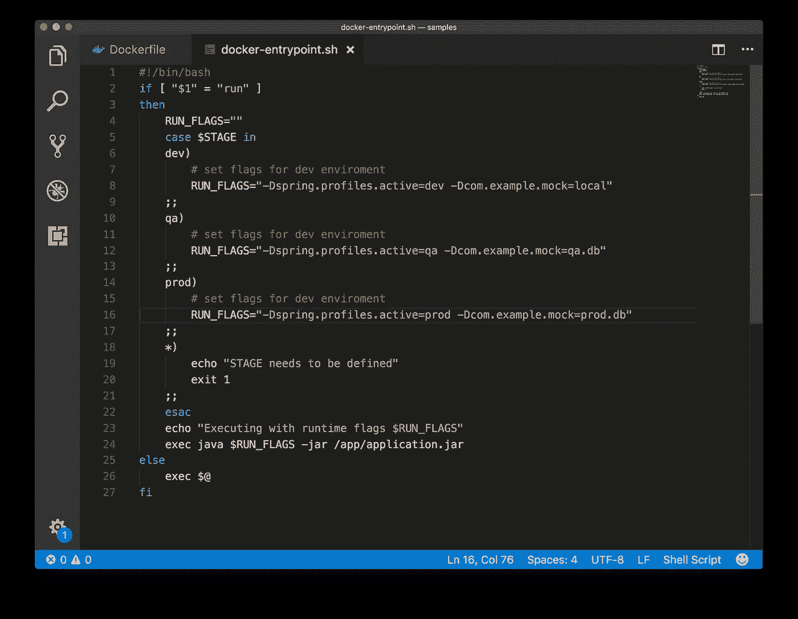
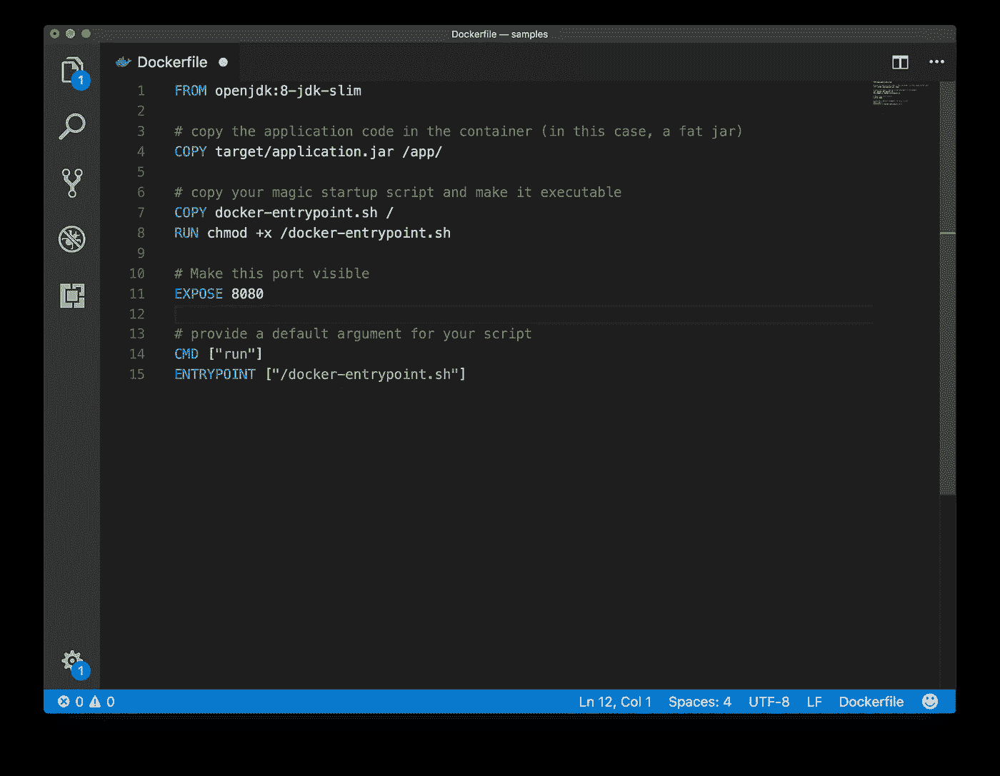
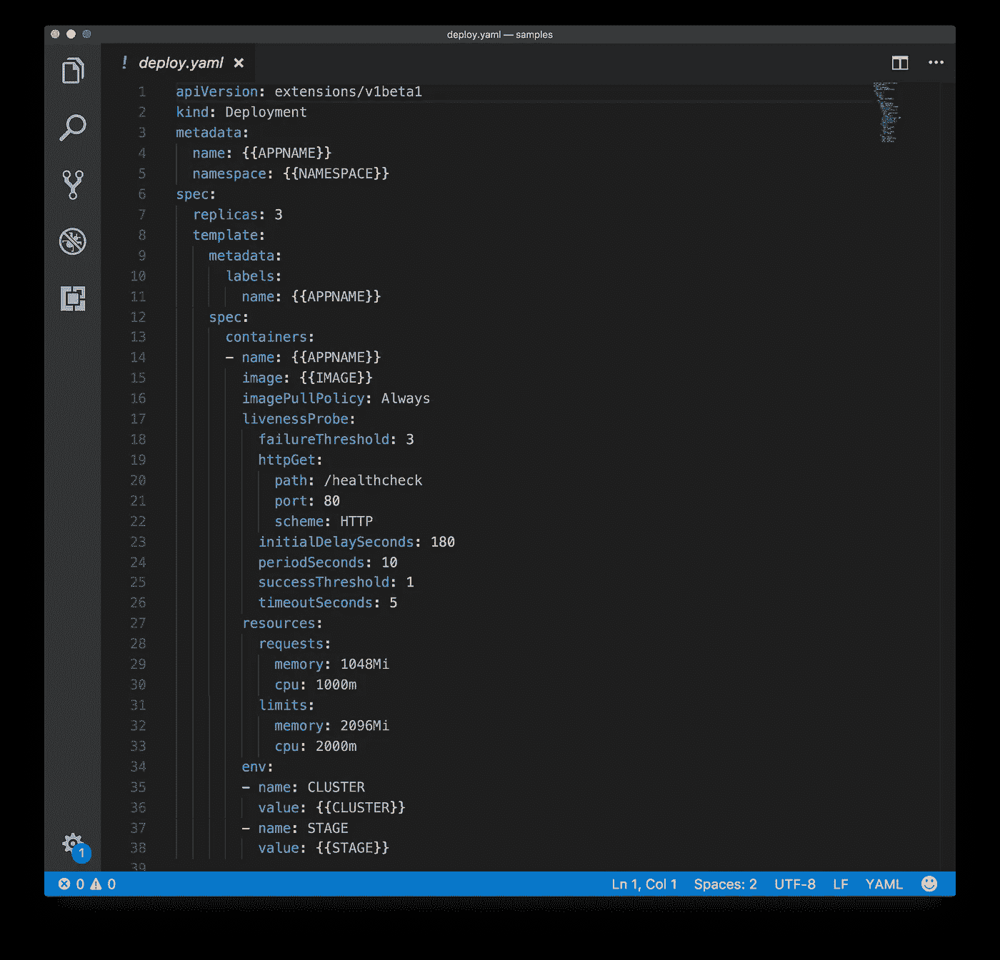
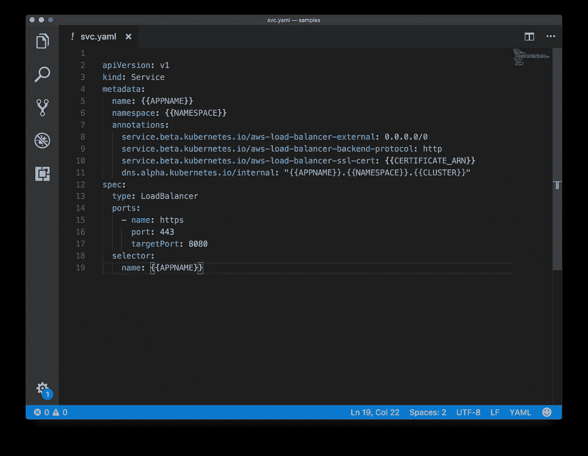

# 从整体到微服务

> 原文：<https://itnext.io/from-monoliths-to-microservices-b6b851ab43e3?source=collection_archive---------2----------------------->


[杰瑞米·托马斯](https://unsplash.com/@jeremythomasphoto?utm_source=medium&utm_medium=referral)在 [Unsplash](https://unsplash.com?utm_source=medium&utm_medium=referral) 上的《文图拉岩滩上用卵石塔平衡石头》

## 只需三个简单的步骤

[*点击这里在 LinkedIn 上分享这篇文章*](https://www.linkedin.com/cws/share?url=https%3A%2F%2Fitnext.io%2Ffrom-monoliths-to-microservices-b6b851ab43e3)

比方说，在某个阳光明媚的日子，你被要求帮助开发一个现有的应用程序，并让它“*你知道，就像微服务一样”。*

然后你意识到这个应用程序是一个几年前的基于 Java 的庞然大物，作为一个 *war* 文件部署在一个不再热门的应用服务器上，或者它是一个大约 2006 *Lamp* 堆栈中的 PHP 应用程序，或者任何其他做很多事情的应用程序，有很多活动的部分，在一些看不见但仁慈的神的帮助下，似乎只是为了一个纯粹的偶然事件而工作。

通常，您还会发现，所有这些都是在一个整体代码存储库中提供的，其中的一些部分已经很多年没有使用过了，没有人真正确定它们是否还在使用。但是“你问过弗兰克了吗？”

此外，因为 monoliths l [长久而繁荣](http://gph.is/1DzWYFR)，它们将运行在精心设计的[小型服务器](http://etherealmind.com/cattle-vs-kittens-on-cloud-platforms-no-one-hears-the-kittens-dying/)上，这些服务器多年来一直由 IT 部门充满爱心地管理，每个服务器都有众所周知的名字和固定的 IP 地址，并且*“请你不要改变这一点！”*

> 在那个阳光明媚的日子里，你最终会开始看到地平线上的乌云迅速逼近，听到远处传来熟悉的隆隆雷声。或者也许你会注意到一股不祥的雾气从地面悄然升起。但是不要害怕，继续读下去。有一条路…

哦，如果你想知道，这不是纯粹的假设。这是我在过去几年里一直在做的事情，我认为我在这方面做得越来越好。实际上，比我想的要好得多，我将分享我的(公认的固执己见的)经验，供某一天可能会发现它有用的读者。

为了让它更有针对性，我会经常提到基于 Java 或 JVM 的 monoliths，因为我最了解它们，并且许多企业软件都是在 JVM 上构建的——但是同样的原理也适用于任何东西。

诀窍很简单:*集装箱化*，*编排*，*扼杀*。前两步主要是为你提供一种更快迭代到第三步的方法，即*扼杀*的那一步。我知道，这听起来有点残忍， [*但是振作起来，这是一个比喻。*](https://www.martinfowler.com/bliki/StranglerApplication.html)

在继续之前，我真的需要在这里添加一些东西。独石有很好的存在理由:它们已经在那里，在生产中运行，由运营团队监控和管理。整块*正在生产*。你所要做的就是提交你的代码并添加新的特性，最终，其他人会负责部署它。这是在生产中启动一个新应用程序的摩擦导致的整体悖论，摩擦越大，整体就变得越大。整体越大，就越难频繁推出新功能。

现在，让我们开始吧。

# 第一步:集装箱化


[Guillaume Bolduc](https://unsplash.com/@guibolduc?utm_source=medium&utm_medium=referral) 在 [Unsplash](https://unsplash.com?utm_source=medium&utm_medium=referral) 上创作的“一堆集装箱形成了一个彩色图案”

多克是你的朋友。真的。

如果应用程序运行在某个 linux 服务器上，那么很有可能你可以让它在 Docker 中运行。从 [*DockerHub*](https://hub.docker.com/) 中挑选一个信誉良好的基础形象。往往最简单的方法就是只 google *dockerhub* 和你想要的语言或者运行时环境，说 [*openjdk*](https://www.google.com/search?q=dockerhub+openjdk) (对，不是 java)或者 [*php*](https://www.google.com/search?q=dockerhub+php) 或者 [*apache*](https://www.google.com/search?q=dockerhub+apache) *。*

> 读者请注意:如果你是 docker 的新手，可能是时候继续搜索和学习 Docker 最佳实践[](https://www.google.com/search?q=docker+best+practices)**。有这么多好的来源，一篇中型文章可能对你来说是不够的。但是你可以把这个加入书签。**

*尽可能保持简单——勇敢一点。不要理会那些会说“*比那个*复杂”的人。经常会有年复一年的积累使它变得复杂。你想让它变得更简单。继续走。会有用的。*

*你的目标是理解应用程序如何在*生产*中运行，而不是在*开发*或*试运行*或某人的 *IntelliJ* 或 *Eclipse* 中运行。如果它是由一个做了很多事情的超级复杂的脚本启动的，只需 *ssh* 进入生产服务器，并运行`ps auxwww|grep java`(如果它是一个 java 应用程序)来查看启动脚本中的所有复杂性最终会达到什么目的(提示，一长串开关和命令行参数)。您还需要查看启动脚本是否在进程中注入了其他东西，比如环境变量，然后只需使用`cat /proc/<pid>/environ`，其中 pid 是您通过上面的`ps`命令获得的。毕竟，Linux 是一个好朋友。*

> *(请读者注意:为了方便复制和粘贴，所有截图都链接到一个 Github 要点)。*

*[](https://gist.github.com/alessandrobologna/4cb81899636d9b523b6eecf491b3510c)

[简单的 docker entrypoint 脚本](https://gist.github.com/alessandrobologna/4cb81899636d9b523b6eecf491b3510c)* 

*编写一个简单的`docker-entrypoint.sh`脚本来启动这个过程(使用`exec`，这样您就可以接收来自 docker 的信号)，并确保您在运行时根据应用程序运行的阶段设置了正确的标志或环境变量。还要确保应用程序需要的每个配置都是从环境中获取的，作为*环境变量*，而不是硬编码在映像中。在 Docker 中，您希望所有环境都有一个单一的映像。*

*理想情况下，您的 docker 文件应该像这个文件一样简单，简单地从一个基本映像继承并复制映像中的可执行代码:*

*[](https://gist.github.com/alessandrobologna/4e019ed8e8909be53a31528f25c746b1)

[简单的 Dockerfile](https://gist.github.com/alessandrobologna/4e019ed8e8909be53a31528f25c746b1)* 

*在某些情况下，你需要给图像添加一些其他的包，但是*抵制住把厨房水槽倒在那里的诱惑*。这是一种反模式。记住，应该是*简单的*。一个 docker 映像，一个进程，pid 为*1，运行所需的资源最少。**

*既然您已经接触了 Docker，那么您可能希望将构建工具容器化，以编译您的应用程序可执行文件。如果您的依赖项只是 docker 映像，并且您不必确保它们在 CI/CD 提供商的正确版本中可用，那么当您构建持续集成/持续部署管道(简称 CI/CD)时，它将会派上用场。*

*例如，如果你只需要 Maven(除了 [*爱*](https://www.youtube.com/watch?v=dsxtImDVMig) )来编译你的 monolith，这里有一行程序:*

```
*docker run -v $PWD:/src -w /src -v $M2_HOME:/root/.m2 maven:3.5.2-slim mvn package*
```

*它将编译您的工件并将其放到您的本地`target`目录中。很简单，比如“看妈妈，不用手”。*

*现在有趣的部分来了，看看现在包含的巨石是否敢开始:*

```
*docker build -t scary-monolith . && docker run scary-monolith*
```

*相信我，这不会是第一次。也许你的`docker-entrypoint.sh`需要更多的爱。也许应用程序*确实需要安装 imagemagick】。不要放弃。修复，冲洗，重复。**

*最终，可能在不到一天的时间里，这个疯狂复杂的庞然大物，除了在一个精心打扮的小猫服务器上运行，没有人会梦想在任何地方运行，将会软化，并将在你的容器上，在你的 2016 年 MacBook Pro 上运行，甚至在 Windows 上运行(如果必须的话)。*

*是的，它可能会抱怨没有数据库，或者 *memcache* ，或者 *redis* ，它会在日志中大发脾气，但是它就在那里，并且正在运行。你屠龙了。*

*现在是时候在一个有数据库的环境中测试它了，或者需要运行的任何东西。是的，你可以走 docker-compose 的路，但是你需要幸运地找到一种方法来用一组有意义的数据填充这些数据源，而通常情况并非如此。因此，您最好的选择可能是根据您的试运行环境进行测试。标记并推送图像 s *cary-monolith* 到一个私有的 docker 注册表，很可能在你自己的云提供商上，然后从任何可以运行它的地方运行它，甚至是你的 staging *VPC* 中的 *EC2* 实例。*

*在这一点上，如果它按照您的预期运行，您可能会尝试将 docker run 命令添加到您的`/etc/rc.local`中，并使用*木偶*或*主厨*或类似的东西来管理部署，但不要这样做。有比这更好的解决方案，这只是第一步。给自己一个祝贺的击掌，带你的同事去喝一杯来庆祝。实至名归。*

# *第二步:编排*

**

*由 [Unsplash](https://unsplash.com?utm_source=medium&utm_medium=referral) 的 [Larisa Birta](https://unsplash.com/@larisabirta?utm_source=medium&utm_medium=referral) 拍摄的“一群音乐家演奏弦乐器的模糊镜头”*

*容器编排系统就像汽车的道路(和交通灯),没有它们，你的旅程将会崎岖不平，你不会走远，所以你需要一个好的系统。*

*您还需要开始构建一个可以使用它的 CI/CD 管道，因为很快您还需要快速迭代代码更改。没有它，你永远也不能成功。我保证。*

*你可以使用 [*CircleCI*](https://circleci.com/) ， [*Travis*](https://travis-ci.com/) 或者你可以只使用 [*AWS Codebuild*](https://aws.amazon.com/codebuild/) 如果你使用 [*这个项目*](https://github.com/alessandrobologna/aws-codebuild-git) 来入门(是的，这是一个无耻的外挂)。*

*对于编配，有很多选项，来自各种供应商，但现在是 2018 年，主角是[*【Kubernetes】*](https://kubernetes.io/)*(或简称为*[*K8s)。*可能有些情况下你可以合理地选择另一个(我也喜欢 AWS 上的](https://kubernetes.io/docs/concepts/overview/what-is-kubernetes/#what-does-kubernetes-mean-k8s) [*亚马逊 ECS*](https://aws.amazon.com/ecs/) 的简单性)，但是我认为使用其他人似乎也在使用的东西是有意义的。***

**如果你的云提供商提供的话，你可以使用他们的托管版 Kubernetes，或者如果你想要更多的控制，还有 [*Kops*](https://github.com/kubernetes/kops) 。在撰写本文时，谷歌云有一个托管解决方案， [GKE](https://cloud.google.com/kubernetes-engine/) ，AWS 和 Azure 有一个与 [EKS](https://aws.amazon.com/eks/) 和 [AKS](https://azure.microsoft.com/en-us/services/container-service/) 的预览。但是，我也喜欢 Kops。**

**要在 Kubernetes 上运行您的 monolith，最起码，您需要定义一个部署，并且很可能还要为它定义一个服务。您将使用 YAML 清单文件，并使它们参数化，以便配置参数、环境和应用程序机密可以从您的 CI/CD 管道外部获得。**

**[](https://gist.github.com/alessandrobologna/aa5959c4fab77c72d4c7ff9bcb7acce3)

[简单 K8s 部署文件](https://gist.github.com/alessandrobologna/aa5959c4fab77c72d4c7ff9bcb7acce3)** 

**在部署定义文件中，您可以定义应用程序的运行时行为:要执行的实例数量、要运行的容器的关联映像名称、运行状况检查的特征、要为其保留的内存和 cpu 数量，以及最终要注入容器的环境变量。**

**注意，这个示例文件是参数化的，变量名在{ {双花括号}}中。正如我上面提到的，您通常会使用类似于[](https://pypi.python.org/pypi/envtpl)*或某种 *sed* 的魔法，在部署期间将它们替换为从您的 CI/CD 配置中获取的实际值。***

***[](https://gist.github.com/alessandrobologna/36c9170638865aa13b0c4efed2e02c19)

[简单 K8s 服务模板](https://gist.github.com/alessandrobologna/36c9170638865aa13b0c4efed2e02c19)*** 

***现在，您新容器化的 monolith 已经在 Kubernetes 上启动并运行，您可能希望通过将它与一个服务关联起来，使它对全世界可见(或者至少是它的一个可信子集……)。***

***请注意，这个例子使用了特定于 AWS 的注释，但是在其他云提供商上也是类似的。清单将定义一个 https 服务，并使用 AWS 弹性负载均衡器(是的，目前经典的一个)将其公开到互联网(这就是 0.0.0.0/0 的意思)，并将其注册到您的 DNS 中。***

***恭喜你。您刚刚构建了一个基本但有效的示例，该示例将在您的 Kubernetes 集群的已定义名称空间中部署您的应用程序的 3 个实例，它们带有一个 7 级负载平衡器，该平衡器使用来自 Amazon Certificate Manager 的证书终止 TLS，并在您的 Route53 区域中注册了一个 DNS 条目。***

***Kubernetes 还将通过 HTTP 健康检查来检查您的应用程序的健康状态，并将自动终止任何未能正确响应的实例(Kubernetes 的说法是 Pod ),并在几秒钟内启动一个新的实例。***

***希望所有这些现在都在您的 CI/CD 管道中运行，并且 Kubernetes 在每次将 Pull 请求合并到 Github 中的 master 时都透明地部署您的应用程序的新版本。***

***换句话说，您可以用几行代码解决和自动化传统基础设施管理中的大量复杂性。太神奇了。Kubernetes 提供了令人难以置信的配置和自动化水平，甚至可以处理最复杂的场景。但那是另一个话题了。***

***记住，这仍然是你的独石，是时候做下一件事了。***

# ***勒死***

******

***塞缪尔·泽勒在 [Unsplash](https://unsplash.com?utm_source=medium&utm_medium=referral) 上的照片***

***是的，这听起来很刺耳。[其他人提议饿死巨石，而不是](https://read.acloud.guru/if-you-cant-strangle-the-monolith-starve-it-to-death-fcc824d3c82)，但这似乎并没有温和多少。***

***扼杀者模式已经在[许多不同的地方](https://www.google.com/search?q=strangler+pattern)描述过了，所以我可以说这都是关于*逐渐将功能从整体转移到微服务*。对于 web 和 API 应用程序，这可以通过去除 URI 空间的碎片，用基本上由反向代理或 API 网关组成的东西拦截它们，并逐步将流量迁移到一个或多个新的微服务来实现。对于其他类型的应用，这要视情况而定。***

***这第三步与编码、重构、抽象、隔离、模块化、在你的应用领域中寻找那些*有界上下文*有很大关系。还记得我说过你需要为你的独石准备一个 CI/CD 管道吗？这就是原因。***

***如果没有第 1 步和第 2 步，迁移过程可能需要数十年，而且因为部署在*小猫*上的单片集成电路也很脆弱，它可能永远不会完成:在第一次生产事故没有在几分钟内解决的时候，有人，通常是你的老板，会停止迁移项目。***

***换句话说，在开始构建微服务之前，明智的做法是确保您有一个平台，在这个平台上，整体服务和微服务都可以快速迭代，可以对故障具有弹性，并在第一次检测到问题时尽快恢复。*再多的精心计划也无法防止糟糕的事情发生*，但是因为你在这里，有 Kubernetes 为你哼唱和编排，你可以呼吸。现在，您可以开始考虑如何实际构建您的新架构，这不是一项简单的任务。***

***您可能必须处理的一个问题是，如何在您的 monolith、其后台数据库和您真正想要的每个微服务的全新数据存储之间保持一致的数据。另一个问题是如何防止你新微服务架构变成一个复杂的、纠缠不清的、最终脆弱的有数百个节点和数千个连接的循环图。***

***提示:事件来源和 CQRS。它显然应该有一个自己的职位。***