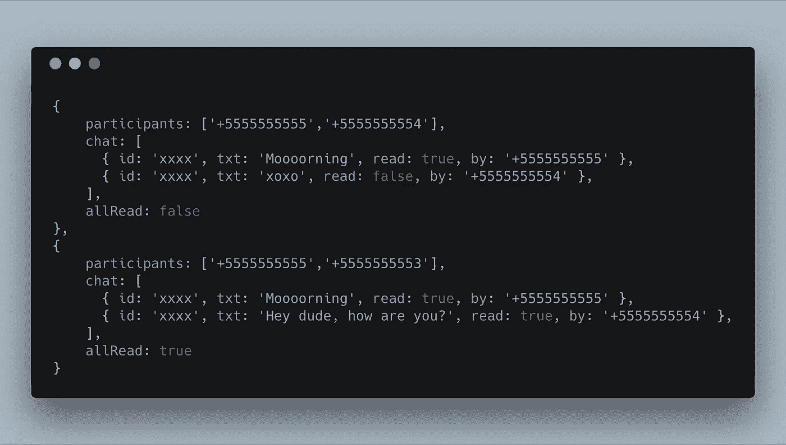
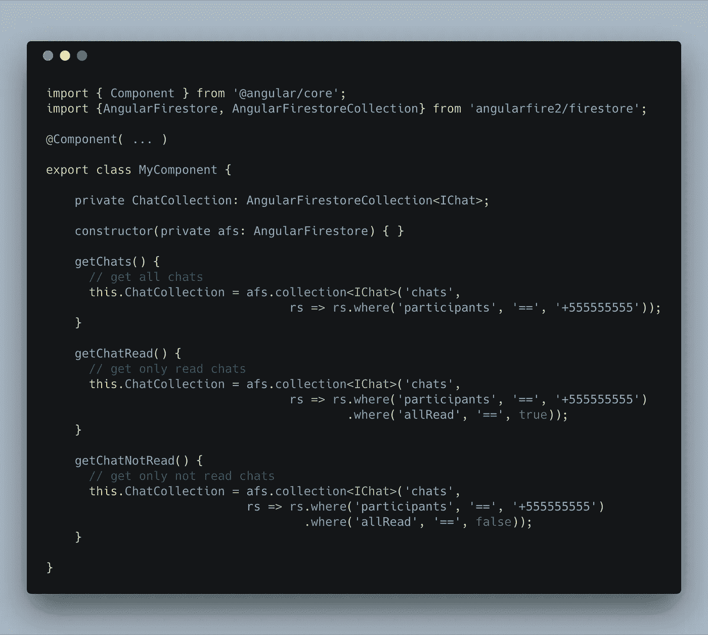
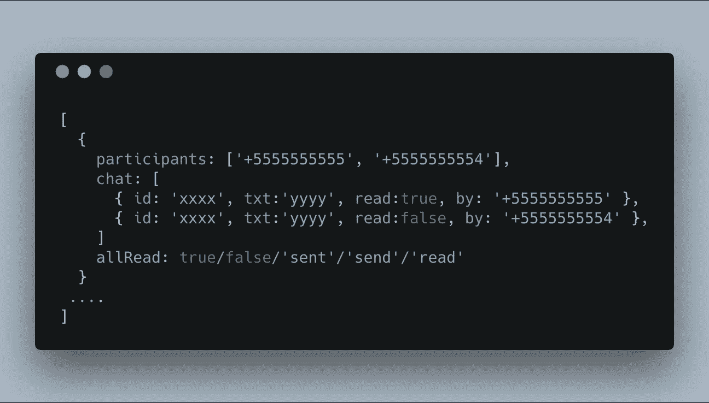
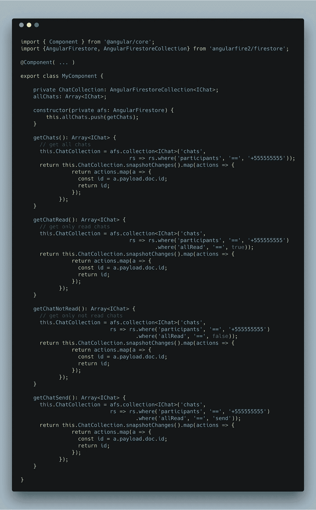
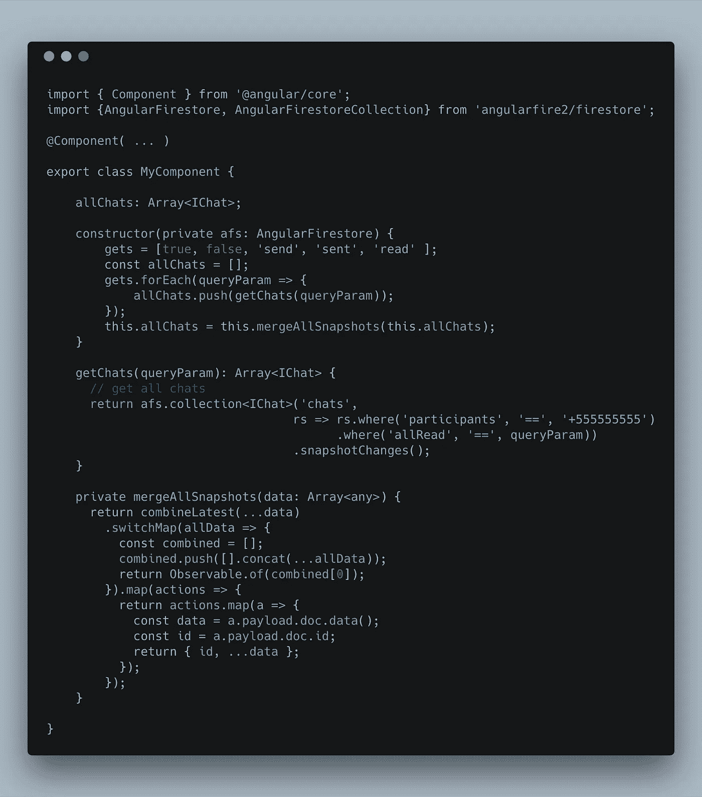

# 从非 sql 数据库到 Firestore & AngularFire

> 原文：<https://itnext.io/from-no-sql-database-to-firestore-angularfire-82dc13ecda65?source=collection_archive---------5----------------------->

你有没有想过 firestore 独特的 query 格式不同于任何其他 nosql …
Firestore 是由 google 的 Firebase 团队创建的超级强大的数据库，但是当我们想要迁移我们在另一个数据库中的数据，并且我们发现我们处理状态数据，而这些数据在 Firestore 的查询中没有得到同等的处理时会发生什么呢…

假设我们想从 mongodb 迁移到 firestore…

假设我们正在迁移的是一个聊天…一个聊天通常有数据，如谁发送它，谁接收它，最重要的是它有一个重要的数据，著名的双蓝检查，或者说是 read 的后续。

那么我们就会有一个类似于这个的结构:

有了这种格式，我们就可以轻松地进行查询，确定它是真还是假，读取它们，因为只有两种状态，如果我们想看到“读数”，我们就去找那些为真的，相反的是“未读的”

让我们考虑一下如何进行查询:

但是有更多的“状态”实际上读取或不读取…我们必须识别“通过发送”，“发送”，“接收/不读取”，“接收/读取”

但是，会有什么问题呢？这很简单，我可以添加更多的“where ”,并通过 2 或 3 个不同的“allRead”进行过滤，在 MongoDB 中可以，但在 firestore 中不行

在 firestore 中，我们必须生成这种类型的结构:

那么，你是在告诉我我不能做迁移吗？

实际上，如果我们想保持数据的格式，我们必须对代码做一些修改…

我们可以考虑的第一件事是调用不同的函数并推入一个通用数组:

但是，这样可以吗？
这是最好的方法吗？
不存在一件不用做那么多代码的事情吗？
我一直在重复同样的话…

感谢 RXJS 和一些小技巧，我们将能够改善我们对 AngularFire 和 Firestore 的体验

RxJS 我的宝贝

通过这种方式，感谢来自 firestore 的数据和数据，我们将能够融合数据，并能够完整地展示它们，而不用考虑我们有多少事情要做。

## 但是它是如何工作的呢？

我们所做的是迭代数组，从而能够处理不同的返回，但 firestore 实际上提供的是一种“可观察的”,我们通过它发送我们在查询中请求的数据。
通过这种方式，利用开关图，我们将能够获得所有可观察到的数据，并以这种方式将它们连接起来。
一旦所有的数据都建立在同一个数组中，我们将制作映射来获取集合的数据以及每个数据的唯一 ID，并将其传送到我们的列表中，以便正确地处理数据。

请记住，该收集当然不包括真实聊天数据库中存在的所有真实数据，但它是一种解释我们如何使用非 sql 和 Firestore 的差异的方式。

该功能可以在:

> 现在，你可以迁移到 firestore :) …享受它

Jorge 在技术行业工作了 9 年多，是一名专注于 JavaScript 技术的全栈开发人员。今天，Jorge 正在使用 Angular/RxJS/Firebase/native script 以及其他技术在 ByteDefault 工作。他讲授了几门课程和讲座，并就这些主题撰写了一些科技文章。正因为如此，他被认为是 Angular & web 技术领域的 Google 开发者专家和 Nativescript 开发者专家。

在离开之前，我离开所有可能看到我在做什么的地方，或者只是被问候的地方=)。

 [## 豪尔赫·卡诺(@jorgeucano) |推特

### Jorge Cano 的最新推文(@jorgeucano)。开发商——Amante de las nuevas technologias——AngularJS Dev——Creador…

twitter.com](https://twitter.com/jorgeucano)  [## 豪尔赫·卡诺

### 立即登录查看您的频道和推荐！

youtube.com](https://youtube.com/channel/UCdp9sM22GW5uIOaU9eZ7n6w) 

感谢阅读👌

法学家(jurisconsult)