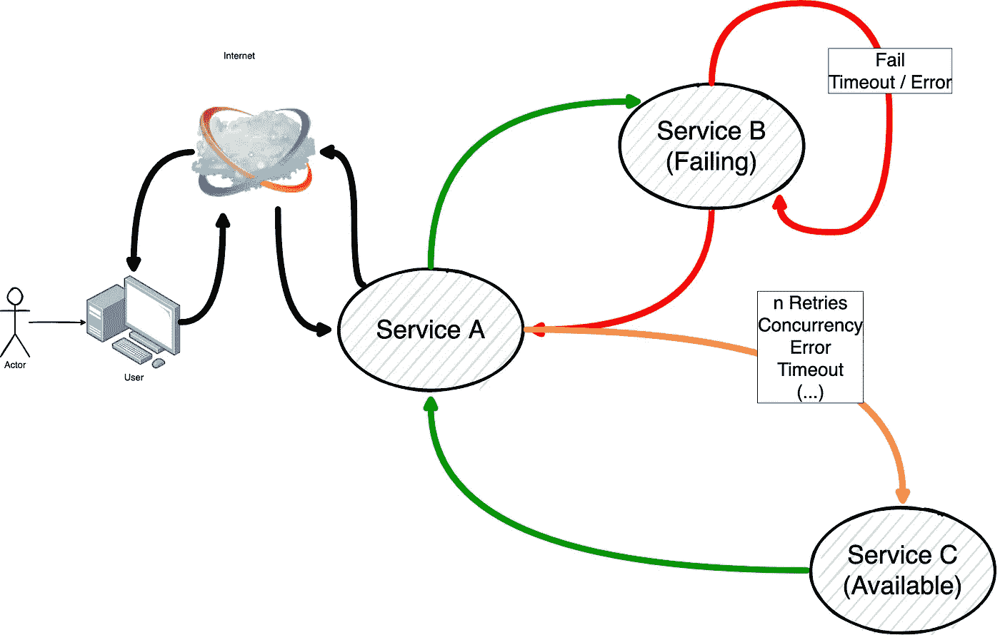
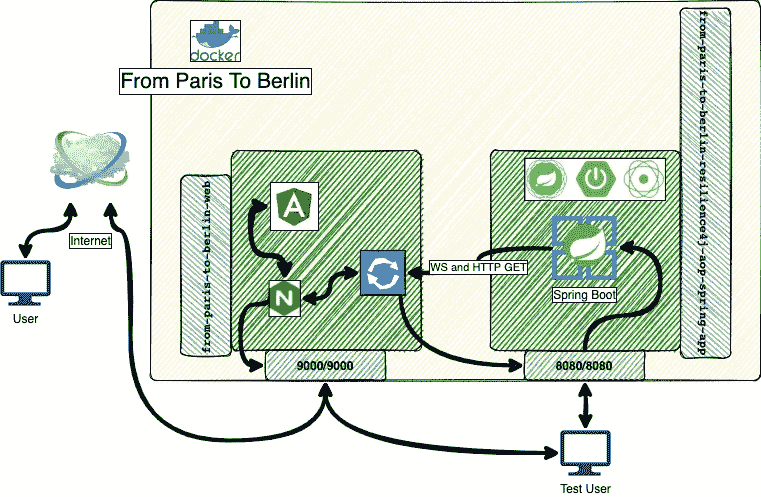
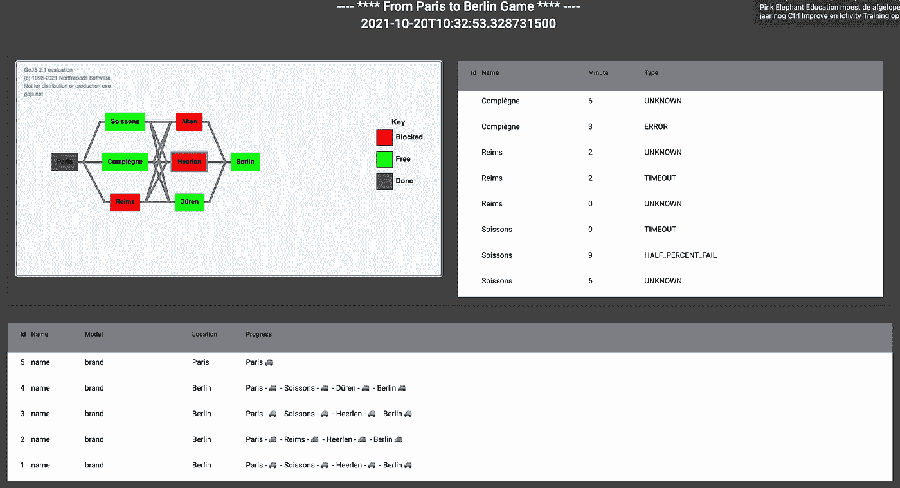

# 从巴黎到柏林——在科特林创造断路器

> 原文：<https://itnext.io/from-paris-to-berlin-creating-circuit-breakers-in-kotlin-3c8be96876ca?source=collection_archive---------4----------------------->


现在使用断路开关来避免对一个或另一个无响应服务的过量请求。例如，当某项服务因为某种原因关闭时，断路器应该如其名称所示断开电路。换句话说，在同时处理一百万个请求以获得赛马结果的情况下，我们希望将这些请求重定向到另一个能够处理这些请求的服务。这个其他服务可以是它的副本，也可以纯粹用于执行与原始服务故障相关的其他操作。最终目标总是中断不必要的呼叫，将信息流引导到其他地方。

2017 年，Michael Nygard 将断路器设计模式带到了软件开发设计的前沿。这是在他出版的**中完成的*发布吧！:设计和部署生产就绪软件(务实的程序员)第 1 版*** 。断路器设计模式的灵感来自实际的电子和电路。

然而，就一般概念而言，断路器的想法实际上是由托马斯·爱迪生于 1879 年发明的。就像在那个时候，一个**溢出** **电流**需要被处理。简单来说，这就是我们在这种情况下应用于软件架构的东西。

主要目标是确保系统有足够的弹性。它必须有多大的弹性，它必须有多大的容错能力，这在负责促进这种模式实现的工程师的眼里是真的。其背后的思想是，在某些情况下，我们可能希望将某个请求的流无缝地重定向到同一端点后面的另一个更可用的流。

假设我们想执行一个从 A 到 B 的请求，B 有时会失败，而 C 总是可用的。如果 B 随机失败，我们希望到达 C，以便使我们的服务完全可用。然而，为了向 B 发出请求，我们希望确保 B 不会再次失败。然后，我们可以配置我们的系统向 B 发出随机请求，并且只有当失败率下降到一定水平时才完全返回 B。我们可能希望在出错时发出请求 C，但也希望在延迟时发出请求 C。如果 B 非常慢，我们可能希望将所有请求重新发送到 C。还有许多其他可能的配置，如在定义的尝试次数、请求类型、并发线程和许多其他选项之后尝试到达 C

这也被称为短路，它主要是一个临时的举动。



断路器的简化概念

为了进一步理解我们对断路器实际上是什么的知识，我们必须理解断路器在我们的应用中作为一个实体工作。断路器有三种主要状态。可以是**关闭**、**开启、**或**半开**。状态**关闭**，意味着我们的应用流程运行正常。我们可以安全地向服务 A 发出请求，因为我们知道所有请求都将发送到服务 B。一个 **open** 状态意味着对服务 B 的所有请求都将失败。我们定义的表示失败的规则已经发生，我们不再到达服务 b。在这种情况下，总是返回一个异常。一个**半开**状态是当我们的断路器被指示执行服务 B 的测试，以查看它是否再次可操作。每个成功的请求都被正常处理，但它将继续向 c 发出请求。如果 B 根据我们设置的验证规则表现出预期，我们的断路器将返回到**闭合**状态，服务 A 将开始专门向服务 B 发出请求。

在大多数应用中，**断路器**遵循[装饰设计模式](https://refactoring.guru/design-patterns/decorator)。然而，它可以手动实现，我们将看看实现断路器的三种编程方式，并最终使用基于 AOP 的实现。该代码可在 [GitHub](https://github.com/jesperancinha/from-paris-to-berlin-circuit-breaker) 上获得。



从巴黎到柏林概述

# 1.汽车检查

在这篇文章的最后一点，我们将看一场赛车游戏。然而，在我们到达那里之前，我想引导你通过一些方面来构建一个运行断路器的应用程序。

# 1.1.Kystrix(从巴黎到柏林-kystrix-runnable-app)

Kystrixs 作为一个小型 DSL，是由 [Johan Haleby](https://github.com/johanhaleby/kystrix) 发明创造的一个令人惊叹的库。该库提供了很多可能性，包括与 Spring 和 [Spring WebFlux](https://docs.spring.io/spring-framework/docs/current/reference/html/web-reactive.html) 的集成。看看它并玩一会儿是很有趣的:

```
<dependency>
    <groupId>se.haleby.kystrix</groupId>
    <artifactId>kystrix-core</artifactId>
</dependency>
<dependency>
    <groupId>se.haleby.kystrix</groupId>
    <artifactId>kystrix-spring</artifactId>
</dependency>
```

我已经创建了一个示例，它位于 GitHub 上的模块 from-Paris-to-Berlin-kystrix-runnable-app 中。首先，我们看一下代码:

第一个汽车代码—命令 2

这段代码表示示例中的命令 2。检查命令 1 的代码。这里发生的事情是，我们用`***monoCommand***`定义了我们想要的命令。这里，我们定义了需要调用的方法。在`***commandProperties***` ***、*** 中，我们定义了使断路器改变状态到**打开**的规则。我们明确地延迟我们的呼叫，以便它正好持续 1 秒钟。同时，我们定义了 5000 毫秒的超时。这意味着我们永远不会超时。在这个例子中，我们可以用一个 **Id** 打电话。因为这只是一个测试，我们假设 **Id** =1，是一辆汽车的 **Id** ，`Jaguar`，不需要断路器。这也意味着我们永远不会得到回退方法中定义的`Tank1`。如果你还没注意到，仔细看看 ***回退*** 方法。这种方法是利用一个 ***可观测的*** 。虽然 **WebFlux** 是根据[可观察](https://refactoring.guru/design-patterns/observer)设计模式实现的，但 Flux 并不完全是可观察的。然而，`**hystrix**`两者都支持。请运行应用程序并在[http://localhost:8080/cars/2](http://localhost:8080/cars/2)上打开您的浏览器，以确认这一点。重要的是要明白，如果你在 Spring Boot 创业初期就开始打电话，你最终可能会收到一条`Tank1`消息。这是因为启动延迟很容易超过 5 秒，这取决于您如何运行这个过程。

在第二个例子中，我们将把我们的例子简化为`Tank 2`:

第一个汽车代码—命令 3

在本例中，我们的断路器将进入打开状态，并返回 `Tank 2` 作为响应。这是因为我们在这里也造成了`1s` 延迟，但是我们指定我们的断路条件在`500ms`标记之后触发。

如果你知道`**hystrix**`的工作原理，你会发现`**kystrix**`并没有什么不同。在这一点上,`**hystrix**`没有给我提供的是一种无缝的、毫不费力的方式来提供我制作游戏所需要的东西。`**Kystrix**`似乎以客户为基础。这意味着我们必须在向主服务后面的服务发出请求之前声明我们的代码。

# 1.2.弹性 4J

`**Resilience4J**`似乎被许多人认为是断路器的一个非常完整的实现。我的第一次试验是探索断路器的一些重要方面。也就是说，我希望看到一个可以根据超时和成功请求的频率工作的断路器。

Resilience4J 允许配置不同类型的短路模块。这些被分成 6 个不同的类别:`**CircuitBreaker**`、`**Bulkhead**`、`**Ratelimiter**`、`**Retry**`和`**Timelimiter**`、**。**这些也都是设计模式的名称。

`**CircuitBreaker**`模块提供了这种模式的完整实现。我们有许多可以配置的参数，但基本上，`**CircuitBreaker**` 模块允许我们配置什么是失败，在`**half-open**`状态下我们允许多少个请求，以及一个滑动窗口，它可以按时间或计数进行配置，其中我们保存在`**closed**`状态下发生的请求的计数。这对计算**错误频率**很重要。本质上，我们可以说这个`**CircuitBreaker**`模块将帮助我们提高请求率，但这不一定是真的。看你怎么解读了。这似乎是一种更好的方式，认为这只是一种处理错误的方式。无论它们来自超时还是异常，这都是它们被处理的地方，也是请求如何被无缝地重定向到其他地方的地方

`**Bulkhead**` 模块设计用于处理并发请求。它不是限速器。相反，它实现了[隔板](https://medium.com/geekculture/bulkhead-pattern-microservice-design-pattern-9e30d414a0fd)设计模式，用于防止在单个端点中发生过多的处理。在这种情况下，`**Bulkhead**` 允许我们以一种将请求分布到所有可用端点的方式来处理请求。名称**舱壁**来自一艘大船通常必须避免沉没的不同密封舱，如果发生事故，就像在船的情况下，我们需要定义线程池中有多少线程可用以及它们的租用时间。

`**RateLimiter**`模块被设计用来处理请求的速率。这与`**Bulkhead**`模块的区别在于，我们希望能够容忍特定的速率。这意味着我们不需要为此导致失败。我们只是说，在设计中，我们不能容忍某个值以上的速率。此外，我们可以重定向一个请求，或者让它保持等待，直到执行请求的许可被授予。

`**Retry**`模块可能是最容易理解的，因为它与其他模块没有太多的共同点。我们本质上明确声明了对某个端点的重试次数，直到达到我们定义的阈值。

`**Timelimiter**`模块可以看作是对`**CircuitBreaker**`模块的简化，因为它们都可以配置超时。然而，`**Timelimiter**` 不依赖于滑动窗口等其他参数，也没有内置的故障阈值计算。因此，如果我们只是对调用某个服务时的超时处理感兴趣，而不考虑其他可能的错误，那么我们可能最好使用`**Timelimiter**` 。

# 1.2.1.有 Kotlin 但没有 Spring 框架的 Resilience4J(从-paris 到-Berlin-resilience 4j-runnable-app)

在这个模块中，我决定只使用 resilience4j kotlin 库:

```
<dependency>
    <groupId>io.github.resilience4j</groupId>
    <artifactId>resilience4j-kotlin</artifactId>
</dependency>
<dependency>
    <groupId>io.github.resilience4j</groupId>
    <artifactId>resilience4j-retry</artifactId>
</dependency>
<dependency>
    <groupId>io.github.resilience4j</groupId>
    <artifactId>resilience4j-circuitbreaker</artifactId>
</dependency>
<dependency>
    <groupId>io.github.resilience4j</groupId>
    <artifactId>resilience4j-ratelimiter</artifactId>
</dependency>
<dependency>
    <groupId>io.github.resilience4j</groupId>
    <artifactId>resilience4j-timelimiter</artifactId>
</dependency>
```

这个实现可以在 [GitHub](https://github.com/jesperancinha/from-paris-to-berlin-circuit-breaker) 上的 repo 上获得。我们首先来看看`**TimeLimiter**`模式:

定时器配置为使用 100 ms 作为超时参考

在这种情况下，我们使用函数 ***装饰我们的函数***getPrivateCar***具有 TimeLimiter 功能。这将导致超时，如果我们调用的函数花费太长时间，我们将得到一个`Opel Corsa`而不是一个`Lancya`。为此，我们可以运行应用程序并打开[http://localhost:8080/cars/time limiter/normal/1](http://localhost:8080/cars/timelimiter/normal/1)。在实现中，我们看到我们永远不能得到一个`Lancya`。这是因为我们在归还之前故意等待`**10s**`。我们的时间限制器有一个低得多的超时，所以这永远不会工作。***

A `**TimeLimiter**`很容易理解。另一方面，一部`**CircuitBreaker**` 可以是不同的故事。这是一个如何做到这一点的例子:

一种可能的断路器配置

在这种情况下，我们说，我们希望我们的断路器在故障率低于属性的`**20%**`时关闭电路。慢速呼叫也会有一个阈值，但在这种情况下，它会小于`**50%**`。我们说慢速呼叫必须持续比`**1s**`更长的时间才能被认为是慢速呼叫。我们还规定半开状态的持续时间应该是`**1s**`。这意味着在实践中，我们或者会有一个`**open-state**`、一个`**half-open**`状态或者一个`**closed**`状态。我们还说我们最多允许 500 个状态请求。对于误差计算，断路器需要知道它将在哪个标记上进行。这对于确定何时对电路进行`**close**`很重要。我们说对于这个计算来说，`**2**`请求是最不必要的，具有`**minimumNumberOfCalls**`属性。记住`**half-open**`是当请求达到安全失败阈值时，我们将继续尝试关闭电路。在这种配置中，这意味着我们需要在滑动窗口内发出至少`**2**`个请求，以计算错误频率并确定是否返回到**关闭**状态。这是我们配置的所有变量的准确读数。一般来说，这意味着我们的应用程序可能会对替代服务进行多次调用，如果有一次调用，它将不会很容易地从`**open**`状态切换到`**closed**`状态，因为在半开状态期间这样做的成功率必须是`**80%**`，并且`**open**`状态的超时必须已经发生。有许多方法可以指定这样的超时。在我们的例子中，我们说`**maxDurationInHalfOpenState**`是 1s。这意味着我们的**断路器**将保持状态`**open**`，只有当我们的检查不满足`**closed**`状态条件**或**时，如果超时尚未发生。

在此`**CircuitBreaker**` 中定义的行为可能很难跟踪和预测，纯粹是因为特定的停机时间、速率和请求的其他特性不可能精确复制，但是如果我们对该端点执行几个请求，我们将会看到上述行为与我们的经验相匹配。所以让我们试着执行几个对端点的请求:[http://localhost:8080/cars/circuit/1](http://localhost:8080/cars/circuit/1)和[http://localhost:8080/cars/circuit/2](http://localhost:8080/cars/circuit/2)。以 1 结尾是成功检索汽车的终点，以 2 结尾是未能获得指定汽车的终点。查看代码，我们看到除了 2 之外的任何值都意味着我们得到了一个`Lancya`作为响应。一个`**2**`，意味着我们立即抛出一个运行时异常，这意味着我们最终得到一个欧宝 Corsa 作为响应。如果我们只是向端点 1 发出请求，我们将继续看到`Lancya`作为响应。如果系统开始失败，也就是当你向 2 发出请求时，你会发现过一会儿回到`Lancya`将不再是一个常数。系统将通知它处于打开状态，不允许更多的请求。

```
2021-10-20 09:56:50.492 ERROR 34064 --- [ctor-http-nio-2] .f.c.b.r.r.c.CarControllerCircuitBreaker : io.github.resilience4j.circuitbreaker.CallNotPermittedException: CircuitBreaker 'TEST' is OPEN and does not permit further calls
```

在请求成功后，我们的断路器将进入`**half-open**`状态，这意味着在它正常化之前，我们需要执行几次返回到`**1**`的请求。在我们再次得到`Lancya`之前，我们将从`Lancya`切换到`Opel Corsa`几次。我们将这个数字定义为`**2**`。这是误差计算的最小值。

如果我们只导致一个失败，并继续调用非失败端点，我们可以更清楚地了解正在发生的情况:

```
2021-10-20 11:53:29.058 ERROR 34090 --- [ctor-http-nio-4] .f.c.b.r.r.c.CarControllerCircuitBreaker : java.lang.RuntimeException
2021-10-20 11:53:41.102 ERROR 34090 --- [ctor-http-nio-4] .f.c.b.r.r.c.CarControllerCircuitBreaker : io.github.resilience4j.circuitbreaker.CallNotPermittedException: CircuitBreaker 'TEST' is OPEN and does not permit further calls
```

这条`**open-status**`消息虽然是真的，但它发生在我向非失败端点发出 2 个请求之后。这就是为什么说状态是`**half-open**` 的原因。

# 1.2.2.Spring Boot 无 AOP 的 Resilience4J(从巴黎到柏林 resilience4j-spring-app)

在前面的部分中，我们已经看到了如何在不使用任何 Spring 技术的情况下以非常程序化的方式实现。我们确实使用了 Spring，但只是为了提供 WebFlux MVC 类型的服务。此外，我们没有对服务本身做任何改变。在下面的应用程序中，我们将探索以下库:

```
<dependency>
    <groupId>io.github.resilience4j</groupId>
    <artifactId>resilience4j-spring-boot2</artifactId>
</dependency>
<dependency>
    <groupId>io.github.resilience4j</groupId>
    <artifactId>resilience4j-all</artifactId>
</dependency>
<dependency>
    <groupId>io.github.resilience4j</groupId>
    <artifactId>resilience4j-reactor</artifactId>
</dependency>
```

当研究代码是如何完成的时，我们可以看到相当大的差异:

使用 WebFlux 和 Resilience4J 模块改造出版商

在这个例子和下面的例子中，我们将主要关注超时属性。因为这是一篇介绍性的文章，所以`**CircuitBreaker**`本身的复杂性不太相关。这里重要的是要意识到，使用 Resilience4J 为 Spring 提供的装饰器，我们可以多么容易地实现这一点。尽管仍然以编程的方式，我们可以很容易地用我们想要的短路类型来修饰我们的初始发布者，即从 carService.getCar()获得的发布者。在这个例子中，我们注册了一个`**TimeLiter**`、一个`**BulkHead**`和一个`**CircuitBreaker**` 。最后，我们定义一旦`**TimeoutException**`发生，就触发`**fallback**`功能。

我们仍然需要看到的是这一切是如何配置的。我们在 Spring 中配置 Resilience4J，就像任何其他可配置模块一样。我们使用 application.yml:

应用程序. yml

该文件是取自[他们的回购](https://github.com/resilience4j/resilience4j-spring-boot2-demo)的示例文件，并相应地修改为[我的示例](https://github.com/jesperancinha/from-paris-to-berlin-circuit-breaker)。正如我们之前看到的，不同类型的限制器/短路的实例都有一个名称。如果你有许多不同的注册表和不同的限制器，这个名字是非常重要的。对于我们的例子，正如前面提到的，我们对`**timelimiter**` 感兴趣。我们可以看到仅限于`**2s**` 。如果我们看看我们实现服务的方式，我们会发现我们正在强制超时:

CarService 超时生成

让我们启动应用程序，在浏览器中进入:[http://localhost:8080/cars/test/2](http://localhost:8080/cars/test/2)。我们得到的不是一个`Fiat`，而是一个`Rolls Royce`。这就是我们如何定义超时的。同样的，我们可以很容易地创建一个`**CircuitBreaker**` **。**

# 2.情况

到目前为止，我们已经看到了实现`**CircuitBreakers**`和相关限制器的三种基本方式。此外，我们将通过我制作的一个应用程序来看看我最喜欢的实现断路器的方法，这是一个非常简单的游戏，我们只需点击方块，就可以从巴黎到达柏林。这个游戏是用来理解如何实现的。它没有详细说明在哪里实现这一点。这只是我设计的一个案例，与你分享**诀窍**。我让你以后决定。

本质上，我们想制造一些汽车，并建立一条通往柏林的路线。在这条路线的不同地点，我们会随机到达一些城市，在那里我们会制造问题。我们的断路器将决定我们要等多久才能被允许继续前进。其他的车没有问题，我们只需要选择正确的路线。我们被允许检查一个时间表，它记录了某个问题将在某个分钟在某个城市发生。分钟标记在其 0°分度位置有效。这意味着 2 意味着时钟上的每 2、12、22、32、42、52 分钟标记都将有效，以产生这个问题。问题有两种:错误和超时。一次失误会让你损失 20 秒。超时会给你 50 秒的延迟。每换一个城市，大家都要等 10 秒。然而，在等待之前，当在后退方法中这样做时，汽车已经在下一个城市的入口。在这种情况下，随机选择下一个城市。



从巴黎到柏林游戏概述

# 3.履行

我们之前已经了解了如何使用 application.yml 配置我们的 resilience4j 注册表。完成之后，让我们看一些如何修饰我们的函数的示例:

正如我们所看到的，原始的服务调用是直接用注释修饰的！。这只能通过包中 AOP 模块的存在来实现:

```
<dependency>
    <groupId>org.springframework.boot</groupId>
    <artifactId>spring-boot-starter-aop</artifactId>
</dependency>
```

AOP 或面向方面编程是另一种基于 OOP 的编程范例。它被认为是面向对象程序设计的一个补充，这也是很多注释工作的原因。这允许在精确的切割点触发原始方法周围、之前或之后的其他功能。正如您在示例中看到的，我们要么生成超时，要么生成错误。`**BlockageException**` **，**也是在回退方法内部生成的。这不代表问题。除了回应。但是，应用程序是在 WebSockets 上运行的，因此在应用程序中不会看到这个错误。

到目前为止，这是游戏。我实现它的目的是为了展示在实现一个有弹性的应用程序时，使用注释是如何让我们的生活变得更加容易的。我们不仅实现了断路器，还实现了其他技术，如 WebSockets、Spring WebFlux、Docker、NGINX、typescript 和其他一些技术。这一切都是为了了解断路器在应用中的表现。

如果您想玩这个应用程序，请转到项目的根目录并运行:

```
make docker-clean-build-start
```

然后运行以下命令:

```
curl -X POST [http://localhost:8080/api/fptb/blockage](http://localhost:8080/api/fptb/blockage) -H "Content-Type: application/json" --data '{"id":1,"name":"Paris","forward":[{"id":2,"name":"Soissons","forward":[{"id":5,"name":"Aken","forward":[{"id":8,"name":"Berlin","forward":[],"blockageTimeTable":[]}],"blockageTimeTable":[]},{"id":6,"name":"Heerlen","forward":[{"id":8,"name":"Berlin","forward":[],"blockageTimeTable":[]}],"blockageTimeTable":[]},{"id":7,"name":"Düren","forward":[{"id":8,"name":"Berlin","forward":[],"blockageTimeTable":[]}],"blockageTimeTable":[]}],"blockageTimeTable":[]},{"id":3,"name":"Compiègne","forward":[{"id":5,"name":"Aken","forward":[{"id":8,"name":"Berlin","forward":[],"blockageTimeTable":[]}],"blockageTimeTable":[]},{"id":6,"name":"Heerlen","forward":[{"id":8,"name":"Berlin","forward":[],"blockageTimeTable":[]}],"blockageTimeTable":[]},{"id":7,"name":"Düren","forward":[{"id":8,"name":"Berlin","forward":[],"blockageTimeTable":[]}],"blockageTimeTable":[]}],"blockageTimeTable":[]},{"id":4,"name":"Reims","forward":[{"id":5,"name":"Aken","forward":[{"id":8,"name":"Berlin","forward":[],"blockageTimeTable":[]}],"blockageTimeTable":[]},{"id":6,"name":"Heerlen","forward":[{"id":8,"name":"Berlin","forward":[],"blockageTimeTable":[]}],"blockageTimeTable":[]},{"id":7,"name":"Düren","forward":[{"id":8,"name":"Berlin","forward":[],"blockageTimeTable":[]}],"blockageTimeTable":[]}],"blockageTimeTable":[]}],"blockageTimeTable":[]}'
```

该请求的有效载荷是使用模块**从巴黎到柏林城市生成器**生成的。如果你看了这个模块，你会发现它很容易理解，你可以为游戏生成你自己的地图！

最后，转到 [http://localhost:9000](http://localhost:9000) ，您的应用程序应该正在运行！。现在你只要点击正确的方块就可以玩游戏了。如果你想赢就不要点击红色的。如果你想看看断路器的动作，那么请运行应用程序日志:

```
docker logs from_paris_to_berlin_web -f
```

并明确点击红色方块，以导致失败。

# 4.Kystrix 和 Resilience4J 有何不同

Kystrix 是小型应用程序的理想选择，并且您希望确保 DSL 的使用率非常低。唯一的缺点似乎是它没有提供一种简单的方法来修饰受**断路器**影响的方法。

**Resilience4J** 对于使用**断路器**的企业工作来说似乎是一个很好的选择。它确实提供了基于注释的编程，使用了 AOP 的所有优点，并且它的模块是分离的。在某种程度上，它也可以战略性地用于应用程序中的关键点。它也可以作为一个完整的框架来覆盖应用程序的许多方面。

# 5.结论

不管我们选择什么品牌，我们的目标始终是拥有一个有弹性的应用程序。

在这篇文章中，我展示了一些例子，展示了我个人调查断路器的经验和我在很高层次上的发现。这意味着这篇文章确实是写给那些想知道什么是**断路器**和什么是**限制器**的人的。

坦率地说，当考虑用像**断路器**这样的弹性机制来改进我们的应用程序时，可能性是无穷无尽的。这种模式允许对应用程序进行微调，以便更好地利用我们拥有的可用资源。主要是在云中，优化我们的成本以及我们实际需要分配多少资源仍然非常重要。

配置**断路器**并不像配置**限制器**那样简单，我们确实需要了解所有的配置可能性，以便达到最佳的性能和弹性水平。这就是我不想在这篇关于**断路器**的介绍性文章中详述的原因。

**断路器**可用于许多不同类型的应用。大多数消息传递、流类型的应用程序将需要这一点。对于处理大量数据并且需要高可用性的应用程序，我们可以并且应该实现某种形式的**断路器**。大型在线零售店需要每天处理大量数据，在过去，Hystrix 得到了广泛应用。目前，我们似乎正朝着包含更多内容的 Resilience4J 方向发展。

我已经把这个应用程序的所有源代码放到了 GitHub 上

我希望你能像我喜欢写这篇文章一样喜欢它。我尽量让它简洁明了，并省略了许多小细节。

我很想听听你的想法，所以请在下面留下你的评论。

提前感谢您的帮助，感谢您的阅读！

# 6.参考

[](https://github.com/johanhaleby/kystrix) [## GitHub-johanhaleby/Kystrix:Kystrix 是 Hystrix 上的一个小型 Kotlin DSL

### Kystrix 是一个小型 DSL，它使 Kotlin 中的 Hystrix 工作起来更加容易。例如:val greeting = hystrixCommand {…

github.com](https://github.com/johanhaleby/kystrix)  [## 用于 Hystrix 的 Kystrix - A Kotlin DSL

### 使用基于微服务的架构时，您需要防止其他系统/服务停机或变慢…

code.haleby.se](http://code.haleby.se/2018/09/16/kystrix-a-kotlin-dsl-for-hystrix/) [](https://github.com/resilience4j/resilience4j) [## GitHub-resilience 4j/resilience 4j:resilience 4j 是一个为 Java8 设计的容错库…

### Resilience4j 是一个轻量级容错库，灵感来自网飞·海斯特里克斯，但它是为 Java 8 和

github.com](https://github.com/resilience4j/resilience4j) [](https://resilience4j.readme.io/docs/circuitbreaker) [## 断路器

### 断路器是通过一个有限状态机实现的，它有三种正常状态:闭合、断开、半开和…

resilience4j.readme.io](https://resilience4j.readme.io/docs/circuitbreaker) [](https://en.wikipedia.org/wiki/Circuit_breaker_design_pattern) [## 断路器设计模式-维基百科

### 断路器是软件开发中使用的一种设计模式。它用于检测故障并封装…

en.wikipedia.org](https://en.wikipedia.org/wiki/Circuit_breaker_design_pattern) [](https://martinfowler.com/bliki/CircuitBreaker.html) [## 断路器

### 软件系统对运行在不同进程中的软件进行远程调用是很常见的，可能是在不同的…

martinfowler.com](https://martinfowler.com/bliki/CircuitBreaker.html) [](https://hackernoon.com/introduction-to-circuit-breaker-pattern-how-to-build-better-software-d11g3t7g) [## 断路器模式介绍:如何构建更好的软件|黑客正午

### 断路器模式是一个监视故障的 NodeJS 工具。当连续失败的次数…

hackernoon.com](https://hackernoon.com/introduction-to-circuit-breaker-pattern-how-to-build-better-software-d11g3t7g)