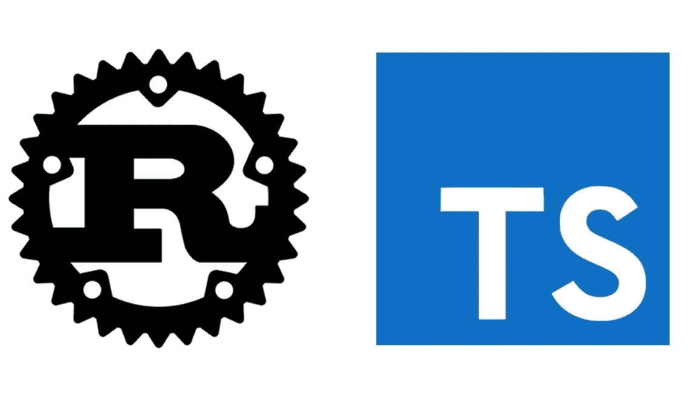
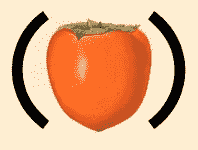

# 从 parsimmon 到 nom —使用解析器组合子(Typescript → Rust)

> 原文：<https://itnext.io/from-parsimmon-to-nom-playing-with-parser-combinators-typescript-rust-c915865edd91?source=collection_archive---------2----------------------->



在这篇文章中，我将快速介绍用 Typescript 编写的虚拟查询语言解析器的重新实现过程。新的实现正在进行中。

一个**解析器组合子**是一个高阶函数，它接受几个**解析器**作为输入，并返回一个新的**解析器**作为输出。

当构建我们的解析器时，我们可能希望从底层开始，组成最终构建我们的主解析器的最小单元。

让我们开始:

## 虚拟 QL

有效的查询语法如下所示:

```
1\. foo == "hey there" && foo == "eatPizza"

2\. foo == "hey there"
```

## Typescript 分析器:

对于我使用的 Parsimmon 的 Typescript 虚拟查询 lang，我建议您深入研究一下它的 github repo，它基于有趣的函数概念。

Parsimmon 是一个小库，用于编写由许多小解析器组成的大解析器。



图像取自 parsimmon repo

**用户 API** 很简单。
我们有一个 parseDummyQL()函数，它获取查询字符串输入，如果查询有效，它将输出某种扁平树🌲表示我们的查询语言规则结构(类似于一个 [AST](https://en.wikipedia.org/wiki/Abstract_syntax_tree) )。

在检查完解析器实现之后，我们将深入研究输出。

## QL 实施

有趣的部分是在创建我们的主解析器时组合的小解析器函数。

我不会过多地解释 Parsimmon API，我们应该只关心下面的流程:

1.  dummy_query() combinator 调用 expression() combinator，并应用 **"many "，**这是解析器 API 中的一种常见方式，用于声明规则可以重复 n 次。
2.  expression()组合器引入了 **"alt()"** 组合器，它接受 n 个解析器并检查输入字符串是否符合其中一个输入解析器规则，您可能会在其他库中看到它是“选择”组合器。在我们的例子中，选择/替代是“base()”或“sub()”组合子。
3.  " base()"和" sub()"都引入了" seq()"组合子(序列)，查看" base()"规则，我们可以看到它得到的解析器的顺序如下:" field "然后" operator "然后" value "
    " sub()"组合子序列如下:
    alt("and "，" or ")然后" base "，这意味着" sub "解析规则可以以" and" or "开头，后跟" base "查询。
4.  其余的组合子都是简单的单元，不涉及其他组合子，比如我们的运算符需要 eq '== '运算符，字段需要字符串“foo”，或者值需要双引号内的任何字符串，等等..

## 现在让我们用 Nom 来做


图像取自 nom 的回购协议

[nom](https://github.com/Geal/nom) 是一个用 Rust 编写的解析器组合子库。它的目标是提供工具来构建安全的解析器，而不牺牲速度或内存消耗。

所以这对我来说是有挑战性的部分:)我真的很喜欢 Rust，但是我写得不多，认为自己是一个不熟练的开发人员..

## QL 实施

**免责声明:

*   [错误处理](https://doc.rust-lang.org/book/ch09-00-error-handling.html)是我喜欢 Rust 的地方之一，但在这一点上我忽略了潜在的错误，这样我就可以专注于学习 API。
*   我实际上调整了下面的 parse_quoted 函数 [stackoverflow 答案](https://stackoverflow.com/questions/58511515/parse-string-with-escaped-single-quotes)。
*   我真的不觉得我抓伤了 nom 的能力，所以你更然后欢迎评论与提示，让我们一起成长。
*   我简化了最终的输出，不像最初的实现那样转换输出:))

## 类型背景:

[名词解析器是到处使用](https://github.com/Geal/nom/blob/master/doc/making_a_new_parser_from_scratch.md) `[nom::IResult](https://github.com/Geal/nom/blob/master/doc/making_a_new_parser_from_scratch.md)` [类型的函数。](https://github.com/Geal/nom/blob/master/doc/making_a_new_parser_from_scratch.md) `[IResult](https://github.com/Geal/nom/blob/master/doc/making_a_new_parser_from_scratch.md)`[类型取决于输入和输出类型，以及一个可选的自定义错误类型。](https://github.com/Geal/nom/blob/master/doc/making_a_new_parser_from_scratch.md)

测试的查询看起来像:

```
foo == "jj" && foo == "bazz"
```

字段→空格→ eqOperator →空格→值→空格→和逻辑运算符→空格→字段→空格→ eqOperator →空格→值

## 代码概述，从上到下:

1.我们的入口点是 dummy _ parser()(lib 中唯一的公共函数)，它接受查询作为参数并返回代表我们最终输出的 IResult，并返回“tuple”序列组合子的结果:

```
tuple((base_parser, tag(" "), and_or_choice, sub_parser))(i)
```

[**元组**](https://github.com/Geal/nom/blob/master/doc/choosing_a_combinator.md) 链接解析器，并将子结果组装成元组。您可以使用尽可能多的子解析器，因为您可以将元素放入一个元组中。

[**标签**](http://Recognizes a specific suite of characters or bytes) “基本元素”识别一组特定的字符或字节。

所以顺序很简单，输入首先由 **base_parser** 解析，然后是空格，接着是**和 _or_choice** ，接着是 **sub_parser。**

2. **and_or_choice** 返回 alt()组合子的结果

```
alt((and_parser, or_parser))(i)
```

[**alt**](https://github.com/Geal/nom/blob/master/doc/choosing_a_combinator.md)**choice 组合器将尝试一系列解析器，并返回第一个成功解析器的结果。**

**3. **sub_parser** 将空格与 base_parser 结合起来**

```
tuple((tag(" "), base_parser))(i)
```

**4.base_parser 解析最简单的查询**

```
tuple((f, tag(" "), eq_op, tag(" "), value))(i)
```

**输出:**

```
 let exp_tuple = (
    (
        "foo",
        " ",
        "==",
        " ",
        "jj",
    ),
    " ",
    "&&",
    (
        " ",
        (
            "foo",
            " ",
            "==",
            " ",
            "bazz",
        ),
    ),
);
```

**这就是这篇文章的全部内容，希望你喜欢！欢迎您点击拍手，并检查[回购](https://github.com/LironHazan/nom-dummy-ql-example)，我可能会在稍后改进代码:)**

**感谢阅读🙏
立荣。**