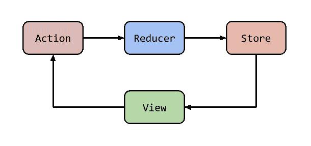

# 从 Redux 到 MobX:一次顺利的实验

> 原文：<https://itnext.io/from-redux-to-mobx-a-smooth-experiment-9eeb6248f58e?source=collection_archive---------1----------------------->

如果你是一名软件开发人员，知道 **Javascript** 和 **React** ，那么你很有可能也知道或者至少对另一个叫做 **Redux** 的东西有所了解。我敢说，没有听说过它几乎是不可避免的，因为*“状态管理”*是 React 的一个巨大组成部分，而 Redux 是最著名的方法之一。著名并不意味着无与伦比，所以如果您曾经寻找过替代方案(尤其是如果您想使用 observables)，我敢打赌您已经看到了另一种状态管理解决方案的一些东西: **MobX** 。

自从我开始关注它，推迟任何使用它的尝试的主要原因是当时缺乏支持。并不是说没有——有很多——但与 Redux 相比，它仍然落后。这完全取决于你能承受多大的风险，以及在你当前的项目中有多大的实验空间。

这么多年后，所有涉及的技术都变得更加成熟——大量的库和框架，在帖子和论坛中共享的知识，以及在开发过程中可能让您陷入困境的较小的错误和死角都得到了修复。

我决定尝试一下 MobX，哇，这是一次多么美好而有趣的经历啊！

所以，我分享一下我的旅程才公平。由于我个人的 Redux 背景，我将把我最初使用 MobX 的尝试与一些类似的 Redux 解决方案和概念进行比较。这是一个很好的方式来看到一些利弊，因为我是 MobX 的新人，这也将是一个分享一些挑战，挫折和克服它们的努力的方式。当然，这将是一个非常个人的观点，但希望它可以帮助读者有一些期望:)

# 1.MobX 原则:

像大多数开发人员一样，我的第一步是研究官方文档，了解一些基础知识:[https://mobx.js.org/](https://mobx.js.org/)

文档相当不错——我将尝试解释 MobX 的核心思想，并与 Redux 进行一些比较:

MobX 数据流

1.  ***动作:*** 是所有改变*可观察*状态*状态*的事物。MobX 将确保由您的操作引起的应用程序状态的所有更改都由所有派生和反应自动处理。同步且无故障。
2.  ***可观测状态:*** 任何可以变异并可能作为计算值来源的值都是可观测状态。塑造应用程序模型的对象、数组、原语和引用的图形。
3.  ***导出值:*** 基本上就是可以从你的应用的*可观测状态*自动计算出来的任何值。这些派生(或计算值)可以是简单的值，如未完成的待办事项的数量，也可以是复杂的东西，如待办事项的可视化 HTML 表示。
4.  ***反应:*** 它们非常类似于推导。主要区别是这些函数不产生值。相反，它们会自动运行来执行一些任务。通常这是与 I/O 相关的。他们确保 DOM 被更新或者网络请求在正确的时间被自动发出。

# 2.还记得 Redux 吗？

让我们来看看 Redux 流:

冗余数据流

乍一看，它们在某些方面看起来有些相似:它们都有某种动作，并且都保持一种可以重新呈现 react 组件的状态。在 MobX 中，这将发生在流的反应部分，我们可以将其与 Redux 中的视图更新进行比较。

现在让我们仔细看看:

## MobX 与 Redux / Actions:

在 Redux 中，一个动作是一个要被*调度的对象，而*是与*缩减器交互的方式。*我们通常创建单独的函数来接收参数和组织有效载荷，这样我们就可以回收那个调用。这些功能我们通常归类为动作创造者。在分派之后，动作通过一个开关，其中一个字符串将用于识别动作类型并创建一个新的状态。**没有发生任何变化**——您总是在另一个状态之上获得一个新的状态，这允许存储有一个*历史*。

在 MobX 中，你不需要分派任何东西。你调用函数，就是这样，**会发生突变**。在这里保持一致的基础的解决方案在于你的方法(动作),从我的角度来看 *Typescript* 可以在定义将要更新的参数和可观察对象的部分提供很大帮助，使函数最不容易出错。因为突变是意料之中的，所以您应该知道它们是负责触发 MobX 流中其他步骤的。

我真的很喜欢不用创建额外的文件。通常我们有动作文件，常量文件，缩减文件等等。此外，我不太喜欢 reducer 中的 switch 语句——它只是在合并 reducer 后对整个应用程序的一个重要说明。不可开箱即用。

在有 Typescript 的 MobX 中，你有类。当然，在某些时候你必须实例化它们，但仅此而已。

## MobX 与 Redux / State:

在 Redux 中，一个对象包含了一切。更新它们的唯一方法是通过*动作*。

在 MobX 中，它们被称为*可观察对象*，基本上是类中的属性。一旦你定义其中一个为可观察的，任何相同属性的突变将调用导数/反应流。请记住，如果您没有将该属性设置为 private，则无需适当的操作就可以访问它——但是不要搞错，它可以开箱即用，因为 MobX 定义了 *get* 和 *set* 是默认操作。

## MobX 与 Redux / React:

在 React with Redux 中，视图更新是通过 Redux 提供的 connect 函数进行的。它接收另外两个函数，其中一个负责读取状态和其他属性，然后返回应该在组件中使用的内容。另一个是相同的，但是使用 dispatch 返回函数。我不会太深入细节或架构(如选择器等。)，，只知道增加了复杂性。

在 MobX 中，您使用一种叫做 autorun 的方法——当您在一个可观察对象中有任何更新时，它将触发一个函数。从这些原始函数中，你可以得到更多的库来支持与其他框架的集成，在我们的例子中，就是 React。对于 React，有一个名为 observer 的函数，它使 React 组件成为数据流上的反应的一部分。所以，如果有什么道具，钩子什么的。起源于一个可观察的，它会工作，它会重新呈现从一个更新。这真的很简单，而且很快！

最后，你所需要的只是一个类或对象作为你的可观察对象，以及一个做出反应的观察者。如果你可以这样说 javascript 的话，那么它的架构感觉如此自由，更加“自然”。

## MobX 与 Redux / Derivates

这是一个强大的工具，Redux 不是开箱即用的。在 MobX 中，您可以使用一个函数，该函数将基于可观察值生成一个返回值，并且该函数将生成一个输出，并在使用后缓存它。因此，如果您在 React 组件中使用相同的函数，它将触发重新渲染，并且所有后续的渲染或使用都将缓存结果，这是一个非常好的开箱即用优化。

您可以将这些派生函数想象成 Redux 中的选择器，并且它们缓存结果以避免重复所有的计算工作。

## **结论**:

我可以说，我对 MobX + React 的初步体验相当积极，主要原因是:

*   对 Javascript / Typescript 感觉更自然；
*   从文件结构到编码都比 Redux 简单得多；
*   充满了“自动化”——但是如果你愿意，你仍然可以定义和控制一切；
*   快速而精确——即使您使用您创建的整个 MobX 商店作为道具，它也只会在必要的地方和必要的时候精确地重新呈现组件。

还有很多东西需要尝试，尤其是看看它在一个更大的项目中的可扩展性。直到现在看起来真的很有前途很有意思:)

## 下一步:

从现在开始，我的计划是启动一个小型的个人项目，并在这个过程中分享更多的发现和经验——但我真的希望得到您的反馈，这样我就可以让它对每个人更有价值:)当然，如果您还没有尝试过 MobX，请不要害羞，也请分享您的经验！:)