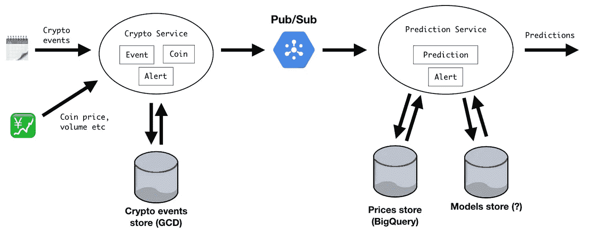

# 从 Scala 应用到 Kubernetes Pod

> 原文：<https://itnext.io/from-scala-app-to-kubernetes-pod-d67e0cd6bfaf?source=collection_archive---------2----------------------->

您正在处理一个[数据项目](https://medium.com/@ticofab/a-crypto-data-project-cf6884c60649)，并且您从您的领域模型开始了一个[事件风暴](https://medium.com/@ticofab/an-eventful-crypto-storm-2a5ed95e5eaf)会话。从那里，你勾画出[一个架构](https://medium.com/@ticofab/from-event-storming-to-architecture-c2dc49e9c2d0)，并最终实现[第一个服务](https://medium.com/@ticofab/monitor-crypto-events-with-akka-stream-b2d5d6687804)。现在怎么办？您可能想将它们部署到云中，并添加一些管道。

**TL；DR** :将本地应用从本地带到谷歌云基础设施上的 Kubernetes pod 的步骤。


为了监控关于加密货币的事件，并最终通过机器学习模型找到它们与其价格变化的关联，我绘制了一个架构，它使用了几个 JVM 服务和谷歌的一些云功能。



[上一篇文章](https://medium.com/@ticofab/monitor-crypto-events-with-akka-stream-b2d5d6687804)描述了加密服务的实现选择，其任务是监控加密货币的事件和价格波动。基于 [Akka Streams](https://doc.akka.io/docs/akka/current/stream/stream-introduction.html) 的能力，最终结果是简洁的，其复杂性是可管理的。现在的目标是将其部署到云服务，第一步是将我们的服务嵌入到容器中。

## 码头化


我的朋友[耶鲁安·罗森博格](https://medium.com/u/e7728216eb1?source=post_page-----d67e0cd6bfaf--------------------------------)提供的[精彩教程](https://medium.com/jeroen-rosenberg/lightweight-docker-containers-for-scala-apps-11b99cf1a666)一步一步地介绍了这个过程。主要思想是使用 [SBT 本地打包器](https://www.scala-sbt.org/sbt-native-packager/)插件来生成 Docker 映像，而不是编写 Docker 文件。

```
addSbtPlugin("com.typesafe.sbt" % "sbt-native-packager" % "1.3.5")
```

在你的`build.sbt`文件中有一些东西需要设置。至关重要的是启用插件及其 Docker 特性，命名我们的应用程序，并声明要打包的基本映像:

```
enablePlugins(JavaAppPackaging)packageName in Docker := <NAME OF YOUR APP>
dockerBaseImage := "openjdk:jre-alpine" // a smaller JVM base image
```

为了在本地环境中创建图像，现在我们只需调用

```
sbt docker:publishLocal
```

…这就是乐趣的开始。Docker 映像在您的本地环境中用处不大。我们需要给它翅膀，让它飞到云端。

## 谷歌容器注册


我选择谷歌作为我的云基础设施提供商。我在那里比在 AWS 更有家的感觉，我想我正在为下一个边项目保存 Azure。为了让我们的容器可以用于云中的其他服务(比如运行它)，我们需要将它上传到 Google 的容器注册中心。初始设置需要几个步骤，主要涉及身份验证。跟随官方指南[这里](https://cloud.google.com/container-registry/docs/advanced-authentication)。

有趣的部分是，我们将使用 Google Cloud SDK ( `gcloud`来自命令行)来设置 Docker 应用程序，并授予它上传到我们的注册表的权限。假设我们在注册表中创建了一个名为`my-app`的图像，并用`latest`标记它，我们可以用

```
docker push my-app:latest
```

像往常一样，现实更丰富一点:我知道我将上传到 Google Container Registry，它的名字是`eu.gr.io`，我在 Google Cloud 中的项目的 ID 是`my-project-id`，我将这些信息嵌入到图像名称中。真正的命令是

```
docker push eu.gcr.io/my-project-id/my-app:latest
```

一旦我们的服务被整齐地打包并上传到在线注册中心，它最终就可以通过一些编排工具使用了。这份工作目前事实上的标准是 Kubernetes。我从我的朋友[Á·达姆·桑多](https://medium.com/u/5307a3d057b8?source=post_page-----d67e0cd6bfaf--------------------------------)那里学到了很多——我们联手准备了一个关于在 Kubernetes 上运行 [Akka 集群解决方案的讲座。](https://youtu.be/OOXRgd5yUQo)

## 谷歌 Kubernetes 引擎


侍者的奔跑，1933 年。版权所有 Archivio Birra Peroni，那不勒斯(意大利)

对我来说，思考 Kubernetes 最简单的方式就像餐馆里的服务员:它的作用是确保你得到你所要求的。

对于这一部分，我们需要采取的两个步骤是:

*   创建一个 Kubernetes 集群
*   为它写一份订单清单

可以通过命令行或 UI 控制台创建集群。您可以选择需要多少台(虚拟机)以及许多其他选项。点餐过程更有趣。

点菜的方式有很多种；这里我们重点关注最基本的一种，即通过 yaml 文件。Kubernetes 中的基本执行单位称为“Pod”。我们能给服务员的最简单的订单是

> 我要你管理这个集装箱。

这意味着要求 Kubernetes 从我们的注册表中获取一个容器并启动它一次。仅此而已——如果它停止了，那就是它了。翻译成 yaml 语言，看起来是这样的:

```
apiVersion: v1
kind: Pod
metadata:
  name: my-service
spec:
  containers:
    - image: eu.gcr.io/my-project-id/my-app:latest
      name: my-app-image
      env:
      - name: MY_ENV_VARIABLE
        value: the_value_of_my_env_variable
```

这样的命令将从注册表中检索 docker 图像并运行它，将我们指定的环境变量传递给它。

写完我们的订单后，我们需要把它交给服务员。这是通过`kubectl`命令行工具完成的。如果我们将这个文件保存为`my-order.yaml`，我们可以通过

```
kubectl apply -f my-order.yaml
```

至此，我们的服务终于可以在云中运行了！为了验证这一点，我们可以问`kubectl`我们的集群的状态是什么。命令是

```
kubectl get pods
```

它的输出应该是

```
NAME                          READY     STATUS    RESTARTS   AGE
my-service                    1/1       Running   0          1m
```

在 STDOUT 流上输出的任何内容都可以通过

```
kubectl logs -f my-service
```

这就是我如何看到第一个运行在云中的 Caterina 服务的。这是非常基本的用法，实际上并不建议直接使用 Pods。
本系列的[下一篇文章](https://medium.com/@ticofab/more-kubernetes-goodness-for-scala-apps-ff6d9f507140)讲述了一些更好的 Kubernetes 特性。

[](https://medium.com/@ticofab) [## 法比奥·特里蒂奇科-中等

### 技术领导和社区人员。寻找一个 DevRel 角色！

medium.com](https://medium.com/@ticofab)