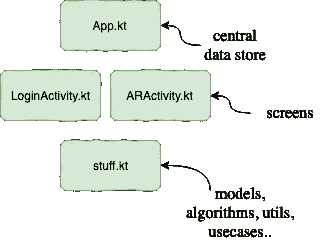
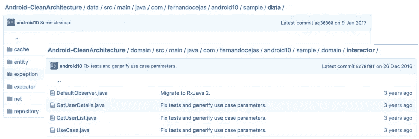
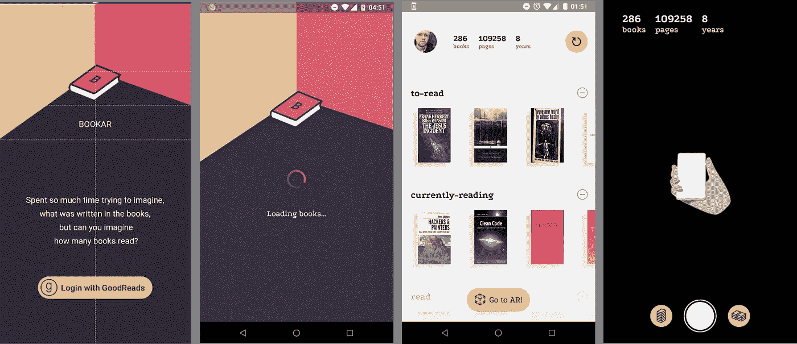
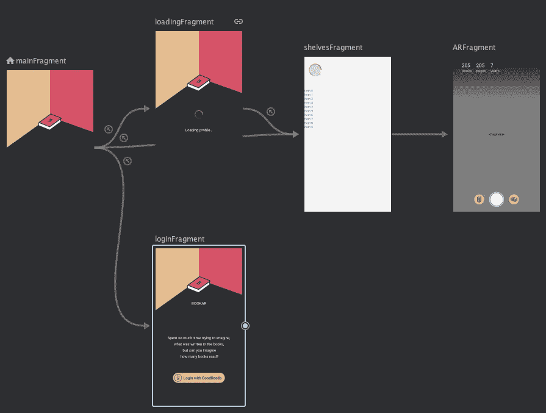
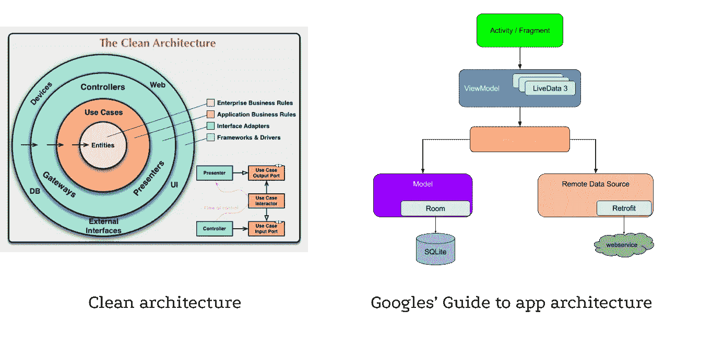
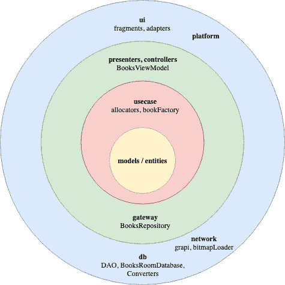
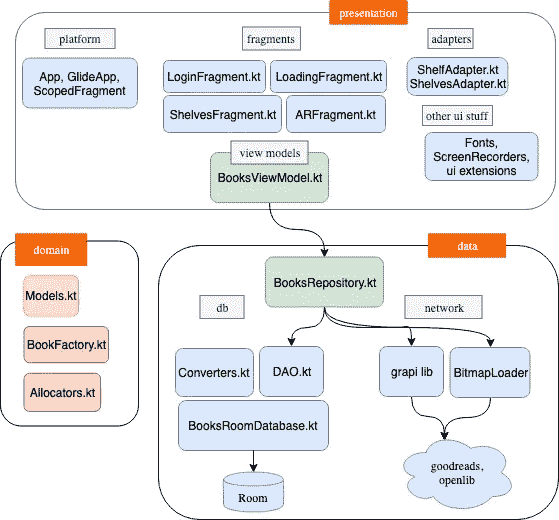
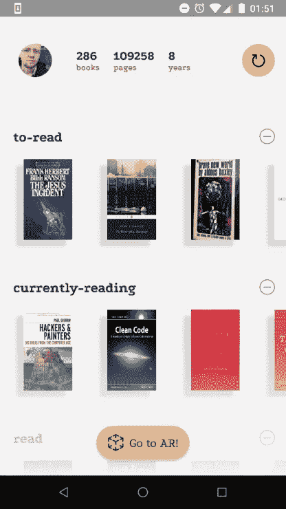
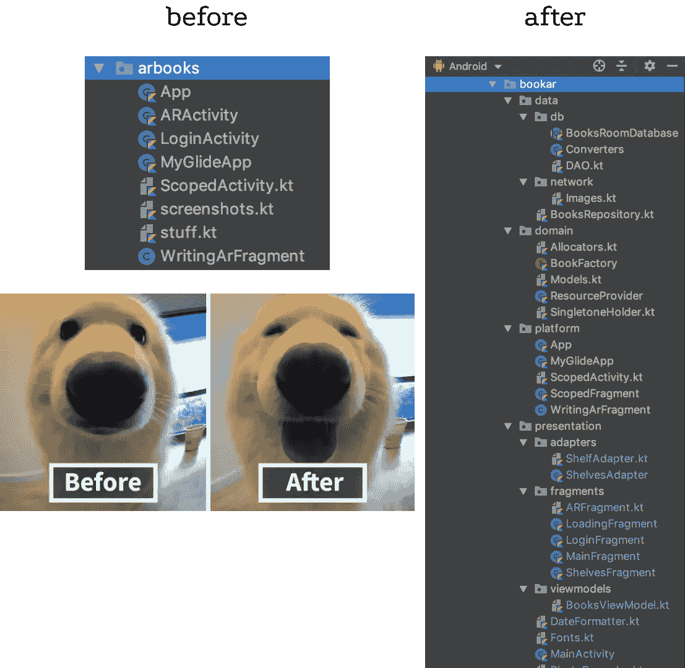

# 从 stuff.kt 到建筑

> 原文：<https://itnext.io/from-stuff-kt-to-architecture-905426799dae?source=collection_archive---------5----------------------->

如何重写你的全功能原型，增加 20 个文件的数量，停止担心。

这是关于我的书籍渲染 ar 实验的第三篇文章，我简要记录了一些架构决策并展示了项目进展。

1.  [使用 Kotlin 从 Android 读取 API](https://medium.com/@intmainreturn00/goodreads-api-from-android-with-kotlin-fd8c2c7338d8)
2.  [我所有的书都在 AR](https://medium.com/@intmainreturn00/all-my-books-in-ar-c4d740a3ecbb)
3.  从 stuff.kt 到建筑【你来了！]

android 应用程序架构的话题极具争议性，争论激烈。最近，在谷歌发布架构组件后，新一轮的讨论已经到来。经过 10 年的代码编写，我们收到了指南，当然，这引发了新一轮的讨论。

以下所有内容都应被视为我个人 8 年经验的浅见，无意让任何人难过或生气。

# 原型

我从上一篇文章离开的地方开始([教程分支](https://github.com/intmainreturn00/Bookar/tree/tutorial))。我们在 AR 中制作了一个原型，它具有以下结构:

许多可能是由于明显缺少干净的图层，甚至是 MVVM 和视图模型而触发的。但这是我在大多数原型中有意识的意图——当你对你的应用一无所知时，不要构建一个架构。这是探索这个想法的阶段:ARCore 是否会允许渲染这样的书，或者它会很慢而且有问题？这是学习 AR 和尝试 AR 的阶段，学习应该是有趣和专注的。我可以很容易地改变这个例子中的任何东西，因为它还没有结构。它没有一个结构，因为我还不知道它应该做什么。

> 🧘‍♀️:让原型尽可能简单，你就能获得大部分乐趣。不要被干净激怒——你正在开发你的原型，而不是最好的通用架构。

# 我们到底需要多少尖叫？

我的[架构尖叫](https://blog.cleancoder.com/uncle-bob/2011/09/30/Screaming-Architecture.html)是为了什么？从上面的方案来看，似乎我的应用程序正在某个地方登录，并在 AR 中做一些事情。而这正是正在发生的事情！如果我有类似于[和](https://github.com/android10/Android-CleanArchitecture)的东西，会不会更好？

这尖叫够了吗？这个示例显示了用户和用户的详细信息，但是它包含了足够控制一次小型导弹发射的体系结构储备。我在原型阶段需要它吗？我想不会。如果我需要花几分钟遍历文件夹来找出那个东西是做什么的——它不会尖叫。但是让我们看看，当项目开始发展时会发生什么。

> 🧘‍♀️太多的建筑噪音会让你头疼。

# 用户界面和导航组件

再来加点 UI 吧！

移动应用的用户界面通常会宣布你开始使用用例的阶段。Simon 关于 Clean 有一个很好的观点——像 web 或 mobile [这样的“烦人的交付机制”可能会非常大](http://www.codingthearchitecture.com/2011/11/06/the_delivery_mechanism_is_an_annoying_detail.html)。我非常同意。

当你第一次打开某个不知名的 app，你想抓住那个东西是做什么的时候，你会怎么做？一开始你真的关注实体吗(比如用户数据类或者 DefaultObserverInterface)？我看着屏幕。因为这通常比任何其他部分都更能体现用例。自从[导航组件](https://developer.android.com/guide/navigation/navigation-getting-started)以来，我们有了一个很好的工具

> 🧘‍♀️导航图给你很大的应用地图。

这仍然是一个早期版本，它有一些深层链接的问题，但优势太诱人，不容忽视。

# 添加一些逻辑

为了在架构上做更多的工作，让我们添加一个新的特性—一个新的图书放置(分配)。我的灵感来自著名的玛格丽特·哈米尔顿照片:

您可以在 google play 制作自己的照片=)

所以现在我们开始了解我们的应用程序是关于什么的。从这里我们可以更好地想象未来我们可以添加什么。现在是时候添加一些架构了。

> 🧘‍♀️只有当你做了一些逻辑工作，并且可以预测你的应用程序在几次迭代后会是什么样子的时候，你才可以开始绘制实体和层。

# 清洁和 MVVM

让我们来看看谷歌[建筑指南](https://developer.android.com/jetpack/docs/guide)和并排清理:

并尽力将这两个指南合并，看看我们会得到什么。在我的例子中，我将以这个结尾:

> 🧘‍♀️·谷歌的指南关注最外层的干净层，它把实体和用例留给了开发者。

如果您和我一样，对您的“企业业务规则”(定义实体的简明建议)感到困惑，您可以尝试使用以下规则:

> 🧘‍♀️良好的实体和用例层应该允许在跨平台解决方案中重用它。您应该能够在 iOS 应用程序中重用这些代码(例如，使用 Kotlin Native)。

这比鲍勃叔叔的定义稍微具体一些，但我发现它很有用。我留下了单词 *_some_* ，因为大多数项目永远不需要跨平台，这没关系。它可能会也可能不会自动实现，但理想情况下，您应该能够实现它，并且您的架构设计将从中受益。

让我们简单地列出通常会妨碍你的是什么？

# 语境

android 中最明显的上下文类。你总是需要上下文来做事情。我的 BookFactory 需要 colors.xml 中的颜色常量。这里有一个简单传递上下文的诱惑，但是有一个更好的解决方案—资源提供者:

SingletoneHolder 您可以在这里获取—[Kotlin singletons with argument](https://medium.com/@BladeCoder/kotlin-singletons-with-argument-194ef06edd9e)(像双重检查锁定这样的行为最好实现一次，然后重用)。现在我的 clean class BookFactory 依赖于这样的 ResourceProvider，而不是 Android 上下文本身。在跨平台中，将有两种不同的实现(您将提供一个公共的共享接口)。

另一个常见的例子是图像加载，这种方法也很有效:

现在我们的 BookFactory 终于干净了(没有 android 导入)，但继续使用图像加载并从资源文件中获取颜色:

> 当你不记得你正在编程什么操作系统的时候，🧘‍♀️可以随意停止提供者。如果您还有时间，请随意将接口从实现中分离出来(您将获得输入/输出端口)

# 模型/实体

clean attendant 有时声明我们应该在每一层有多个不同的模型，并有一堆接口适配器来转换/映射它们。在移动项目中，我经常违反这样的规则:即使是 REST 模型也经常针对 UI 进行设计。如果您的 UI 显示了实体中的每个(或几乎每个)字段，这似乎没问题。更多关于这个的讨论你可以在这里找到。

在 [Bookar](https://play.google.com/store/apps/details?id=com.intmainreturn00.bookar) 中，我使用了两套模型:一套是从 [grapi](https://github.com/intmainreturn00/grapi) 库(网络层)获得的，另一套是从它转换成实体/模型，然后用于房间、UI 和用例。是的，我不能像跨平台那样重用它(因为房间的实体规范)，但另一方面，我有一个 Book 类用于整个应用程序，而不是许多。但 Room 在这里只是 Android 依赖。例如，我对原语使用了接口适配器，可以从 Sceneform 导入:

> 🧘‍♀️:如果你有时不区分 UI 模型和实体模型，不要难过。它发生了。如果你的 UI 使用你的实体而没有不需要的映射，这并不违反依赖规则。

# 深层链接

简单的 OAuth 登录流程包括将用户发送到浏览器并捕获深层链接重定向。对于浏览器意图，你需要上下文。为了捕捉深层链接，您需要活动(因为清单中的 [intent-filter 声明](https://developer.android.com/training/app-links/deep-linking)可能只与活动相关)。所以很难完全在 UI 层之外实现登录用例。

> 🧘‍♀️Deep 链接导致疼痛。与早期导航控制器的深度链接导致更多的痛苦。

# 实时数据、预处理和嵌套回收视图

另一个伟大的架构组件是 [LiveData](https://developer.android.com/topic/libraries/architecture/livedata) 。这里讨论的[基地使用模式](https://medium.com/androiddevelopers/viewmodels-and-livedata-patterns-antipatterns-21efaef74a54)。这里的[详细描述了常见用例(“一次性请求”)。有些出版物特别强调](https://medium.com/androiddevelopers/coroutines-on-android-part-iii-real-work-2ba8a2ec2f45)[流播事件](https://medium.com/androiddevelopers/livedata-with-snackbar-navigation-and-other-events-the-singleliveevent-case-ac2622673150)的恶行，而不是国家。但是在我的具体例子中，我嵌套了回收器视图。而且我还需要在展示它们之前，对每本书逐一进行预处理。

所以，[流状态+使用 Maers 算法](https://medium.com/@iammert/using-diffutil-in-android-recyclerview-bdca8e4fbb00) (DiffUtils)进行 RecyclerView 的常见模式在这里不起作用。由于预处理可能会花费很多时间，并且用户希望看到进度更新，所以我最终流式处理事件:

是的，如果用户在应用程序之间切换，progress 可能会丢失几本书。是的，流式事件不好。但是使用 DiffUtils 对多个嵌套列表进行顺序更新更糟糕。您可以通过在处理结束时更新数据库来恢复最终状态，在事务内[——这样您将在结束时同步状态。](https://github.com/intmainreturn00/Bookar/blob/master/app/src/main/java/com/intmainreturn00/bookar/data/BooksRepository.kt)

> 🧘‍♀ ️Sometimes 通过 LiveData 直播部分赛事是最佳方式。不要忘记通过事务更新从数据库同步最终状态。

# 包名

对于组织包装结构，切哈斯的方案([android architecture——the clean way](https://fernandocejas.com/2014/09/03/architecting-android-the-clean-way/))显然成为 Android 世界的默认方式。在该方案中，清洁圈被组织成这样的子层:

# 结果

长话短说——我添加了一些功能，重写了这个非常好用的应用程序，并记录了一些关于 android 应用程序架构的想法。最终的解决方案似乎具有更好的灵活性和结构。是的，它仍然有效。

谁是好孩子？

> 在[Google play](https://play.google.com/store/apps/details?id=com.intmainreturn00.bookar)🧘‍♀checkout 应用，在 [GitHub](https://github.com/intmainreturn00/Bookar) 查看完整源代码。
> 
> 欢迎拉要求和评论！

# 链接

1.  [干净的建筑](https://blog.cleancoder.com/uncle-bob/2011/11/22/Clean-Architecture.html)
2.  [交付机制是一个恼人的细节...](http://www.codingthearchitecture.com/2011/11/06/the_delivery_mechanism_is_an_annoying_detail.html)
3.  [应用架构指南](https://developer.android.com/jetpack/docs/guide)
4.  заблуждения清洁建筑
5.  [构建 Android……干净的方式？](https://fernandocejas.com/2014/09/03/architecting-android-the-clean-way/)