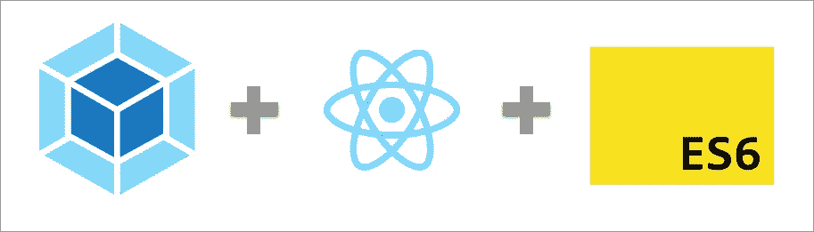

# 使用 Webpack 设置 React 堆栈

> 原文：<https://itnext.io/from-zero-to-deploy-set-up-react-stack-with-webpack-3-20b57d6cb8d7?source=collection_archive---------2----------------------->



# 先决条件:

1.  安装[纱线](https://yarnpkg.com/lang/en/docs/install/)
2.  在 [ubuntu 或 mac](http://nodesource.com/blog/installing-node-js-tutorial-using-nvm-on-mac-os-x-and-ubuntu/) 或 [windows](https://nodejs.org/en/download/) 上安装 Node v 9.2.0。

# 设置:

1.  **创建项目目录:**

```
mkdir projectName && cd projectName
```

**2。用纱线初始化项目:**

```
yarn init
```

> 系统会提示您一些问题，您可以按*键输入*作为默认值，或者输入您对每个问题的答案，直到结束。
> 
> 之后，它会在你的根目录下生成一个文件 **package.json** 。

**3。使用 es6 功能。安装 babel *(作为 devDependencies):***

```
yarn add babel-cli babel-loader babel-preset-env babel-preset-react -D
```

**4。创建并配置** `**.babelrc**` **文件:**

```
touch .babelrc
```

> 带点(。)在 babelrc 这个词之前

配置我们的`.babelrc`把下面的代码放进去。

```
// inside .babelrc
{
 "presets": ["env", "react"]
}
```

**5。安装 React:**

```
yarn add react react-dom
```

6。安装 Webpack:

> 用于开发服务器和捆绑生产。我们安装 webpack 和它的 devServer *(作为 devDependencies)* :

```
yarn add webpack webpack-dev-server webpack-cli -D
```

**7。将以下结构添加到项目目录中:**

```
- build/ - index.html- src/ - index.js- webpack.config.js
```

**8。设置 webpack:**

```
// inside webpack.config.jsconst path = require('path')
const webpack = require('webpack')module.exports = { 
  entry: './src/index.js',
  output: {
    path: path.resolve(__dirname, 'build'),
    filename: 'index.bundle.js'
  },  
  mode: 'development',
  devtool: 'inline-source-map',
  devServer: {
    contentBase: './build',
    port: 3000
  },  
  module: {
    rules: [
      {test: /\.js$/, exclude: /node_modules/, use: 'babel-loader'}  
    ]   
  }
}
```

> **入口点:**将 **index.js** 放在 **/src/** 目录下。
> 
> **输出**:名为 i **ndex.bundle.js** 的生成文件，将在 **/build/** 目录下生成。

**9。设置入口点的 index.html:**

```
<!-- inside /build/index.html --><!DOCTYPE html>
<html lang="en"> <head>
    <meta name="viewport" content="width=device-width, initial-scale=1.0" charset="utf-8">
    <title>Your Project Name</title>
  </head>

  <body>
    <div id='root'></div>
  </body>
  <script src="./index.bundle.js"></script></html>
```

**10。设置入口点(index.js):**

```
// inside src/index.js
import React from 'react'
import {render} from 'react-dom'

const App = () => {
 return <**div**>
  <**h1**>React App Running!</**h1**>
 </**div**>
}

render(
 <**App**/>,
 document.getElementById('root')
)
```

**11。添加脚本:**

我们将为启动开发服务器和构建生产文件等任务添加脚本。

当我们之前运行`yarn init`时，它生成了一个名为 ***package.json*** 的文件。我们将在那个 ***package.json*** 里面添加脚本:

> 我们可以将脚本添加到许可证部分之后，或者您想要的任何位置

```
"license": "MIT",
"scripts": {
  "start": "webpack-dev-server --open",
  "build": "npm run clean && npm run compile",
  "clean": "rm -rf ./build/index.bundle.js",
  "compile": "NODE_ENV=production webpack --config ./webpack.config.js --progress"
},
```

> **启动**:将启动 webpack devserver，并在浏览器上自动打开 **localhost:3000** 。
> 
> **清理:**将删除 **/build/** 目录下生成的 **index.bundle.js**
> 
> **编译** : webpack 会在 **/build/** 目录下编译生成 **index.bundle.js**
> 
> **构建**:将运行脚本**清理**然后**编译**

> 设置完成！接下来是开发和生产。

# 发展

我们使用 webpack 作为我们的开发服务器。要启动开发服务器运行:

```
yarn start
```

> **start** 是我们早前在 **package.json** 中添加的脚本之一。如果你记得的话

这将自动打开您的浏览器并导航到***localhost:3000***。您应该看到您的 react 页面正在运行。

这个开发服务器还支持**热重新加载**，所以当我们在源代码中做了一些改变时，我们的开发服务器会自动为我们重新加载页面。

# 生产

我们使用 webpack 将所有的 javascript 文件捆绑到一个文件中。


要运行 webpack 捆绑包:

```
yarn build
```

> **build** 是我们之前在 **package.json** 中添加的脚本之一。

这将创建一个名为`index.bundle.js`的文件，保存在`index.html`所在的`/build/`目录下。

因此，如果我们进入`/build`目录，我们应该会看到这样的结构。

```
- build

   - index.html
   - index.bundle.js
```

这两个文件是生产文件。`index.bundle.js`包含一切。我们现在只需要在浏览器中打开`index.html`，一切都将正常工作。

我们可以将它部署在一个免费的托管站点上，比如 [co.nf](https://www.biz.nf/co.nf-domain.php) 。创建一个免费的`co.nf`子域，并上传这 2 个文件。导航到它的 url，然后您就有一个 react web 应用程序部署！


> 就是这样！快乐建筑&黑客。谢谢！\m/

请点击👏按钮下面几下，以示支持！⬇⬇谢谢！