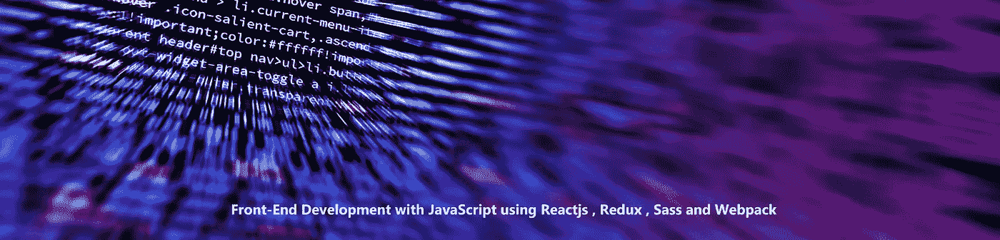
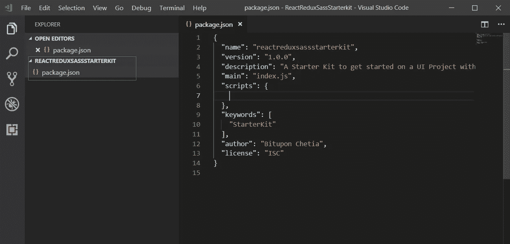
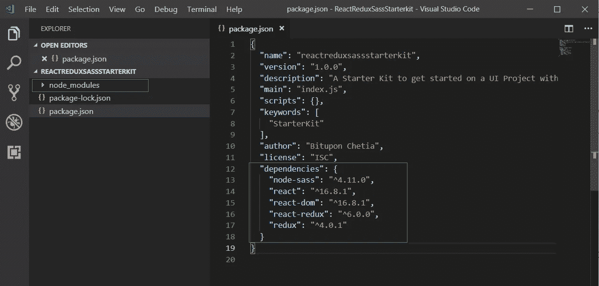
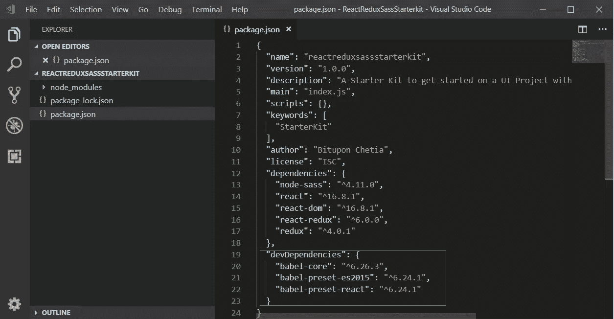
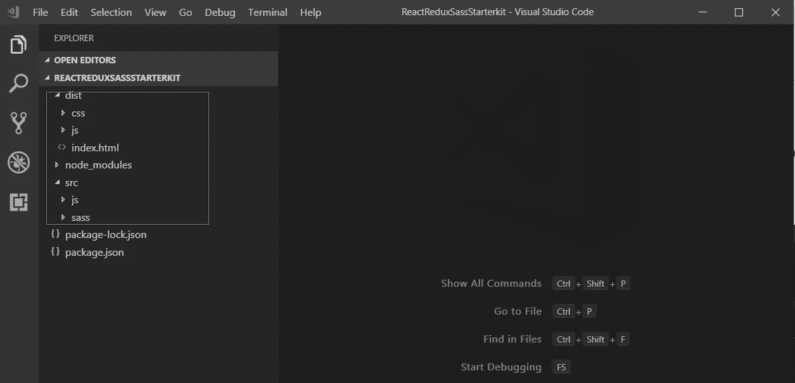
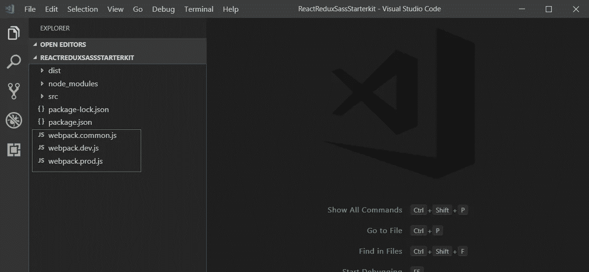
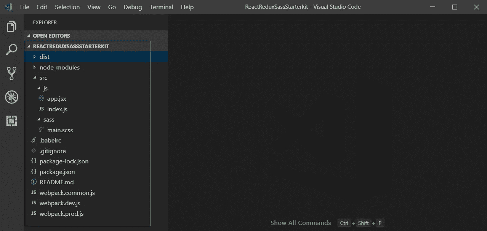

# 使用 Reactjs、Redux、Sass 和 Webpack 的 JavaScript 前端开发

> 原文：<https://itnext.io/front-end-development-with-javascript-using-reactjs-redux-sass-and-webpack-1a2fdd46daba?source=collection_archive---------1----------------------->



这篇博客文章是为那些想使用 JavaScript 的全栈功能开发 Web 应用程序的 JavaScript 开发人员写的。众所周知，JavaScript 一直在发展，并且仍在发展，使我们不仅能够从客户端，而且能够从服务器端编写 Web 应用程序。在本文中，我将展示如何利用下面的**工具和技术**进行 web 应用程序的**前端开发**。

*   **环境:Nodejs**
*   **包装经理:NPM**
*   **编译器** : **巴别塔**
*   **捆绑器:网络包**
*   **CSS 预处理器** : **Sass**
*   **客户端:Reactjs，Redux**

基本上，我将演示如何进行上述工具和技术的初始设置，以开始我们的前端开发。在本文的最后，我们将有一个 ***入门套件*** 准备好使用 ***Reactjs、Redux 和 Sass*** 进行前端开发。 **VS 代码**已被用作本文的代码编辑器，您将看到多个带有 **VS 代码**的图像，用于直观地解释代码及其结构。

# **设置**

> 开始逐步安装和配置

## **Node.js**

Node.js 是一个开源、跨平台的 JavaScript 运行时环境，在浏览器之外执行 JavaScript 代码。它基本上有助于开发服务器端 JavaScript 应用程序。这是开发我们的应用程序的先决条件。

**安装:** [点击这里](https://nodejs.org)进入 Node.js 官方页面。从那里下载并安装它

## NPM

NPM 代表节点包管理器，它是 JavaScript 的一个包管理器。它是世界上最大的软件包管理器，根据您的应用需求，您可以安装来自 npm 的可用软件包，这些软件包以称为“**节点或 NPM 模块**的小软件包形式提供。

您也可以创建自己的 NPM 包并将其发布到 NPM，供其他人使用。欲知详情，请前往其[官方网站](https://docs.npmjs.com/)。

**安装** : NPM 可以在安装 Node.js 的同时安装，也可以像这样从命令行全局安装

```
npm install npm -g
```

在本文中，我们将使用`npm`来安装所有的依赖项。

让我们首先创建一个项目文件夹“***ReactReduxSassStarterkit***”，然后为这个项目创建`package.json`文件。我们将首先进入项目文件夹并运行-

```
npm init
```

在我们给`cli`中的一系列默认配置选项输入后，这个命令将创建`package.json`文件。



该图显示了项目文件夹“***ReactReduxSassStarterkit***”中的 package.json 文件。

## 反应堆

Reactjs 是一个用于构建 UI 的 JavaScript 库，是当今广泛使用和流行的 JavaScript 库之一。

要了解更多关于 Reactjs 的信息，请访问它的官方网站。

**安装:** Reactjs 可以直接添加到 HTML 页面或者我们可以这样安装它的 NPM 包。`--save` 是将 react 包保存为这个项目的依赖项。

```
npm install react --save
```

我们还需要一个名为`react-dom`的包来渲染 DOM。

```
npm install react-dom --save
```

当处理一个实际的 web 应用程序时，随着应用程序范围的扩大，我们将需要更多的`react`模块。但是这两个包`react` 和`react-dom`对于本文的目的来说已经足够了。

## Redux

根据定义， [Redux](https://redux.js.org/) 是 JavaScript 应用程序的可预测状态容器。随着我们的单页面应用程序的规模和复杂性的增长，管理应用程序的不同状态变得非常困难。状态可以是任何东西，从服务器端响应到切换 UI 面板的 UI 层状态。这就是 Redux 发挥作用的地方，它用单一的存储来保存应用程序状态，从而简化我们的应用程序状态管理。

关于详细的概念及其 API 定义，请访问其[官方网站](https://redux.js.org)。

**安装:**和 React 一样，我们可以直接下载其预编译的开发和生产 UMD 版本，并将文件直接嵌入到`<script>`标签中。或者，我们可以像下面这样安装它的`NPM`包-

```
npm install redux --save
```

Redux 可以和 React、Angular、jQuery 等框架一起使用。在本文中，当我们用 Reactjs 演示 Redux 时，我们需要安装一个额外的`react-redux`包。

```
npm install react-redux --save
```

## **萨斯**

Sass，又名，[语法上令人敬畏的样式表](https://sass-lang.com/)，基本上是一个 CSS 预处理器。这是一个非常成熟和强大的 CSS 扩展。在当今世界，UI/UX 开发人员使用 CSS 预处理器，如 **Sass** ，而不是普通的 CSS。

因为它有很多功能，比如嵌套、**变量**、**函数**、**混合**，增加**逻辑**等等。，创建**样式表**现在变得简单多了，当涉及到管理拥有数千个 CSS 规则集的庞大 CSS 文件时，耗时更少。当然，要了解更多，请访问其[官方网站](https://sass-lang.com/)。

**安装**:让我们用下面的命令安装它的`npm`包。

```
npm install node-sass --save
```

到目前为止，我们已经为 **Reactjs、Redux、Sass** 安装了 npm 包作为依赖项。在用`— -save`安装它们时，它会在`package.json`文件的“**依赖项**部分创建一个条目，如下所示。现在可以在`node_modules`文件夹下找到安装的 npm 包。



该图显示了 package.json 以及“ **node_modules** ”文件夹中的依赖关系。

> 在本文中，我们将使用 ES6 来编写 React + Redux 应用程序。但是 ES6 仍然没有得到最新浏览器的广泛支持，因此我们需要一个 transpiler 将我们的 ES6 语法转换成它的较低版本 ES5，这样它就可以兼容所有的浏览器和环境。这将引出我们下一个讨论的话题**‘巴别塔’。**

## 巴比伦式的城市

Babel 是一个 JavaScript 编译器，主要用于将 ECMAScript 2015+(像 ES6)代码转换为当前和旧浏览器或环境中的 JavaScript 向后兼容版本。

因为我们将在这个项目中使用 ES6，所以 babel 需要将我们的 ES6 代码转换为 ES5，这与大多数浏览器或环境兼容。所以，让我们把它安装到我们的项目中。

**安装**:我们将运行一系列命令来为 **Babel** 安装多个包。下面是`cli`命令及其描述，以便理解每个特定模块的使用。

首先，我们将安装`babel-core`包。

```
npm install babel-core --save-dev
```

二。我们还需要安装几个通天塔`presets`。babel `presets`基本上是一组用于支持特定语言特性的插件，

```
npm install babel-preset-react babel-preset-es2015 --save-dev
```

我们也可以同时安装多个包，如下所示。后缀`--save-dev`是将这些包作为开发依赖项安装，因为我们只在开发环境中需要它们。生产环境将不需要这些依赖项，也不会在生产环境中安装这些`dev-dependencies`。

三。让 babel 工作的最后一件事是创建一个名为`.babelrc`的 babel 配置文件。在`.babelrc`文件中，我们必须为预置一个条目。



该图显示了 package.json 中的开发依赖项

## 网络包

Webpack 是 JavaScript 应用程序的模块捆绑器。我们可以在`Webpack`中做很多配置来管理和自动化我们的项目资产。

Webpack 是一个庞大的主题，你可以去它的官方文档获得详细的理解。

在本文中，我们将只展示它的基本安装和其他最低配置。

**安装:**首先**、**我们会开始安装`webpack`和`webpack-cli`开始上手。`webpack-cli`package 是 webpack 的官方 CLI，它提供了一组有助于创建自定义 webpack 配置的命令。我们将需要另外两个 webpack 包— `webpack-merge`合并来自多个 webpack 配置文件的 webpack 配置对象，以及`webpack-dev-server`在内存中本地创建一个开发服务器以简化开发。

像 babel 一样，我们将把它们作为`--save-dev`或开发依赖项来安装。

```
npm install webpack webpack-cli webpack-merge webpack-dev-server --save-dev
```

**搭建:**现在我们已经安装了 webpack，我们必须考虑不同的配置来选择我们的源 JavaScript 文件，然后进行各种转换，最后将它们放在某个地方或加载到 DOM 中，以便我们的应用程序开始访问这些文件。

在此之前，让我们搭建项目结构来组织我们的代码文件。在'***ReactReduxSassStarterkit***'项目文件夹下创建了两个文件夹`src`和`dist`，分别包含源文件和分发文件。

这两个文件夹都包含保存 JavaScript 文件的`js`文件夹。我们的源 JavaScript 文件(在我们的例子中是 React 代码)将位于`src/js`文件夹中，在这些文件被传输后，它们将在`Webpack`的帮助下进入`dist/js`文件夹。

我们还将创建`src/sass`文件夹来保存我们的**。scss** 或 **sass** 文件和`dist/css`文件夹来保存**。从**生成的 css** 文件。scss** 在`webpack`的帮助下。最后，我们将在`dist`文件夹中添加一个 index.html 文件，它将加载我们的 **React+ Redux** 应用程序。



该图显示了项目脚手架。

**配置:**一旦我们的项目搭建完成，我们就可以开始 webpack 配置了。为此，我们将创建 webpack 配置文件。

> Webpack 配置文件不是执行 webpack 操作所必需的。我们可以根据需要创建一个或多个 webpack 配置文件。

出于我们的目的，我们将在项目根目录中创建三个 webpack 配置文件。

`webpack.common.js` :-该文件将包含适用于`dev`和`prod`环境的通用`webpack` 配置。

`webpack.dev.js` :-该文件将包含`dev`环境特定的`webpack` 配置。

`webpack.prod.js` :-该文件将包含`prod`环境特定的`webpack` 配置。



该图显示了三个 webpack 配置文件

到目前为止，这些文件是空的，我们将很快向这些文件添加配置对象。但在此之前，让我们讨论一下这些文件中的一些内容。

基本上，`webpack`有几个核心概念，为了这篇文章，我只给出它的要点，并给出我们的 webpack 配置条目的高级概念。

— ***条目*** :该配置属性用于添加一个或多个入口点，webpack 将使用这些入口点来构建它们及其内部依赖项。

在我们的例子中，`index.js`和`main.scss`分别是`src/js`和`srs/sass`文件夹中的入口点文件。

— ***Output*** :这个 config 属性是必需的，用来告诉在哪里生成文件以及给文件取什么名字。

在我们的例子中，`dist`文件夹是文件发出的地方。`dist/js`将包含生成的 JavaScript 文件。在`prod`环境中，`css`文件将从`sass`编译，并在`dist/css`文件夹中生成。

— ***加载器*** : Webpack 默认情况下只能处理 JavaScript 和 Json 文件。使用这个属性，我们可以让 webpack 处理其他类型的文件。[点击查看不同的 Webpack 加载器](https://webpack.js.org/loaders/)

在我们的例子中，我们将使用下面的 webpack 加载器。

*   `babel-loader`:使用`babel`将 ES2015+代码转换成 ES5 的 webpack 加载器。
*   `sass-loader`:加载和编译 SASS/SCSS 文件的样式加载器。
*   `css-loader`:一个样式加载器，加载带有解析导入的 CSS 文件并返回 CSS 代码
*   `style-loader`:一个样式加载器，用于将模块的导出作为样式添加到 DOM 中。

因此，让我们为这些 webpack 加载器安装 npm 包。

```
npm install babel-loader sass-loader css-loader style-loader --save-dev
```

— ***插件*** :在这个属性的帮助下，我们可以根据自己的需要声明不同的 webpack 插件。Webpack 插件可以用来执行不同的任务，如缩小，管理资产等。

在本文中，我们将在我们正在开发的“***【ReactReduxSassStarterkit】***中加入一些 webpack 插件，以执行一些很酷的东西。因此，让我们安装它们，我们也将看到这些单独的插件实际上做什么。

*   `html-webpack-plugin`:简化 HTML 文件的创建，为您的包提供服务。我们将在`dev`环境中需要它。
*   `html-webpack-template`:基本上是`html-webpack-plugin`的模板。
*   `clean-webpack-plugin`:在构建之前移除/清理您的构建文件夹。
*   `mini-css-extract-plugin`:这个插件将 CSS 提取到单独的文件中。

```
npm install clean-webpack-plugin html-webpack-plugin html-webpack-template mini-css-extract-plugin --save-dev
```

因此，现在我们可以将配置添加到已经创建的三个`webpack`配置文件中。`webpack.common.js`由`webpack.dev.js`和`webpack.prod.js`在`webpack-merge`的帮助下共享。

让我们也在 **Reactjs** 中创建我们的**初学者工具包**登陆页面，并在`sass` 或`scss`中创建它的样式表。

*   下面是在`src/js`中呈现基本 html 标记的`app.jsx`文件和将导入`app.jsx`并在`react-dom`的帮助下呈现的`index.js`。

*   最后，这是`src/sass`文件夹中的`.scss`文件。



图像显示了“***ReactReduxSassStarterkit”***下的最终文件及其结构

好了，我们已经安装了所有的依赖项，并为“***ReactReduxSassStarterkit”创建了所有需要的资产。*** *W* e 处于我们设置过程的最后阶段。

现在，为了实际运行和自动化这个构建过程，我们将使用一些`cli`命令。我们将如何做到这一点？这个问题的答案是我们下一个话题 **NPM 剧本**

**NPM 脚本:** NPM 有一个运行命令，它将运行定义在`package.json`文件内`script`对象内的脚本。我们现在将在`scripts`下添加两个属性`start`和`build`。

> `*npm run start*` *现在可以用来在开发环境中运行* ***初学者工具包*** *。它使用* `*webpack.dev.js*` *配置文件打开* `*webpack-dev-server*` *中的登陆页面。借助*`*html-webpack-plugin*`*`*html-webpack-template*`*插件，在内存中生成登陆 HTML 页面。它还加载传输的 JS 和 CSS。如前所述，webpack* `*babel-loader*` *帮助将 ES5+代码转换为 ES5，样式加载器* `*sass-loader*` *、* `*css-loader*` *和* `*style-loader*` *负责将***转换为* ***CSS。*****
> 
> ***检查* `*webpack.dev.js*` *配置文件，查看所有上述 webpack 加载器和插件的配置。***

> ***另一方面**`*npm run build*`*现在可以用来在生产环境中运行* ***启动套件*** *。它使用* `*webpack.prod.js*` *config 文件构建* `*src*` *文件夹中的 src 文件，并在* `*dist*` *文件夹中生成 JavaScript 和 CSS 文件。我们现在知道，webpack 默认只处理 JS 和 json 文件，我们只好使用 webpack 插件* `*`*mini-css-extract-plugin*`*` *来处理* `*.scss*` *文件到* `*.css*` *。除此之外，每次运行* `*npm run build*` *时，我们都使用插件* `clean-webpack-plugin` *来清理* `*dist/js*` *和* `*dist/css*` *。****
> 
> ***检查* `*webpack.prod.js*` *配置文件，查看所有上述 webpack 加载器和插件的配置。***

**如果你想下载或者投稿到“***ReactReduxSassStarterkit”，*** 请访问这个 [***Github 资源库***](https://github.com/bitupon/ReactReduxSassStarterkit) 。**

**[](https://github.com/bitupon/ReactReduxSassStarterkit) [## bitupon/ReactReduxSassStarterkit

### 使用 Reactjs、Redux 和 Sass 开始 UI 项目的初学者工具包。-bitupon/ReactReduxSassStarterkit

github.com](https://github.com/bitupon/ReactReduxSassStarterkit) 

好了，我要结束这篇文章了。谢谢你…..**